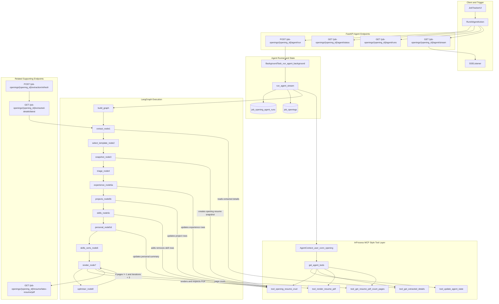

# AI Agent Runtime Architecture (Current Backend)

Based on:
- `backend/app/features/job_tracker/agents/graph.py`
- `backend/app/features/job_tracker/agents/runner.py`
- `backend/app/features/job_tracker/agents/router.py`
- `backend/app/features/job_tracker/agents/mcp_server.py`
- `backend/app/features/job_tracker/opening_ingestion/router.py`
- `backend/app/features/job_tracker/opening_resume/latex_resume/router.py`
- `Features-to-develop/Langgraph Implementation/development-plan.md`

## Node Responsibilities

- `node1_extract`: loads latest extracted job details from ingestion snapshot.
- `node2_select_template`: picks best `job_profile` template (LLM-assisted if multiple).
- `node3_snapshot`: creates opening-resume snapshot from selected profile.
- `node4_triage`: analyzes which sections need adaptation.
- `node5a..5d`: rewrite experience/projects/skills/personal content.
- `node6_skills_certs`: alignment check for certifications and skills.
- `node7_render`: render LaTeX PDF and compute page count.
- `node8_optimiser`: trims and loops back to render until page target or max iterations.

## Endpoint Interaction Summary

- Primary agent API used by UI:
  - `/job-openings/{opening_id}/agent/run`
  - `/job-openings/{opening_id}/agent/stream`
  - `/job-openings/{opening_id}/agent/status`
  - `/job-openings/{opening_id}/agent/runs`
- Upstream data dependency:
  - `/job-openings/{opening_id}/extraction/refresh`
  - `/job-openings/{opening_id}/extracted-details/latest`
- Downstream artifact endpoint:
  - `/job-openings/{opening_id}/resume/latex-resume/pdf`

## MCP Connectivity Note

In current code, MCP is implemented as an in-process tool layer via `get_agent_tools()` and shared `AgentContext` (not an external MCP transport endpoint).
