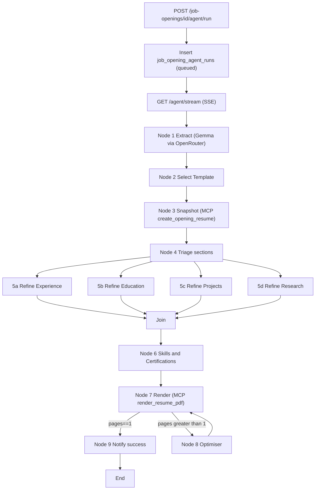
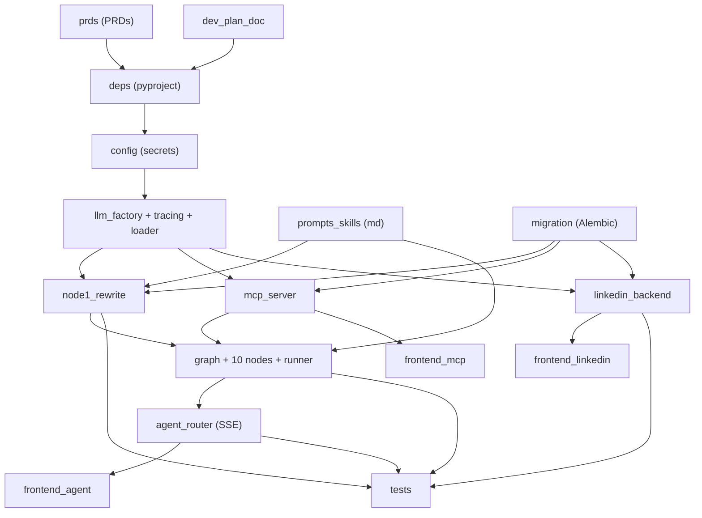

# Development Plan: LangGraph Resume Agent + LinkedIn Profile Import
## apply_n_reach — Jobs Tracker Backend + Frontend

> **Reference Documents:**
>
> - [Job Tracker Development Plan](../job-tracker/job-tracker-features-plan.md)
> - [User Profile Development Plan](../user-profile-development-plan.md)
> - [Job Profile Development Plan](../job-profile%20feature/development-plan.md)
> - [LaTeX Resume Rendering Plan](../latex-resume/latex-render-feature.md)
> - [Frontend Development Plan](../frontend/development-plan.md)

---

## Executive Summary

This plan delivers two features that sit on top of the existing `job_tracker` and `user_profile` backends:

1. A **10-node LangGraph resume-tailoring agent** wired into `job_tracker` via an in-process FastMCP server, using OpenRouter's free `google/gemma-3-27b-it:free` model, traced with LangSmith, and streamed to the frontend over Server-Sent Events so a progress checklist renders node-by-node.
2. A **LangChain-driven "Import from LinkedIn" button** on the user-profile Personal form that scrapes via Apify's `harvestapi/linkedin-profile-scraper` actor and replaces every profile list-section in a single transaction.

Deliverables include PRDs, dev-plan documents, DB migrations, markdown scaffolding for system prompts + agent skills, backend agent code, LinkedIn import backend, and frontend integration in the JobTracker table row and the user-profile Personal form.

- **Total phases:** 5 (P0 specs, P1 shared infra, P2a/P2b backend features, P3a/P3b frontend features, P4 verification)
- **Estimated total effort:** 8-12 days solo / 4-6 days with 3-4 parallel agents
- **Stack additions:** `langchain`, `langchain-openai`, `langgraph`, `langsmith`, `fastmcp`, `pypdf` (backend); no frontend deps (native `EventSource`)

**Top 3 Risks**

1. **Gemma-free rate limits during fan-out** (nodes 5a/5b/5c/5d run in parallel). Mitigation: shared `AsyncLimiter` in `llm_factory` + exponential backoff on 429/5xx.
2. **LinkedIn replace-all data loss on partial failure** (delete-then-insert). Mitigation: single asyncpg transaction wrapping delete + insert; mandatory "raise-in-the-middle" rollback test.
3. **SSE auth limitations in `EventSource`** (no custom headers). Mitigation: rely on existing session cookies; fall back to short-lived signed `run_token` query param if token auth is introduced.

---

## Todos (execution tracker)

| id | content | status |
| --- | --- | --- |
| `prds` | Draft Feature 1 PRD (LangGraph Resume Agent) and Feature 2 PRD (LinkedIn Import) using prd-creator template; save under `docs/superpowers/specs/` | pending |
| `dev_plan_doc` | Write `Features-to-develop/langgraph-agent/development-plan.md` + implementation plans under `docs/superpowers/plans/` (TDD task-by-task, bite-sized) | pending |
| `deps` | Add backend deps: `langchain`, `langchain-openai`, `langgraph`, `langsmith`, `fastmcp`, `pypdf` (`pyproject.toml`) | pending |
| `config` | Extend core `config.py`: `openrouter_api_key`, `apify_api_token`, `langchain_api_key`; set `LANGCHAIN_TRACING_V2`/`LANGCHAIN_PROJECT=ETB_Project` on import | pending |
| `llm_factory` | Create `job_tracker/agents/{config.py, llm_factory.py, tracing.py, prompt_loader.py}` using `google/gemma-3-27b-it:free` via OpenRouter | pending |
| `prompts_skills` | Scaffold `job_tracker/agents/prompts/Node_{1..8}.md` + `skills/{refine_bullet_point, determine_technical_keywords, determine_sector_keywords, education_early_stage}.md` | pending |
| `migration` | Alembic migration: add `agent_*` JSONB columns + `snapshot_created` on `job_openings`; add `summary` on `job_profiles`; create `job_opening_agent_runs`; extend `extracted_details_versions` with new JSONB columns | pending |
| `node1_rewrite` | Rewrite `opening_ingestion/clients/extraction_chain.py` to Gemma-via-OpenRouter with expanded `ExtractedJobDetails`; update `service.py` to persist new fields; update tests | pending |
| `mcp_server` | Build in-process FastMCP server wrapping existing `opening_resume/service` + ingestion + `latex_resume` service functions; expose `get_agent_tools()` for LangGraph | pending |
| `graph` | Build LangGraph agent: `state.py`, `graph.py`, 10 node modules, `runner.py` with SSE event yielding + `langsmith_run_id` capture | pending |
| `agent_router` | Create `/job-openings/{id}/agent` router: `POST /run`, `GET /stream` (SSE), `GET /status`, `GET /runs`; wire into `app.py` | pending |
| `linkedin_backend` | Build `user_profile/linkedin_import`: `scraper.py` (harvestapi actor), `mapping_chain.py` (structured LLM), `service.py` (replace-all txn), `router.py` `POST /profile/import/linkedin` | pending |
| `frontend_agent` | Frontend: `JobTrackerTable` Run AI Agent action + `useAgentRun` hook (EventSource); `agentApi.ts`; progress modal per-node; Download PDF button on success | pending |
| `frontend_linkedin` | Frontend: Import from LinkedIn button in `PersonalForm` with replace-all confirm modal; `profileApi.importFromLinkedIn`; refresh all section hooks on success | pending |
| `frontend_mcp` | Frontend `opening-resume/mcp/`: `mcpClient.ts` consuming `GET /mcp/tools` + `types.ts` for agent events (supports future MCP-aware UI) | pending |
| `tests` | Tests: `extraction_chain` with new schema (mocked LLM); `linkedin_import` service replace-all txn; agent runner happy-path with mocked MCP tools; SSE endpoint integration | pending |

---

## 1. Decisions locked from Q&A

- LLM: `google/gemma-3-27b-it:free` via OpenRouter (single `LLMFactory` used everywhere).
- MCP: In-process FastMCP server mounted inside FastAPI; shared asyncpg pool + auth dependency.
- LinkedIn scraper: Apify actor `harvestapi/linkedin-profile-scraper` via existing `apify_client` pattern.
- LinkedIn import mode: **replace_all** (wipe each user-profile section then repopulate).
- Agent execution: Server-Sent Events streaming (`langgraph.compile().astream`) so frontend shows per-node progress.
- Agent state persistence: Add JSONB columns on `job_openings` (no checkpointer in v1).
- Trigger UI: "Run AI Agent" button in the **JobTracker table row** only.
- Node 1: **Rewrite** `extraction_chain.py` to Gemma + expanded schema; update ingestion pipeline so it does not break.

## 2. New dependencies (backend `pyproject.toml`)

```
"langchain>=0.3",
"langchain-core>=0.3",
"langchain-openai>=0.2",        # used with OpenRouter base_url
"langgraph>=0.2",
"langsmith>=0.1",
"fastmcp>=2.0",                  # in-process MCP server
"pypdf>=4.0",                    # Node 7 page count
```

Frontend: no new deps (SSE via native `EventSource`).

## 3. PRD / plan documents to produce

Create the following markdown files as part of deliverables (not runtime code):

- `docs/superpowers/specs/2026-04-17-langgraph-resume-agent-prd.md` - PRD for Feature 1.
- `docs/superpowers/specs/2026-04-17-linkedin-import-prd.md` - PRD for Feature 2.
- `docs/superpowers/plans/2026-04-17-langgraph-resume-agent.md` - implementation plan (task-by-task, TDD).
- `docs/superpowers/plans/2026-04-17-linkedin-import.md` - implementation plan.
- `Features-to-develop/langgraph-agent/development-plan.md` - high-level phased plan that slots next to existing `Features-to-develop/*` docs.

Both PRDs follow `.codex/skills/prd-creator/references/prd-template.md` (summary, objectives, non-goals, user stories, requirements, UX, tech constraints, metrics, risks, milestones, open questions).

## 4. Shared infrastructure (Phase 0 - build once, reuse for both features)

Files to create under [backend/app/features/job_tracker/agents/](../../backend/app/features/job_tracker/agents/):

- `__init__.py`
- `config.py` - reads `LLMProvider` settings: model slug, OpenRouter base_url, temperature; also reads `LANGCHAIN_API_KEY` + sets `LANGCHAIN_TRACING_V2=true`, `LANGCHAIN_PROJECT=ETB_Project`, `LANGCHAIN_ENDPOINT=https://api.smith.langchain.com` on import.
- `llm_factory.py` - single `get_chat_llm(structured_output_schema=None, temperature=0)` helper using `langchain_openai.ChatOpenAI(model="google/gemma-3-27b-it:free", base_url="https://openrouter.ai/api/v1", api_key=settings.openrouter_api_key)`. Handles `.with_structured_output(schema)` for constrained outputs.
- `tracing.py` - `wrap_runnable(name, runnable)` helper that attaches LangSmith tags `feature=job_tracker`, `node=<name>` via `RunnableConfig`.
- `prompts/` directory (system prompts in markdown - see section 5).
- `skills/` directory (agent skills in markdown - see section 6).
- `prompt_loader.py` - loads a markdown file from `prompts/` and `skills/` at import-time; raises clear error if missing.

Extend [backend/app/features/core/config.py](../../backend/app/features/core/config.py):

- Add `openrouter_api_key: str | None = None`, `apify_api_token: str | None = None` (alias for `APIFY_API_KEY`), `langchain_api_key: str | None = None`, `anthropic_api_key: str | None = None`.
- `model_config` already has `extra="ignore"`, so no breakage.

### 4.1 In-process FastMCP server

New file `backend/app/features/job_tracker/agents/mcp_server.py`:

- Build a `FastMCP("job-tracker-agent-mcp")` instance.
- Register tools that wrap **existing service functions** (no new DB logic) for:
  - `list_opening_resume_experience(opening_id)`, `update_opening_resume_experience(...)`, `delete_opening_resume_experience(...)` - delegate to `app.features.job_tracker.opening_resume.experience.service`.
  - Same shape for `education`, `projects`, `research`, `certifications`, `skills`, `personal`.
  - `get_extracted_details(opening_id)` - delegate to `opening_ingestion.service.get_latest_extracted_details`.
  - `render_resume_pdf(job_profile_id)` and `get_resume_metadata(job_profile_id)` - delegate to `job_profile.latex_resume.service`.
  - `count_pdf_pages(pdf_bytes)` - utility using `pypdf`.
  - `update_agent_state(opening_id, patch)` - writes to the new JSONB columns on `job_openings`.
- Each tool takes `(user_id: int, conn: asyncpg.Connection)` via a dependency-injected context provided by the agent runner (not through HTTP). The agent runner constructs the MCP client in-process and injects a DB connection from the existing pool.
- Expose a thin wrapper `get_agent_tools()` returning the list of `StructuredTool`s (LangChain-compatible) so LangGraph nodes can bind them without speaking MCP wire protocol; this satisfies "in-process MCP" without paying stdio/SSE cost. (FastMCP supports in-memory transport.)
- Mount an HTTP dev endpoint `GET /mcp/tools` (debug only, auth-required) that lists registered tools - useful for frontend MCP setup item in to-do #1.

### 4.2 Frontend MCP setup (to-do item #1)

Add `frontend/src/features/opening-resume/mcp/` with:

- `mcpClient.ts` - wraps `fetch('/mcp/tools')` for the debug endpoint.
- `useAgentRun.ts` - opens `EventSource('/job-openings/:id/agent/stream?run_id=')` for SSE progress events.
- `types.ts` - `AgentNodeEvent`, `AgentProgress`, `AgentFinalResult`.

The user's request for "setup mcp server for endpoints in `frontend/src/features/opening-resume`" is interpreted as: **backend** provides the MCP (section 4.1), **frontend** provides an MCP-aware client that reads tool metadata and subscribes to agent progress over SSE.

## 5. System-prompt folder (to-do #2)

`backend/app/features/job_tracker/agents/prompts/` (markdown, loaded at runtime):

- `Node_1.md` - extraction prompt: fields to extract (Role Name, Company, Technical/Sector Keywords, Business Sectors, Role Summary, Problem being solved, Useful experiences). Includes rules from Agent Context.md section 1.
- `Node_2.md` - template-selection prompt: read all job-profile summaries, pick best match.
- `Node_3.md` - snapshot-creation prompt (routes to MCP tool).
- `Node_4.md` - triage prompt: decide which parallel refinement nodes to run.
- `Node_5a.md` - refine_experience.
- `Node_5b.md` - refine_education.
- `Node_5c.md` - refine_projects.
- `Node_5d.md` - refine_research.
- `Node_6.md` - refine_skills_certifications.
- `Node_7.md` - render-resume + page-count check.
- `Node_8.md` - optimiser (margin/font/content pruning).

Each file contains: role, mission, inputs (agent state keys), tools allowed, output format (JSON schema excerpt), and safety rails (e.g. never edit links).

## 6. Agent skills folder (to-do #3)

`backend/app/features/job_tracker/agents/skills/`:

- `refine_bullet_point.md` - XYZ format rules, action-verb list (~80 verbs), quantification heuristics. Called by Node 5a/5b/5c and Node 6.
- `determine_technical_keywords.md` - how to detect technical keywords per role.
- `determine_sector_keywords.md` - how to detect domain/sector keywords (Payments, Supply Chain, etc.).
- `education_early_stage.md` - rules for <3 years of experience enhancements.

A single loader function `load_skill(name)` returns the markdown; system prompts reference skills by name (e.g. `"Use skill:refine_bullet_point when rewriting"`). Skills are embedded inline into the relevant node's user message so the LLM has them in-context.

## 7. DB schema changes (to-do #5)

New Alembic migration `backend/alembic/versions/<new>_job_tracker_agent_state.py`:

```sql
ALTER TABLE job_openings
  ADD COLUMN agent_status TEXT NOT NULL DEFAULT 'idle'
    CHECK (agent_status IN ('idle','running','succeeded','failed')),
  ADD COLUMN agent_last_run_at TIMESTAMPTZ,
  ADD COLUMN agent_role_summary TEXT,
  ADD COLUMN agent_technical_keywords JSONB NOT NULL DEFAULT '[]',
  ADD COLUMN agent_sector_keywords JSONB NOT NULL DEFAULT '[]',
  ADD COLUMN agent_business_sectors JSONB NOT NULL DEFAULT '[]',
  ADD COLUMN agent_problem_solved TEXT,
  ADD COLUMN agent_useful_experiences JSONB NOT NULL DEFAULT '[]',
  ADD COLUMN agent_skills_to_add JSONB NOT NULL DEFAULT '[]',
  ADD COLUMN agent_optimisation TEXT,
  ADD COLUMN snapshot_created BOOLEAN NOT NULL DEFAULT FALSE;

ALTER TABLE job_profiles
  ADD COLUMN summary TEXT;  -- used by Node 2 for template selection
```

New table for per-run audit trail (lightweight, for SSE reconnection + history):

```sql
CREATE TABLE job_opening_agent_runs (
    id SERIAL PRIMARY KEY,
    opening_id INTEGER NOT NULL REFERENCES job_openings(id) ON DELETE CASCADE,
    status TEXT NOT NULL CHECK (status IN ('queued','running','succeeded','failed')),
    current_node TEXT,
    started_at TIMESTAMPTZ NOT NULL DEFAULT NOW(),
    completed_at TIMESTAMPTZ,
    error_message TEXT,
    final_pdf_rendered BOOLEAN NOT NULL DEFAULT FALSE,
    langsmith_run_id TEXT
);
CREATE INDEX ix_agent_runs_opening_id ON job_opening_agent_runs(opening_id);
```

Extend `backend/app/features/job_tracker/opening_ingestion/models.py` schemas to match the new extraction columns added to `job_opening_extracted_details_versions` (new JSONB fields for `technical_keywords`, `sector_keywords`, `business_sectors`, `role_summary`, `problem_being_solved`, `useful_experiences`).

## 8. Feature 1 - Node 1 rewrite (to-do #4)

Rewrite `backend/app/features/job_tracker/opening_ingestion/clients/extraction_chain.py`:

- Remove `ChatAnthropic`; use `get_chat_llm(structured_output_schema=ExtractedJobDetails)` from `llm_factory`.
- Rename constant `EXTRACTION_MODEL = "google/gemma-3-27b-it:free"`.
- Load system prompt from `prompts/Node_1.md` via `prompt_loader`.
- Expand `ExtractedJobDetails` in `backend/app/features/job_tracker/schemas.py` with new fields:
  - `role_summary: str | None`
  - `technical_keywords: list[str] | None`
  - `sector_keywords: list[str] | None`
  - `business_sectors: list[str] | None`
  - `problem_being_solved: str | None`
  - `useful_experiences: list[str] | None`
- Update `opening_ingestion/service.py::_execute_run` to persist new fields into `job_opening_extracted_details_versions` (migration adds JSONB columns) AND mirror them onto `job_openings` (`agent_technical_keywords`, etc.) so the graph can read them without joins.
- Keep all old fields optional for backward-compat; existing callers (tests, API response schema) continue to work.
- Extend `ExtractedDetailsResponse` similarly.
- Wrap the chain with `wrap_runnable("node_1_extract_job_details", chain)` for LangSmith.

Existing tests in `backend/app/features/job_tracker/opening_ingestion/tests/` already stub the extraction function - update stubs to return the new schema; no ingestion-pipeline breakage.

## 9. Feature 1 - LangGraph agent (Nodes 1 - 10)

New files under `backend/app/features/job_tracker/agents/`:

- `state.py` - `AgentState(TypedDict)` with all fields from Agent Context.md (role_name, technical_keywords, sector_keywords, problem_being_solved, useful_experiences, selected_job_profile_id, snapshot_created, sections_to_refine: dict, skills_to_add: list, optimisation: str, pdf_page_count: int, final_pdf_ref: str).
- `graph.py` - builds `StateGraph(AgentState)`, adds nodes, edges:
  - Node 1 -> Node 2 -> Node 3 -> Node 4 -> fan-out [5a, 5b, 5c, 5d] -> join -> Node 6 -> Node 7 -> conditional(Node 8 loop back to Node 7 or -> Node 9) -> END.
  - Uses `compile(checkpointer=None)` (no persistence in v1) - state is written to `job_openings` columns at end of each node via MCP tool `update_agent_state`.
- `nodes/node1_extract.py`, `node2_select_template.py`, `node3_snapshot.py`, `node4_triage.py`, `node5a_refine_experience.py`, `node5b_refine_education.py`, `node5c_refine_projects.py`, `node5d_refine_research.py`, `node6_refine_skills_certs.py`, `node7_render.py`, `node8_optimiser.py`, `node9_notify.py` - each node imports its prompt, binds allowed MCP tools, invokes the LLM, updates state.
- `runner.py` - `async def run_agent_stream(opening_id, user_id, conn) -> AsyncIterator[AgentEvent]` yielding per-node progress; persists a `job_opening_agent_runs` row; catches exceptions per-node and emits failure events without crashing the SSE stream.

New router `backend/app/features/job_tracker/agents/router.py`:

- `POST /job-openings/{opening_id}/agent/run` -> creates a row in `job_opening_agent_runs`, returns `{"run_id": int}` (202).
- `GET /job-openings/{opening_id}/agent/stream?run_id=...` -> `StreamingResponse(media_type="text/event-stream")` calling `run_agent_stream`.
- `GET /job-openings/{opening_id}/agent/status` -> latest run row.
- `GET /job-openings/{opening_id}/agent/runs` -> history.
- Auth on every endpoint via existing `get_current_user` dep.

Wire router into `backend/app/app.py` alongside other job_tracker routers.

## 10. Feature 2 - LinkedIn Import (backend)

New sub-feature `backend/app/features/user_profile/linkedin_import/`:

- `__init__.py`
- `schemas.py` - `LinkedInImportRequest(linkedin_url: str)`, `LinkedInImportResponse(imported_counts: dict, status: str)`, and structured-output schema `LinkedInScrapedProfile` (fields: `full_name`, `headline`, `location`, `about`, `experiences: list[ExperienceItem]`, `educations: list[EducationItem]`, `skills: list[str]`, `certifications: list`, `projects: list`, `publications: list`).
- `scraper.py` - `async def scrape_linkedin(url: str) -> dict` calling Apify actor `harvestapi/linkedin-profile-scraper` via `run-sync-get-dataset-items` (mirrors `backend/app/features/job_tracker/opening_ingestion/clients/apify_client.py` pattern). Token: `settings.apify_api_token`.
- `mapping_chain.py` - LangChain chain with `get_chat_llm(structured_output_schema=LinkedInScrapedProfile)`. System prompt lives in `prompts/linkedin_map.md`:
  - Explains: "You receive raw JSON from the harvestapi LinkedIn actor. Map to the following fields. For `experience.bullet_points`, split the LinkedIn description into 3-6 XYZ-style bullets, preserving facts. Separate technical vs competency skills. Format dates as MM/YYYY (01/2024). Keep empty arrays if data missing. Never fabricate data."
  - Wrapped with `wrap_runnable("linkedin_profile_mapper", chain)` for LangSmith.
- `service.py` - `async def import_from_linkedin(conn, profile_id, linkedin_url)`:
  1. Call `scrape_linkedin(linkedin_url)`.
  2. Feed raw dict into mapping chain, get `LinkedInScrapedProfile`.
  3. In a single transaction **delete all rows** for the profile from `experiences`, `educations`, `projects`, `researches`, `certifications`, `skill_items`, then `INSERT` new rows using the existing service-layer helpers (bulk path - do not call HTTP endpoints).
  4. Update `personal_details` (`full_name`, `linkedin_url`, and if available `summary` via new nullable column - or skip if no column).
  5. Return counts per section.
- `router.py` - `POST /profile/import/linkedin` with `LinkedInImportRequest`, returns `LinkedInImportResponse`. 202 + background task optional; v1 synchronous since scraping is ~10-30s.

Wire router in `backend/app/app.py`.

## 11. Frontend - JobTracker "Run AI Agent" action

Extend `frontend/src/features/job-tracker/openings/JobTrackerTable.tsx`:

- Add a row action button "Run AI Agent" that opens a modal / panel.
- Use new `useAgentRun(openingId)` hook:
  1. `POST /job-openings/:id/agent/run` -> get `run_id`.
  2. Open `new EventSource(/.../agent/stream?run_id=...)`, render a node-by-node checklist with live status.
  3. On `final_pdf_rendered` event, provide a "Download PDF" link hitting the existing `/job-profiles/:id/latex-resume/pdf` endpoint.
- Add matching API function to `frontend/src/features/job-tracker/api.ts` (or a new `agentApi.ts`).

## 12. Frontend - "Import from LinkedIn" button

Edit `frontend/src/features/user-profile/sections/personal/PersonalForm.tsx`:

- Add a secondary button next to "Save": "Import from LinkedIn".
- Opens an inline confirm dialog that warns: "This will replace ALL your Experience, Education, Projects, Research, Certifications, and Skills with data from LinkedIn." with Cancel/Confirm.
- On confirm, calls new `profileApi.importFromLinkedIn(linkedin_url)` (reuses the URL already in the form).
- Shows a spinner + on success re-invokes the hooks that load each section (via a top-level refresh callback passed down, or by navigating back to `/profile` which re-mounts all sections).
- Show success toast with per-section counts.

Extend `frontend/src/features/user-profile/profileApi.ts`:

```ts
importFromLinkedIn: (linkedin_url: string) =>
  apiRequest<{ imported_counts: Record<string, number>; status: string }>(
    '/profile/import/linkedin',
    { method: 'POST', body: { linkedin_url } }
  ),
```

## 13. LangSmith tracing (to-do #6)

- `config.py` sets `LANGCHAIN_TRACING_V2=true`, `LANGCHAIN_PROJECT=ETB_Project`, `LANGCHAIN_API_KEY=<settings.langchain_api_key>` at application import time (guarded by `if settings.langchain_api_key`).
- `wrap_runnable(name, runnable)` ensures each node/chain appears as a distinct span.
- The LangGraph runner adds `langsmith_run_id` to `job_opening_agent_runs` using `langsmith.Client` callback to surface it in the UI.

## 14. Flow diagram



## 15. Risks and open items

- Gemma-free on OpenRouter has soft rate limits; add retry-with-exponential-backoff in `llm_factory`.
- `harvestapi/linkedin-profile-scraper` may require `profileUrls` input key (need to verify Apify docs at implementation time).
- Node 8 can loop; cap at 3 iterations to prevent infinite rerender.
- LangGraph's async `.astream` must be bridged into FastAPI SSE; include a small wrapper + heartbeat to avoid proxy timeouts.
- Existing Anthropic API key in `.env` becomes unused - leave the setting optional, do not remove.

---

## 16. Phase Overview

The plan is decomposed into 5 phases so multiple agents can work in parallel once foundation gates close. Each phase has an explicit exit gate that downstream phases key off.

| Phase | Name | Focus | Key Deliverables | Effort | Depends On |
| --- | --- | --- | --- | --- | --- |
| P0 | Specs and Planning Docs | PRDs + development plan markdowns | 2 PRDs, 2 task-by-task plans, 1 high-level dev plan | S / 0.5-1 day | - |
| P1 | Shared Infrastructure | Config, LLM factory, LangSmith tracing, FastMCP server, prompt/skill scaffolding, DB migration | `agents/` package skeleton, `mcp_server.py`, `prompts/` + `skills/` files, Alembic migration, config secrets wired | M / 1.5-2 days | P0 |
| P2a | Feature 1 - Backend (Resume Agent) | Node 1 rewrite, LangGraph 10-node agent, SSE router, agent runner, LangSmith tracing | Expanded `ExtractedJobDetails`, `graph.py` + 10 node modules, `/job-openings/{id}/agent/*` router | XL / 3-5 days | P1 |
| P2b | Feature 2 - Backend (LinkedIn Import) | Apify scraper, mapping chain, replace-all service, router | `user_profile/linkedin_import/` sub-feature end-to-end | M / 1.5-2 days | P1 |
| P3a | Feature 1 - Frontend (Agent UI) | `Run AI Agent` button, `useAgentRun` SSE hook, progress modal, MCP client, Download PDF action | `JobTrackerTable` action + `opening-resume/mcp/` module + `agentApi.ts` | M / 1-1.5 days | P2a router contract locked |
| P3b | Feature 2 - Frontend (Import UI) | `Import from LinkedIn` button in PersonalForm, confirm modal, section refresh | `profileApi.importFromLinkedIn` + refreshed section hooks | S / 0.5-1 day | P2b router contract locked |
| P4 | Verification and Hardening | Test suites, SSE integration tests, replace-all txn test, agent happy-path with mocked MCP tools, retry/backoff verification | Backend + frontend test coverage, docs updated | M / 1-1.5 days | P2a, P2b, P3a, P3b |

**Phase Exit Criteria**

| Phase | Exit Gate |
| --- | --- |
| **P0** | 2 PRDs + 2 TDD plans + 1 dev-plan committed under `docs/superpowers/` and `Features-to-develop/langgraph-agent/`. Reviewable by product + eng. |
| **P1** | `python -c "from app.features.job_tracker.agents import llm_factory, prompt_loader, mcp_server"` succeeds. Alembic `upgrade head` + `downgrade -1` pass cleanly in dev DB. `get_agent_tools()` returns non-empty tool list. Secrets load without error even when unset (graceful `None`). |
| **P2a** | `POST /job-openings/{id}/agent/run` returns `202` with `run_id`. `GET /agent/stream` emits at least one event per node on a happy-path fixture. LangSmith run surfaces with 10 node spans. Node 1 rewrite passes existing ingestion tests with new schema. |
| **P2b** | `POST /profile/import/linkedin` with a mocked Apify response wipes and repopulates all 6 sections in a single transaction, returns `imported_counts`. Concurrent double-submit is safe (second request either no-ops or returns 409). |
| **P3a** | Clicking `Run AI Agent` opens a modal, streams per-node progress, and exposes `Download PDF` on success. Reconnect after refresh recovers via `GET /agent/status` + `/runs`. |
| **P3b** | Clicking `Import from LinkedIn` shows the replace-all confirm dialog, calls the API, refreshes every section hook, and surfaces per-section counts in a toast. |
| **P4** | All new tests pass in scoped suites. No new type errors (`tsc`, `mypy`/pyright as applicable). Smoke-test script exercises both features end-to-end against a mocked LLM and mocked Apify. |

---

## 17. Dependency Map (for parallel agents)

### 17.1 Critical path

`P0 -> P1 -> { P2a || P2b } -> { P3a (after P2a router contract) || P3b (after P2b router contract) } -> P4`

### 17.2 Task-level dependency table

Sub-task IDs here map to the Todos table at the top of this document. The "Parallel with" column tells an orchestrator which tasks can be dispatched to different agents in the same batch once dependencies close.

| Task id | Depends on | Ordering note | Parallel with (once deps done) | Owner hint |
| --- | --- | --- | --- | --- |
| `prds` | - | Two PRDs can be drafted independently | `dev_plan_doc` | agent-A |
| `dev_plan_doc` | - | Reuses PRD outline; may reference drafts | `prds` | agent-B |
| `deps` | - | Trivial edit to `pyproject.toml` | `config`, `prompts_skills` | agent-A |
| `config` | `deps` | Must not break existing app boot (all new keys default to `None`) | `llm_factory` scaffold, `prompts_skills` | agent-A |
| `llm_factory` | `config` | Includes `tracing.py`, `prompt_loader.py` | `prompts_skills`, `migration` | agent-A |
| `prompts_skills` | - | Pure markdown authoring, no code dependency | `deps`, `config`, `llm_factory`, `migration` | agent-B |
| `migration` | `deps` | Must review JSONB types manually | `llm_factory`, `prompts_skills` | agent-C |
| `node1_rewrite` | `llm_factory`, `migration`, `prompts_skills` (Node_1.md) | Update stub tests after schema expansion | `linkedin_backend` | agent-A |
| `mcp_server` | `llm_factory`, `migration` | Wrap existing services; no new DB logic | `linkedin_backend` | agent-A |
| `graph` | `node1_rewrite`, `mcp_server`, `prompts_skills` (Nodes 2-8) | Each node module can be implemented in parallel once state + graph skeleton exists | `linkedin_backend` | agent-A (split nodes across sub-agents) |
| `agent_router` | `graph` | SSE wrapper + auth dep | `linkedin_backend` | agent-A |
| `linkedin_backend` | `llm_factory`, `migration` (no schema changes here, but depends on secrets wired) | Independent of P2a entirely after P1 | `node1_rewrite`, `mcp_server`, `graph`, `agent_router` | agent-B |
| `frontend_mcp` | `mcp_server` (just the `GET /mcp/tools` shape) | Type-only dep; can stub the endpoint | `frontend_agent`, `frontend_linkedin` | agent-C |
| `frontend_agent` | `agent_router` contract (schemas locked) | Needs SSE event shape frozen | `frontend_linkedin`, `frontend_mcp` | agent-C |
| `frontend_linkedin` | `linkedin_backend` contract | Needs request/response schemas locked | `frontend_agent`, `frontend_mcp` | agent-D |
| `tests` | `node1_rewrite`, `linkedin_backend`, `graph`, `agent_router` | Split into 4 independent test files -> 4 agents | - | agent-E (fan-out) |

### 17.3 Parallelization opportunities (explicit fan-out map)

The following groups can be dispatched to concurrent agents **in the same message** by an orchestrator that follows `dispatching-parallel-agents`:

**Wave 0 (P0, 2 agents):**
- agent-A: `prds`
- agent-B: `dev_plan_doc`

**Wave 1 (P1, 3 agents):**
- agent-A: `deps` -> `config` -> `llm_factory`
- agent-B: `prompts_skills` (all 12 system prompts + 4 skills, pure markdown)
- agent-C: `migration` (Alembic + model schema changes)

**Wave 2 (P2, 2-6 agents):**
- agent-A: `node1_rewrite`
- agent-B: `mcp_server`
- agent-C: `linkedin_backend` (independent feature; does not touch job_tracker)
- Once `graph` skeleton (state + graph shell) is merged, fan-out further:
  - agent-D: nodes 1, 2, 3 (sequential, shared state model)
  - agent-E: nodes 5a, 5b, 5c, 5d (parallel fan-out nodes - the natural unit)
  - agent-F: nodes 6, 7, 8 (renderer + optimiser loop)
- agent-G: `agent_router` (after graph + runner compile)

**Wave 3 (P3, 2-3 agents):**
- agent-C: `frontend_agent` (JobTrackerTable + useAgentRun + agentApi)
- agent-D: `frontend_linkedin` (PersonalForm + profileApi)
- agent-E: `frontend_mcp` (opening-resume/mcp/ client)

**Wave 4 (P4, 4 agents):**
- `tests.extraction_chain`
- `tests.linkedin_import_service`
- `tests.agent_runner`
- `tests.sse_endpoint`

### 17.4 Mermaid dependency graph



### 17.5 Contract-freeze checkpoints (enables frontend to start early)

Frontend agents (P3a/P3b) do not need working backends - they only need frozen contracts. An orchestrator should treat these as sub-dependencies of the router tasks, not the full implementation:

| Frontend task | Requires | Contract artifact |
| --- | --- | --- |
| `frontend_agent` | `agent_router` schemas locked | `AgentEvent`, `AgentRunResponse`, `AgentStatus` Pydantic models exported to `docs/contracts/agent.md` (or similar) |
| `frontend_linkedin` | `linkedin_backend` schemas locked | `LinkedInImportRequest`, `LinkedInImportResponse` shape pinned in PRD |
| `frontend_mcp` | `mcp_server` tool catalog locked | Output of `GET /mcp/tools` stabilised (tool name + json-schema) |

Once a contract is frozen, the backend and frontend can proceed in parallel. Contract changes after freeze require explicit sync with the frontend agent.

---

## 18. File Structure Target

```
backend/
  app/
    features/
      core/
        config.py                             # +openrouter_api_key, +apify_api_token, +langchain_api_key
      job_tracker/
        agents/                               # NEW (Phase 1)
          __init__.py
          config.py                           # LangSmith env bootstrap
          llm_factory.py                      # get_chat_llm(structured_output_schema=...)
          tracing.py                          # wrap_runnable(name, runnable)
          prompt_loader.py                    # load_prompt / load_skill
          mcp_server.py                       # FastMCP in-process + get_agent_tools()
          state.py                            # AgentState TypedDict
          graph.py                            # StateGraph builder
          runner.py                           # run_agent_stream(opening_id, user_id, conn)
          router.py                           # POST /agent/run, GET /agent/stream, /status, /runs
          nodes/
            __init__.py
            node1_extract.py
            node2_select_template.py
            node3_snapshot.py
            node4_triage.py
            node5a_refine_experience.py
            node5b_refine_education.py
            node5c_refine_projects.py
            node5d_refine_research.py
            node6_refine_skills_certs.py
            node7_render.py
            node8_optimiser.py
            node9_notify.py
          prompts/
            Node_1.md … Node_8.md
            linkedin_map.md                   # used by user_profile/linkedin_import
          skills/
            refine_bullet_point.md
            determine_technical_keywords.md
            determine_sector_keywords.md
            education_early_stage.md
          tests/
            test_llm_factory.py
            test_mcp_server.py
            test_runner_happy_path.py
            test_agent_router_sse.py
        opening_ingestion/
          clients/
            extraction_chain.py               # REWRITE to Gemma + expanded schema
        schemas.py                            # +role_summary, +technical_keywords, ...
      user_profile/
        linkedin_import/                      # NEW (Phase 2b)
          __init__.py
          schemas.py
          scraper.py
          mapping_chain.py
          service.py
          router.py
          tests/
            test_import_service.py
            test_mapping_chain.py
  alembic/
    versions/
      <ts>_job_tracker_agent_state.py         # NEW
frontend/
  src/
    features/
      job-tracker/
        openings/
          JobTrackerTable.tsx                 # + Run AI Agent action
        agentApi.ts                           # NEW
        hooks/
          useAgentRun.ts                      # NEW (EventSource wrapper)
        components/
          AgentProgressModal.tsx              # NEW
      opening-resume/
        mcp/                                  # NEW (Phase 3a)
          mcpClient.ts
          types.ts
      user-profile/
        profileApi.ts                         # +importFromLinkedIn
        sections/
          personal/
            PersonalForm.tsx                  # +Import from LinkedIn button
            ImportFromLinkedInDialog.tsx     # NEW
docs/
  superpowers/
    specs/
      2026-04-17-langgraph-resume-agent-prd.md
      2026-04-17-linkedin-import-prd.md
    plans/
      2026-04-17-langgraph-resume-agent.md
      2026-04-17-linkedin-import.md
Features-to-develop/
  Langgraph Implementation/
    development-plan.md
```

---

## 19. Appendix

### Appendix A - Glossary

| Term | Meaning |
| --- | --- |
| **Agent** | The 10-node LangGraph-orchestrated workflow that tailors an opening resume from extracted job details. |
| **AgentState** | `TypedDict` threaded through every node; mirrored into `job_openings.agent_*` JSONB columns after each node. |
| **MCP (in-process)** | FastMCP server mounted inside the FastAPI process exposing existing service functions as LangChain `StructuredTool`s; zero wire cost. |
| **SSE** | Server-Sent Events (`text/event-stream`) streaming LangGraph `.astream` events to the frontend via `EventSource`. |
| **OpenRouter** | Unified LLM router used to call `google/gemma-3-27b-it:free` via the `ChatOpenAI` client with a custom `base_url`. |
| **LangSmith** | Hosted trace/observability dashboard. Enabled by setting `LANGCHAIN_TRACING_V2=true` + `LANGCHAIN_PROJECT=ETB_Project`. |
| **harvestapi actor** | Apify actor `harvestapi/linkedin-profile-scraper` called via `run-sync-get-dataset-items` to scrape a LinkedIn profile. |
| **Replace-all import** | LinkedIn import semantics: wipe every list-section (experience, education, projects, research, certifications, skills) for the profile and repopulate inside a single transaction. |
| **Snapshot (opening resume)** | Existing concept from `job_tracker` — a one-time copy of `job_profile` data onto an opening. Node 3 triggers it via the MCP tool. |
| **XYZ bullet** | Bullet-point format enforced by `refine_bullet_point.md`: _Accomplished X, measured by Y, by doing Z_. |
| **Contract freeze** | Moment when a request/response schema stops mutating, enabling frontend implementation to start without backend blocking. |

### Appendix B - Full Risk Register

| ID | Risk | Likelihood | Impact | Mitigation |
| --- | --- | --- | --- | --- |
| R1 | Gemma-free rate limits on OpenRouter during fan-out (nodes 5a/b/c/d parallel) | High | Medium | `llm_factory` exposes a shared `AsyncLimiter` (5 req/s default); retry-with-exponential-backoff (1s, 2s, 5s, 10s) on 429/5xx; node fan-out serialises at the semaphore, not in code. |
| R2 | harvestapi actor input key mismatch (`profileUrls` vs `url`) | Medium | Medium | Encapsulate input shape in `scraper.py` behind a function; add a single integration test hitting the actor's dataset schema; fall back to `LinkedIn_URL` if first key fails. |
| R3 | Node 8 optimiser loops infinitely when page-count never converges | Medium | High | Hard cap 3 iterations in `graph.py`; on cap-exceeded emit `failed` event with `optimisation_cap_reached`; user can manually download multi-page PDF. |
| R4 | SSE proxy timeout (reverse proxy closes idle stream) | Medium | Medium | Emit a `heartbeat` event every 15s; ensure `StreamingResponse` headers include `X-Accel-Buffering: no` (for nginx). |
| R5 | Alembic generates `sa.JSON` instead of `postgresql.JSONB` for new agent columns | Medium | Medium | Mandatory migration review; test `JSONB` introspection with `SELECT pg_typeof(agent_technical_keywords) FROM job_openings LIMIT 1`. |
| R6 | Schema expansion in Node 1 breaks existing ingestion callers | High | High | Keep all new fields `Optional`; update stub fixtures in `opening_ingestion/tests/` before landing `node1_rewrite`; run scoped ingestion test suite locally. |
| R7 | LinkedIn replace-all deletes data before re-insert can commit (partial failure = data loss) | Low | Critical | Single asyncpg transaction around delete + insert; test covers `raise_after_delete` and verifies rollback restores prior rows. |
| R8 | LangSmith API key missing in env -> app crash on import | Medium | High | `config.py` only sets `LANGCHAIN_TRACING_V2=true` if `settings.langchain_api_key` is truthy; otherwise tracing silently disabled. |
| R9 | FastMCP tool binding expects synchronous context but service functions are async | Low | Medium | Wrap service functions via `StructuredTool.from_function(coroutine=async_fn)`; unit-test one tool end-to-end in `test_mcp_server.py`. |
| R10 | Frontend `EventSource` cannot send auth headers -> SSE endpoint rejects with 401 | High | High | Session cookie auth (already used by other endpoints) carries the auth; if token auth is required later, switch to WebSockets or a short-lived signed `run_token` query param. |
| R11 | Concurrent `POST /agent/run` for the same opening starts two runs | Low | Medium | Row-level `SELECT ... FOR UPDATE` on `job_openings.agent_status` inside the router; reject with 409 if `running`. |
| R12 | Existing Anthropic key silently stops working because Node 1 moved to Gemma | - | Low | Keep `anthropic_api_key` setting optional; delete no code until a cleanup task lands. |
| R13 | harvestapi response volume exceeds asyncpg statement timeout on replace-all | Low | Medium | Use bulk `copy_records_to_table` or chunked `executemany`; statement timeout raised to 30s inside the import transaction. |

### Appendix C - Assumptions Log

| ID | Assumption | Impact if wrong |
| --- | --- | --- |
| A1 | OpenRouter exposes `google/gemma-3-27b-it:free` via OpenAI-compatible API at `https://openrouter.ai/api/v1` | `llm_factory` fails at boot; swap model slug or provider |
| A2 | asyncpg pool is already initialised globally in `app.py` lifespan and accessible from FastMCP tool handlers | Need to surface pool via FastAPI app state or DI container |
| A3 | Existing session-auth dependency works unchanged for SSE responses | SSE endpoint returns 401; switch to token-in-query-string pattern |
| A4 | `job_profile` latex rendering service exposes a callable `render_resume_pdf(job_profile_id) -> bytes` | Node 7 must adapt to a different signature; MCP wrapper absorbs the diff |
| A5 | `.env` already loads via `pydantic-settings` with `extra="ignore"` | Add explicit aliases for `APIFY_API_KEY`, `LANGCHAIN_API_KEY`, `OPENROUTER_API_KEY` |
| A6 | Apify `apify_client` Python package is already in `pyproject.toml` from `opening_ingestion` | Add dependency explicitly; mirror existing import pattern |
| A7 | Frontend uses native `EventSource` (no polyfill) and session cookies are `SameSite=Lax` or better | Swap to `eventsource` polyfill or switch to WebSocket upgrade |
| A8 | `job_openings` table exists (P6 of job_tracker plan is merged) before this plan starts | Coordinate sequencing; this plan's migration depends on that one |
| A9 | User's `linkedin_url` is already present on `personal_details`; import button reuses it | If absent, show input field in confirm modal |
| A10 | LangSmith project `ETB_Project` exists or auto-provisions on first trace | Manual project creation in LangSmith UI |

### Appendix D - Instructions for coding agents

1. **Skill-first workflow.** Before any implementation touch, invoke `using-superpowers` and use it to plan the exact skill stack for the task, then invoke the applicable process skills (`brainstorming` for new design, `writing-plans` for multi-step work, `test-driven-development` before writing code, `systematic-debugging` for any failure, `verification-before-completion` before claiming done).
2. **Dispatch rule.** Consult section 17.3 before starting work. If the current wave allows fan-out, use `dispatching-parallel-agents` and send one tool message with multiple `Task` calls; do NOT serialise independent work.
3. **Contract freeze discipline.** When you close a backend contract (router schemas), publish it to `docs/contracts/<feature>.md` (or PRD section) in the same commit; frontend agents watch that file.
4. **Scoped testing.** Run targeted tests only for the files you touched. Run the full suite only when a shared module (`llm_factory`, `config`, `mcp_server`, migration) changes.
5. **Migration review.** `node1_rewrite` and `migration` must both land in the same PR or downstream agents are blocked. Manually review the generated Alembic file for `JSONB` correctness before `upgrade head`.
6. **Graphify-first scoping.** Before substantive edits, query `graphify-out/` for impact radius; after edits, run `python -m graphify update .`.
7. **Secrets hygiene.** Never commit `.env`; verify secret keys load with `settings.openrouter_api_key is None` default so CI passes without real creds.
8. **SSE testing.** Use `httpx.AsyncClient` with `stream=True` for the agent SSE integration test; assert each expected event-name arrives in order before `done`.
9. **Replace-all testing.** The LinkedIn import test MUST include a "raise-in-the-middle" case that verifies no rows were lost on rollback. Skip this test -> reject the PR.
10. **Frontend verification.** After `frontend_agent` lands, manually exercise the flow with a stubbed backend returning the canned SSE stream from `tests/fixtures/agent_sse_happy.txt`; no real LLM calls required for UI work.

### Appendix E - Development order summary (human-friendly)

| Order | Work item | Rationale |
| --- | --- | --- |
| 1 | PRDs + dev-plan docs (P0) | Freeze scope, unblock parallel agents |
| 2 | Secrets + pyproject + config | Enables every downstream agent |
| 3 | `llm_factory` + `prompt_loader` + `tracing` | Shared runtime infra |
| 4 | Alembic migration | Unblocks Node 1 + linkedin import persistence |
| 5 | prompts/*.md + skills/*.md | Pure authoring, fully parallel with 3-4 |
| 6 | `mcp_server.py` | Shared tool surface for Node 3-8 |
| 7 | `node1_rewrite` + schema expansion | Ingestion pipeline still functional |
| 8 | `state.py` + `graph.py` skeleton + `runner.py` | Unblocks per-node parallel authoring |
| 9 | Nodes 2-9 implementations (fan-out) | Agents can split 5a/5b/5c/5d naturally |
| 10 | `agent_router.py` + SSE wiring | Contract freeze moment for frontend |
| 11 | `linkedin_backend` (parallel with 7-10) | Independent feature slice |
| 12 | `frontend_agent` + `frontend_linkedin` + `frontend_mcp` | All three parallel after respective contract freezes |
| 13 | Test suites (P4, four-way fan-out) | Last wave before merge |
| 14 | Docs + cleanup + PR | Follow `finishing-a-development-branch` |

Parallelism: once items 3-6 close, items 7, 11, and the prompt/skill authoring can all proceed on separate agents. Once item 10 closes, frontend waves start. Item 13 is always a four-way fan-out.

### Appendix F - Feature development order table (explicit)

This section is the explicit feature-level development order for this document. Use it when sequencing feature implementation waves.

| Feature order | Feature slice | Depends on | Deliverable checkpoint |
| --- | --- | --- | --- |
| F1 | Planning + scope freeze (`development-plan`, PRD sections, contracts draft) | none | Scope and contracts frozen for all agents |
| F2 | Shared backend foundations (`pyproject`, settings, `llm_factory`, prompt loader, tracing toggles) | F1 | Shared runtime ready and import-safe |
| F3 | Data foundation (Alembic migration + DB fields for agent output and linkedin import) | F1 | Schema migrated and reviewed (`JSONB`, rollback path) |
| F4 | Shared agent platform (`mcp_server`, prompts folder, agent skills folder) | F2 | Tool layer + prompt/skill assets available |
| F5 | Agent ingestion foundation (`node1_rewrite`, expanded extraction schema) | F3, F4 | Node 1 emits full state without breaking ingestion |
| F6 | LangGraph execution core (`state.py`, `graph.py`, `runner.py`, Nodes 2-9) | F5 | End-to-end agent pipeline executes deterministically |
| F7 | Agent API + SSE (`agent_router.py`) | F6 | Frontend-ready run endpoint + stable event contract |
| F8 | LinkedIn import backend (`linkedin_backend`) | F3 | Replace-all import with transaction safety |
| F9 | Frontend integration (`frontend_agent`, `frontend_linkedin`, `frontend_mcp`) | F7 and/or F8 contracts | User can run AI agent and import LinkedIn data |
| F10 | Targeted tests + verification docs + cleanup | F7, F8, F9 | Change-scoped tests pass and verification notes complete |
| F11 | Multi-agent review + user review + PR hardening | F10 | Ready-to-merge quality bar met with minimal rework |

### Appendix G - Coding instructions and implementation quality bar

1. **Use `using-superpowers` to plan skills before coding.** At task start, invoke `using-superpowers`, decide the skill sequence (for example: `brainstorming` -> `test-driven-development` -> implementation skill -> `verification-before-completion`), then execute in that order.
2. **Use Graphify MCP for codebase reading first.** Before deep file reads, use Graphify MCP context (`graphify-out/` artifacts and MCP graph queries if available) to identify blast radius, callers/callees, and likely tests. Do not scan the entire repository blindly.
3. **Follow task dependency order.** Treat Appendix E and Appendix F as sequencing truth. Parallelize only when dependencies are cleared.
4. **Preserve file structure quality.** New or modified files must match the feature layout in section 18 (`router.py`, `service.py`, `schemas.py`, tests layout, naming conventions, package boundaries).
5. **Keep contracts explicit.** For any endpoint, SSE event schema, or tool interface change, update contract documentation in the same change set so downstream agents and reviewers can validate behavior quickly.
6. **Minimize rework by shipping complete slices.** Each implementation chunk should include code, targeted tests, docs updates, and migration notes (if applicable), rather than partial code drops.

### Appendix H - Testing instructions and test audit log requirements

1. **Mandatory scoped-test rule.** Test only what was developed or changed in the current task (new files + directly modified code paths). Do not run the full test suite by default.
2. **When broader tests are allowed.** Expand test scope only when shared infrastructure changed (`llm_factory`, config loading, migration layer, `mcp_server`, shared auth/session wiring). Record the reason for broader scope.
3. **Mandatory test creation for changed behavior.** For every feature implementation or behavior change, add or update tests that prove the new or changed behavior. No behavior change without test evidence.
4. **Mandatory test audit log per change set.** Create a test audit log entry that includes: task/change id, exact commands (or pytest node ids), whether each test targets new vs changed code, pass/fail result, and notes on any intentionally skipped areas.
5. **Audit log granularity.** The log should make it obvious that only relevant tests were run for the change, and why. This is required for reviewer traceability.
6. **Critical cases that must stay covered.** Keep explicit rollback safety coverage for LinkedIn replace-all and event-order coverage for SSE agent streaming.

Suggested test audit log template:

| Field | Required content |
| --- | --- |
| Task / change id | `F6-node-5-improvements` (example) |
| Changed files / behavior | concise list of changed paths and behavior |
| Tests executed | exact command(s) or node IDs |
| Scope type | `new-code`, `changed-code`, or `shared-dependency` |
| Result | pass/fail with short note |
| Why not full suite | one-line rationale (mandatory if full suite not run) |

### Appendix I - Multi-agent and user review gates (rework prevention)

Code is reviewed by multiple sub-agents and by the user after development. Approval is based on all of the following quality gates:

1. **Functionality gate:** behavior matches this plan, edge cases are handled, and no regressions appear in touched flows.
2. **Code quality gate:** readability, maintainability, error handling, and appropriate abstractions meet production expectations.
3. **File structure gate:** paths, module boundaries, naming, and folder structure match section 18 and existing feature conventions.
4. **Testing gate:** targeted tests exist for developed/changed behavior, and the test audit log proves relevant coverage.
5. **Review readiness gate:** documentation/contracts are updated, migration notes are clear, and reviewers can validate quickly without requesting follow-up rework.

If any gate is not satisfied, the task is incomplete and must be revised before merge.

---
