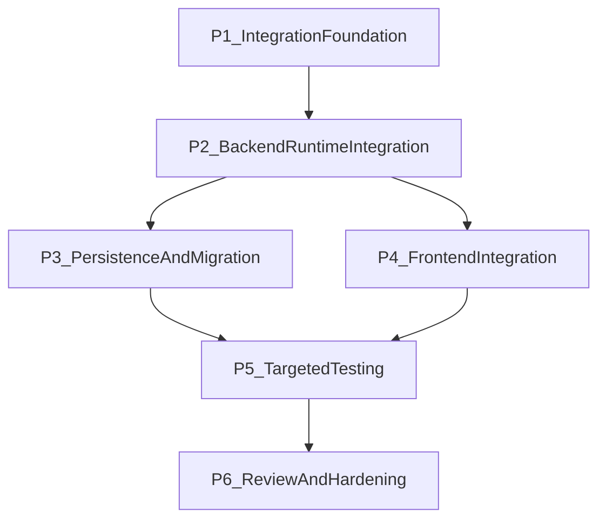

# Development Plan: Email Feature Integration into Job Tracker

## Executive Summary

This plan integrates the standalone `email_Feature` codebase into the main application as a first-class `job_tracker` capability, with backend ownership under `email_agent` and frontend entry points from both job tracker list and observation workflows. The integration keeps the existing app architecture (FastAPI + asyncpg backend, Next.js/React frontend) and avoids parallel standalone services.

- **Total phases**: 6
- **Estimated total effort**: 8-12 days (solo) or 4-6 days (2-3 developers with parallel execution where allowed)
- **Primary deliverable**: in-app email agent flow scoped to a specific `job_opening`

Top risks and mitigations:
1. **State-model mismatch risk** (`email_Feature/state.py` vs existing `job_tracker` contracts): mitigate by defining explicit adapter schemas in `email_agent/schemas.py` before node integration.
2. **Lifecycle mismatch risk** (new email agent run states vs existing agent run table and status conventions): mitigate by introducing targeted Alembic migration(s) and backward-compatible defaults.
3. **UI navigation fragmentation risk** (separate pages/actions from job opening context): mitigate by using opening-bound routes and adding explicit CTA/buttons from `JobTrackerPage` and `ObservationPage`.

---

## Plan Generation Requirement

This development plan must be created and maintained using:
- `/using-superpowers` (process governance)
- `/brainstorming` (gap closure and requirement quality)
- `/dev-plan-generator` (final phased plan decomposition and structure)

No alternate ad hoc planning format should replace `/dev-plan-generator` for this feature.

---

## Tech Stack and Scope Baseline

### In-Scope Backend
- `backend/app/features/job_tracker/email_agent/` (new feature area)
- `backend/app/features/job_tracker/openings_core/` (read-only dependency for opening ownership and status context)
- `backend/app/features/job_tracker/agents/` (pattern reference + potential coexistence/interop)
- `backend/alembic/versions/` (schema migration files)
- `backend/app/app.py` (router registration)

### In-Scope Frontend
- `frontend/src/app/job-tracker/JobTrackerPage.tsx`
- `frontend/src/app/job-tracker/ObservationPage.tsx`
- `frontend/src/features/job-tracker/jobTrackerApi.ts`
- New feature modules under `frontend/src/features/job-tracker/email-agent/`
- New route page(s) under `frontend/src/app/job-openings/[openingId]/email-agent/`

### Out-of-Scope
- Running the old standalone `email_Feature/ui/backend/main.py` and `email_Feature/ui/frontend/src/App.jsx` as a separate app in production
- Rewriting unrelated `user-profile` or `job-profile` modules

---

## Phase Overview

| Phase | Name | Focus | Key Deliverables | Effort | Depends On |
|------|------|------|------|------|------|
| P1 | Integration Foundation | Architecture mapping and contracts | `email_agent` module skeleton, state/schema contract map, API surface definition | M / 1 day | None |
| P2 | Backend Runtime Integration | Graph/node/runner integration | `email_agent` graph runner, service layer, opening ownership checks, run lifecycle | L / 1-2 days | P1 |
| P3 | Persistence and Migration | Schema updates for email-agent execution data | Alembic migration(s), models/table usage updates, compatibility safeguards | M / 1 day | P2 |
| P4 | Frontend Integration | In-app navigation and email-agent experience | Job tracker + observation entry actions, email-agent page bound to opening, API client wiring | L / 1-2 days | P2 |
| P5 | Targeted Testing and QA | Focused validation only for changed/new paths | Backend targeted tests, frontend targeted tests, new feature tests, manual QA checklist | L / 1-2 days | P3, P4 |
| P6 | Review, Hardening, Release Readiness | Code quality, optimization, rollout confidence | codex review/rescue workflows, optimization pass, cross-verification sign-off | M / 1 day | P5 |

---

## Phase 1: Integration Foundation

### Overview
- **Goal**: create a stable integration contract before implementation.
- **Entry criteria**: repository builds and current `job_tracker` routes are healthy.
- **Exit criteria**: explicit backend/frontend contract is documented in code comments/schemas and accepted by team.

### Task P1.T1: Define Backend Domain Boundaries
**Feature**: `email_agent` ownership in `job_tracker`  
**Effort**: S / 3-4 hours  
**Dependencies**: None  
**Risk Level**: Medium

#### Sub-task P1.T1.S1: Create `email_agent` module skeleton
**Description**: Add module structure for `router.py`, `service.py`, `schemas.py`, `state.py`, `graph.py`, `runner.py`, and `tests/` under `backend/app/features/job_tracker/email_agent/`.  
**Implementation Hints**: Follow structure conventions already used in `job_tracker/agents/` and `opening_resume/`.  
**Dependencies**: None  
**Effort**: S / 2 hours  
**Acceptance Criteria**:
- `email_agent` package imports cleanly.
- Router can be safely registered in `app.py` without runtime import errors.

#### Sub-task P1.T1.S2: Define API contract and opening-scoped endpoints
**Description**: Define endpoint set anchored to `opening_id` (start run, stream/status, fetch latest output, optional save/send actions).  
**Implementation Hints**: Mirror ownership checks from `job_tracker/agents/router.py` and `openings_core` patterns.  
**Dependencies**: P1.T1.S1  
**Effort**: S / 2 hours  
**Acceptance Criteria**:
- All endpoints are explicitly opening-bound.
- Auth and ownership requirements are documented per endpoint.

### Task P1.T2: Map Standalone Email Feature into In-App Contracts
**Feature**: graph/state/node adaptation  
**Effort**: M / 4-6 hours  
**Dependencies**: P1.T1.S2  
**Risk Level**: Medium

#### Sub-task P1.T2.S1: Build state-field mapping matrix
**Description**: Map each state key from `email_Feature/state.py` to in-app equivalents and mark required vs optional.  
**Implementation Hints**: Convert shape differences into typed Pydantic schemas in `email_agent/schemas.py`.  
**Dependencies**: P1.T1.S2  
**Effort**: S / 2-3 hours  
**Acceptance Criteria**:
- All required fields for generation and resume flow are mapped.
- No ambiguous fields remain undocumented.

#### Sub-task P1.T2.S2: Define node integration strategy
**Description**: Decide which nodes are reused as-is, wrapped, or rewritten to conform with current project config, tracing, and DB access patterns.  
**Implementation Hints**: Keep `email_Feature/nodes/*` behavior parity but avoid standalone app assumptions.  
**Dependencies**: P1.T2.S1  
**Effort**: S / 2 hours  
**Acceptance Criteria**:
- Each node has a clear integration path.
- Runtime dependencies (LLM keys, APIs, optional services) are explicit.

---

## Phase 2: Backend Runtime Integration

### Overview
- **Goal**: implement backend email-agent execution flow for a specific opening.
- **Entry criteria**: P1 contract approved.
- **Exit criteria**: a user can start and monitor an email-agent run per opening via API.

### Task P2.T1: Implement `email_agent` Router and Service
**Feature**: opening-bound agent runtime endpoints  
**Effort**: M / 1 day  
**Dependencies**: P1 complete  
**Risk Level**: Medium

#### Sub-task P2.T1.S1: Add start/status/history endpoints
**Description**: Implement endpoint handlers for start run and retrieve run status/history for one opening.  
**Implementation Hints**: Reuse ownership verification logic pattern from `job_tracker/agents/router.py`.  
**Dependencies**: P1.T1.S2  
**Effort**: M / 4-6 hours  
**Acceptance Criteria**:
- Start endpoint returns 202 and run identifier.
- Status endpoint returns deterministic shape with run stage and errors.

#### Sub-task P2.T1.S2: Implement stream/resume behavior
**Description**: Support interruption/resume flow (HITL style) and event streaming needed by frontend review step.  
**Implementation Hints**: Translate standalone graph interrupt behavior into existing run lifecycle conventions.  
**Dependencies**: P2.T1.S1  
**Effort**: M / 4-6 hours  
**Acceptance Criteria**:
- Stream endpoint yields ordered events.
- Resume endpoint updates run state and final output reliably.

### Task P2.T2: Integrate Graph/Runner and Node Execution
**Feature**: LangGraph runtime in main backend  
**Effort**: L / 1-2 days  
**Dependencies**: P2.T1.S2  
**Risk Level**: High

#### Sub-task P2.T2.S1: Port and adapt graph builder
**Description**: Move/adapt graph orchestration from `email_Feature/graph.py` into `email_agent/graph.py` with project settings/loading conventions.  
**Implementation Hints**: Replace standalone path/dotenv assumptions with existing app config provider patterns.  
**Dependencies**: P2.T1.S2  
**Effort**: M / 4-8 hours  
**Acceptance Criteria**:
- Graph compiles in backend environment.
- Conditional routing and interrupt points behave as expected.

#### Sub-task P2.T2.S2: Wire node execution with service dependencies
**Description**: Integrate node calls with current clients, auth context, and persistence hooks.  
**Implementation Hints**: Avoid direct imports from standalone app backend module; keep all logic in `job_tracker/email_agent`.  
**Dependencies**: P2.T2.S1  
**Effort**: M / 4-8 hours  
**Acceptance Criteria**:
- Node execution works for at least one complete opening flow.
- Failures propagate to run status and error payloads.

---

## Phase 3: Persistence and Alembic Migration

### Overview
- **Goal**: persist run metadata/output needed by UX and auditability.
- **Entry criteria**: runtime behavior stable in-memory/local execution.
- **Exit criteria**: schema migration applied and rollback tested.

### Task P3.T1: Design Data Persistence for Email-Agent Artifacts
**Feature**: run snapshots, outputs, review edits, statuses  
**Effort**: S / 3-4 hours  
**Dependencies**: P2 complete  
**Risk Level**: Medium

#### Sub-task P3.T1.S1: Define storage model deltas
**Description**: Define whether to extend existing run tables or add dedicated `email_agent` run/output tables keyed by `opening_id` and `user_id`.  
**Implementation Hints**: Prefer normalized schema with explicit status enums and JSONB payload columns only where variability is high.  
**Dependencies**: P2.T2.S2  
**Effort**: S / 2 hours  
**Acceptance Criteria**:
- Clear schema decision with ownership columns and timestamps.
- Query patterns for UI are efficient and explicit.

### Task P3.T2: Create and Apply Alembic Migration(s)
**Feature**: schema migration for new/updated data model  
**Effort**: M / 4-6 hours  
**Dependencies**: P3.T1.S1  
**Risk Level**: Medium

#### Sub-task P3.T2.S1: Generate migration file(s)
**Description**: Add Alembic revision(s) in `backend/alembic/versions/` for `email_agent` schema changes.  
**Implementation Hints**: Ensure FK constraints to `job_openings` and user ownership indices are present.  
**Dependencies**: P3.T1.S1  
**Effort**: S / 2-3 hours  
**Acceptance Criteria**:
- Migration file(s) are deterministic and reviewed.
- Upgrade path succeeds locally.

#### Sub-task P3.T2.S2: Validate rollback and compatibility
**Description**: Validate downgrade behavior for the new revision(s) and no regression for existing `job_tracker` flows.  
**Implementation Hints**: Run only targeted DB migration checks and job_tracker smoke paths.  
**Dependencies**: P3.T2.S1  
**Effort**: S / 2 hours  
**Acceptance Criteria**:
- Upgrade and downgrade complete without errors.
- Existing opening and agent endpoints continue functioning.

---

## Phase 4: Frontend Integration in Existing Pages

### Overview
- **Goal**: expose email-agent through current job tracker UX, not a standalone frontend.
- **Entry criteria**: backend endpoints are stable.
- **Exit criteria**: users can navigate from list/observation into opening-scoped email-agent page and execute flow.

### Task P4.T1: Add Navigation Entry Points
**Feature**: integration with existing job tracker pages  
**Effort**: M / 1 day  
**Dependencies**: P2 API contract  
**Risk Level**: Low

#### Sub-task P4.T1.S1: Add CTA from Job Tracker table row actions
**Description**: Add button/menu action in job tracker list to open email-agent page for a selected opening.  
**Implementation Hints**: Keep action consistent with existing `View Resume` style and status-driven availability.  
**Dependencies**: P2.T1.S1  
**Effort**: S / 2-3 hours  
**Acceptance Criteria**:
- Each eligible opening exposes an email-agent entry action.
- Route includes opening identifier.

#### Sub-task P4.T1.S2: Add CTA/overlay action in Observation page
**Description**: Add observation-page action/button to launch email-agent workflow for current opening context.  
**Implementation Hints**: Extend `ObservationPage.tsx` card actions with clear text and disabled/error states.  
**Dependencies**: P2.T1.S1  
**Effort**: S / 2-3 hours  
**Acceptance Criteria**:
- Observation page links directly to email-agent page.
- Behavior is opening-specific and user-scoped.

### Task P4.T2: Build Email-Agent Page and Client API Layer
**Feature**: in-app email-agent execution UX  
**Effort**: L / 1-2 days  
**Dependencies**: P4.T1 and P2 complete  
**Risk Level**: Medium

#### Sub-task P4.T2.S1: Create API client module
**Description**: Add strongly typed frontend API client for email-agent endpoints within `features/job-tracker`.  
**Implementation Hints**: Follow `jobTrackerApi.ts` patterns for request handling and mapping.  
**Dependencies**: P2.T1.S1  
**Effort**: S / 2-3 hours  
**Acceptance Criteria**:
- Start/status/stream/resume endpoints are wired.
- Error handling aligns with existing frontend conventions.

#### Sub-task P4.T2.S2: Create opening-scoped email-agent page
**Description**: Implement page to run workflow, review content, and present output for a specific opening.  
**Implementation Hints**: Reuse conceptual steps from `email_Feature/ui/frontend/src/App.jsx` but conform to existing project component patterns and routing.  
**Dependencies**: P4.T2.S1  
**Effort**: M / 4-8 hours  
**Acceptance Criteria**:
- Page loads opening context and run status.
- User can execute and complete end-to-end flow from UI.

---

## Phase 5: Targeted Testing Strategy (No Full Suite by Default)

### Overview
- **Goal**: prove correctness with focused tests for changed/new paths.
- **Entry criteria**: code implementation complete for backend and frontend.
- **Exit criteria**: targeted tests pass; manual scenarios pass.

### Task P5.T1: Backend Targeted Tests
**Feature**: email-agent endpoints, service, migration safety  
**Effort**: M / 1 day  
**Dependencies**: P2 and P3  
**Risk Level**: Medium

#### Sub-task P5.T1.S1: Add/Update backend tests only for touched modules
**Description**: Add tests under `backend/app/features/job_tracker/email_agent/tests/` and update only impacted existing tests.  
**Implementation Hints**: Cover ownership, run lifecycle, interruption/resume, and failure transitions.  
**Dependencies**: P2.T2.S2, P3.T2.S1  
**Effort**: M / 4-8 hours  
**Acceptance Criteria**:
- New feature tests pass.
- Existing touched tests still pass.

### Task P5.T2: Frontend Targeted Tests + Manual Validation
**Feature**: page navigation, API flow, status behavior  
**Effort**: M / 1 day  
**Dependencies**: P4 complete  
**Risk Level**: Low

#### Sub-task P5.T2.S1: Add focused frontend tests
**Description**: Test only impacted UI pieces (`job tracker row action`, `observation CTA`, `email-agent page interactions`).  
**Implementation Hints**: Extend local component tests in job tracker feature; avoid unrelated page tests.  
**Dependencies**: P4.T2.S2  
**Effort**: S / 2-4 hours  
**Acceptance Criteria**:
- Navigation and key action flows are covered.
- Error and loading states are validated.

#### Sub-task P5.T2.S2: Execute manual verification scenarios
**Description**: Manually verify opening-specific behavior and run-state transitions with realistic inputs.  
**Implementation Hints**: Include scenarios for success, partial failure, retry, and unauthorized access.  
**Dependencies**: P5.T2.S1  
**Effort**: S / 2-3 hours  
**Acceptance Criteria**:
- Manual checklist complete with pass/fail outcomes.
- Any defects are fed back before sign-off.

Testing policy:
- Run only specific test files for touched/new code.
- Do not run broad full-suite batches unless a dependency interaction requires it.
- For new functionality, create new tests rather than overloading unrelated suites.

---

## Phase 6: Review, Optimization, and Release Readiness

### Overview
- **Goal**: enforce quality and reduce integration risk before merge.
- **Entry criteria**: all targeted tests and manual checks pass.
- **Exit criteria**: review-complete, quality bar met, merge-ready.

### Task P6.T1: Agent-Led Review and Optimization
**Feature**: code quality, structure, performance  
**Effort**: S / 3-4 hours  
**Dependencies**: P5 complete  
**Risk Level**: Low

#### Sub-task P6.T1.S1: Run codex plugin review workflow
**Description**: Perform automated agent review and remediation loop.  
**Implementation Hints**: Use `/codex review` for structured findings and `/codex rescue` if broken intermediate states occur.  
**Dependencies**: P5 complete  
**Effort**: S / 2 hours  
**Acceptance Criteria**:
- Review findings are triaged and resolved or documented.
- No high-severity unresolved issues remain.

#### Sub-task P6.T1.S2: Final file-structure and optimization pass
**Description**: Validate feature boundaries, remove dead paths, and tighten performance-sensitive queries/render paths.  
**Implementation Hints**: Keep all new backend code in `job_tracker/email_agent` and preserve existing architectural patterns.  
**Dependencies**: P6.T1.S1  
**Effort**: S / 1-2 hours  
**Acceptance Criteria**:
- File structure remains coherent and feature-local.
- Obvious performance/code-quality issues are addressed.

---

## Appendix

### Glossary

| Term | Definition |
|------|-----------|
| Email Agent | Opening-scoped workflow that generates outreach email content and related artifacts. |
| Opening-Scoped | Every run and output is tied to one `job_opening` and authenticated user. |
| HITL | Human-in-the-loop pause/review/resume flow during generation pipeline. |
| Targeted Testing | Running only tests for touched/new modules instead of entire suites. |
| Graphify MCP | Knowledge-graph-based codebase exploration and impact analysis tooling. |

---

### Dependency Map

Critical path:
`P1 -> P2 -> P3 -> P5 -> P6`

Parallelization opportunity:
- After `P2`, backend migration work (`P3`) and frontend integration (`P4`) can proceed in parallel.

---

### Development Chronology Table

| Order | Work Item | Why This Order |
|------|------|------|
| 1 | P1 Foundation contracts | Prevents rework from unclear backend/frontend interfaces. |
| 2 | P2 Backend runtime integration | Frontend and migration details depend on stable API/run lifecycle. |
| 3 | P3 Persistence + Alembic | Stabilizes state durability and schema before broad QA. |
| 4 | P4 Frontend integration | Built on finalized endpoint and run-state behavior. |
| 5 | P5 Targeted tests + manual QA | Verifies changed/new behavior only, minimizing cycle time. |
| 6 | P6 Review + optimization + sign-off | Final quality gate before merge. |

---

### Full Risk Register

| ID | Risk | Likelihood | Impact | Mitigation |
|----|------|------------|--------|------------|
| R1 | State/contract mismatch between standalone and integrated modules | Medium | High | Define typed mapping contract in P1 before coding nodes. |
| R2 | Migration breaks existing job_tracker flows | Medium | High | Add backward-safe migration and rollback validation. |
| R3 | UI navigation causes fragmented opening context | Medium | Medium | Use opening-bound routes and CTA points from existing pages only. |
| R4 | Event stream/retry edge cases create inconsistent run status | Medium | High | Add targeted lifecycle tests and explicit state transitions. |
| R5 | Over-testing slows delivery | High | Medium | Enforce targeted test execution policy and change-scoped suites. |

---

### Assumptions Log

| ID | Assumption | Impact if Wrong |
|----|------------|-----------------|
| A1 | Existing auth ownership model remains unchanged for job_openings | Endpoint auth wrappers must be adjusted. |
| A2 | `job_openings` remains canonical parent for email-agent context | Data model may need alternate parent linkage. |
| A3 | Frontend route pattern can support opening-scoped email-agent page | Routing structure updates required. |
| A4 | Existing agent infra patterns are reusable for email-agent lifecycle | Additional runtime abstraction may be needed. |

---

### File Structure Requirements

- Backend integration must live under:
  - `backend/app/features/job_tracker/email_agent/`
- Frontend integration must live under existing job-tracker feature/app routing:
  - `frontend/src/features/job-tracker/email-agent/`
  - `frontend/src/app/job-openings/[openingId]/email-agent/`
- Alembic migration files must be created under:
  - `backend/alembic/versions/`
- Do not introduce parallel production usage of:
  - `email_Feature/ui/backend/`
  - `email_Feature/ui/frontend/`

---

### Agent Workflow Instructions (Mandatory)

Use the following workflow for planning, implementation, testing, and release:

1. `/using-superpowers` before major task transitions.
2. `/brainstorming` to close requirement/behavior gaps before large code changes.
3. `/dev-plan-generator` to create and maintain development plan structure.
4. Use graphify MCP first for codebase understanding and impact tracing before broad file scanning.
5. Use subagents for independent tasks where appropriate.
6. Use `/codex review` for code review before merge.
7. Use `/codex rescue` for recovery when intermediate states break expected flow.
8. Use targeted testing and evidence capture before claiming completion.

---

### Testing and Review Governance

- Agent must run targeted tests for touched/new code only.
- Agent must add new tests for all new development paths.
- Agent must perform `/codex review` and address critical findings.
- Agent should execute additional focused checks when code review flags risk.
- Manual verification will be performed by you and a developer team.
- Final sign-off must prioritize:
  - Functionality correctness
  - Code quality
  - File structure adherence
  - Optimization/performance sanity

