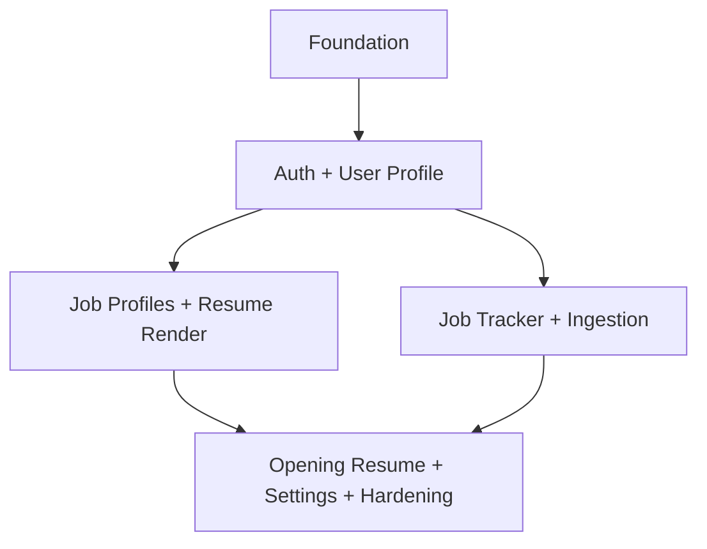

# Development Plan: Frontend (Rari + React + TypeScript)
## apply_n_reach — Jobs Tracker Frontend

---

## Executive Summary

This document completes **Phase 0** and is the single-source development plan for the frontend build. It includes the equivalent of `tech-stack-analysis`, `dependency-map`, and `development-plan` in one artifact so implementation can begin without separate planning files.

- **Project goal**: deliver a feature-first frontend that integrates with existing backend modules (`auth`, `user_profile`, `job_profile`, `job_tracker`) with MVP-first sequencing.
- **Total implementation phases after Phase 0**: 5 (P1-P5)
- **Estimated effort**: 6-10 weeks (1-2 engineers), or 4-7 weeks with parallel feature pods.
- **Primary constraints**: Rari-first architecture, lazy-loaded boundaries, typed API contracts, targeted tests only, compliance-safe ingestion UX.

Top risks and mitigation:
1. **API-contract drift across fast backend iteration**
   Mitigation: typed client DTOs generated/validated per feature and per-task contract checks before merge.
2. **UI/feature coupling causing parallel branch conflicts**
   Mitigation: strict feature-folder ownership + explicit dependency table for task-level sequencing.
3. **Test sprawl and slow feedback loops**
   Mitigation: mandatory targeted testing + maintained testing/audit logs instead of full-suite default.

---

## Stage 1: Requirements Analysis

### Feature F1: Frontend Foundation
**Description**: Bootstrap the app shell, route boundaries, typed API layer, auth/session plumbing, and shared UI states for loading/error/empty flows. This phase enables independent feature implementation without rework.
**Core capabilities**: app scaffold, route architecture, HTTP client, auth context/guards, test harness, baseline lint/format tooling.
**User-facing behavior**: user can load app shell, navigate primary routes, and see clear fallback states.
**Implied requirements**: environment configuration, cookie/session handling, request retry policy, global error notifications.
**Dependencies**: none.
**Open questions**: final choice for state cache layer (custom hooks only vs optional query cache utility wrapper).

### Feature F2: Auth + User Profile UX
**Description**: Implement signup/login/logout experience and profile management tabs aligned to backend `user_profile` sections. Profile bootstrap and section-level CRUD must be obvious and resilient.
**Core capabilities**: auth forms, protected routes, profile bootstrap (`POST /profile`), tabbed section editors, per-section hook/service modules.
**User-facing behavior**: users can authenticate, create profile once, and maintain all profile sections in one screen.
**Implied requirements**: optimistic updates or guarded refetch, section form validation, unsaved-change prompts, error mapping for 401/404/409/422.
**Dependencies**: F1.
**Open questions**: autosave policy per section vs explicit save CTA.

### Feature F3: Job Profiles + Resume Render UX
**Description**: Implement list/detail editing for job-specific profiles and rendered resume preview/download workflows.
**Core capabilities**: job profile list filters, editor tabs, latex layout controls, render trigger/polling, metadata and PDF availability UI.
**User-facing behavior**: user creates job-targeted profile variations and previews rendered output where available.
**Implied requirements**: side-panel virtualization, render state machine, retry UX, disabled controls during render.
**Dependencies**: F1, F2 (shared auth + section patterns).
**Open questions**: polling interval and timeout strategy for render status.

### Feature F4: Job Tracker + Ingestion
**Description**: Build tracker table CRUD and URL-based job description ingestion to prefill job opening data with explicit compliance constraints.
**Core capabilities**: openings table CRUD, status update actions, ingestion triggers, ingestion history visibility, extraction error states.
**User-facing behavior**: user tracks jobs and imports structured details from supported URLs.
**Implied requirements**: idempotent ingestion actions, conflict handling, policy messaging (LinkedIn non-scrape notice), retry controls.
**Dependencies**: F1, F2 (auth), optionally F3 shared UI primitives.
**Open questions**: whether ingestion history appears inline or in detail drawer/modal.

### Feature F5: Opening Resume Creator + Settings + Hardening
**Description**: Provide opening-level resume snapshot/edit flows, app settings, and performance hardening.
**Core capabilities**: opening resume create/edit, section-level snapshot edits, settings page, performance instrumentation and optimization.
**User-facing behavior**: user can tailor resume per opening and manage account/app preferences with responsive UI.
**Implied requirements**: copy integrity from source profile, snapshot independence indicators, latency budgets, accessibility checks.
**Dependencies**: F3, F4.
**Open questions**: settings scope for MVP (account only vs feature flags/preferences).

---

## Stage 2: Tech Stack Analysis (Embedded)

### Stack Components and Roles

| Component | Role |
| --- | --- |
| Rari (RSC-native) | route and rendering architecture with server/client boundaries |
| React + TypeScript | UI composition and strongly typed domain models |
| Custom hooks pattern | feature-level data orchestration and side-effect isolation |
| Typed HTTP client (`fetch` wrapper) | backend contract integration and consistent error handling |
| Vitest + Testing Library | unit/hook/component targeted verification |
| Existing FastAPI backend contracts | source of truth for endpoint behavior and payload schemas |

### Coverage Assessment by Capability

| Capability | Primary stack element | Coverage status |
| --- | --- | --- |
| Routing + layout boundaries | Rari | Covered |
| Feature state + forms | React + TypeScript + hooks | Covered |
| Contract-safe API integration | typed HTTP client + DTO modules | Covered |
| Section-level tabbed editing | React components + feature hooks | Covered |
| Targeted tests | Vitest/Test Library | Covered |
| E2E smoke path | lightweight browser automation/manual scripts | Partial |
| Runtime observability | logging/toast + optional perf marks | Partial |

### Gaps and Recommended Additions

1. **Schema runtime validation at boundary**
   - Gap: compile-time types do not guarantee runtime payload safety.
   - Why needed: backend can evolve per feature.
   - Recommendation: add a narrow runtime parser layer in `frontend/src/core/http/parsers.ts` (zod or equivalent lightweight validator).
2. **Request state normalization for repeated list/detail patterns**
   - Gap: repeated loading/error/reset logic across feature hooks.
   - Why needed: reduce drift and simplify testing.
   - Recommendation: add shared `useAsyncRequestState` utility under `frontend/src/core/hooks`.
3. **Feature-level route guards and redirect memory**
   - Gap: auth guard behavior not yet formalized.
   - Why needed: seamless return-to flow after login.
   - Recommendation: standardize guard utilities in `frontend/src/core/auth/guards.ts`.

### Assumptions

- Backend contracts in `auth`, `user_profile`, `job_profile`, and `job_tracker` are stable enough for frontend phased implementation.
- Session-based auth remains cookie-driven and frontend does not store sensitive tokens in local storage.
- Rari app can coexist in repo under `frontend/` without monorepo tooling changes.
- Full end-to-end suite is intentionally deferred; targeted test execution is required.

### Compatibility Notes

- RSC/client boundary errors are likely if feature hooks are used in server components; define strict `"use client"` boundary conventions early.
- Lazy loading plus nested tab forms can trigger hydration mismatches if default values differ server/client.
- Session expiry UX must map backend 401 responses to immediate guard-driven redirects.

---

## Stage 3: Dependency Mapping (Embedded)

### Foundation Layer
- F1 Frontend Foundation

### Feature Dependency Graph



### Critical Path
`F1 -> F2 -> (F3 or F4) -> F5`

### Parallelization Opportunities
- After F2 stabilizes, F3 and F4 can run in parallel.
- Within F2, user profile sections can run in parallel once shared profile shell and hook contracts are merged.
- Within F5, settings page and performance hardening can run in parallel with opening-resume UI finishing tasks.

### Shared Infrastructure to Build Once
- typed HTTP layer and shared error mapper
- auth/session guard utilities
- shared table, form, modal, and toast primitives
- shared test helpers and fixture builders

---

## Stage 4 and 5: Work Item Tree + Development Plan Assembly

## Phase Overview

| Phase | Focus | Key Deliverables | Effort | Depends On |
| --- | --- | --- | --- | --- |
| P1 | Frontend Foundation | app shell, core HTTP/auth/UI modules, test baseline | 1-2 weeks | Phase 0 |
| P2 | Auth + User Profile | auth pages, profile shell, section CRUD UX/hooks | 2-3 weeks | P1 |
| P3 | Job Profiles + Resume Render | profile list/editor and render panel | 1-2 weeks | P2 |
| P4 | Job Tracker + Ingestion | tracker table/workflows, ingestion UX | 1-2 weeks | P2 |
| P5 | Opening Resume + Settings + Hardening | resume creator, settings, perf hardening, final audit | 1-2 weeks | P3 + P4 |

---

## Phase 1: Frontend Foundation

### Entry Criteria
- Backend development environment and auth endpoints reachable from frontend.
- `frontend/` directory approved as source root.

### Exit Criteria
- App bootstraps and navigates all primary route placeholders.
- Auth guard and typed HTTP client are usable by feature teams.
- Targeted test workflow is documented and runnable.

### Task P1.T1: Scaffold Rari + TypeScript app shell
**Where to code**: `frontend/src/app`, `frontend/src/main.tsx`, `frontend/package.json`, `frontend/tsconfig*.json`
**What to develop**:
- route layout shell with global suspense/error boundaries
- route stubs for `/auth`, `/profile`, `/job-profiles`, `/job-tracker`, `/settings`
- persistent app navigation shell:
  - left sidebar navigation for `Job Profiles` and `Job Tracker` route groups
  - top-right account button/menu with actions for `User Profile` and `User Settings`
- strict TS config and path aliases for `@core`, `@features`, `@shared`
**Backend API Connections**:
- no business API calls required to render layout shell
- navigation routes must align with backend-backed pages:
  - `/job-profiles` pages integrate with `job_profile` routes
  - `/job-tracker` pages integrate with `job_tracker` routes
  - `/profile` and `/settings` should remain auth-protected and session-aware
**Points to consider**:
- separate server and client component boundaries explicitly
- avoid cross-feature imports at this stage
**Success criteria**:
- app compiles and route shell renders
- unresolved route fallback and global error boundary work
- sidebar and top-right account menu are visible and navigable from protected pages
**Testing points**:
- targeted smoke: app boot + route navigation render tests
- navigation smoke: sidebar route switches + account-menu route switches

### Task P1.T2: Build core HTTP client + contract adapters
**Where to code**: `frontend/src/core/http/*`, `frontend/src/core/config/*`
**What to develop**:
- typed request wrapper with JSON parsing and error normalization
- per-feature API module placeholders (`authApi`, `userProfileApi`, `jobProfileApi`, `jobTrackerApi`)
- optional runtime parser utility for high-risk payloads
**Backend API Connections**:
- auth: `/auth/register`, `/auth/login`, `/auth/logout`, `/auth/reset`, `/auth/me`
- user profile (base prefixes): `/profile`, `/profile/personal`, `/profile/summary`, `/profile/education`, `/profile/experience`, `/profile/projects`, `/profile/research`, `/profile/certifications`, `/profile/skills`
- job profile (base prefixes): `/job-profiles`, `/job-profiles/{job_profile_id}/personal|education|experience|projects|research|certifications|skills`, `/job-profiles/{job_profile_id}/latex-resume`
- job tracker (base prefixes): `/job-openings`, `/job-openings/{opening_id}/status`, `/job-openings/{opening_id}/status-history`, `/job-openings/{opening_id}/extraction/*`, `/job-openings/{opening_id}/resume*`
**Points to consider**:
- normalize 401/404/409/422 response handling
- preserve backend error detail for user-safe messaging
**Success criteria**:
- feature modules call one shared HTTP layer
- typed request/response contracts exist for core endpoints
**Testing points**:
- unit tests for response parsing and error mapping

### Task P1.T3: Implement auth state + route guards
**Where to code**: `frontend/src/core/auth/*`, `frontend/src/app/guards/*`
**What to develop**:
- auth context/session hooks
- protected route guard and return-to redirect behavior
- logout handling and stale session recovery
**Backend API Connections**:
- `GET /auth/me` to resolve current session user and bootstrap auth state
- `POST /auth/logout` for explicit sign-out flow
- auth pages from P2 consume `POST /auth/login` and `POST /auth/register`
**Points to consider**:
- avoid token persistence in local storage when session cookies are used
- guard should be composable for nested routes
**Success criteria**:
- unauthenticated users are redirected from protected routes
- authenticated users access protected routes without flicker
**Testing points**:
- guard logic unit tests and route-level behavior tests

### Task P1.T4: Establish testing and quality baseline
**Where to code**: `frontend/vitest.config.ts`, `frontend/src/test/*`, CI docs if applicable
**What to develop**:
- test setup helpers for component rendering and mocked APIs
- naming conventions for targeted tests
- command matrix for per-feature test execution
**Backend API Connections**:
- mock coverage should include endpoint families used by all feature adapters:
  - `/auth/*`
  - `/profile*`
  - `/job-profiles*`
  - `/job-openings*`
**Points to consider**:
- ensure tests are fast and deterministic
- enforce "no full suite by default" in docs
**Success criteria**:
- every new task can run only impacted tests
- testing log template is adopted by developers and agents
**Testing points**:
- verify sample targeted commands and output format

---

## Phase 2: Auth + User Profile (MVP Block 1)

### Entry Criteria
- P1 core modules merged.

### Exit Criteria
- Auth flows stable.
- User profile tabs support section-level CRUD through backend contracts.

### Task P2.T1: Build auth screens and workflows
**Where to code**: `frontend/src/features/auth/*`, `frontend/src/app/auth/*`
**What to develop**:
- signup/login/logout UI
- field validation and backend error surfaces
- auth completion redirect to intended route
**Backend API Connections**:
- `POST /auth/register`
- `POST /auth/login`
- `POST /auth/logout`
- `GET /auth/me` (session rehydration and guard bootstrap)
- `POST /auth/reset` (if reset is exposed in MVP auth screen)
**Success criteria**:
- happy and failure paths are handled (invalid credentials, expired session)
**Testing points**:
- auth form validation + mocked endpoint flows

### Task P2.T2: Create profile shell and bootstrap flow
**Where to code**: `frontend/src/features/user-profile/shell/*`, `frontend/src/app/profile/*`
**What to develop**:
- tabbed profile shell with section navigation
- bootstrap flow calling `POST /profile` when needed
- summary header and section-level save status indicators
**Backend API Connections**:
- `POST /profile` (bootstrap master profile)
- `GET /profile/summary` (counts/existence for tab summary states)
- `GET /profile/personal` and section list routes for tab preload checks
**Points to consider**:
- prevent duplicate profile bootstrap requests
- persist selected tab across refresh/navigation
**Success criteria**:
- first-time user can initialize profile and access all tabs
**Testing points**:
- profile bootstrap conflict path (`409`) and recovery tests

### Task P2.T3: Implement personal, education, experience, projects, research, skills, certifications sections
**Where to code**: `frontend/src/features/user-profile/sections/<section>/*`
**What to develop**:
- per-section form/list UI + custom hook + API adapter
- create/edit/delete actions where backend supports them
- common section action bar and field-level validation mapping
**Backend API Connections**:
- personal: `GET /profile/personal`, `PATCH /profile/personal`
- education: `GET /profile/education`, `GET /profile/education/{education_id}`, `POST /profile/education`, `PATCH /profile/education/{education_id}`, `DELETE /profile/education/{education_id}`
- experience: `GET /profile/experience`, `GET /profile/experience/{experience_id}`, `POST /profile/experience`, `PATCH /profile/experience/{experience_id}`, `DELETE /profile/experience/{experience_id}`
- projects: `GET /profile/projects`, `GET /profile/projects/{project_id}`, `POST /profile/projects`, `PATCH /profile/projects/{project_id}`, `DELETE /profile/projects/{project_id}`
- research: `GET /profile/research`, `GET /profile/research/{research_id}`, `POST /profile/research`, `PATCH /profile/research/{research_id}`, `DELETE /profile/research/{research_id}`
- certifications: `GET /profile/certifications`, `GET /profile/certifications/{certification_id}`, `POST /profile/certifications`, `PATCH /profile/certifications/{certification_id}`, `DELETE /profile/certifications/{certification_id}`
- skills: `GET /profile/skills`, `GET /profile/skills/{skill_id}`, `PATCH /profile/skills` (replace-all semantics)
**Points to consider**:
- each section must remain independently testable and mergeable
- sanitize and validate URLs/dates/lengths before submit for fast feedback
**Success criteria**:
- each tab performs CRUD/read actions with clear success/failure messaging
- no section leaks state into another section
**Testing points**:
- section hook tests and component tests scoped per section folder

### Task P2.T4: UX hardening for profile workflows
**Where to code**: `frontend/src/features/user-profile/shared/*`
**What to develop**:
- unsaved change prompts, disabled states, retry affordances
- standardized empty and error states across sections
**Backend API Connections**:
- hardening must map backend semantics:
  - `409` from `POST /profile` duplicate bootstrap
  - `404` on missing section rows (for GET-by-id and initial personal GET)
  - `422` for validation failures across section create/update routes
  - `401` session expiry on all `/profile*` routes
**Success criteria**:
- user cannot unintentionally lose in-progress edits
- consistent handling for 401/404/422/500 across profile sections
**Testing points**:
- behavior tests for save/unsaved/retry flows

---

## Phase 3: Job Profiles + Resume Render (MVP Block 2)

### Task P3.T1: Implement job profiles list and details navigation
**Where to code**: `frontend/src/features/job-profiles/list/*`, `frontend/src/app/job-profiles/*`
**What to develop**:
- listing page with count, status filters, and open profile actions
- create profile CTA and route to editor
**Backend API Connections**:
- `POST /job-profiles` (create)
- `GET /job-profiles` (paginated list; supports `limit`, `offset`, `status`)
- `GET /job-profiles/{job_profile_id}` (open profile from list row)
- `DELETE /job-profiles/{job_profile_id}` (optional row action if exposed in MVP)
**Success criteria**:
- user can discover, create, and open job profiles quickly
**Testing points**:
- list rendering and filter behavior tests

### Task P3.T2: Build job profile editor tabs
**Where to code**: `frontend/src/features/job-profiles/editor/*`
**What to develop**:
- tabbed editor aligned with backend section APIs
- save/update controls and validation feedback
**Detailed implementation scope**:
- build an editor shell with:
  - left tab rail for `Personal`, `Education`, `Experience`, `Projects`, `Research`, `Certifications`, `Skills`
  - center form/list workspace
  - right contextual panel reserved for latex render controls/metadata (wired in P3.T3)
- provide feature hooks per section (`useJPOverview`, `useJPPersonal`, `useJPEducation`, etc.) with consistent return shape:
  - `{ data, isLoading, isSaving, error, refresh, create, update, remove, importFromProfile }`
- define per-tab mutation UX:
  - optimistic row updates only when idempotent and low risk (for small PATCH operations)
  - for create/delete/import flows, prefer server-confirmed refresh to preserve ownership/filter correctness
- implement import workflows from master profile where backend supports `/import`:
  - surface selectable source entries and import confirmation
  - show `ImportResult` counts (`imported_count`, `skipped_count`, `already_imported_ids`) in UI feedback
- enforce editor-level safeguards:
  - unsaved changes prompt when switching tabs/routes
  - disable duplicate submissions while request in flight
  - section-level empty and recoverable error states
- keep editor route contract stable:
  - `/job-profiles/:jobProfileId/edit?tab=<section>`
  - restore active tab after refresh/back navigation
**Backend API Connections**:
- core:
  - `GET /job-profiles/{job_profile_id}` (header metadata)
  - `PATCH /job-profiles/{job_profile_id}` (name/status/metadata edits)
- personal:
  - `GET /job-profiles/{job_profile_id}/personal`
  - `PATCH /job-profiles/{job_profile_id}/personal`
  - `POST /job-profiles/{job_profile_id}/personal/import`
- education:
  - `GET /job-profiles/{job_profile_id}/education`
  - `GET /job-profiles/{job_profile_id}/education/{education_id}`
  - `POST /job-profiles/{job_profile_id}/education`
  - `PATCH /job-profiles/{job_profile_id}/education/{education_id}`
  - `DELETE /job-profiles/{job_profile_id}/education/{education_id}`
  - `POST /job-profiles/{job_profile_id}/education/import`
- experience:
  - `GET /job-profiles/{job_profile_id}/experience`
  - `GET /job-profiles/{job_profile_id}/experience/{experience_id}`
  - `POST /job-profiles/{job_profile_id}/experience`
  - `PATCH /job-profiles/{job_profile_id}/experience/{experience_id}`
  - `DELETE /job-profiles/{job_profile_id}/experience/{experience_id}`
  - `POST /job-profiles/{job_profile_id}/experience/import`
- projects:
  - `GET /job-profiles/{job_profile_id}/projects`
  - `GET /job-profiles/{job_profile_id}/projects/{project_id}`
  - `POST /job-profiles/{job_profile_id}/projects`
  - `PATCH /job-profiles/{job_profile_id}/projects/{project_id}`
  - `DELETE /job-profiles/{job_profile_id}/projects/{project_id}`
  - `POST /job-profiles/{job_profile_id}/projects/import`
- research:
  - `GET /job-profiles/{job_profile_id}/research`
  - `GET /job-profiles/{job_profile_id}/research/{research_id}`
  - `POST /job-profiles/{job_profile_id}/research`
  - `PATCH /job-profiles/{job_profile_id}/research/{research_id}`
  - `DELETE /job-profiles/{job_profile_id}/research/{research_id}`
  - `POST /job-profiles/{job_profile_id}/research/import`
- certifications:
  - `GET /job-profiles/{job_profile_id}/certifications`
  - `GET /job-profiles/{job_profile_id}/certifications/{cert_id}`
  - `POST /job-profiles/{job_profile_id}/certifications`
  - `PATCH /job-profiles/{job_profile_id}/certifications/{cert_id}`
  - `DELETE /job-profiles/{job_profile_id}/certifications/{cert_id}`
  - `POST /job-profiles/{job_profile_id}/certifications/import`
- skills:
  - `GET /job-profiles/{job_profile_id}/skills`
  - `GET /job-profiles/{job_profile_id}/skills/{skill_id}`
  - `PATCH /job-profiles/{job_profile_id}/skills` (replace-all)
  - `POST /job-profiles/{job_profile_id}/skills/import`
**Points to consider**:
- ensure import UX clearly distinguishes additive import vs direct manual edits
- preserve section scroll position and focus after mutation
- keep request cancellation support when switching tabs rapidly
**Success criteria**:
- user can edit all supported sections and persist updates reliably
- import-from-profile workflows are successful and auditable per section
- tab switching is stable with no stale data bleed across sections
**Testing points**:
- section edit tests, save path tests, validation tests
- import flow tests for each section that supports `/import`
- route-state tests for `tab` query persistence and unsaved-change guards

### Task P3.T3: Add resume render panel and controls
**Where to code**: `frontend/src/features/job-profiles/render/*`
**What to develop**:
- right-side panel for render metadata and PDF availability
- trigger render action and poll metadata endpoint
- download/open PDF action when present
**Detailed implementation scope**:
- render panel structure:
  - `RenderStatusCard` (idle, rendering, success, failed, never-rendered states)
  - `LayoutControls` for latex options (margins, spacing, display toggles) with preset and custom mode
  - `RenderActions` (`Render now`, `Re-render`, `Download PDF`, `Open PDF`, `Copy error details`)
- render orchestration hook (`useJPLatexRender`) responsibilities:
  - trigger render request with optional layout payload
  - poll metadata endpoint with capped retries/backoff
  - stop polling on terminal states (success/failure/not-found after timeout)
  - expose derived state (`lastRenderedAt`, `hasPdf`, `isRendering`, `renderError`)
- UX behavior requirements:
  - disable render button while active render request is in progress
  - persist last used layout values per job profile in local UI state
  - show exact backend error message in developer-facing debug panel and user-safe message in primary UI
  - support opening PDF in new tab and forced file download path
- reliability requirements:
  - polling cadence: short interval first minute, then reduced frequency
  - cancellation on route change/unmount
  - hard timeout path that instructs user to manually refresh render metadata
**Backend API Connections**:
- `POST /job-profiles/{job_profile_id}/latex-resume/render` (trigger render; optional layout payload)
- `GET /job-profiles/{job_profile_id}/latex-resume` (metadata polling/read)
- `GET /job-profiles/{job_profile_id}/latex-resume/pdf` (download binary PDF)
**Points to consider**:
- avoid over-polling; stop polling on terminal states
- clear user messaging for render failures/timeouts
- binary PDF response handling must support both blob download and browser-open flow
**Success criteria**:
- render action lifecycle is visible and actionable
- metadata updates appear without full page refresh
- PDF actions work only when artifact exists and are disabled otherwise
**Testing points**:
- render state-machine hook tests and panel UI tests
- polling behavior tests (success, timeout, error, cancellation)
- binary response tests for download/open action branching

---

## Phase 4: Job Tracker + Ingestion (MVP Block 3)

### Task P4.T1: Build job tracker table and opening CRUD workflows
**Where to code**: `frontend/src/features/job-tracker/openings/*`, `frontend/src/app/job-tracker/*`
**What to develop**:
- table with status, company, role, source URL, timestamps
- create/edit/delete workflows tied to openings core endpoints
- row-level actions and details drawer
**Backend API Connections**:
- `POST /job-openings`
- `GET /job-openings` (supports status/company/role filters and cursor-like pagination params)
- `GET /job-openings/{opening_id}`
- `PATCH /job-openings/{opening_id}`
- `DELETE /job-openings/{opening_id}?confirm=true`
- `POST /job-openings/{opening_id}/status`
- `GET /job-openings/{opening_id}/status-history`
**Success criteria**:
- tracker table supports full core workflow with clear status transitions
**Testing points**:
- row CRUD tests and status transition behavior tests

### Task P4.T2: Implement URL ingestion flow
**Where to code**: `frontend/src/features/job-tracker/ingestion/*`
**What to develop**:
- ingestion trigger from URL and extraction run status UI
- retry/manual refresh and history view where needed
- compliance-safe copy stating LinkedIn jobs are not scraped
**Backend API Connections**:
- `POST /job-openings/{opening_id}/extraction/refresh`
- `GET /job-openings/{opening_id}/extracted-details/latest`
- `GET /job-openings/{opening_id}/extraction-runs`
**Points to consider**:
- idempotency/409 conflict handling on concurrent extraction attempts
- preserve failed-run visibility for user troubleshooting
**Success criteria**:
- user can run ingestion on supported URLs and inspect status/result
**Testing points**:
- ingestion hook tests for success, retry, timeout, and conflict paths

### Task P4.T3: Integrate tracker detail with opening resume entry points
**Where to code**: `frontend/src/features/job-tracker/integration/*`
**What to develop**:
- deep links/CTA from opening row to opening resume creator
- pass opening context safely through route params/state
**Backend API Connections**:
- `GET /job-openings/{opening_id}` for detail hydration before navigating into resume creator
- `GET /job-openings/{opening_id}/resume` to determine if snapshot exists
- `POST /job-openings/{opening_id}/resume?source_job_profile_id=<id>` when creating snapshot from tracker path
**Success criteria**:
- users can transition from tracker to resume flow without context loss
**Testing points**:
- navigation contract tests for opening context handoff

---

## Phase 5: Opening Resume Creator + Settings + Hardening

### Task P5.T1: Build opening resume creator and section editors
**Where to code**: `frontend/src/features/opening-resume/*`, `frontend/src/app/opening-resume/*`
**What to develop**:
- opening resume creation action and snapshot section editing
- section-level forms/actions mirroring backend opening_resume endpoints
**Backend API Connections**:
- root snapshot:
  - `POST /job-openings/{opening_id}/resume?source_job_profile_id=<id>`
  - `GET /job-openings/{opening_id}/resume`
- personal:
  - `GET /job-openings/{opening_id}/resume/personal`
  - `PUT /job-openings/{opening_id}/resume/personal`
- education:
  - `GET /job-openings/{opening_id}/resume/education`
  - `POST /job-openings/{opening_id}/resume/education`
  - `GET /job-openings/{opening_id}/resume/education/{entry_id}`
  - `PATCH /job-openings/{opening_id}/resume/education/{entry_id}`
  - `DELETE /job-openings/{opening_id}/resume/education/{entry_id}`
- experience:
  - `GET /job-openings/{opening_id}/resume/experience`
  - `POST /job-openings/{opening_id}/resume/experience`
  - `GET /job-openings/{opening_id}/resume/experience/{entry_id}`
  - `PATCH /job-openings/{opening_id}/resume/experience/{entry_id}`
  - `DELETE /job-openings/{opening_id}/resume/experience/{entry_id}`
- projects:
  - `GET /job-openings/{opening_id}/resume/projects`
  - `POST /job-openings/{opening_id}/resume/projects`
  - `GET /job-openings/{opening_id}/resume/projects/{entry_id}`
  - `PATCH /job-openings/{opening_id}/resume/projects/{entry_id}`
  - `DELETE /job-openings/{opening_id}/resume/projects/{entry_id}`
- research:
  - `GET /job-openings/{opening_id}/resume/research`
  - `POST /job-openings/{opening_id}/resume/research`
  - `GET /job-openings/{opening_id}/resume/research/{entry_id}`
  - `PATCH /job-openings/{opening_id}/resume/research/{entry_id}`
  - `DELETE /job-openings/{opening_id}/resume/research/{entry_id}`
- certifications:
  - `GET /job-openings/{opening_id}/resume/certifications`
  - `POST /job-openings/{opening_id}/resume/certifications`
  - `GET /job-openings/{opening_id}/resume/certifications/{entry_id}`
  - `PATCH /job-openings/{opening_id}/resume/certifications/{entry_id}`
  - `DELETE /job-openings/{opening_id}/resume/certifications/{entry_id}`
- skills:
  - `GET /job-openings/{opening_id}/resume/skills`
  - `POST /job-openings/{opening_id}/resume/skills`
  - `GET /job-openings/{opening_id}/resume/skills/{entry_id}`
  - `PATCH /job-openings/{opening_id}/resume/skills/{entry_id}`
  - `DELETE /job-openings/{opening_id}/resume/skills/{entry_id}`
**Points to consider**:
- communicate snapshot independence from source job profile
- prevent duplicate create action conflicts
**Success criteria**:
- opening resume lifecycle works end-to-end from creation to edits
**Testing points**:
- creation and section-edit targeted tests with conflict paths

### Task P5.T2: Implement settings page
**Where to code**: `frontend/src/features/settings/*`, `frontend/src/app/settings/*`
**What to develop**:
- account/session preference UI
- persisted settings retrieval/update flow
**Backend API Connections**:
- current backend-auth user endpoint: `GET /auth/me` (initial account identity and session metadata)
- logout action in settings: `POST /auth/logout`
- if user settings persistence endpoints are introduced later, adapters should live in `settingsApi` with the same typed HTTP conventions
**Success criteria**:
- settings are editable, validated, and persisted correctly
**Testing points**:
- settings form and persistence tests

### Task P5.T3: Performance and reliability hardening
**Where to code**: cross-cutting in `frontend/src/app/*`, feature routes, and hooks
**What to develop**:
- route-level lazy splitting and suspense optimization
- selective memoization where measured bottlenecks exist
- standardized async loading/error/retry behavior review
**Backend API Connections**:
- evaluate high-frequency and high-latency API usage hotspots:
  - `GET /job-profiles`
  - section list routes under `/job-profiles/{job_profile_id}/*`
  - `GET /job-openings`
  - ingestion polling routes under `/job-openings/{opening_id}/extraction/*`
  - latex resume metadata polling route `/job-profiles/{job_profile_id}/latex-resume`
**Points to consider**:
- do not memoize prematurely; justify by measurement
- keep accessibility behavior intact after optimization
**Success criteria**:
- critical pages show acceptable initial and interaction latency
- no regressions in feature behavior
**Testing points**:
- targeted regression tests for optimized components/hooks

### Task P5.T4: Final documentation and implementation audit closeout
**Where to code**: `Features-to-develop/frontend/frontend-features-plan.md`, appendix test/audit logs
**What to develop**:
- finalize task completion evidence
- ensure log completeness and unresolved risk notes
**Backend API Connections**:
- include endpoint-level coverage mapping in final audit:
  - which frontend tasks consume which backend endpoint families
  - which endpoint error states were tested (`401`, `404`, `409`, `422`, `500`)
  - which endpoints remain partially integrated or deferred
**Success criteria**:
- every completed task has associated test and audit evidence
**Testing points**:
- none new; validate that previously targeted tests are documented

---

## Appendix

### Appendix A: Development Rules for Developers and Agents

1. **Feature boundary rule**: implement within feature folder (`auth`, `user-profile`, `job-profiles`, `job-tracker`, `opening-resume`, `settings`) and avoid cross-feature business logic leakage.
2. **Single responsibility rule**: keep UI components presentational; place data-fetching/mutation in hooks/services.
3. **Contract-first rule**: backend contract changes must update typed adapters and impacted tests in the same task.
4. **Targeted testing rule (mandatory)**: run only tests for new/changed paths; do not run entire suite by default.
5. **Audit evidence rule**: each task closure must include changed files, test commands, outputs, and pending risks.
6. **Compliance rule**: ingestion UX and docs must explicitly preserve LinkedIn non-scraping policy.

### Appendix B: Task Dependency and Parallel Execution

| Task | Depends On | Sequential Note | Parallel Opportunities |
| --- | --- | --- | --- |
| P1.T1 | - | app shell before features | docs prep |
| P1.T2 | P1.T1 | HTTP layer before feature APIs | P1.T3 prep |
| P1.T3 | P1.T1 | guards after route skeleton | P1.T4 |
| P1.T4 | P1.T1 | test baseline can begin early | P1.T2/P1.T3 |
| P2.T1 | P1.* | auth before protected features | - |
| P2.T2 | P2.T1 | profile shell before section work | - |
| P2.T3 | P2.T2 | per-section modules | section-wise parallel pods |
| P2.T4 | P2.T2/P2.T3 | hardening after base UX | with late section work |
| P3.T1 | P2.* | job profile list setup | - |
| P3.T2 | P3.T1 | editor after list routing | - |
| P3.T3 | P3.T2 | render panel after editor | - |
| P4.T1 | P2.* | tracker CRUD base first | P4.T2 prep |
| P4.T2 | P4.T1 | ingestion on top of openings | P3 finalization |
| P4.T3 | P4.T1 + P5.T1 design | integration wiring | - |
| P5.T1 | P3 + P4 | opening resume flow after upstream data flows | P5.T2 |
| P5.T2 | P1 + P2 auth baseline | settings independent of resume internals | P5.T1 |
| P5.T3 | P3 + P4 + P5.T1 | optimization after functionality | with P5.T2 |
| P5.T4 | all prior tasks | closeout only at end | - |

Parallel workstream recommendation:
- **Stream A**: P3 (Job Profiles)
- **Stream B**: P4 (Job Tracker + Ingestion)
- **Stream C**: P2 section-by-section work (after P2.T2)

### Appendix C: Planned File Structure (Frontend)

```text
frontend/
  src/
    app/
      auth/
      profile/
      job-profiles/
      job-tracker/
      opening-resume/
      settings/
      layout/
    core/
      config/
      http/
      auth/
      hooks/
      ui/
      utils/
    features/
      auth/
      user-profile/
        shell/
        sections/
          personal/
          education/
          experience/
          projects/
          research/
          skills/
          certifications/
      job-profiles/
        list/
        editor/
        render/
      job-tracker/
        openings/
        ingestion/
        integration/
      opening-resume/
      settings/
    test/
      fixtures/
      helpers/
```

### Appendix D: Testing and Verification Strategy

- Mandatory scope: run tests only for code added/changed in the current task and immediate integration touchpoints.
- Forbidden default: running full frontend test suite unless task explicitly changes shared foundational modules.
- Test layers:
  - unit tests (utils, adapters, validators)
  - hook tests (async state, mutation flows, polling/retry)
  - component tests (forms/tables/panels/guards)
  - minimal route smoke checks for changed routes
- Minimum per-task test evidence:
  - command run
  - targeted scope
  - pass/fail summary
  - known untested edge cases (if any)

### Appendix E: Developer and Agent Testing + Audit Logs (Mandatory Templates)

#### E.1 Development Log Template

| Date | Task ID | Developer/Agent | What changed | Files touched | Notes |
| --- | --- | --- | --- | --- | --- |
| YYYY-MM-DD | P?.T? | name | short summary | path list | blockers/decisions |

#### E.2 Targeted Testing Log Template

| Date | Task ID | Test command | Why this scope | Result | Follow-up |
| --- | --- | --- | --- | --- | --- |
| YYYY-MM-DD | P?.T? | `pnpm vitest ...` | changed hook/component only | pass/fail | rerun/additional tests |

#### E.3 Audit Log Template

| Date | Task ID | Risk area checked | Outcome | Remaining risk | Owner |
| --- | --- | --- | --- | --- | --- |
| YYYY-MM-DD | P?.T? | auth guard / API mapping / perf / compliance | ok/issue | short note | name |

Usage rule:
- developers and coding agents must update E.1-E.3 for each task before marking task complete.

### Appendix F: Graphify + CLAUDE.md Instructions for Token-Efficient Development

Before broad exploration or implementation:
1. Read `CLAUDE.md` for workspace rules and graph workflow expectations.
2. Read `graphify-out/GRAPH_REPORT.md` first to identify high-value communities, hubs, and likely impact radius.
3. Prefer graph-guided navigation over full-repo scans to reduce token consumption and improve context precision.
4. When graph wiki/index exists, use it before raw file traversals.
5. During implementation, update Graphify context after substantial **code** edits by running:
   - `python -m graphify update .`
6. Record Graphify-informed findings in task audit log (E.3) when they influenced design or scope.

### Appendix G: Plan Quality Checklist

- Every required frontend feature appears in at least one phase task.
- Task dependencies remain acyclic and match dependency map.
- Each task includes where-to-code, what-to-develop, success criteria, and testing points.
- Targeted testing and logging protocols are explicit and mandatory.
- Graphify and `CLAUDE.md` usage instructions are present for developers and agents.
