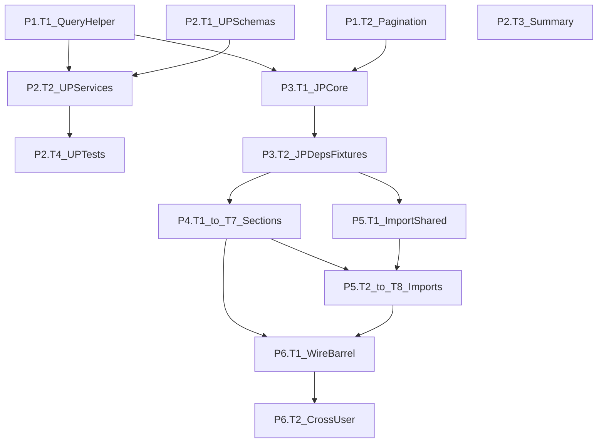

# Development Plan: Job Profile Feature + User Profile Enhancements

> **Reference Documents:**
>
> - [Brainstorm & Design Doc](./job-profile-feature-brainstorm.md)
> - [Gap Closure — Final Decisions](./gap-closure.md)
> - [Tech Stack Analysis](./tech-stack-analysis.md)
> - [Dependency Map](./dependency-map.md)

---

## Executive Summary

This plan covers two related feature scopes: (1) building the complete **Job Profile** feature — a multi-section, import-driven resume builder — and (2) enhancing the existing **User Profile** with partial updates and a summary endpoint to support the import flow. The codebase uses FastAPI + asyncpg + PostgreSQL with raw SQL, Pydantic v2 schemas with `sanitize_text` validation, and pytest integration tests.

- **Total phases:** 6
- **Estimated total effort:** 8–12 days (solo developer) / 4–6 days (2–3 developers with parallelism)
- **Key risks and mitigations:**
  1. **Dynamic SQL in partial updates** — building SET clauses from dicts risks SQL injection if not parameterized correctly. Mitigation: centralized `build_partial_update_query()` helper with strict parameterization, tested in isolation.
  2. **Import ownership validation** — source_ids in import requests must be verified against the authenticated user's master profile. Missing this check = IDOR vulnerability. Mitigation: every import service function joins through `user_profiles.user_id` to verify ownership.
  3. **Test fixture complexity** — job profile tests need multi-layer fixtures (user → user_profile → master data → job_profile). Mitigation: dedicated conftest with reusable helpers, built in Phase 3.

---

## Phase Overview


| Phase | Focus                     | Key Deliverables                                                                                     | Effort         | Depends On |
| ----- | ------------------------- | ---------------------------------------------------------------------------------------------------- | -------------- | ---------- |
| P1    | Shared Infrastructure     | `build_partial_update_query()`, pagination schemas                                                   | S / 2–4 hrs    | —          |
| P2    | User Profile Enhancements | Partial update schemas + services for 6 sections, summary endpoint                                   | L / 1.5–2 days | P1         |
| P3    | Job Profile Foundation    | `job_profiles` table, core CRUD, dependencies, test fixtures                                         | L / 1–1.5 days | P1         |
| P4    | Job Profile Sections      | 7 section sub-features (personal, education, experience, projects, research, certifications, skills) | XL / 2–3 days  | P3         |
| P5    | Import System             | Shared import schemas, 7 section import endpoints                                                    | L / 1.5–2 days | P4         |
| P6    | Integration & Wiring      | Router wiring in app.py, barrel imports, cross-user isolation tests                                  | M / 0.5–1 day  | P4, P5     |


---

## Phase 1: Shared Infrastructure

### Overview

- **Goal:** Build reusable utilities needed by both user_profile enhancements and job_profile.
- **Features addressed:** Partial updates (both features), paginated listing (job_profile).
- **Entry criteria:** Existing codebase cloned, dev environment running, tests passing.
- **Exit criteria:** `build_partial_update_query()` and pagination schemas exist with passing unit tests.

---

### Task P1.T1: Create Partial Update Query Helper

**Feature:** Shared utility for both user_profile and job_profile partial updates
**Effort:** S / 2–3 hours
**Dependencies:** None
**Risk Level:** Medium — dynamic SQL generation is a common source of injection vulnerabilities.

#### Sub-task P1.T1.S1: Write tests for `build_partial_update_query`

**Files:** `app/features/core/tests/test_query_helpers.py`

**Description:** Write unit tests for a function that takes a table name, a list of ID column/value pairs (for the WHERE clause), and a dict of column→value updates, then returns a parameterized SQL string and an ordered list of parameter values. The function must reject empty update dicts, must use `$N` positional parameters (asyncpg format), and must never interpolate values into the SQL string directly.

**Implementation Hints:**

- Test cases to cover:
  - Happy path: `build_partial_update_query("educations", {"id": 5, "profile_id": 3}, {"major": "CS", "degree_type": "MS"})` → returns `("UPDATE educations SET major=$1, degree_type=$2, updated_at=NOW() WHERE id=$3 AND profile_id=$4 RETURNING *", ["CS", "MS", 5, 3])`
  - Empty updates dict → raises `ValueError`
  - Single update field → works correctly
  - JSONB fields: when a value is a list, it should be `json.dumps()`'d and the SQL should cast with `::jsonb`
  - The function should include `updated_at=NOW()` automatically in the SET clause
- Use plain `pytest` assertions, no DB needed for this test.

**Dependencies:** None
**Effort:** S / 1 hour
**Risk Flags:** None — pure unit test.
**Acceptance Criteria:**

- All test cases written and importable
- Tests fail when run (RED phase — function doesn't exist yet)
- Tests cover: happy path, empty dict rejection, single field, JSONB handling, automatic `updated_at`

#### Sub-task P1.T1.S2: Implement `build_partial_update_query`

**Files:** `app/features/core/query_helpers.py`

**Description:** Implement the function to pass the tests from P1.T1.S1. The function signature: `build_partial_update_query(table: str, where: dict[str, Any], updates: dict[str, Any], jsonb_fields: set[str] | None = None, returning: str = "*") -> tuple[str, list[Any]]`. The `jsonb_fields` param tells the function which update keys need `::jsonb` casting.

**Implementation Hints:**

- Build the SET clause by iterating `updates.items()`, assigning `$1, $2, ...` in order.
- For JSONB fields: `json.dumps(value)` the value and append `::jsonb` to the column assignment: `bullet_points=$3::jsonb`.
- Always append `updated_at=NOW()` as a non-parameterized SET entry (no `$N` — it's a DB function call).
- Build the WHERE clause from the `where` dict, continuing the `$N` sequence after the SET params.
- Return `(sql_string, params_list)` where params_list is the values in the same order as their `$N` references.
- **SECURITY:** The `table` and column names come from developer code (hardcoded in service functions), NOT from user input. Do not accept arbitrary table/column names from request data.
- Raise `ValueError("No fields to update")` if `updates` is empty after filtering.

**Dependencies:** P1.T1.S1
**Effort:** S / 1 hour
**Risk Flags:** The `table` and column names are string-interpolated (not parameterized) since SQL doesn't allow parameterized identifiers. This is safe ONLY because these values come from hardcoded service code, never from user input. Document this constraint clearly in the docstring.
**Acceptance Criteria:**

- All tests from P1.T1.S1 pass (GREEN phase)
- Function raises `ValueError` on empty updates
- Generated SQL uses `$N` positional parameters — no string interpolation of values
- JSONB fields get `::jsonb` cast
- `updated_at=NOW()` is always included in SET clause

---

### Task P1.T2: Create Pagination Schema

**Feature:** Paginated list endpoint support for job_profile
**Effort:** XS / 30 mins
**Dependencies:** None
**Risk Level:** Low

#### Sub-task P1.T2.S1: Add pagination schemas to core base_model

**Files:** `app/features/core/base_model.py`

**Description:** Add two schemas: `PaginationParams` (for query params) and `PaginatedResponse` (for wrapping list responses with total count). These live alongside `BaseSchema` in the core module.

**Implementation Hints:**

- `PaginationParams(BaseSchema)`:
  - `limit: int = 20` with `field_validator` enforcing `1 <= limit <= 100`
  - `offset: int = 0` with `field_validator` enforcing `offset >= 0`
- `PaginatedResponse(BaseSchema, Generic[T])`:
  - Use `from typing import TypeVar, Generic` — `T = TypeVar("T")`
  - Fields: `items: list[T]`, `total: int`, `limit: int`, `offset: int`
- FastAPI will auto-parse these from query params when used as `Depends(PaginationParams)`.

**Dependencies:** None
**Effort:** XS / 30 mins
**Risk Flags:** None.
**Acceptance Criteria:**

- `PaginationParams(limit=200)` raises validation error (exceeds max 100)
- `PaginationParams(offset=-1)` raises validation error
- `PaginatedResponse` can wrap any list of Pydantic models
- Existing tests still pass (no regressions in base_model)

---

## Phase 2: User Profile Enhancements

### Overview

- **Goal:** Add true partial update support to all user_profile sections and a summary endpoint.
- **Features addressed:** User profile partial updates, profile summary for import UI.
- **Entry criteria:** P1.T1 complete (query helper available).
- **Exit criteria:** All 6 section PATCH endpoints accept partial payloads; `GET /profile/summary` returns section counts; all existing tests still pass; new tests cover partial update behavior.

---

### Task P2.T1: Add Partial Update Schemas to User Profile Sections

**Feature:** True partial updates for user_profile
**Effort:** M / 3–4 hours
**Dependencies:** None (schemas only, no service changes)
**Risk Level:** Low

#### Sub-task P2.T1.S1: Create `EducationUpdate` schema

**Files:** `app/features/user_profile/education/schemas.py`

**Description:** Add an `EducationUpdate` schema alongside the existing `EducationCreate`. All fields are `Optional` with default `None`. Field validators still apply (sanitize_text, MM/YYYY format) but only fire when the field is provided. The model_validator for date ordering must handle the case where only one date field is provided (skip validation if either is None/unset).

**Implementation Hints:**

- Copy `EducationCreate` and make every field `Optional[...] = None`.
- Validators with `mode="before"` still work on Optional fields — they fire only when the value is not None. Add a `if v is None: return None` guard at the top of each validator.
- The `model_validator` for date ordering needs adjustment: only validate if BOTH `start_month_year` and `end_month_year` are provided in the update. If only one is provided, the service will fetch the existing value from DB to compare.
- **Key pattern:** The service layer (P2.T2) will call `data.model_dump(exclude_unset=True)` to get only the fields the client actually sent. Fields defaulting to `None` that were NOT sent by the client will NOT appear in this dict.

**Dependencies:** None
**Effort:** S / 30 mins
**Risk Flags:** None.
**Acceptance Criteria:**

- `EducationUpdate(major="Physics")` validates successfully (only one field provided)
- `EducationUpdate()` validates successfully (empty update — service layer will reject this, not the schema)
- `EducationUpdate(start_month_year="13/2020")` raises validation error (invalid month)
- `EducationUpdate(major="<script>alert(1)</script>")` sanitizes to empty string or raises error

#### Sub-task P2.T1.S2: Create `ExperienceUpdate` schema

**Files:** `app/features/user_profile/experience/schemas.py`

**Description:** Same pattern as P2.T1.S1 but for experience fields: `role_title`, `company_name`, `start_month_year`, `end_month_year`, `context`, `work_sample_links`, `bullet_points` — all Optional.

**Dependencies:** None
**Effort:** XS / 20 mins
**Acceptance Criteria:**

- `ExperienceUpdate(role_title="Senior Engineer")` validates with only one field
- HTML in any text field is stripped
- Date validation fires only when dates are provided

#### Sub-task P2.T1.S3: Create `ProjectUpdate` schema

**Files:** `app/features/user_profile/projects/schemas.py`

**Description:** Same pattern — `project_name`, `description`, `start_month_year`, `end_month_year`, `reference_links` — all Optional.

**Dependencies:** None
**Effort:** XS / 20 mins
**Acceptance Criteria:**

- Partial payloads validate correctly
- Sanitization fires on provided fields only

#### Sub-task P2.T1.S4: Create `ResearchUpdate` schema

**Files:** `app/features/user_profile/research/schemas.py`

**Description:** Same pattern — `paper_name`, `publication_link`, `description` — all Optional.

**Dependencies:** None
**Effort:** XS / 15 mins
**Acceptance Criteria:**

- Same as above sections

#### Sub-task P2.T1.S5: Create `CertificationUpdate` schema

**Files:** `app/features/user_profile/certifications/schemas.py`

**Description:** Same pattern — `certification_name`, `verification_link` — all Optional.

**Dependencies:** None
**Effort:** XS / 15 mins
**Acceptance Criteria:**

- Same as above sections

#### Sub-task P2.T1.S6: Create `PersonalDetailsUpdate` schema

**Files:** `app/features/user_profile/personal/schemas.py`

**Description:** Same pattern — `full_name`, `email` (Optional[EmailStr]), `linkedin_url`, `github_url`, `portfolio_url` — all Optional. Note: the current personal details PATCH uses upsert (insert-or-update). With the partial update schema, the PATCH should only UPDATE if a record exists, and require the full `PersonalDetailsCreate` for the initial creation (which is handled by the existing upsert logic). The service layer will check: if no personal_details row exists and the update is partial, return 404 with "Create personal details first via full payload".

**Dependencies:** None
**Effort:** S / 20 mins
**Acceptance Criteria:**

- `PersonalDetailsUpdate(email="new@email.com")` validates
- `PersonalDetailsUpdate(email="not-an-email")` raises validation error
- HTML stripped from all text fields

---

### Task P2.T2: Update User Profile Services for Partial Updates

**Feature:** Wire partial update schemas to services using `build_partial_update_query`
**Effort:** M / 4–5 hours
**Dependencies:** P1.T1 (query helper), P2.T1 (schemas)
**Risk Level:** Medium — changing existing service behavior; must maintain backward compatibility.

#### Sub-task P2.T2.S1: Update education service `update_education()`

**Files:** `app/features/user_profile/education/service.py`, `app/features/user_profile/education/router.py`

**Description:** Modify `update_education()` to accept the new `EducationUpdate` schema instead of `EducationCreate`. Use `build_partial_update_query()` to generate the SQL dynamically from only the provided fields. Update the router's PATCH endpoint to use `EducationUpdate` as the request body type.

**Implementation Hints:**

- In `service.py`, change the `data` parameter type from `EducationCreate` to `EducationUpdate`.
- Call `updates = data.model_dump(exclude_unset=True)` to get only client-provided fields.
- If `updates` is empty, raise `HTTPException(400, "No fields to update")`.
- **Date order validation with partial data:** If only `start_month_year` OR `end_month_year` is in `updates`, fetch the current row first to get the other date, then validate ordering. If both are provided, validate directly (the schema model_validator handles this). If neither is provided, skip date validation.
- JSONB fields for education: `bullet_points`, `reference_links`. Pass these to `build_partial_update_query(jsonb_fields={"bullet_points", "reference_links"})`.
- Call: `query, params = build_partial_update_query("educations", {"id": education_id, "profile_id": profile_id}, updates, jsonb_fields={"bullet_points", "reference_links"})`.
- Execute: `row = await conn.fetchrow(query, *params)`.
- In `router.py`, change the type annotation of `data` from `EducationCreate` to `EducationUpdate` on the PATCH endpoint only. The POST endpoint keeps `EducationCreate`.

**Dependencies:** P1.T1.S2, P2.T1.S1
**Effort:** M / 45 mins
**Risk Flags:** The date ordering validation across partial updates adds complexity. If the client sends `end_month_year` without `start_month_year`, the service must fetch the existing row to validate. This is one extra DB query — acceptable for correctness.
**Acceptance Criteria:**

- `PATCH /profile/education/{id}` with `{"major": "Physics"}` updates only `major`, leaves all other fields unchanged
- `PATCH /profile/education/{id}` with `{}` returns 400
- `PATCH /profile/education/{id}` with `{"end_month_year": "01/2015"}` where existing `start_month_year` is `09/2020` returns 422 (date order violation)
- Full payload PATCH still works (backward compatible)
- `POST /profile/education` still requires full `EducationCreate` payload

#### Sub-task P2.T2.S2: Update experience service for partial updates

**Files:** `app/features/user_profile/experience/service.py`, `app/features/user_profile/experience/router.py`

**Description:** Same pattern as P2.T2.S1 but for experience. JSONB fields: `work_sample_links`, `bullet_points`.

**Dependencies:** P1.T1.S2, P2.T1.S2
**Effort:** S / 30 mins
**Acceptance Criteria:**

- Same pattern as education: partial payload updates only specified fields
- Full payload backward compatible
- Date ordering validated cross-referencing DB when partial

#### Sub-task P2.T2.S3: Update projects service for partial updates

**Files:** `app/features/user_profile/projects/service.py`, `app/features/user_profile/projects/router.py`

**Description:** Same pattern. JSONB fields: `reference_links`.

**Dependencies:** P1.T1.S2, P2.T1.S3
**Effort:** S / 30 mins
**Acceptance Criteria:**

- Same as above

#### Sub-task P2.T2.S4: Update research service for partial updates

**Files:** `app/features/user_profile/research/service.py`, `app/features/user_profile/research/router.py`

**Description:** Same pattern. No JSONB fields. No date fields.

**Dependencies:** P1.T1.S2, P2.T1.S4
**Effort:** XS / 20 mins
**Acceptance Criteria:**

- Same as above, simpler (no dates, no JSONB)

#### Sub-task P2.T2.S5: Update certifications service for partial updates

**Files:** `app/features/user_profile/certifications/service.py`, `app/features/user_profile/certifications/router.py`

**Description:** Same pattern. No JSONB fields. No date fields.

**Dependencies:** P1.T1.S2, P2.T1.S5
**Effort:** XS / 20 mins
**Acceptance Criteria:**

- Same as above

#### Sub-task P2.T2.S6: Update personal details service for partial updates

**Files:** `app/features/user_profile/personal/service.py`, `app/features/user_profile/personal/router.py`

**Description:** The personal details PATCH currently uses an upsert (insert-or-update). With partial updates, the behavior changes: if no `personal_details` row exists, partial update should return 404 ("Create personal details first"). The upsert behavior is preserved only when the full `PersonalDetailsCreate` payload is sent via POST (or the first PATCH with all fields).

**Implementation Hints:**

- Add a new `update_personal_details()` service function (separate from `upsert_personal_details`).
- In the router, change PATCH to use `PersonalDetailsUpdate` body and call `update_personal_details()`.
- The `update_personal_details()` function: checks if a row exists first. If not, 404. If yes, uses `build_partial_update_query` on the `personal_details` table.
- Keep `upsert_personal_details` available — it's still used by the POST endpoint or the initial full-payload creation.
- Actually, reviewing the current router: there is no POST for personal details — only PATCH (which does upsert). This means we need to keep the upsert behavior for when ALL fields are provided, but switch to partial update when only some fields are provided.
- **Simplest approach:** In the router, keep the PATCH endpoint but change the schema to `PersonalDetailsUpdate`. In the service, check if a row exists. If not, require all fields to be present (raise 400 if any required field is missing). If yes, do a partial update.

**Dependencies:** P1.T1.S2, P2.T1.S6
**Effort:** S / 40 mins
**Risk Flags:** The dual behavior (upsert-if-new vs partial-update-if-exists) adds a conditional branch. Test both paths.
**Acceptance Criteria:**

- PATCH with full payload when no personal_details exist → creates the row (upsert behavior preserved)
- PATCH with partial payload when no personal_details exist → returns 400 "All fields required for initial creation"
- PATCH with `{"email": "new@test.com"}` when personal_details exist → updates only email
- PATCH with `{}` → returns 400

---

### Task P2.T3: Add Profile Summary Endpoint

**Feature:** `GET /profile/summary` for the import UI
**Effort:** S / 2 hours
**Dependencies:** None (reads from existing tables)
**Risk Level:** Low

#### Sub-task P2.T3.S1: Write tests for profile summary endpoint

**Files:** `app/features/user_profile/personal/tests/test_profile_summary.py`

**Description:** Write integration tests for `GET /profile/summary`. Test that it returns correct counts when sections are empty, when sections have data, and that it requires authentication.

**Implementation Hints:**

- Use the existing `authenticated_client` fixture.
- Create a profile via `POST /profile`, then check summary returns all zeros.
- Add 2 education entries, 1 experience entry, check counts update.
- Test unauthenticated request returns 401.

**Dependencies:** None
**Effort:** S / 30 mins
**Acceptance Criteria:**

- Tests cover: empty profile, populated profile, unauthenticated access
- Tests fail initially (endpoint doesn't exist yet)

#### Sub-task P2.T3.S2: Implement profile summary service and router

**Files:**

- `app/features/user_profile/personal/schemas.py` (add `ProfileSummaryResponse`)
- `app/features/user_profile/personal/service.py` (add `get_profile_summary()`)
- `app/features/user_profile/personal/router.py` (add `GET /profile/summary`)

**Description:** Add a single-query summary endpoint that returns boolean/count for each section. Uses a single SQL query with subqueries for efficiency rather than 7 separate COUNT queries.

**Implementation Hints:**

- Schema: `ProfileSummaryResponse(BaseSchema)` with fields: `personal_details_exists: bool`, `education_count: int`, `experience_count: int`, `projects_count: int`, `research_count: int`, `certifications_count: int`, `skills_count: int`.
- Service function `get_profile_summary(conn, profile_id)`: single SQL query:
  ```sql
  SELECT
      EXISTS(SELECT 1 FROM personal_details WHERE profile_id = $1) AS personal_details_exists,
      (SELECT COUNT(*) FROM educations WHERE profile_id = $1) AS education_count,
      (SELECT COUNT(*) FROM experiences WHERE profile_id = $1) AS experience_count,
      (SELECT COUNT(*) FROM projects WHERE profile_id = $1) AS projects_count,
      (SELECT COUNT(*) FROM researches WHERE profile_id = $1) AS research_count,
      (SELECT COUNT(*) FROM certifications WHERE profile_id = $1) AS certifications_count,
      (SELECT COUNT(*) FROM skill_items WHERE profile_id = $1) AS skills_count
  ```
- Router: `@router.get("/summary", response_model=ProfileSummaryResponse)` with `Depends(get_profile_or_404)`.
- Note: call `ensure_*_schema` for all tables before the query, or rely on the fact that tables already exist if the user has a profile. Safest: call ensure for all tables.

**Dependencies:** P2.T3.S1
**Effort:** S / 1 hour
**Risk Flags:** The `ensure_*_schema` calls for all 7 tables on every summary request is wasteful. Acceptable for now since the existing codebase does this everywhere. Flag for future cleanup when migrating to Alembic-only schema management.
**Acceptance Criteria:**

- Tests from P2.T3.S1 pass
- `GET /profile/summary` returns correct counts for each section
- Response time acceptable (single query, not 7)
- Unauthenticated requests return 401

---

### Task P2.T4: Tests for User Profile Partial Update Behavior

**Feature:** Integration tests confirming partial update behavior across all sections
**Effort:** M / 2–3 hours
**Dependencies:** P2.T2 (all sub-tasks)
**Risk Level:** Low

#### Sub-task P2.T4.S1: Add partial update tests to education test suite

**Files:** `app/features/user_profile/education/tests/test_education.py`

**Description:** Add test cases to the existing education test file that exercise the new partial update behavior.

**Implementation Hints:**

- `test_partial_update_single_field`: Create education entry, PATCH with only `{"major": "Physics"}`, verify major changed but university_name, degree_type, dates unchanged.
- `test_partial_update_empty_body_returns_400`: PATCH with `{}` → 400.
- `test_partial_update_preserves_jsonb`: Create with bullet_points=["A","B"], PATCH with `{"major": "X"}`, verify bullet_points still ["A","B"].
- `test_partial_update_date_cross_validation`: Create with start=09/2018, end=06/2022. PATCH with `{"end_month_year": "01/2017"}` → 422.
- `test_full_payload_patch_still_works`: PATCH with all fields → 200 (backward compatibility).

**Dependencies:** P2.T2.S1
**Effort:** S / 40 mins
**Acceptance Criteria:**

- All 5 new test cases pass
- All existing education tests still pass (no regressions)

#### Sub-task P2.T4.S2: Add partial update tests to remaining sections

**Files:**

- `app/features/user_profile/experience/tests/test_experience.py`
- `app/features/user_profile/projects/tests/test_projects.py`
- `app/features/user_profile/research/tests/test_research.py`
- `app/features/user_profile/certifications/tests/test_certifications.py`
- `app/features/user_profile/personal/tests/test_personal.py`

**Description:** Add 2–3 partial update tests per section following the same pattern as P2.T4.S1. For personal details, additionally test the dual behavior (upsert-if-new vs partial-update-if-exists).

**Dependencies:** P2.T2.S2–P2.T2.S6
**Effort:** M / 1.5 hours
**Acceptance Criteria:**

- At least 2 partial update tests per section pass
- Personal details tests cover both upsert and partial-update paths
- Zero regressions in existing tests

## Phase 3: Job Profile Foundation

### Overview

- **Goal:** Create the top-level `job_profiles` table, core CRUD endpoints, dependency guards, and the test fixture layer that all section sub-features will build on.
- **Features addressed:** Job profile creation, listing (with pagination/filtering), metadata updates, deletion.
- **Entry criteria:** P1.T1 and P1.T2 complete (query helper + pagination schemas available).
- **Exit criteria:** `POST/GET/PATCH/DELETE /job-profiles` endpoints work with authentication, ownership validation, pagination, status filtering, and 50-profile cap. Test fixtures create users + profiles for job-profile tests.

---

### Task P3.T1: Job Profile Core — Models, Schemas, Service, Router

**Feature:** Top-level job profile CRUD
**Effort:** L / 1–1.5 days
**Dependencies:** P1.T1, P1.T2
**Risk Level:** Medium — this is the foundation everything else builds on.

#### Sub-task P3.T1.S1: Create `job_profiles` table DDL

**Files:** `app/features/job_profile/core/models.py`, `app/features/job_profile/__init__.py`, `app/features/job_profile/core/__init__.py`

**Description:** Create the models module with the `job_profiles` table DDL and `ensure_job_profiles_schema()` function. Also create the necessary `__init__.py` files for the package hierarchy.

**Implementation Hints:**

- Follow the exact pattern from `app/features/user_profile/personal/models.py`.
- DDL:
  ```sql
  CREATE TABLE IF NOT EXISTS job_profiles (
      id SERIAL PRIMARY KEY,
      user_id INTEGER NOT NULL REFERENCES users(id) ON DELETE CASCADE,
      profile_name TEXT NOT NULL,
      target_role TEXT,
      target_company TEXT,
      job_posting_url TEXT,
      status TEXT NOT NULL DEFAULT 'draft' CHECK (status IN ('draft', 'active', 'archived')),
      created_at TIMESTAMPTZ NOT NULL DEFAULT NOW(),
      updated_at TIMESTAMPTZ NOT NULL DEFAULT NOW(),
      UNIQUE(user_id, profile_name)
  );
  ```
- The `UNIQUE(user_id, profile_name)` constraint prevents duplicate profile names per user. asyncpg will raise `UniqueViolationError` — the service must catch this and return 409.
- `ensure_job_profiles_schema(conn)` runs the DDL.
- Create empty `__init__.py` in `app/features/job_profile/` and `app/features/job_profile/core/`.

**Dependencies:** None
**Effort:** S / 30 mins
**Risk Flags:** None.
**Acceptance Criteria:**

- `app/features/job_profile/core/models.py` exists with valid DDL
- `ensure_job_profiles_schema` is importable and callable
- DDL includes all columns, constraints, and foreign keys from design doc

#### Sub-task P3.T1.S2: Create job profile schemas

**Files:** `app/features/job_profile/core/schemas.py`

**Description:** Create Pydantic schemas for job profile CRUD: `JobProfileCreate` (required fields for creation), `JobProfileUpdate` (all optional for partial update), `JobProfileResponse` (API response), and `JobProfileListParams` (query params for filtering/pagination).

**Implementation Hints:**

- `JobProfileCreate(BaseSchema)`:
  - `profile_name: str` — required, `sanitize_text(v, max_length=255)`
  - `target_role: Optional[str] = None` — `sanitize_text(v, max_length=255)`
  - `target_company: Optional[str] = None` — `sanitize_text(v, max_length=255)`
  - `job_posting_url: Optional[str] = None` — `sanitize_text(v, max_length=2048)`
  - `status` is NOT in Create — defaults to 'draft' in DB.
- `JobProfileUpdate(BaseSchema)`:
  - All fields Optional, including `status: Optional[Literal["draft", "active", "archived"]] = None`
  - Each with `sanitize_text` validator guarded by `if v is None: return None`
- `JobProfileResponse(BaseSchema)`:
  - `id: int`, `user_id: int`, `profile_name: str`, `target_role: Optional[str]`, `target_company: Optional[str]`, `job_posting_url: Optional[str]`, `status: str`, `created_at: datetime`, `updated_at: datetime`
- `JobProfileListParams(BaseSchema)`:
  - Inherit from `PaginationParams` (from P1.T2)
  - Add `status: Optional[Literal["draft", "active", "archived"]] = None` for filtering
- Import `sanitize_text` from `app.features.user_profile.validators` — reuse, don't duplicate.

**Dependencies:** P1.T2.S1 (PaginationParams)
**Effort:** S / 45 mins
**Risk Flags:** None.
**Acceptance Criteria:**

- `JobProfileCreate(profile_name="<script>evil</script>")` sanitizes to empty string and raises validation error (empty after strip)
- `JobProfileUpdate(status="invalid")` raises validation error
- `JobProfileListParams(limit=200)` raises validation error
- `JobProfileCreate(profile_name="My Resume")` validates successfully

#### Sub-task P3.T1.S3: Create job profile service

**Files:** `app/features/job_profile/core/service.py`

**Description:** Implement the CRUD service functions: `create_job_profile`, `list_job_profiles`, `get_job_profile`, `update_job_profile`, `delete_job_profile`. Include the 50-profile cap enforcement in `create_job_profile`.

**Implementation Hints:**

- `create_job_profile(conn, user_id, data: JobProfileCreate)`:
  - Call `ensure_job_profiles_schema(conn)`.
  - Count existing profiles: `SELECT COUNT(*) FROM job_profiles WHERE user_id = $1`. If >= 50, raise `HTTPException(409, "Maximum of 50 job profiles reached")`.
  - Insert: `INSERT INTO job_profiles (user_id, profile_name, target_role, target_company, job_posting_url) VALUES (...) RETURNING `*.
  - Catch `asyncpg.UniqueViolationError` → raise `HTTPException(409, "A job profile with this name already exists")`.
- `list_job_profiles(conn, user_id, params: JobProfileListParams)`:
  - Build query: `SELECT * FROM job_profiles WHERE user_id = $1`.
  - If `params.status` is not None, append `AND status = $2`.
  - Add `ORDER BY updated_at DESC`.
  - Count query: same WHERE clause with `SELECT COUNT(*)`.
  - Data query: append `LIMIT $N OFFSET $M`.
  - Return `(rows, total_count)`.
- `get_job_profile(conn, user_id, job_profile_id)`:
  - `SELECT * FROM job_profiles WHERE id = $1 AND user_id = $2`.
  - If None, raise 404. The `AND user_id` clause ensures ownership.
- `update_job_profile(conn, user_id, job_profile_id, data: JobProfileUpdate)`:
  - Use `build_partial_update_query("job_profiles", {"id": job_profile_id, "user_id": user_id}, updates)`.
  - The `user_id` in the WHERE clause ensures ownership.
  - If result is None (no rows matched), raise 404.
  - Catch `asyncpg.UniqueViolationError` if `profile_name` was changed to a duplicate.
- `delete_job_profile(conn, user_id, job_profile_id)`:
  - `DELETE FROM job_profiles WHERE id = $1 AND user_id = $2`.
  - Check affected rows. If 0, raise 404.

**Dependencies:** P1.T1.S2, P3.T1.S1, P3.T1.S2
**Effort:** M / 1.5 hours
**Risk Flags:** The `UniqueViolationError` catch requires importing `asyncpg` exceptions. The dynamic WHERE clause for list filtering needs care — use parameterized queries, not string formatting.
**Acceptance Criteria:**

- Creating 51st profile returns 409
- Duplicate profile_name for same user returns 409
- Listing with `status=active` returns only active profiles
- Listing respects limit/offset and returns correct total
- Deleting non-existent profile returns 404
- Deleting another user's profile returns 404 (ownership check)

#### Sub-task P3.T1.S4: Create job profile router

**Files:** `app/features/job_profile/core/router.py`

**Description:** Wire the service functions to FastAPI endpoints under the `/job-profiles` prefix.

**Implementation Hints:**

- `router = APIRouter(prefix="/job-profiles", tags=["job-profile"])`
- Endpoints:
  - `POST ""` → `create_job_profile` → 201
  - `GET ""` → `list_job_profiles` → 200 (returns `PaginatedResponse[JobProfileResponse]`)
  - `GET "/{job_profile_id}"` → `get_job_profile` → 200
  - `PATCH "/{job_profile_id}"` → `update_job_profile` → 200
  - `DELETE "/{job_profile_id}"` → 204
- All endpoints use `Depends(get_current_user)` for authentication and pass `current_user["id"]` to service functions.
- For the list endpoint, use `Depends(JobProfileListParams)` to parse query params (FastAPI auto-parses dataclass/Pydantic models from query params).
- The list endpoint constructs `PaginatedResponse(items=[...], total=total, limit=params.limit, offset=params.offset)`.
- `job_profile_id: int` is a path parameter — FastAPI validates it's an integer automatically.

**Dependencies:** P3.T1.S3
**Effort:** S / 45 mins
**Risk Flags:** None.
**Acceptance Criteria:**

- All 5 endpoint paths respond correctly
- Authentication required on all endpoints
- Response schemas match `JobProfileResponse` / `PaginatedResponse[JobProfileResponse]`
- Path param `job_profile_id` of non-integer type returns 422

---

### Task P3.T2: Job Profile Dependencies

**Feature:** Shared dependency injection for job profile ownership validation
**Effort:** S / 1–2 hours
**Dependencies:** P3.T1.S1
**Risk Level:** Medium — this is the security gate for all section endpoints.

#### Sub-task P3.T2.S1: Create `get_job_profile_or_404` dependency

**Files:** `app/features/job_profile/dependencies.py`

**Description:** Create the dependency callable that validates a `job_profile_id` path parameter belongs to the authenticated user. This is analogous to `get_profile_or_404` in user_profile but takes the job_profile_id from the URL path.

**Implementation Hints:**

- Function signature: `async def get_job_profile_or_404(job_profile_id: int, current_user = Depends(get_current_user), conn = DbDep) -> asyncpg.Record`
- Call `ensure_job_profiles_schema(conn)`.
- Query: `SELECT * FROM job_profiles WHERE id = $1 AND user_id = $2`.
- If None, raise `HTTPException(404, "Job profile not found")`.
- Return the full row — section services need `job_profile["id"]` and potentially other metadata.
- **CRITICAL:** The `AND user_id = $2` check is the ownership guard. Without it, any authenticated user could access any job profile by guessing IDs. This is the most important security check in the entire feature.
- Re-export `get_current_user` for convenience, same pattern as user_profile dependencies.

**Dependencies:** P3.T1.S1
**Effort:** S / 30 mins
**Risk Flags:** If the `AND user_id = $2` clause is accidentally omitted, it's an IDOR vulnerability. The integration tests in P3.T3 must explicitly test cross-user access.
**Acceptance Criteria:**

- Valid job_profile_id + correct user → returns record
- Valid job_profile_id + wrong user → returns 404 (not 403)
- Invalid job_profile_id → returns 404
- Unauthenticated request → returns 401

#### Sub-task P3.T2.S2: Create shared test fixtures (conftest)

**Files:**

- `app/features/job_profile/tests/__init__.py`
- `app/features/job_profile/tests/conftest.py`

**Description:** Create the test fixture layer for all job profile tests. This needs to create a test user, a user_profile for that user (needed for import tests), and provide helpers to create job profiles and populate master data.

**Implementation Hints:**

- Copy the pattern from `app/features/user_profile/tests/conftest.py`.
- Fixtures:
  - `app` → `create_app()`
  - `client` → unauthenticated `TestClient`
  - `authenticated_client` → same as user_profile but also creates a `user_profile` for the user and returns `(client, user_data, profile_id)` as a 3-tuple.
  - Add helper functions (not fixtures):
    - `_create_job_profile(client, **overrides)` → calls `POST /job-profiles` with default payload
    - `_create_user_profile_data(client)` → populates master profile with sample education, experience, project, research, certification, skills entries. Returns a dict of `{section: [ids]}` for use in import tests.
- The `authenticated_client` fixture creates the user_profile because import tests need master data to exist. Creating it here avoids every test file repeating the setup.
- Default job profile payload: `{"profile_name": "Test Resume", "target_role": "Engineer", "target_company": "TestCorp"}`.
- Master data samples:
  - 2 education entries, 2 experience entries, 1 project, 1 research, 1 certification, 3 skills.

**Dependencies:** P3.T1.S4
**Effort:** M / 1 hour
**Risk Flags:** Fixture complexity — if a fixture breaks, all job profile tests break. Keep it simple and well-documented.
**Acceptance Criteria:**

- `authenticated_client` fixture creates user, user_profile, and returns working client
- `_create_job_profile(client)` returns a created job profile dict with id
- `_create_user_profile_data(client)` populates all 7 sections and returns source IDs
- A simple canary test using these fixtures passes

#### Sub-task P3.T2.S3: Write core job profile integration tests

**Files:**

- `app/features/job_profile/core/tests/__init__.py`
- `app/features/job_profile/core/tests/test_job_profile_core.py`

**Description:** Integration tests for the core CRUD endpoints.

**Implementation Hints:**

- Test cases:
  - `test_create_job_profile` → 201, returns id, profile_name, status="draft"
  - `test_create_duplicate_name_returns_409` → create same name twice → 409
  - `test_list_job_profiles_empty` → no profiles → 200, items=[], total=0
  - `test_list_job_profiles_with_pagination` → create 3, request limit=2, offset=0 → 2 items, total=3
  - `test_list_job_profiles_filter_by_status` → create draft + active, filter status=active → 1 item
  - `test_get_job_profile_by_id` → 200
  - `test_get_nonexistent_returns_404` → 404
  - `test_partial_update_profile_name` → PATCH with `{"profile_name": "New Name"}` → 200, name changed
  - `test_update_status` → PATCH with `{"status": "active"}` → 200
  - `test_delete_job_profile` → 204, subsequent GET → 404
  - `test_unauthenticated_returns_401` → all endpoints
  - `test_cross_user_access_returns_404` → user B cannot GET/PATCH/DELETE user A's profile
  - `test_cap_at_50` → create 50, try 51st → 409 (use a loop, may be slow)

**Dependencies:** P3.T2.S2
**Effort:** M / 1.5 hours
**Risk Flags:** The 50-cap test requires 50 inserts — may be slow. Consider mocking the count query for speed, or accept the slowness in CI.
**Acceptance Criteria:**

- All tests pass
- Cross-user test explicitly verifies 404 (not 403)
- Pagination test verifies total count is correct
- Status filter test verifies only matching profiles returned

---

## Phase 4: Job Profile Sections

### Overview

- **Goal:** Build all 7 section sub-features, each with its own table, schemas, service, router, and tests.
- **Features addressed:** CRUD for personal details, education, experience, projects, research, certifications, and skills within a job profile.
- **Entry criteria:** P3 complete (job_profiles table exists, dependencies work, test fixtures available).
- **Exit criteria:** All 7 section endpoints respond correctly with CRUD operations, ownership validation, input sanitization, and partial updates. Full test coverage.

**Architecture note:** All 7 sections follow the same file structure pattern. Education is documented in full detail below as the **template section**. The remaining 6 sections note only their differences (unique fields, JSONB columns, special behaviors).

---

### Task P4.T1: Job Profile Personal Details Sub-Feature

**Feature:** 1:1 personal details within a job profile
**Effort:** M / 3–4 hours
**Dependencies:** P3.T2
**Risk Level:** Low

#### Sub-task P4.T1.S1: Create personal details table DDL

**Files:** `app/features/job_profile/personal/__init__.py`, `app/features/job_profile/personal/models.py`

**Description:** Create the `job_profile_personal_details` table DDL. 1:1 relationship with `job_profiles` (UNIQUE constraint on `job_profile_id`). Includes `source_personal_id` for import tracking.

**Implementation Hints:**

- DDL:
  ```sql
  CREATE TABLE IF NOT EXISTS job_profile_personal_details (
      id SERIAL PRIMARY KEY,
      job_profile_id INTEGER NOT NULL UNIQUE REFERENCES job_profiles(id) ON DELETE CASCADE,
      source_personal_id INTEGER REFERENCES personal_details(id) ON DELETE SET NULL,
      full_name TEXT NOT NULL,
      email TEXT NOT NULL,
      linkedin_url TEXT NOT NULL,
      github_url TEXT,
      portfolio_url TEXT
  );
  ```
- `ensure_jp_personal_schema(conn)` function.

**Dependencies:** P3.T1.S1
**Effort:** XS / 15 mins
**Acceptance Criteria:**

- DDL is valid SQL with correct foreign keys and constraints

#### Sub-task P4.T1.S2: Create personal details schemas

**Files:** `app/features/job_profile/personal/schemas.py`

**Description:** Create `JPPersonalDetailsCreate`, `JPPersonalDetailsUpdate`, `JPPersonalDetailsResponse`. Mirror the user_profile personal schemas but add `source_personal_id` to the response.

**Implementation Hints:**

- `JPPersonalDetailsCreate` — same fields and validators as `PersonalDetailsCreate` from user_profile. Import `sanitize_text` from `app.features.user_profile.validators`.
- `JPPersonalDetailsUpdate` — all Optional.
- `JPPersonalDetailsResponse` — adds `source_personal_id: Optional[int] = None` to the response.

**Dependencies:** None
**Effort:** S / 20 mins
**Acceptance Criteria:**

- HTML sanitization fires on all text fields
- Email validation via `EmailStr`
- Response includes `source_personal_id`

#### Sub-task P4.T1.S3: Create personal details service

**Files:** `app/features/job_profile/personal/service.py`

**Description:** Implement `get_personal_details`, `upsert_personal_details`, `update_personal_details`. Same dual behavior as user_profile (upsert for first creation, partial update for subsequent edits). No delete endpoint (cascade handles it).

**Implementation Hints:**

- `get_personal_details(conn, job_profile_id)` — SELECT by `job_profile_id`.
- `upsert_personal_details(conn, job_profile_id, data)` — INSERT ON CONFLICT DO UPDATE, same as user_profile pattern.
- `update_personal_details(conn, job_profile_id, data: JPPersonalDetailsUpdate)` — uses `build_partial_update_query` for partial updates. Checks row exists first.
- All functions call `ensure_jp_personal_schema(conn)`.

**Dependencies:** P4.T1.S1, P4.T1.S2, P1.T1.S2
**Effort:** S / 45 mins
**Acceptance Criteria:**

- Upsert creates new row or updates existing
- Partial update changes only specified fields
- All queries filter by `job_profile_id`

#### Sub-task P4.T1.S4: Create personal details router

**Files:** `app/features/job_profile/personal/router.py`

**Description:** Wire endpoints under `/job-profiles/{job_profile_id}/personal`.

**Implementation Hints:**

- `router = APIRouter(prefix="/job-profiles/{job_profile_id}/personal", tags=["job-profile"])`
- `GET ""` → `get_personal_details` → uses `Depends(get_job_profile_or_404)`
- `PATCH ""` → checks if exists (update) or not (upsert-if-full-payload)
- All endpoints inject `job_profile` via `Depends(get_job_profile_or_404)` and pass `job_profile["id"]` to service.

**Dependencies:** P4.T1.S3, P3.T2.S1
**Effort:** S / 30 mins
**Acceptance Criteria:**

- GET returns personal details or 404
- PATCH creates or updates
- Wrong user → 404 (via dependency)

#### Sub-task P4.T1.S5: Create personal details tests

**Files:** `app/features/job_profile/personal/tests/__init__.py`, `app/features/job_profile/personal/tests/test_jp_personal.py`

**Description:** Integration tests covering GET, PATCH (create), PATCH (update), partial update, cross-user isolation, HTML sanitization.

**Dependencies:** P4.T1.S4
**Effort:** S / 45 mins
**Acceptance Criteria:**

- Test: GET empty → 404
- Test: PATCH full payload → creates, GET returns it
- Test: PATCH partial → updates single field
- Test: HTML stripped from fields
- Test: cross-user access → 404

---

### Task P4.T2: Job Profile Education Sub-Feature (TEMPLATE SECTION — full detail)

**Feature:** CRUD for education entries within a job profile
**Effort:** M / 3–4 hours
**Dependencies:** P3.T2
**Risk Level:** Low

This is the **template** that all other 1:many sections (experience, projects, research, certifications) follow.

#### Sub-task P4.T2.S1: Create education table DDL

**Files:** `app/features/job_profile/education/__init__.py`, `app/features/job_profile/education/models.py`

**Description:** Create `job_profile_educations` table DDL with `source_education_id` for import tracking.

**Implementation Hints:**

- DDL:
  ```sql
  CREATE TABLE IF NOT EXISTS job_profile_educations (
      id SERIAL PRIMARY KEY,
      job_profile_id INTEGER NOT NULL REFERENCES job_profiles(id) ON DELETE CASCADE,
      source_education_id INTEGER REFERENCES educations(id) ON DELETE SET NULL,
      university_name TEXT NOT NULL,
      major TEXT NOT NULL,
      degree_type TEXT NOT NULL,
      start_month_year TEXT NOT NULL,
      end_month_year TEXT,
      bullet_points JSONB NOT NULL DEFAULT '[]',
      reference_links JSONB NOT NULL DEFAULT '[]',
      created_at TIMESTAMPTZ NOT NULL DEFAULT NOW(),
      updated_at TIMESTAMPTZ NOT NULL DEFAULT NOW()
  );
  ```
- `ensure_jp_education_schema(conn)` function.

**Dependencies:** P3.T1.S1
**Effort:** XS / 15 mins
**Acceptance Criteria:**

- DDL includes `source_education_id` with `ON DELETE SET NULL`
- All columns match the user_profile education table plus `job_profile_id` and `source_education_id`

#### Sub-task P4.T2.S2: Create education schemas

**Files:** `app/features/job_profile/education/schemas.py`

**Description:** Create `JPEducationCreate`, `JPEducationUpdate`, `JPEducationResponse`. Same fields and validators as user_profile education schemas. Response adds `source_education_id: Optional[int] = None` and `job_profile_id: int`.

**Implementation Hints:**

- `JPEducationCreate` — copy field definitions and validators from `EducationCreate`. All validators use `sanitize_text` from `app.features.user_profile.validators`. Include MM/YYYY regex validation and date ordering model_validator.
- `JPEducationUpdate` — all fields Optional. Date ordering model_validator only fires when both dates are provided (same pattern as P2.T1.S1).
- `JPEducationResponse` — fields: `id`, `job_profile_id`, `source_education_id`, `university_name`, `major`, `degree_type`, `start_month_year`, `end_month_year`, `bullet_points`, `reference_links`, `created_at`, `updated_at`.

**Dependencies:** None
**Effort:** S / 30 mins
**Acceptance Criteria:**

- Same validation behavior as user_profile EducationCreate/Response
- Update schema accepts partial payloads
- Response includes `source_education_id` and `job_profile_id`

#### Sub-task P4.T2.S3: Create education service

**Files:** `app/features/job_profile/education/service.py`

**Description:** Full CRUD service: `list_educations`, `get_education`, `add_education`, `update_education`, `delete_education`.

**Implementation Hints:**

- **Exact same pattern as `app/features/user_profile/education/service.py`** but:
  - Table name: `job_profile_educations` instead of `educations`
  - ID column in WHERE: `job_profile_id` instead of `profile_id`
  - All column lists include `source_education_id` (always NULL for manual creates, set during import)
  - `update_education` uses `build_partial_update_query` with `JPEducationUpdate` and `model_dump(exclude_unset=True)`:
    ```python
    updates = data.model_dump(exclude_unset=True)
    if not updates:
        raise HTTPException(400, "No fields to update")
    # Date cross-validation if only one date provided
    query, params = build_partial_update_query(
        "job_profile_educations",
        {"id": education_id, "job_profile_id": job_profile_id},
        updates,
        jsonb_fields={"bullet_points", "reference_links"}
    )
    ```
  - `add_education` does NOT set `source_education_id` (it's NULL for manual entries).
- All functions call `ensure_jp_education_schema(conn)`.
- List ordered by `start_month_year DESC`.

**Dependencies:** P4.T2.S1, P4.T2.S2, P1.T1.S2
**Effort:** M / 1 hour
**Risk Flags:** The date cross-validation on partial updates requires fetching the existing row when only one date field is provided. Same approach as P2.T2.S1.
**Acceptance Criteria:**

- List returns all education entries for a job profile, ordered by start date DESC
- Get returns single entry, verifies job_profile_id ownership
- Add creates entry with `source_education_id = NULL`
- Update modifies only provided fields
- Delete removes entry, verifies ownership
- All SQL uses parameterized queries

#### Sub-task P4.T2.S4: Create education router

**Files:** `app/features/job_profile/education/router.py`

**Description:** Wire CRUD endpoints under `/job-profiles/{job_profile_id}/education`.

**Implementation Hints:**

- `router = APIRouter(prefix="/job-profiles/{job_profile_id}/education", tags=["job-profile"])`
- Endpoints:
  - `GET ""` → list, response_model=`list[JPEducationResponse]`
  - `GET "/{education_id}"` → get single
  - `POST ""` → add, status_code=201
  - `PATCH "/{education_id}"` → update (uses `JPEducationUpdate`)
  - `DELETE "/{education_id}"` → delete, status_code=204
- All use `Depends(get_job_profile_or_404)` for ownership.
- `_row_to_response` helper to deserialize JSONB fields (same pattern as user_profile education router).

**Dependencies:** P4.T2.S3, P3.T2.S1
**Effort:** S / 30 mins
**Acceptance Criteria:**

- All 5 endpoints respond with correct status codes
- JSONB fields properly deserialized in responses
- Ownership validated on all endpoints

#### Sub-task P4.T2.S5: Create education tests

**Files:** `app/features/job_profile/education/tests/__init__.py`, `app/features/job_profile/education/tests/test_jp_education.py`

**Description:** Integration tests for all CRUD operations plus partial updates, HTML sanitization, date validation, cross-user isolation.

**Implementation Hints:**

- Use fixtures from P3.T2.S2 — `authenticated_client` and `_create_job_profile`.
- Test cases (follow existing user_profile education test patterns):
  - `test_list_empty`, `test_add_and_list`, `test_get_by_id`, `test_update`, `test_delete`
  - `test_partial_update_single_field`, `test_partial_update_empty_body_400`
  - `test_end_before_start_returns_422`, `test_html_stripped`
  - `test_cross_user_returns_404`, `test_unauthenticated_returns_401`
  - `test_source_education_id_null_for_manual_entry`

**Dependencies:** P4.T2.S4
**Effort:** M / 1 hour
**Acceptance Criteria:**

- All tests pass
- Cross-user test uses two different users
- `source_education_id` is None for manually created entries

---

### Task P4.T3: Job Profile Experience Sub-Feature

**Feature:** CRUD for experience entries within a job profile
**Effort:** M / 2–3 hours
**Dependencies:** P3.T2
**Risk Level:** Low

**Follows the template from P4.T2 with these differences:**

#### Sub-task P4.T3.S1: Create experience table DDL

**Files:** `app/features/job_profile/experience/__init__.py`, `app/features/job_profile/experience/models.py`

**Table name:** `job_profile_experiences`
**Source tracking column:** `source_experience_id INTEGER REFERENCES experiences(id) ON DELETE SET NULL`
**Unique columns vs education:** `role_title`, `company_name`, `context`, `work_sample_links` (JSONB), `bullet_points` (JSONB)

**Effort:** XS / 15 mins
**Acceptance Criteria:** DDL matches experience fields from user_profile + job_profile_id + source_experience_id

#### Sub-task P4.T3.S2–S5: Schemas, Service, Router, Tests

Follow P4.T2.S2–S5 exactly, substituting:

- Schema names: `JPExperienceCreate/Update/Response`
- Fields: `role_title`, `company_name`, `start_month_year`, `end_month_year`, `context`, `work_sample_links`, `bullet_points`
- JSONB fields for `build_partial_update_query`: `{"work_sample_links", "bullet_points"}`
- Prefix: `/job-profiles/{job_profile_id}/experience`

**Effort:** M / 2 hours total
**Acceptance Criteria:** Same as P4.T2, adapted for experience fields

---

### Task P4.T4: Job Profile Projects Sub-Feature

**Feature:** CRUD for project entries within a job profile
**Effort:** M / 2–3 hours
**Dependencies:** P3.T2
**Risk Level:** Low

**Follows the template from P4.T2 with these differences:**

#### Sub-task P4.T4.S1: Create projects table DDL

**Table name:** `job_profile_projects`
**Source tracking column:** `source_project_id INTEGER REFERENCES projects(id) ON DELETE SET NULL`
**Unique columns:** `project_name`, `description`, `reference_links` (JSONB)

#### Sub-task P4.T4.S2–S5: Schemas, Service, Router, Tests

- Schema names: `JPProjectCreate/Update/Response`
- Fields: `project_name`, `description`, `start_month_year`, `end_month_year`, `reference_links`
- JSONB fields: `{"reference_links"}`
- Prefix: `/job-profiles/{job_profile_id}/projects`

**Effort:** M / 2 hours total

---

### Task P4.T5: Job Profile Research Sub-Feature

**Feature:** CRUD for research entries within a job profile
**Effort:** S / 2 hours
**Dependencies:** P3.T2
**Risk Level:** Low

**Follows the template from P4.T2 with these differences:**

#### Sub-task P4.T5.S1: Create research table DDL

**Table name:** `job_profile_researches`
**Source tracking column:** `source_research_id INTEGER REFERENCES researches(id) ON DELETE SET NULL`
**Unique columns:** `paper_name`, `publication_link`, `description`
**No JSONB fields. No date fields.**

#### Sub-task P4.T5.S2–S5: Schemas, Service, Router, Tests

- Schema names: `JPResearchCreate/Update/Response`
- Fields: `paper_name`, `publication_link`, `description`
- No JSONB fields → simpler `build_partial_update_query` call
- No date validation needed
- Prefix: `/job-profiles/{job_profile_id}/research`

**Effort:** S / 1.5 hours total (simpler — fewer fields, no dates, no JSONB)

---

### Task P4.T6: Job Profile Certifications Sub-Feature

**Feature:** CRUD for certification entries within a job profile
**Effort:** S / 1.5 hours
**Dependencies:** P3.T2
**Risk Level:** Low

**Follows the template from P4.T2 with these differences:**

#### Sub-task P4.T6.S1: Create certifications table DDL

**Table name:** `job_profile_certifications`
**Source tracking column:** `source_certification_id INTEGER REFERENCES certifications(id) ON DELETE SET NULL`
**Unique columns:** `certification_name`, `verification_link`
**No JSONB fields. No date fields.**

#### Sub-task P4.T6.S2–S5: Schemas, Service, Router, Tests

- Schema names: `JPCertificationCreate/Update/Response`
- Fields: `certification_name`, `verification_link`
- No JSONB. No dates. Simplest section.
- Prefix: `/job-profiles/{job_profile_id}/certifications`

**Effort:** S / 1 hour total

---

### Task P4.T7: Job Profile Skills Sub-Feature

**Feature:** Skills management within a job profile (replace-all pattern)
**Effort:** M / 2–3 hours
**Dependencies:** P3.T2
**Risk Level:** Low

**Follows the user_profile skills pattern (replace-all), not the CRUD template:**

#### Sub-task P4.T7.S1: Create skills table DDL

**Files:** `app/features/job_profile/skills/__init__.py`, `app/features/job_profile/skills/models.py`

**Table:** `job_profile_skill_items` — same columns as `skill_items` but with `job_profile_id` instead of `profile_id`.

```sql
CREATE TABLE IF NOT EXISTS job_profile_skill_items (
    id SERIAL PRIMARY KEY,
    job_profile_id INTEGER NOT NULL REFERENCES job_profiles(id) ON DELETE CASCADE,
    kind TEXT NOT NULL CHECK (kind IN ('technical', 'competency')),
    name TEXT NOT NULL,
    sort_order INTEGER NOT NULL DEFAULT 0,
    created_at TIMESTAMPTZ NOT NULL DEFAULT NOW()
);
```

**No `source_skill_id`** — skills use replace-all, so tracking individual source mappings is meaningless. The import endpoint handles bulk copy.

**Effort:** XS / 15 mins

#### Sub-task P4.T7.S2: Create skills schemas

**Files:** `app/features/job_profile/skills/schemas.py`

**Schemas:** Mirror `SkillItemCreate`, `SkillsUpdate`, `SkillItemResponse` from user_profile. Same `Literal["technical", "competency"]` validation, same `sanitize_text` on name.

**Effort:** XS / 15 mins

#### Sub-task P4.T7.S3: Create skills service

**Files:** `app/features/job_profile/skills/service.py`

**Functions:** `list_skills`, `get_skill`, `replace_skills` — same pattern as user_profile skills service. Replace-all uses `conn.transaction()` for atomic delete+insert.

**Effort:** S / 30 mins

#### Sub-task P4.T7.S4: Create skills router

**Files:** `app/features/job_profile/skills/router.py`

**Endpoints:**

- `GET /job-profiles/{job_profile_id}/skills` → list
- `GET /job-profiles/{job_profile_id}/skills/{skill_id}` → get single
- `PATCH /job-profiles/{job_profile_id}/skills` → replace-all

**Effort:** S / 20 mins

#### Sub-task P4.T7.S5: Create skills tests

**Files:** `app/features/job_profile/skills/tests/__init__.py`, `app/features/job_profile/skills/tests/test_jp_skills.py`

**Effort:** S / 30 mins
**Acceptance Criteria:**

- Replace-all clears existing and inserts new
- Empty list clears all skills
- Kind validation rejects invalid values
- Cross-user isolation works

## Phase 5: Import System

### Overview

- **Goal:** Build the import endpoints that copy selected entries from the user's master profile into a job profile.
- **Features addressed:** Per-section cherry-pick import with duplicate detection, ownership validation, and clear result reporting.
- **Entry criteria:** Phase 4 complete (all job profile section tables exist), user_profile data exists (test fixtures populate it).
- **Exit criteria:** All 7 section import endpoints work correctly, ownership is validated on source IDs, duplicates are skipped (not re-imported), import results report imported/skipped/not_found lists.

---

### Task P5.T1: Shared Import Infrastructure

**Feature:** Reusable schemas and helper for all import endpoints
**Effort:** S / 1–2 hours
**Dependencies:** P3.T2
**Risk Level:** Medium — the ownership validation query pattern must be correct. An error here = IDOR vulnerability in every import endpoint.

#### Sub-task P5.T1.S1: Create import schemas

**Files:** `app/features/job_profile/import_schemas.py`

**Description:** Create the shared request and response schemas used by all section import endpoints.

**Implementation Hints:**

- `ImportRequest(BaseSchema)`:
  - `source_ids: list[int]`
  - `field_validator("source_ids")`: must be non-empty, max 50 items, no duplicates, all values > 0.
  ```python
  @field_validator("source_ids", mode="before")
  @classmethod
  def validate_source_ids(cls, v):
      if not isinstance(v, list):
          raise ValueError("source_ids must be a list")
      if len(v) == 0:
          raise ValueError("source_ids must not be empty")
      if len(v) > 50:
          raise ValueError("Maximum 50 source_ids per import request")
      if len(set(v)) != len(v):
          raise ValueError("source_ids must not contain duplicates")
      if any(not isinstance(i, int) or i <= 0 for i in v):
          raise ValueError("All source_ids must be positive integers")
      return v
  ```
- `PersonalImportRequest(BaseSchema)`:
  - Empty body — personal details is 1:1, no source_ids needed.
  - (Could also just be an empty Pydantic model or no body at all — but having a schema makes it explicit.)
- `ImportResult(BaseSchema)`:
  - `imported: list[int]` — source_ids that were successfully copied
  - `skipped: list[int]` — source_ids that already exist in the job profile (duplicate)
  - `not_found: list[int]` — source_ids that don't exist in the user's master profile

**Dependencies:** None
**Effort:** S / 30 mins
**Risk Flags:** The `source_ids` validation (max 50, no dupes, positive ints) is critical for preventing abuse. Without the cap, a malicious client could send thousands of IDs.
**Acceptance Criteria:**

- `ImportRequest(source_ids=[])` raises validation error
- `ImportRequest(source_ids=list(range(51)))` raises validation error (over 50)
- `ImportRequest(source_ids=[1, 1, 2])` raises validation error (duplicates)
- `ImportRequest(source_ids=[1, -5])` raises validation error (negative)
- `ImportResult` correctly holds three lists

#### Sub-task P5.T1.S2: Create import helper utility

**Files:** `app/features/job_profile/import_helpers.py`

**Description:** Create a reusable helper function that validates source ID ownership — the core security check for all import endpoints.

**Implementation Hints:**

- Function: `async def validate_source_ownership(conn, source_table, source_id_column, source_ids, user_id) -> tuple[list[int], list[int]]`
  - `source_table`: e.g. `"educations"`
  - `source_id_column`: e.g. `"id"`
  - Queries the source table joined with `user_profiles` to verify the source IDs belong to the user:
    ```sql
    SELECT s.id FROM {source_table} s
    JOIN user_profiles up ON s.profile_id = up.id
    WHERE s.id = ANY($1) AND up.user_id = $2
    ```
  - Returns `(valid_ids, not_found_ids)` where `not_found_ids = set(source_ids) - set(valid_ids)`.
  - **SECURITY:** The table name is hardcoded by the calling service (developer code), never from user input. Same safety constraint as `build_partial_update_query`.
- Function: `async def get_already_imported(conn, target_table, job_profile_id, source_column, source_ids) -> list[int]`
  - Checks which source_ids are already present in the target table:
    ```sql
    SELECT {source_column} FROM {target_table}
    WHERE job_profile_id = $1 AND {source_column} = ANY($2)
    ```
  - Returns list of already-imported source_ids.

**Dependencies:** None
**Effort:** S / 45 mins
**Risk Flags:** The JOIN through `user_profiles` is essential. Without it, the function only checks that the source row EXISTS, not that it BELONGS to the user. A missing JOIN = IDOR vulnerability. Test this explicitly.
**Acceptance Criteria:**

- Valid source IDs for user A → returned in valid_ids
- Source IDs belonging to user B → returned in not_found_ids
- Non-existent source IDs → returned in not_found_ids
- Already-imported IDs correctly detected

#### Sub-task P5.T1.S3: Write tests for import helpers

**Files:** `app/features/job_profile/tests/test_import_helpers.py`

**Description:** Integration tests for the ownership validation and duplicate detection helpers.

**Implementation Hints:**

- Create two users (A and B), each with their own user_profile and education entries.
- Test `validate_source_ownership` with:
  - User A's source IDs + user A → all valid
  - User B's source IDs + user A → all not_found (cross-user blocked)
  - Mix of valid + invalid IDs → correctly split
  - Non-existent IDs → all not_found
- Test `get_already_imported` with:
  - No existing imports → empty list
  - Some already imported → returns those IDs

**Dependencies:** P5.T1.S2
**Effort:** M / 1 hour
**Risk Flags:** Requires multi-user test setup — use the `app` fixture with manual user creation (same pattern as `test_delete_other_users_education_returns_404` in existing tests).
**Acceptance Criteria:**

- Cross-user ownership test explicitly fails when JOIN is removed (regression test)
- All edge cases covered

---

### Task P5.T2: Personal Details Import Endpoint

**Feature:** Import personal details from user_profile into a job profile
**Effort:** S / 1.5 hours
**Dependencies:** P4.T1, P5.T1
**Risk Level:** Low

#### Sub-task P5.T2.S1: Implement personal import service + router + tests

**Files:**

- `app/features/job_profile/personal/service.py` (add `import_from_profile` function)
- `app/features/job_profile/personal/router.py` (add `POST .../personal/import` endpoint)
- `app/features/job_profile/personal/tests/test_jp_personal.py` (add import tests)

**Description:** Personal details import is unique: it's a 1:1 upsert (since there's only one personal_details record per profile). The endpoint takes no body (or empty `PersonalImportRequest`), fetches the user's master personal details, and copies them into the job profile's personal details.

**Implementation Hints:**

- Service function `import_personal_from_profile(conn, job_profile_id, user_id)`:
  1. Fetch master: `SELECT * FROM personal_details pd JOIN user_profiles up ON pd.profile_id = up.id WHERE up.user_id = $1`. If None, raise 404 "No personal details in master profile to import".
  2. Upsert into job_profile_personal_details:
    ```sql
     INSERT INTO job_profile_personal_details
       (job_profile_id, source_personal_id, full_name, email, linkedin_url, github_url, portfolio_url)
     VALUES ($1, $2, $3, $4, $5, $6, $7)
     ON CONFLICT (job_profile_id) DO UPDATE SET
       source_personal_id = EXCLUDED.source_personal_id,
       full_name = EXCLUDED.full_name, ...
     RETURNING *
    ```
  3. Return the upserted row.
- Router: `@router.post("/import", response_model=JPPersonalDetailsResponse, status_code=200)`.
- Tests:
  - Import when master has personal details → 200, data matches
  - Import when master has no personal details → 404
  - Import overwrites existing job profile personal details (idempotent)
  - Cross-user: cannot import another user's personal details

**Dependencies:** P4.T1, P5.T1.S2
**Effort:** S / 1.5 hours
**Acceptance Criteria:**

- Import copies all fields from master to job profile
- `source_personal_id` is set to the master's personal_details ID
- Re-importing overwrites with current master data
- 404 if master has no personal details

---

### Task P5.T3: Education Import Endpoint (TEMPLATE — full detail)

**Feature:** Batch import education entries from user_profile into a job profile
**Effort:** M / 2–3 hours
**Dependencies:** P4.T2, P5.T1
**Risk Level:** Medium — ownership validation and duplicate detection must be correct.

#### Sub-task P5.T3.S1: Implement education import service

**Files:** `app/features/job_profile/education/service.py` (add `import_from_profile` function)

**Description:** Implement the batch import function that copies selected education entries from the user's master profile into the job profile, skipping duplicates.

**Implementation Hints:**

- Function: `async def import_educations_from_profile(conn, job_profile_id, user_id, source_ids: list[int]) -> ImportResult`
  1. **Validate ownership:** Call `validate_source_ownership(conn, "educations", "id", source_ids, user_id)` → get `(valid_ids, not_found_ids)`.
  2. **Check duplicates:** Call `get_already_imported(conn, "job_profile_educations", job_profile_id, "source_education_id", valid_ids)` → get `already_imported_ids`.
  3. **Filter:** `to_import = [id for id in valid_ids if id not in already_imported_ids]`, `skipped = already_imported_ids`.
  4. **Fetch source data:** `SELECT * FROM educations WHERE id = ANY($1)` (only `to_import` IDs).
  5. **Batch insert:** Within `async with conn.transaction()`:
    ```python
     for row in source_rows:
         await conn.execute(
             "INSERT INTO job_profile_educations "
             "(job_profile_id, source_education_id, university_name, major, degree_type, "
             "start_month_year, end_month_year, bullet_points, reference_links) "
             "VALUES ($1, $2, $3, $4, $5, $6, $7, $8, $9)",
             job_profile_id, row["id"], row["university_name"], row["major"],
             row["degree_type"], row["start_month_year"], row["end_month_year"],
             row["bullet_points"], row["reference_links"]
         )
    ```
     Or use `executemany` for better performance.
  6. **Return:** `ImportResult(imported=[ids], skipped=skipped, not_found=not_found_ids)`.

**Dependencies:** P4.T2.S3, P5.T1.S2
**Effort:** M / 1 hour
**Risk Flags:**

- The `bullet_points` and `reference_links` from the source row are already JSONB — no need to `json.dumps()` when copying. But if `asyncpg` returns them as Python lists (which it does for JSONB), you may need to re-encode them. Test this.
- The transaction ensures atomicity — if one insert fails, all roll back.
**Acceptance Criteria:**
- Import 3 education entries → all 3 appear in job profile with correct `source_education_id`
- Import same IDs again → all 3 in `skipped`, none re-imported
- Import mix of valid + invalid IDs → valid ones imported, invalid in `not_found`
- Import IDs belonging to another user → all in `not_found` (ownership blocked)

#### Sub-task P5.T3.S2: Add education import router endpoint

**Files:** `app/features/job_profile/education/router.py`

**Description:** Add `POST /job-profiles/{job_profile_id}/education/import` endpoint.

**Implementation Hints:**

- Endpoint: `@router.post("/import", response_model=ImportResult, status_code=200)`
- Body: `ImportRequest`
- Inject: `Depends(get_job_profile_or_404)` for ownership + `get_current_user` for user_id.
- Call: `await service.import_educations_from_profile(conn, job_profile["id"], current_user["id"], data.source_ids)`
- Note: the import endpoint is `POST .../import`, not `POST .../`. The `POST ""` endpoint is for manual creation. These are separate endpoints.

**Dependencies:** P5.T3.S1
**Effort:** XS / 15 mins
**Acceptance Criteria:**

- Endpoint accessible at correct path
- Returns `ImportResult` with correct imported/skipped/not_found

#### Sub-task P5.T3.S3: Write education import tests

**Files:** `app/features/job_profile/education/tests/test_jp_education.py` (add import test cases)

**Description:** Integration tests for the import endpoint.

**Implementation Hints:**

- Use `_create_user_profile_data(client)` fixture helper to populate master data.
- Test cases:
  - `test_import_education_success`: import 2 of 2 available → both imported, source_education_id set
  - `test_import_education_skips_duplicates`: import, then import same IDs again → all skipped
  - `test_import_education_mixed_valid_invalid`: import with 1 valid + 1 non-existent ID → 1 imported, 1 not_found
  - `test_import_cross_user_blocked`: user A imports user B's education IDs → all not_found
  - `test_import_empty_source_ids_422`: empty list → 422
  - `test_import_over_50_source_ids_422`: 51 IDs → 422
  - `test_imported_entries_editable`: import, then PATCH the imported entry → works (independence from master)
  - `test_delete_master_preserves_import`: import education, delete master education, GET job profile education → still exists, `source_education_id = NULL`

**Dependencies:** P5.T3.S2, P3.T2.S2
**Effort:** M / 1.5 hours
**Risk Flags:** The `test_delete_master_preserves_import` test requires deleting from user_profile and verifying the job_profile copy survives with `source_education_id = NULL`. This tests the `ON DELETE SET NULL` FK behavior.
**Acceptance Criteria:**

- All 8 test cases pass
- Cross-user test is explicit and fails if ownership check is removed
- Source_education_id nullification on master delete is verified

---

### Task P5.T4: Experience Import Endpoint

**Feature:** Batch import experience entries from user_profile into a job profile
**Effort:** S / 1.5 hours
**Dependencies:** P4.T3, P5.T1
**Risk Level:** Low

**Follows the exact template from P5.T3 with these differences:**

- Service function: `import_experiences_from_profile`
- Source table: `experiences`
- Target table: `job_profile_experiences`
- Source tracking column: `source_experience_id`
- Fields to copy: `role_title`, `company_name`, `start_month_year`, `end_month_year`, `context`, `work_sample_links`, `bullet_points`
- JSONB fields to handle: `work_sample_links`, `bullet_points`
- Router: `POST /job-profiles/{id}/experience/import`
- Tests: same pattern as P5.T3.S3

**Effort:** S / 1.5 hours total
**Acceptance Criteria:** Same as P5.T3

---

### Task P5.T5: Projects Import Endpoint

**Follows P5.T3 template:**

- Source: `projects` → Target: `job_profile_projects`
- Tracking: `source_project_id`
- Fields: `project_name`, `description`, `start_month_year`, `end_month_year`, `reference_links`
- JSONB: `reference_links`
- Route: `POST /job-profiles/{id}/projects/import`

**Effort:** S / 1 hour

---

### Task P5.T6: Research Import Endpoint

**Follows P5.T3 template:**

- Source: `researches` → Target: `job_profile_researches`
- Tracking: `source_research_id`
- Fields: `paper_name`, `publication_link`, `description`
- No JSONB. No dates.
- Route: `POST /job-profiles/{id}/research/import`

**Effort:** S / 1 hour

---

### Task P5.T7: Certifications Import Endpoint

**Follows P5.T3 template:**

- Source: `certifications` → Target: `job_profile_certifications`
- Tracking: `source_certification_id`
- Fields: `certification_name`, `verification_link`
- No JSONB. No dates. Simplest import.
- Route: `POST /job-profiles/{id}/certifications/import`

**Effort:** XS / 45 mins

---

### Task P5.T8: Skills Import Endpoint

**Feature:** Selective import of skill items from user_profile into a job profile
**Effort:** S / 1.5 hours
**Dependencies:** P4.T7, P5.T1
**Risk Level:** Low

**Different from other imports:** Skills uses replace-all for PATCH, but import is ADDITIVE. Selected skills are appended. Duplicates (same `kind` + `name` already exists in job profile) are skipped.

#### Sub-task P5.T8.S1: Implement skills import service

**Files:** `app/features/job_profile/skills/service.py` (add `import_skills_from_profile` function)

**Description:** Import selected skill items from the user's master profile, skipping duplicates by `kind + name` match.

**Implementation Hints:**

- Function: `async def import_skills_from_profile(conn, job_profile_id, user_id, source_ids: list[int]) -> ImportResult`
  1. Validate ownership: `SELECT si.id FROM skill_items si JOIN user_profiles up ON si.profile_id = up.id WHERE si.id = ANY($1) AND up.user_id = $2`.
  2. Fetch source skill data for valid IDs.
  3. Get existing skills in job profile: `SELECT kind, name FROM job_profile_skill_items WHERE job_profile_id = $1`.
  4. For each source skill, check if `(kind, name)` already exists in the job profile. If yes → skip. If no → insert.
  5. Use `conn.transaction()` for atomicity.
  6. Return `ImportResult`.
- Note: `source_skill_id` tracking is NOT used (no column for it). Duplicate detection is by `kind + name` match.

**Dependencies:** P4.T7.S3, P5.T1.S2
**Effort:** S / 1 hour
**Risk Flags:** Duplicate detection by `kind + name` (not by source ID) is different from other sections. Make sure this is clear in code comments.
**Acceptance Criteria:**

- Import 3 skills → all appear in job profile
- Import same skills again → all skipped (kind+name match)
- Import 1 new + 1 existing → 1 imported, 1 skipped
- Cross-user blocked

#### Sub-task P5.T8.S2: Router + Tests

**Files:**

- `app/features/job_profile/skills/router.py` (add import endpoint)
- `app/features/job_profile/skills/tests/test_jp_skills.py` (add import tests)
- Route: `POST /job-profiles/{id}/skills/import`
- Tests: same patterns plus duplicate-by-name test.

**Effort:** S / 30 mins

---

## Phase 6: Integration & Wiring

### Overview

- **Goal:** Wire all new routers into the FastAPI app, create barrel import modules, and run comprehensive cross-user isolation tests.
- **Features addressed:** App startup, route registration, final security verification.
- **Entry criteria:** Phases 4 and 5 complete.
- **Exit criteria:** All job profile routes accessible, all tests pass, cross-user tests verify isolation across features.

---

### Task P6.T1: Wire Routers to `app.py` and Create Barrel Modules

**Feature:** Route registration
**Effort:** S / 1 hour
**Dependencies:** P4 (all), P5 (all)
**Risk Level:** Low

#### Sub-task P6.T1.S1: Update `app.py` with job profile routers

**Files:** `app/app.py`

**Description:** Import and register all job profile routers alongside the existing user_profile routers.

**Implementation Hints:**

- Add imports:
  ```python
  from app.features.job_profile.core.router import router as jp_core_router
  from app.features.job_profile.personal.router import router as jp_personal_router
  from app.features.job_profile.education.router import router as jp_education_router
  from app.features.job_profile.experience.router import router as jp_experience_router
  from app.features.job_profile.projects.router import router as jp_projects_router
  from app.features.job_profile.research.router import router as jp_research_router
  from app.features.job_profile.certifications.router import router as jp_certifications_router
  from app.features.job_profile.skills.router import router as jp_skills_router
  ```
- Register with `app.include_router(...)` after the user_profile routers.
- Also import and register the profile summary router if it's in a separate router (it's in the personal router, so already included — verify).

**Dependencies:** All Phase 4 and 5 routers exist
**Effort:** XS / 15 mins
**Acceptance Criteria:**

- App starts without import errors
- `GET /docs` shows all job-profile endpoints under the "job-profile" tag
- All existing endpoints still work

#### Sub-task P6.T1.S2: Create job profile models barrel module

**Files:** `app/features/job_profile/models/__init__.py`

**Description:** Create a barrel import module for all job profile model modules, following the pattern in `app/features/user_profile/models/__init__.py`.

**Implementation Hints:**

```python
from app.features.job_profile.core import models as core_models
from app.features.job_profile.personal import models as personal_models
from app.features.job_profile.education import models as education_models
# ... etc for all sections
```

**Dependencies:** All Phase 4 models exist
**Effort:** XS / 10 mins
**Acceptance Criteria:**

- All model modules importable via the barrel

---

### Task P6.T2: Cross-User Isolation Integration Tests

**Feature:** Security verification — comprehensive cross-user access tests
**Effort:** M / 2–3 hours
**Dependencies:** P6.T1
**Risk Level:** High — these tests are the final safety net for IDOR vulnerabilities.

#### Sub-task P6.T2.S1: Cross-user job profile section access tests

**Files:** `app/features/job_profile/tests/test_cross_user_isolation.py`

**Description:** Comprehensive tests verifying that User B cannot access, modify, or delete User A's job profile data. Tests every section endpoint.

**Implementation Hints:**

- Test setup: create User A and User B, each with their own user_profile. User A creates a job profile and populates all sections.
- For EACH section (personal, education, experience, projects, research, certifications, skills):
  - User B tries `GET /job-profiles/{A's_job_profile_id}/{section}` → 404
  - User B tries `POST /job-profiles/{A's_job_profile_id}/{section}` with valid data → 404
  - User B tries `PATCH /job-profiles/{A's_job_profile_id}/{section}/{item_id}` → 404
  - User B tries `DELETE /job-profiles/{A's_job_profile_id}/{section}/{item_id}` → 404
  - User B tries `POST /job-profiles/{A's_job_profile_id}/{section}/import` → 404
- Follow the multi-user test pattern from `test_delete_other_users_education_returns_404` in the existing codebase.
- Use `app.dependency_overrides` to swap `get_current_user` between User A and User B.

**Dependencies:** P6.T1.S1
**Effort:** M / 2 hours
**Risk Flags:** This test file will be large (7 sections × 5 actions = 35 test cases minimum). Use parameterized tests (`@pytest.mark.parametrize`) to reduce code duplication while maintaining clarity.
**Acceptance Criteria:**

- All 35+ cross-user tests return 404 (never 200, never 403)
- Tests explicitly verify status code AND response body
- Tests cover all section endpoints including import

#### Sub-task P6.T2.S2: Cross-user import source ownership test

**Files:** `app/features/job_profile/tests/test_cross_user_isolation.py` (additional tests)

**Description:** Verify that User A cannot import User B's master profile data into their own job profile via the import endpoints.

**Implementation Hints:**

- User A has a job profile. User B has master education entries.
- User A calls `POST /job-profiles/{A's_id}/education/import` with `{"source_ids": [B's_education_ids]}`.
- Expected: all IDs in `not_found`, none imported.
- Repeat for each section's import endpoint.

**Dependencies:** P6.T2.S1
**Effort:** S / 1 hour
**Risk Flags:** This is the most critical security test. If this passes but the ownership check is actually broken (e.g., the test setup is wrong), it's a false positive. Verify by temporarily removing the `AND up.user_id = $2` clause in `validate_source_ownership` and confirming the test FAILS.
**Acceptance Criteria:**

- User A cannot import any of User B's data
- All cross-user source_ids appear in `not_found`
- Verified that test fails if ownership check is removed (regression guard)

---

## Appendix

### A. Glossary


| Term             | Definition                                                                                                          |
| ---------------- | ------------------------------------------------------------------------------------------------------------------- |
| **User Profile** | The master career record containing all of a user's career details. One per user.                                   |
| **Job Profile**  | A curated resume built from the user profile, tailored for a specific job application. Many per user.               |
| **Section**      | A category of career data (education, experience, projects, research, certifications, skills, personal details).    |
| **Import**       | Copying selected entries from the user's master profile into a job profile.                                         |
| **Source ID**    | The ID of a master profile entry that was imported into a job profile. Stored as `source_*_id`.                     |
| **IDOR**         | Insecure Direct Object Reference — a vulnerability where a user can access another user's data by manipulating IDs. |


### B. Full Risk Register


| ID  | Risk                                          | Likelihood | Impact   | Mitigation                                                                                                                                               | Phase  |
| --- | --------------------------------------------- | ---------- | -------- | -------------------------------------------------------------------------------------------------------------------------------------------------------- | ------ |
| R1  | SQL injection via dynamic SET clause          | Low        | Critical | Centralized `build_partial_update_query` with parameterized queries. Table/column names from developer code only.                                        | P1     |
| R2  | IDOR on job profile sections                  | Medium     | Critical | `get_job_profile_or_404` checks `user_id` in WHERE clause. Cross-user tests in P6.                                                                       | P3, P6 |
| R3  | IDOR on import source IDs                     | Medium     | Critical | `validate_source_ownership` JOINs through `user_profiles.user_id`. Explicit cross-user import tests.                                                     | P5, P6 |
| R4  | Import duplicate detection failure            | Low        | Low      | `get_already_imported` checks source column. Idempotent on retry.                                                                                        | P5     |
| R5  | JSONB serialization mismatch on import copy   | Low        | Medium   | Test that JSONB fields survive the copy correctly (list → JSONB → list).                                                                                 | P5     |
| R6  | Partial update overwrites fields with NULL    | Medium     | Medium   | Use `model_dump(exclude_unset=True)`, not `model_dump(exclude_none=True)`. Test with explicitly setting a field to None vs not sending it.               | P1, P2 |
| R7  | Date cross-validation fails on partial update | Low        | Low      | Fetch existing row for the missing date when only one is provided. Test explicitly.                                                                      | P2, P4 |
| R8  | 50-profile cap bypass via race condition      | Very Low   | Low      | Check-then-insert is not atomic. Accept the minor risk — worst case, 51 profiles. Use UNIQUE constraint on `(user_id, profile_name)` as secondary guard. | P3     |


### C. Assumptions Log


| #   | Assumption                                   | Rationale                                            | Impact if Wrong                                    |
| --- | -------------------------------------------- | ---------------------------------------------------- | -------------------------------------------------- |
| A1  | No caching needed for import queries         | Import is infrequent, not a hot path                 | Add Redis cache later if performance degrades      |
| A2  | 50 job profiles per user is sufficient       | Most users apply to <50 jobs actively                | Easy to increase the cap via config                |
| A3  | Replace-all for skills is acceptable UX      | Matches existing user_profile pattern                | Could add individual skill CRUD later              |
| A4  | CORS `["*"]` remains for now                 | Development phase, no frontend in production yet     | Must lock down before production                   |
| A5  | `ensure_*_schema` on every request continues | Existing pattern, not worth changing mid-feature     | Migrate to Alembic-only when ready                 |
| A6  | URL fields don't need format validation      | Sanitization covers security; format is a UX concern | Add frontend validation or backend `HttpUrl` later |
| A7  | Research table is already named `researches` | Confirmed by code review of models.py                | N/A — verified                                     |


### D. File Structure (Final)

```
app/features/
├── core/
│   ├── base_model.py          ← add PaginationParams, PaginatedResponse
│   ├── query_helpers.py       ← NEW: build_partial_update_query()
│   └── tests/
│       └── test_query_helpers.py  ← NEW
│
├── user_profile/
│   ├── personal/
│   │   ├── schemas.py         ← add PersonalDetailsUpdate, ProfileSummaryResponse
│   │   ├── service.py         ← add update_personal_details(), get_profile_summary()
│   │   ├── router.py          ← add GET /profile/summary, update PATCH
│   │   └── tests/
│   │       └── test_profile_summary.py  ← NEW
│   ├── education/
│   │   ├── schemas.py         ← add EducationUpdate
│   │   ├── service.py         ← update update_education() for partial updates
│   │   └── router.py          ← change PATCH schema to EducationUpdate
│   ├── experience/
│   │   ├── schemas.py         ← add ExperienceUpdate
│   │   ├── service.py         ← update for partial updates
│   │   └── router.py          ← change PATCH schema
│   ├── projects/              ← same pattern
│   ├── research/              ← same pattern
│   ├── certifications/        ← same pattern
│   └── validators.py          ← NO CHANGES
│
├── job_profile/               ← ALL NEW
│   ├── __init__.py
│   ├── dependencies.py        ← get_job_profile_or_404
│   ├── import_schemas.py      ← ImportRequest, ImportResult, PersonalImportRequest
│   ├── import_helpers.py      ← validate_source_ownership, get_already_imported
│   ├── models/
│   │   └── __init__.py        ← barrel imports
│   ├── core/
│   │   ├── __init__.py
│   │   ├── models.py          ← job_profiles DDL
│   │   ├── schemas.py         ← JobProfileCreate/Update/Response/ListParams
│   │   ├── service.py         ← CRUD + pagination + 50 cap
│   │   ├── router.py          ← /job-profiles endpoints
│   │   └── tests/
│   │       ├── __init__.py
│   │       └── test_job_profile_core.py
│   ├── personal/
│   │   ├── __init__.py
│   │   ├── models.py
│   │   ├── schemas.py
│   │   ├── service.py         ← CRUD + import_from_profile
│   │   ├── router.py          ← /job-profiles/{id}/personal + /import
│   │   └── tests/
│   │       ├── __init__.py
│   │       └── test_jp_personal.py
│   ├── education/
│   │   ├── __init__.py
│   │   ├── models.py
│   │   ├── schemas.py
│   │   ├── service.py         ← CRUD + import_from_profile
│   │   ├── router.py          ← /job-profiles/{id}/education + /import
│   │   └── tests/
│   │       ├── __init__.py
│   │       └── test_jp_education.py
│   ├── experience/            ← same structure
│   ├── projects/              ← same structure
│   ├── research/              ← same structure
│   ├── certifications/        ← same structure
│   ├── skills/                ← same structure (replace-all + additive import)
│   └── tests/
│       ├── __init__.py
│       ├── conftest.py        ← shared fixtures: user + profile + master data + job profile
│       ├── test_fixtures_canary.py
│       ├── test_import_helpers.py
│       └── test_cross_user_isolation.py
│
└── app.py                     ← add job profile router includes
```

---

## Appendix E — Task dependency and agent execution

This appendix summarizes **task order**, **parallelism**, and **how coding agents should execute** the plan. Use it together with [Dependency Map](./dependency-map.md). For file-level and change-impact context (which code to read or touch), see **§ E.6**.

### E.1 Task-level dependency table


| Task  | Depends on                   | Sequential note                                                     | Parallel with (once your deps are done)    |
| ----- | ---------------------------- | ------------------------------------------------------------------- | ------------------------------------------ |
| P1.T1 | —                            | TDD: P1.T1.S1 → P1.T1.S2                                            | P1.T2, P2.T1, P2.T3.S1                     |
| P1.T2 | —                            | Single sub-task P1.T2.S1                                            | P1.T1, P2.T1, P2.T3.S1                     |
| P2.T1 | —                            | Section schemas (S1–S6) can run in parallel with each other         | P1.T1, P1.T2, P2.T3                        |
| P2.T2 | P1.T1, P2.T1                 | Each P2.T2.S*n* after P1.T1.S2 + matching P2.T1.S*n*                | Other sections’ P2.T2.*                    |
| P2.T3 | — (uses existing DB)         | P2.T3.S1 → P2.T3.S2                                                 | P2.T1, P1.*                                |
| P2.T4 | P2.T2 (all section services) | After entire P2.T2 complete                                         | —                                          |
| P3.T1 | P1.T1, P1.T2                 | P3.T1.S1 → S2 → S3 → S4                                             | P2.* (Phase 2) after P1 complete           |
| P3.T2 | P3.T1                        | P3.T2.S1 after P3.T1.S1; S2 after P3.T1.S4; S3 after S2             | —                                          |
| P4.T1 | P3.T2                        | Per section: S1 → S2 → S3 → S4 → S5                                 | P4.T2 … P4.T7                              |
| P4.T2 | P3.T2                        | Same template chain                                                 | P4.T1, P4.T3 … P4.T7                       |
| P4.T3 | P3.T2                        | Same template chain                                                 | Other P4.*                                 |
| P4.T4 | P3.T2                        | Same template chain                                                 | Other P4.*                                 |
| P4.T5 | P3.T2                        | Same template chain                                                 | Other P4.*                                 |
| P4.T6 | P3.T2                        | Same template chain                                                 | Other P4.*                                 |
| P4.T7 | P3.T2                        | S1 → S2 → S3 → S4 → S5                                              | Other P4.*                                 |
| P5.T1 | P3.T2                        | P5.T1.S1 ∥ P5.T1.S2; P5.T1.S3 after S2                              | —                                          |
| P5.T2 | P4.T1, P5.T1                 | Typically S1 → router → tests                                       | P5.T3–P5.T8 (each needs its P4.T* + P5.T1) |
| P5.T3 | P4.T2, P5.T1                 | Import S1 → S2 → S3                                                 | Other P5.T* after deps                     |
| P5.T4 | P4.T3, P5.T1                 | Same as P5.T3 pattern                                               | Other P5.T* after deps                     |
| P5.T5 | P4.T4, P5.T1                 | Same                                                                | Other P5.T* after deps                     |
| P5.T6 | P4.T5, P5.T1                 | Same                                                                | Other P5.T* after deps                     |
| P5.T7 | P4.T6, P5.T1                 | Same                                                                | Other P5.T* after deps                     |
| P5.T8 | P4.T7, P5.T1                 | S1 → S2 (+ tests)                                                   | Other P5.T* after deps                     |
| P6.T1 | All P4.T*, all P5.T*         | P6.T1.S1 after all routers exist; P6.T1.S2 after all Phase 4 models | —                                          |
| P6.T2 | P6.T1                        | P6.T2.S1 → P6.T2.S2                                                 | —                                          |


**Task graph (phase flow):**


| From → To                    | Relationship                                                                                                         |
| ---------------------------- | -------------------------------------------------------------------------------------------------------------------- |
| P1.T1, P1.T2                 | Gate for P3.T1 (both); P1.T1 also gates P2.T2 and all job-profile partial updates using `build_partial_update_query` |
| P2.T1 → P2.T2                | Each section’s service work follows its `*Update` schema sub-task                                                    |
| P2.T2 (all sections) → P2.T4 | Integration tests for partial updates                                                                                |
| P2.T3                        | Independent of P2.T1/P2.T2 at task level; subtasks S1 before S2                                                      |
| P3.T1 → P3.T2                | Core CRUD before `get_job_profile_or_404`, conftest, core tests                                                      |
| P3.T2 → P4.T1 … P4.T7        | All seven job-profile sections are independent of **each other**                                                     |
| P5.T1 → P5.T2 … P5.T8        | Shared import layer before section imports; each P5.T* also needs its P4.T*                                          |
| P4.*, P5.* → P6.T1 → P6.T2   | Wiring and barrel after all routes exist; cross-user tests after routers are included                                |


**Parallelization summary**

- **After P1:** Phase 2 (user profile) and Phase 3–4 (job profile foundation + sections) can proceed in parallel; P3.T1 needs both P1.T1 and P1.T2.
- **Phase 4:** P4.T1–P4.T7 are embarrassingly parallel once P3.T2 is complete (separate directories, no cross-section code dependencies).
- **Phase 5:** P5.T2–P5.T8 are parallel once P5.T1.S2 (import helpers) exists and each target P4.T* is done.
- **Critical path (longest task chain):** P1.T1 → P3.T1 → P3.T2 → (representative section) P4.T2 → P5.T3 → P6.T1 → P6.T2 — see [Dependency Map](./dependency-map.md).

### E.2 Sub-task ordering (high-signal)

- **P1.T1:** P1.T1.S1 → P1.T1.S2 (TDD).
- **P2.T2 / P2.T1:** P2.T2.S*n* after P1.T1.S2 + matching P2.T1.S*n*; work across sections can run in parallel by *n*.
- **P2.T3:** P2.T3.S1 → P2.T3.S2.
- **P3.T1:** S1 → S2 (needs `PaginationParams`) → S3 → S4.
- **P3.T2:** S1 after P3.T1.S1; S2 after P3.T1.S4; S3 after S2.
- *P4. (each section):** S1 → S2 → S3 → S4 → S5; the seven sections run in parallel after P3.T2.
- **P5.T1:** S1 and S2 in parallel; S3 after S2.
- **P5.T3+ (each import template):** S1 → S2 → S3; different sections in parallel after P5.T1.S2 and their P4.T*.
- **P6:** P6.T1.S1 after all Phase 4 and 5 routers exist; P6.T1.S2 after all Phase 4 models exist; P6.T2 after P6.T1.S1.

### E.3 Task flow (Mermaid)




### E.4 Instructions for coding agents

1. **Using superpowers (required first):** Before planning or executing this roadmap, invoke and follow the **using-superpowers** skill so you load the correct workflow (which skills to invoke, ordering, and checklists). In this repository, that skill lives at `[.claude/skills/using-superpowers/SKILL.md](../.claude/skills/using-superpowers/SKILL.md)`. In other environments, open the equivalent **using-superpowers** skill for your tool. Use it to decide when to apply brainstorming, TDD, systematic debugging, verification-before-completion, and code-review skills.
2. **Code-review-graph:** When the **code-review-graph** MCP server is available (see **§ E.6**), use it to narrow **which files to read or change**—for example impact radius, token-oriented review context, and graph queries (callers, callees, tests). Do **not** treat the graph as the source of truth for **task order**; that remains **Appendix E.1 and E.2** plus [Dependency Map](./dependency-map.md).
3. **Execution order:** Treat **Appendix E.1 and E.2** as the source of truth for sequencing. Only parallelize where the **Parallel with** column and parallelization summary allow.
4. **Testing:** Run tests relevant to the task before marking it complete. Where the platform supports it, use **sub-agents or parallel test jobs** for isolation (e.g. unit helpers vs. integration endpoints). Fix failures before moving on.
5. **Code review:** After each coherent chunk (e.g. a phase or task group), do a deliberate **review pass** (or use a reviewer agent): parameterized SQL and identifier safety, ownership / `user_id` guards, Pydantic `model_dump(exclude_unset=True)` for partial updates, and IDOR / cross-user coverage.
6. **Delivery:** Ship each chunk with passing tests for touched areas, no new regressions in suites referenced in this plan, and a concise list of changed files.

### E.5 Documentation and verification standards

- **Docstrings (required):** For every **new or materially changed function**, include a docstring that states **purpose**, **inputs** (parameters and notable side effects), **outputs** / return values, and **behavior** (how it works), including **security constraints** where relevant (e.g. dynamic SQL: identifiers only from developer code, never from user input). For every **new module/file**, add a **module-level docstring** describing its role in the feature and primary exports.
- **File layout and format:** Match [Appendix D](#d-file-structure-final) and existing `app/features/*` conventions: package `__init__.py` files, router / service / schema / models / tests layout, and naming consistent with adjacent features.
- **Per-task verification gate:** Before starting the **next** task, **verify** the current one: run its tests, run project-appropriate lint/type checks if available, confirm paths and filenames match this plan, and confirm docstrings are in place. This supports **human review and approval task-by-task** without carrying defects forward.

### E.6 Code review graph (local MCP)

This repository uses **[code-review-graph](https://github.com/tirth8205/code-review-graph)** (Tree-sitter structural graph, local SQLite, MCP tools) at the **repo root**. It is already installed and configured for this project (including MCP); use it to **scope work and reviews** instead of scanning the whole codebase when a task touches known entry files.

- **Purpose:** Before or while implementing a task, query the graph for **callers, callees, tests, blast radius, and review-oriented summaries** so you align with this plan’s per-task file lists and [Appendix D](#d-file-structure-final) without redundant reads.
- **Artifacts:** Graph data lives under `**.code-review-graph/`** at the repository root (local only; no cloud). Paths to omit from indexing are listed in `[.code-review-graphignore](../.code-review-graphignore)` at the repo root. That file currently excludes `**job-profile feature/****` (planning docs here are not indexed); the graph applies to **implementation code** (e.g. `backend/app/...`).
- **MCP (coding agents):** With the **code-review-graph** server enabled in your tool, **prefer** its tools when scoping or reviewing changes. High-signal examples: `**build_or_update_graph`** (refresh or incremental update), `**get_impact_radius**`, `**get_review_context**`, `**query_graph**`, `**detect_changes**`. See the upstream README for the full tool list and prompts.
- **CLI (developers):** Without MCP, you can use the same project via the `code-review-graph` CLI (e.g. `status`, `update`, `detect-changes`); full command reference is in the [upstream repository](https://github.com/tirth8205/code-review-graph).
- **Freshness:** Keep the graph current using the project’s hooks or watch mode, or run `**build`** / `**update**` when needed. If the index may be stale, refresh it before trusting impact or review context.


Code developed in the following Claude Session

claude --resume d8418b64-f7f8-45c2-97c1-822d1ac9ba74