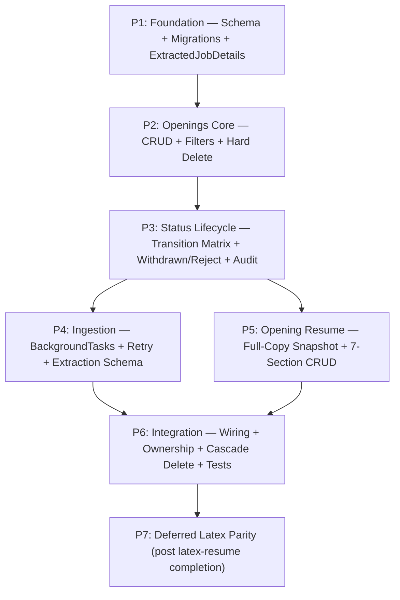
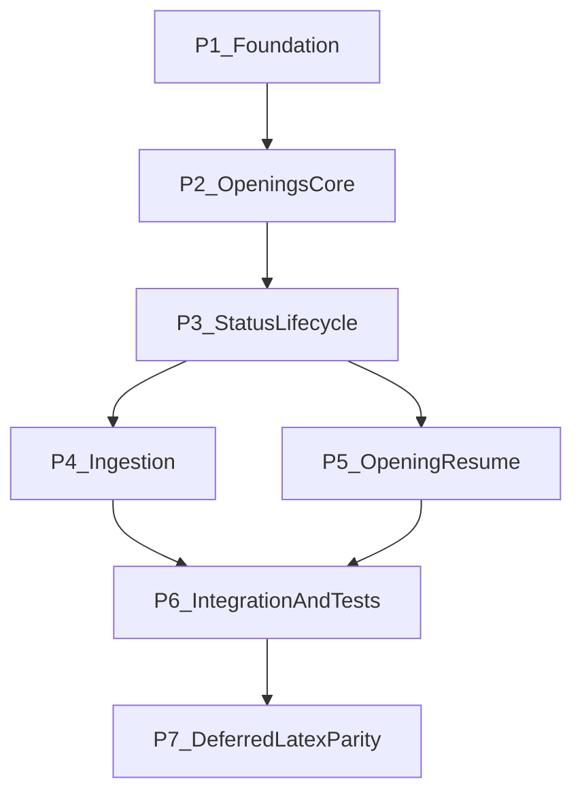

# Development Plan: Job Tracker Feature
## apply_n_reach — Jobs Tracker Backend

> **Reference Documents:**
>
> - [Job Profile Development Plan](../../job-profile%20feature/development-plan.md)
> - [User Profile Development Plan](../../backend/user-profile-development-plan.md)
> - [LaTeX Resume Rendering Plan](../latex-resume/latex-render-feature.md)

---

## Executive Summary

This plan defines a backend-only implementation for a new `job_tracker` feature that helps users track openings, store extracted job posting details, and create opening-specific resumes derived from existing `job_profile` data. The feature is intentionally decomposed into sub-features so development can follow the repository's modular directory conventions and minimize cross-feature coupling.

- **Total phases:** 7
- **Estimated total effort:** 11-16 days (solo) / 6-9 days (parallelized across 2-3 contributors)
- **Core product decisions locked:**
  1. **Status model:** guided transitions with controlled backward moves
  2. **Ingestion model:** hybrid (`auto async extraction on create` + `manual refresh`)
  3. **Resume model:** snapshot-once copy from `job_profile` into opening-owned resume data
  4. **Latex parity:** deferred dependency phase starts after in-progress `latex_resume` feature is complete

**Top Risks and Mitigations**

1. **External extraction instability (crawler/LLM variability)**  
   Mitigation: persist extraction attempts, version snapshots, and extraction status independently from opening core row.
2. **Ownership leaks across opening and resume records**  
   Mitigation: enforce `user_id` ownership gates in every read/write path and return 404 for cross-user access.
3. **State drift between `job_profile` and opening-specific resume snapshot**  
   Mitigation: snapshot metadata (`source_job_profile_id`, `snapshot_at`, `snapshot_version`) and strict "opening owns its copy" rules after creation.

---

## Scope and Non-Goals

### In Scope

- Backend database schema, migrations, services, API routers, and tests for:
  - job opening tracking and status lifecycle
  - job-link extraction and normalized structured snapshot storage
  - opening-specific resume creation and edit flows based on a one-time `job_profile` snapshot
  - deferred integration boundary for opening-level latex render parity

### Out of Scope

- Frontend/UI tasks
- Cross-feature full regression suites beyond required dependency checks
- Replacing existing `user_profile` / `job_profile` security architecture

---

## Requirements Analysis

### Feature F1: Opening Tracker Core

**Description**  
Allow users to create and manage job openings with lifecycle status (`Interested`, `Applied`, `Interviewing`, `Offer`, `Withdrawn`, `Reject`) and track progression over time.

**Core capabilities**

- create/update/delete/list job openings
- guided status transition validation with full transition matrix
- status timeline and audit history
- filter by status, company name (partial match), role name (partial match); sort by `created_at` desc; cursor-based pagination

**Status Transition Matrix**

| From \ To | Interested | Applied | Interviewing | Offer | Withdrawn | Reject |
| --- | --- | --- | --- | --- | --- | --- |
| **Interested** | - | YES | - | - | YES | - |
| **Applied** | YES (correction) | - | YES | - | YES | YES |
| **Interviewing** | - | YES (correction) | - | YES | YES | YES |
| **Offer** | - | - | - | - | YES | YES |
| **Withdrawn** | - | - | - | - | - | - |
| **Reject** | - | - | - | - | - | - |

- **Forward transitions:** Interested -> Applied -> Interviewing -> Offer
- **Backward corrections:** Applied -> Interested, Interviewing -> Applied
- **Terminal states:** Withdrawn and Reject are absorbing — no transitions out
- **Any-to-terminal:** every non-terminal status can transition to Withdrawn or Reject

**User-facing behavior**

- User saves a job opening from a URL or manual input.
- User changes status through a guided lifecycle with validation.
- User sees current status and previous transitions.
- User filters openings by status, company name (partial), or role name (partial).
- User sorts results by creation date (newest first).
- Listing endpoint uses cursor-based pagination.

**Deletion behavior**

- Hard delete with explicit `confirm=true` query parameter required.
- Cascade deletes all child records: status history, extraction runs, extraction snapshots, opening resume and all resume sections.
- Missing or `confirm=false` returns 400 with a descriptive error.

**Implied requirements**

- ownership checks (user_id predicate on every query)
- input sanitization and URL validation
- cursor-based pagination for list endpoint
- consistent error envelopes
- cascade delete referential integrity

**Dependencies**

- authentication dependency reused from existing profile features
- shared pagination and validation patterns in `core`

### Feature F2: Opening Ingestion and Structured Capture

**Description**  
Store all captured job details from job links, using Apify website content crawler + LangChain extraction pipeline into the `ExtractedJobDetails` schema defined in the Extraction Schema Definition section below.

**Core capabilities**

- async extraction trigger on opening creation via **FastAPI BackgroundTasks** (locked-in orchestration mechanism)
- manual extraction refresh endpoint
- extraction attempt tracking (`queued`, `running`, `succeeded`, `failed`)
- versioned structured snapshots conforming to `ExtractedJobDetails` Pydantic model
- provenance metadata (`source_url`, `extracted_at`, extractor version/model)

**Retry and timeout policy**

- **Timeout:** 60 seconds per extraction attempt (Apify crawl + LangChain parse combined)
- **Automatic retries:** up to 2 retries on failure with exponential backoff (30s delay after first failure, 120s delay after second failure)
- **Max retries exhausted:** mark extraction run as `failed`; opening remains usable without extracted details
- **Backoff tracked in DB:** `attempt_number`, `next_retry_at` fields on `extraction_runs` row

**User-facing behavior**

- Opening appears immediately after creation.
- Extracted details populate asynchronously via BackgroundTasks.
- User can manually refresh extraction if output is stale/failed.
- Extraction status is visible as part of opening detail response.

**Implied requirements**

- idempotency keys to prevent duplicate concurrent extractions
- extraction lock (`extraction_runs.status = 'running'`) prevents overlapping runs for same opening
- timeout enforcement (60s per attempt)
- retry with exponential backoff (30s, 120s)
- partial-failure safe updates (opening remains usable even if extraction fails)
- extraction output validated against `ExtractedJobDetails` schema before persistence

**Dependencies**

- opening core entity must exist first
- FastAPI BackgroundTasks as async orchestration mechanism (no external queue infrastructure)
- `ExtractedJobDetails` schema defined and importable

### Feature F3: Opening-Specific Resume Management

**Description**  
Create an opening-owned resume from `job_profile` reference data using a **full-copy-always** strategy (all 7 sections copied every time), then allow independent edits for that opening without mutating the original `job_profile`.

**Core capabilities**

- snapshot copy endpoint (`job_profile` -> `job_opening_resume*`) — always copies all 7 sections: `personal`, `education`, `experience`, `projects`, `research`, `certifications`, `skills`
- opening resume section CRUD (`personal`, `education`, `experience`, `projects`, `research`, `certifications`, `skills`)
- optional resume presence per opening (but when created, always full copy)

**Snapshot metadata fields**

Each opening resume root row stores:

| Field | Type | Description |
| --- | --- | --- |
| `source_job_profile_id` | `UUID` | FK to the `job_profile` that was copied from |
| `snapshot_at` | `datetime` | Timestamp when the copy was performed |
| `snapshot_version` | `int` | Monotonic version counter (starts at 1; incremented if user re-snapshots) |
| `source_section_count` | `int` | Number of sections that existed in source at copy time (validation: should always be 7) |

**User-facing behavior**

- User clicks create-resume within a job opening.
- System copies **all 7 sections** from `job_profile` in a single transaction.
- User edits opening resume sections independently and saves changes.
- Edits to the opening resume never propagate back to `job_profile`.
- Edits to `job_profile` after snapshot never propagate forward to the opening resume.

**Implied requirements**

- deterministic snapshot mapping (all 7 sections, every time)
- full-copy-always: no partial copies, no section selection
- referential integrity between opening and resume rows
- independent update timestamps and auditability
- post-copy mutation isolation: source and snapshot are fully independent after creation

**Dependencies**

- opening core feature
- existing `job_profile` read patterns and ownership dependencies
- all 7 `job_profile` section services must be readable

### Feature F4: Deferred Opening Latex Render Parity

**Description**  
Replicate latex resume rendering behavior for opening-owned resume data after current `job_profile/latex_resume` effort is complete.

**Core capabilities**

- opening-level render trigger and retrieval endpoints
- reuse or adapt template/render pipeline from `job_profile/latex_resume`
- persist rendered artifacts per opening resume

**Dependencies**

- completion and stabilization of existing latex-render implementation
- opening resume aggregate endpoints finalized

---

## Extraction Schema Definition

The `ExtractedJobDetails` Pydantic model defines the normalized output of the ingestion pipeline (Apify crawl + LangChain extraction). This schema is referenced by P1.T1.S3 (extraction snapshot tables) and the entire P4 ingestion phase.

### `ExtractedJobDetails` Pydantic Model

```python
from datetime import date
from typing import Optional
from pydantic import BaseModel, Field

class ExtractedJobDetails(BaseModel):
    """Normalized extraction output from job posting URL.
    
    All fields are optional because extraction may partially succeed.
    The ingestion pipeline persists whatever fields it can extract
    and marks the rest as None.
    """
    job_title: Optional[str] = Field(None, max_length=500)
    company_name: Optional[str] = Field(None, max_length=300)
    location: Optional[str] = Field(None, max_length=500, description="Free-text location; may include remote/hybrid indicators")
    employment_type: Optional[str] = Field(None, max_length=50, description="full-time | part-time | contract | internship | freelance")
    salary_range: Optional[str] = Field(None, max_length=200, description="Raw salary text as extracted; not parsed into min/max")
    description_summary: Optional[str] = Field(None, max_length=5000, description="LLM-generated summary of the job description")
    required_skills: list[str] = Field(default_factory=list, description="Skills explicitly listed as required")
    preferred_skills: list[str] = Field(default_factory=list, description="Skills listed as preferred/nice-to-have")
    experience_level: Optional[str] = Field(None, max_length=100, description="e.g., entry-level, mid, senior, lead, principal")
    posted_date: Optional[date] = Field(None, description="Date the posting was published, if extractable")
    application_deadline: Optional[date] = Field(None, description="Application deadline, if stated")
```

### Schema Rules

1. **All fields nullable except skill lists** — extraction is best-effort; partial results are valid.
2. **Skill arrays default to empty** — never None, always `[]` when no skills extracted.
3. **Free-text fields** (`location`, `salary_range`, `employment_type`) — stored as extracted, not normalized into enums. Normalization is a future concern.
4. **Max lengths enforced at Pydantic level** — truncation happens before DB persistence.
5. **Schema version** — stored alongside each extraction snapshot in `job_opening_extracted_details_versions.schema_version` column. Current version: `1`.

### DB Column Mapping

The `job_opening_extracted_details_versions` table stores these fields as individual columns (not JSONB) for queryability. The raw extraction payload is preserved separately in a `raw_payload` JSONB column for debugging and re-extraction.

---

## Embedded Tech Stack Analysis

### Stack Components and Roles

- **FastAPI:** API layer, dependency injection, route composition
- **PostgreSQL:** source of truth for openings, extraction snapshots, opening resume sections
- **Alembic:** schema migration lifecycle and rollback validation
- **Pydantic v2:** request/response contracts and validator rules
- **pytest:** unit + integration + isolation tests
- **Apify website-content-crawler:** external content acquisition from job link
- **LangChain extraction agent:** transform crawled text into strict structured schema

### Coverage Assessment

- F1 handled by FastAPI + PostgreSQL + Pydantic + pytest
- F2 handled by Apify + LangChain + async orchestration + PostgreSQL snapshots
- F3 handled by PostgreSQL section tables + service copy logic + FastAPI routers
- F4 handled by deferred reuse of existing latex-render architecture

### Gaps and Recommended Additions

1. ~~**Background orchestration mechanism not explicitly fixed**~~ **RESOLVED:** FastAPI `BackgroundTasks` is the locked-in async orchestration mechanism. Extraction runs are tracked in the `extraction_runs` DB table with durable state transitions. No external queue infrastructure needed.
2. **Extraction schema drift risk**  
   Recommendation: version extraction schema and persist `schema_version` + raw payload + normalized payload. Current schema version: `1` (see Extraction Schema Definition section).
3. ~~**Retry/idempotency policy not centralized**~~ **RESOLVED:** Retry policy is defined — up to 2 automatic retries with exponential backoff (30s, 120s). Idempotency enforced via `extraction_runs.status = 'running'` lock check. Fields: `attempt_number`, `next_retry_at` on extraction run rows.

### Assumptions

- Existing auth/session dependency in backend remains the canonical mechanism.
- Existing service code style (raw SQL + asyncpg conventions) remains preferred.
- External extraction credentials/config live in backend environment settings.
- No new queue technology introduced in this phase — FastAPI BackgroundTasks is sufficient.
- No resource limits (max openings per user, max extractions per day) imposed in initial release.
- Hard delete is the deletion strategy (no soft delete); confirmation flag required.
- Full mock testing of Apify and LangChain at service boundary is sufficient for external service coverage.

### Compatibility Notes

- Crawler output can be noisy; schema coercion must fail closed and preserve raw payload for debugging.
- LangChain extraction should be bounded by token/time limits to avoid long-running endpoint coupling. Timeout: 60s per extraction attempt.
- Any URL processing must avoid SSRF-style misuse by restricting provider usage and validating host scheme.
- **BackgroundTasks caveat:** FastAPI BackgroundTasks run in the same process. If the server restarts mid-extraction, the run will be orphaned in `running` state. Mitigation: a startup check that marks stale `running` extractions (older than 5 minutes) as `failed` with a `server_restart` reason.
- **Retry backoff timing:** 30s after first failure, 120s after second failure. These are hardcoded constants, not configurable, to keep the initial implementation simple.

---

## Dependency Mapping

### Foundation Layer

- P1 foundation/migrations
- P2 openings core contracts and ownership dependencies

### Critical Path

`P1 -> P2 -> P3 -> P4 -> P5 -> P6 -> P7`

### Parallelization Opportunities

- P4 (ingestion) and P5 (opening resume) can partially parallelize after P3 contracts are stable.
- Section-level tasks in P5 are parallelizable by sub-feature folder.

### Shared Infrastructure

- auth + ownership dependencies
- validation/sanitization helpers
- common error/response envelope
- shared fixtures for user/opening/job_profile integration tests

### Status Model Summary

The opening lifecycle uses 6 states: `Interested`, `Applied`, `Interviewing`, `Offer`, `Withdrawn`, `Reject`. Withdrawn and Reject are terminal (absorbing) states reachable from any non-terminal state. See Feature F1 for the full transition matrix.

### Mermaid Dependency Graph



---

## Phase Overview

| Phase | Focus | Key Deliverables | Effort | Depends On |
| --- | --- | --- | --- | --- |
| P1 | Foundation and DB schema | new tables, Alembic revisions, shared contracts | L / 1.5-2.5 days | - |
| P2 | Openings Core API | opening CRUD, listing filters, ownership gates | L / 1.5-2 days | P1 |
| P3 | Status Lifecycle | guided transitions + audit history APIs | M / 1-1.5 days | P2 |
| P4 | Ingestion Pipeline | async create-trigger extraction + manual refresh + snapshots | XL / 2-3 days | P3 |
| P5 | Opening Resume Snapshot | one-time copy + opening resume section CRUD | XL / 2.5-4 days | P3 |
| P6 | Integration and hardening | app wiring, cross-user isolation, targeted test suites | M / 1-1.5 days | P4, P5 |
| P7 | Deferred Latex Parity | opening-level render parity tasks (post latex-resume completion) | L / 1.5-2 days | P6, latex feature complete |

---

## Phase Exit Criteria

Each phase must pass its gate before downstream phases begin. Gates are test-based and verifiable — no subjective "feels done" assessments.

| Phase | Exit Gate |
| --- | --- |
| **P1** | All migrations upgrade/downgrade cleanly in dev environment. Schema DDL matches spec (table names, column types, constraints, indexes). `ExtractedJobDetails` Pydantic model importable and validates sample data. |
| **P2** | Opening CRUD tests pass (create, read, list, update, delete). Ownership tests pass (cross-user returns 404). Filter/sort tests pass (status filter, company partial, role partial, cursor pagination). Hard-delete-with-confirm tests pass (cascade verified, missing confirm returns 400). |
| **P3** | Full transition matrix tests pass: all valid forward transitions, all valid backward corrections, all invalid transitions rejected, terminal state immutability (Withdrawn/Reject cannot transition). Status history append tests pass (ordered, immutable, actor tracked). |
| **P4** | Extraction mock tests pass: success flow (Apify mock -> LangChain mock -> persisted snapshot), retry on failure (attempt 1 fails -> 30s backoff -> attempt 2), max retries exhausted (3 attempts -> status=failed), idempotency guard (concurrent trigger blocked), BackgroundTask trigger verified (extraction starts asynchronously). Extraction output validates against `ExtractedJobDetails` schema. |
| **P5** | Snapshot copy tests pass: all 7 sections copied, `source_section_count=7`, snapshot metadata populated. Section CRUD tests pass for all 7 section types. Source independence tests pass: editing snapshot does not mutate source `job_profile`; editing `job_profile` after snapshot does not affect opening resume. |
| **P6** | Cross-user isolation suite passes (all endpoints return 404 for non-owner). All routers wired and responding (smoke test for every registered route). Cascade delete tests pass (deleting opening removes all children). Response schema registration verified (OpenAPI spec includes all new schemas). |
| **P7** | Opening-level render tests pass with same coverage scope as `job_profile` latex tests. Render output persisted and retrievable. Ownership gates enforced on render endpoints. |

---

## Phase 1: Foundation and Migrations

### Task P1.T1: Define job-tracker DB models
**Effort:** M / 4-6 hours  
**Dependencies:** -  
**Risk:** Medium

#### Sub-task P1.T1.S1: Add opening core table(s)
- **Description:** Create `job_openings` table with ownership and lifecycle fields.
- **Implementation hints:** Include `user_id`, `job_profile_id` (optional), `source_url`, `current_status`, timestamps, and normalized company/title fields.
- **Dependencies:** -
- **Effort:** S / 2-3 hours
- **Acceptance criteria:**
  - Table includes ownership FK and status column constraints.
  - Indexes exist for `user_id`, `current_status`, `created_at`.

#### Sub-task P1.T1.S2: Add status history table
- **Description:** Create immutable transition history rows for every status change.
- **Implementation hints:** `job_opening_status_history(opening_id, from_status, to_status, changed_at, changed_by_user_id)`.
- **Dependencies:** P1.T1.S1
- **Effort:** S / 1-2 hours
- **Acceptance criteria:**
  - Transition rows are append-only in service layer.
  - Foreign keys and cascade behavior are valid.

#### Sub-task P1.T1.S3: Add extraction snapshot tables
- **Description:** Create tables for extraction attempts and versioned structured snapshots.
- **Implementation hints:** separate `job_opening_extraction_runs` and `job_opening_extracted_details_versions`.
- **Dependencies:** P1.T1.S1
- **Effort:** M / 3-4 hours
- **Acceptance criteria:**
  - Supports multiple attempts per opening.
  - Stores raw payload + normalized schema + metadata/version fields.

### Task P1.T2: Alembic revisions and rollback verification
**Effort:** M / 3-4 hours  
**Dependencies:** P1.T1.*  
**Risk:** Medium

#### Sub-task P1.T2.S1: Generate migrations
- **Description:** Generate explicit Alembic revisions for `job_tracker` schema changes and data transitions.
- **Implementation hints:**
  - Create **schema migration** revisions for DDL changes (tables, columns, indexes, constraints, enums).
  - Create **data migration** revisions only when backfilling/transforming persisted data is required.
  - Keep schema and data migration concerns separate unless tight coupling requires same revision.
  - Add clear revision docstrings (scope + rollback intent), and ensure deterministic revision ordering.
- **Acceptance criteria:**
  - Revision files created with clear purpose and reviewed before execution.
  - `upgrade()` and `downgrade()` are both implemented (no placeholder pass blocks).
  - Data migrations are idempotent/re-runnable in dev workflows.

#### Sub-task P1.T2.S2: Upgrade + downgrade checks
- **Description:** Validate migration safety and rollback integrity in local/dev DB.
- **Implementation hints:**
  - Run forward migration to head, then run rollback to previous revision.
  - Validate key constraints/indexes/FKs after both forward and rollback passes.
  - For data migrations, verify backfilled/transformed rows are correct after upgrade and safe after rollback.
- **Acceptance criteria:**
  - `upgrade head` and `downgrade -1` both pass in dev environment.
  - Schema integrity checks pass after rollback (no broken FKs/constraints for surviving objects).
  - Data migration checks pass for representative fixtures.

---

## Phase 2: Openings Core API

### Task P2.T1: Create contracts and validators
**Effort:** S / 2-3 hours  
**Dependencies:** P1.T2

#### Sub-task P2.T1.S1: Opening create/update/list schemas
- **Acceptance criteria:** strict validation, sanitized text fields, pagination schema integrated.

### Task P2.T2: Implement opening service and router
**Effort:** M / 4-6 hours  
**Dependencies:** P2.T1

#### Sub-task P2.T2.S1: Opening create + read/list
- **Acceptance criteria:** scoped to authenticated user only.

#### Sub-task P2.T2.S2: Opening update/delete
- **Acceptance criteria:** only owner can mutate; 404 for cross-user.

---

## Phase 3: Status Lifecycle and Audit

### Task P3.T1: Implement guided transition matrix
**Effort:** S / 2-4 hours  
**Dependencies:** P2.T2

#### Sub-task P3.T1.S1: Encode transition rules
- **Implementation hints:** Implement the full transition matrix from Feature F1 as a lookup dict or set. Allow forward path (`Interested -> Applied -> Interviewing -> Offer`), backward corrections (`Applied -> Interested`, `Interviewing -> Applied`), any non-terminal -> Withdrawn, any non-terminal -> Reject. Terminal states (Withdrawn, Reject) have no outgoing transitions.
- **Effort:** S / 2-3 hours
- **Acceptance criteria:**
  - All valid forward transitions (Interested->Applied, Applied->Interviewing, Interviewing->Offer) succeed.
  - Backward corrections (Applied->Interested, Interviewing->Applied) succeed.
  - Any non-terminal state -> Withdrawn succeeds.
  - Any non-terminal state -> Reject succeeds.
  - Transitions out of Withdrawn return validation error.
  - Transitions out of Reject return validation error.
  - Self-transitions (e.g., Applied->Applied) return validation error.

### Task P3.T2: Persist status history and expose endpoint
**Effort:** S / 2-3 hours  
**Dependencies:** P3.T1

#### Sub-task P3.T2.S1: Write history rows on transition
- **Description:** On every successful status transition, insert an append-only row into `job_opening_status_history` recording `from_status`, `to_status`, `changed_at`, and `changed_by_user_id`.
- **Implementation hints:** Service method should write history row in the same DB transaction as the status update on `job_openings`.
- **Effort:** S / 1-2 hours
- **Acceptance criteria:**
  - Every successful transition creates exactly one history row.
  - History rows are append-only — no updates or deletes via service layer.
  - `changed_at` is server-generated, not client-supplied.
  - Failed/rejected transitions do not create history rows.

#### Sub-task P3.T2.S2: History list endpoint
- **Description:** `GET /job-openings/{id}/status-history` returns paginated, chronologically ordered list of status transitions for an opening.
- **Implementation hints:** Order by `changed_at` ascending. Include `from_status`, `to_status`, `changed_at` in response schema.
- **Effort:** S / 1-2 hours
- **Acceptance criteria:**
  - Returns history ordered by `changed_at` ascending.
  - Each entry includes `from_status`, `to_status`, and `changed_at`.
  - Returns 404 for non-existent or non-owned opening.
  - Returns empty list for opening with no transitions yet.

---

## Phase 4: Ingestion Pipeline (Hybrid)

### Task P4.T1: Async extraction trigger on create
**Effort:** M / 4-6 hours  
**Dependencies:** P3.T2  
**Risk:** High

#### Sub-task P4.T1.S1: Enqueue extraction run on opening creation
- **Description:** When a new opening is created with a `source_url`, insert an `extraction_runs` row with `status=queued` and dispatch a BackgroundTask to process it. The opening create response returns immediately.
- **Implementation hints:** Use `fastapi.BackgroundTasks.add_task()` in the create endpoint. The extraction run row must be committed before the background task starts to avoid race conditions.
- **Effort:** S / 2-3 hours
- **Dependencies:** P3.T2
- **Acceptance criteria:**
  - Opening create with `source_url` returns 201 immediately with opening data.
  - An `extraction_runs` row exists with `status=queued` after create returns.
  - Opening create without `source_url` does NOT enqueue extraction.
  - BackgroundTask is registered and starts asynchronously.

#### Sub-task P4.T1.S2: Process Apify crawl + LangChain extraction
- **Description:** Background task fetches page content via Apify website-content-crawler, then passes raw content to LangChain extraction chain to produce `ExtractedJobDetails`. On success, persists normalized snapshot. On failure, updates run status and schedules retry if attempts remain.
- **Implementation hints:** Mock `ApifyClient` and LangChain chain at service boundary for tests. Enforce 60s timeout per attempt. Validate extraction output against `ExtractedJobDetails` before persistence.
- **Effort:** L / 1-2 days
- **Risk Flags:** External API variability; LLM output may not conform to schema
- **Dependencies:** P4.T1.S1
- **Acceptance criteria:**
  - Successful extraction produces a valid `ExtractedJobDetails` snapshot persisted in `job_opening_extracted_details_versions`.
  - Failed extraction updates run status to `failed` if max retries exhausted, or schedules retry with backoff (30s, 120s).
  - Extraction timeout (60s) is enforced — long-running extractions are killed.
  - Raw crawler output is preserved in `raw_payload` column regardless of extraction success.

#### Sub-task P4.T1.S3: Persist run state transitions
- **Description:** Extraction run progresses through `queued -> running -> succeeded/failed`. Each transition updates the `extraction_runs` row with timestamp, attempt number, and error details if applicable.
- **Implementation hints:** State machine: `queued` can only move to `running`, `running` can only move to `succeeded` or `failed`. Track `attempt_number` (1, 2, 3) and `next_retry_at` for retry scheduling.
- **Effort:** S / 2-3 hours
- **Dependencies:** P4.T1.S1
- **Acceptance criteria:**
  - Run status transitions follow valid state machine (no skipping states).
  - `started_at`, `completed_at` timestamps are server-generated.
  - Failed runs include `error_message` describing the failure reason.
  - `attempt_number` increments correctly across retries.

### Task P4.T2: Manual refresh endpoint
**Effort:** S / 2-3 hours  
**Dependencies:** P4.T1

#### Sub-task P4.T2.S1: `POST /job-openings/{id}/extraction/refresh`
- **Description:** Allows user to manually trigger a new extraction attempt for an existing opening. Creates a new `extraction_runs` row and dispatches BackgroundTask.
- **Implementation hints:** Check that no extraction is currently `queued` or `running` before accepting. Return 409 Conflict if an extraction is already in flight.
- **Effort:** S / 1-2 hours
- **Dependencies:** P4.T1
- **Acceptance criteria:**
  - Returns 202 Accepted when refresh is successfully enqueued.
  - Returns 409 Conflict when an extraction is already `queued` or `running`.
  - Returns 404 for non-existent or non-owned opening.
  - New extraction run row is created with incremented version.

#### Sub-task P4.T2.S2: Idempotency and in-flight protection
- **Description:** Prevent concurrent extraction runs for the same opening. The `extraction_runs.status = 'running'` check serves as a lock.
- **Implementation hints:** Use a SELECT check for existing `queued`/`running` rows before INSERT. Consider using `SELECT ... FOR UPDATE` to prevent TOCTOU races under concurrent requests.
- **Effort:** S / 1-2 hours
- **Dependencies:** P4.T2.S1
- **Acceptance criteria:**
  - Two simultaneous refresh requests for the same opening result in exactly one new extraction run.
  - The second request receives 409 Conflict.
  - After a run completes (succeeded/failed), refresh is allowed again.

### Task P4.T3: Versioned extracted detail read APIs
**Effort:** S / 2-3 hours  
**Dependencies:** P4.T1

#### Sub-task P4.T3.S1: Latest normalized detail endpoint
- **Description:** `GET /job-openings/{id}/extracted-details/latest` returns the most recent successfully extracted `ExtractedJobDetails` snapshot with provenance metadata.
- **Implementation hints:** Query `job_opening_extracted_details_versions` ordered by `extracted_at` desc, limit 1, filtered by `status=succeeded` in the associated extraction run.
- **Effort:** S / 1-2 hours
- **Dependencies:** P4.T1
- **Acceptance criteria:**
  - Returns the most recent successful extraction snapshot.
  - Response includes provenance: `source_url`, `extracted_at`, `schema_version`, `extractor_model`.
  - Returns 404 if no successful extraction exists yet.
  - Returns 404 for non-owned opening.

#### Sub-task P4.T3.S2: Extraction history endpoint
- **Description:** `GET /job-openings/{id}/extraction-runs` returns paginated list of all extraction attempts with status, timestamps, and attempt metadata.
- **Implementation hints:** Return all runs ordered by `created_at` desc. Include `status`, `attempt_number`, `started_at`, `completed_at`, `error_message`.
- **Effort:** S / 1-2 hours
- **Dependencies:** P4.T1
- **Acceptance criteria:**
  - Returns all extraction runs for the opening, ordered by `created_at` desc.
  - Each entry includes `status`, `attempt_number`, `started_at`, `completed_at`.
  - Failed runs include `error_message`.
  - Returns 404 for non-owned opening.

---

## Phase 5: Opening Resume Snapshot and Section CRUD

### Task P5.T1: Snapshot copy from job_profile
**Effort:** M / 4-6 hours  
**Dependencies:** P3.T2  
**Risk:** High

#### Sub-task P5.T1.S1: Create opening resume root row
- **Description:** `POST /job-openings/{id}/resume` creates the root `job_opening_resume` row linked to the opening. Only one resume per opening is allowed.
- **Implementation hints:** Check for existing resume before creating. Return 409 if resume already exists. The root row holds `source_job_profile_id`, `snapshot_at`, `snapshot_version`, `source_section_count`.
- **Effort:** S / 2-3 hours
- **Dependencies:** P3.T2
- **Acceptance criteria:**
  - Root resume row is created with correct `source_job_profile_id` and `snapshot_at`.
  - Second create attempt returns 409 Conflict.
  - Returns 404 if opening doesn't exist or isn't owned by user.
  - Returns 400 if referenced `job_profile` doesn't exist or isn't owned by user.

#### Sub-task P5.T1.S2: Copy all supported sections from source `job_profile`
- **Description:** In the same transaction as root row creation, copy all 7 sections (personal, education, experience, projects, research, certifications, skills) from `job_profile` into opening-owned section tables.
- **Implementation hints:** Use bulk INSERT from SELECT for each section type. Copy all rows for list sections (education, experience, etc.). Ensure the copy is atomic — if any section copy fails, the entire transaction rolls back.
- **Effort:** M / 3-4 hours
- **Dependencies:** P5.T1.S1
- **Acceptance criteria:**
  - All 7 sections are copied in a single transaction.
  - Copied data matches source data field-by-field at the moment of copy.
  - If source `job_profile` has no data for a section, the copy still succeeds (empty section).
  - Transaction rollback on partial failure: no orphaned section rows.

#### Sub-task P5.T1.S3: Persist snapshot metadata
- **Description:** Populate `snapshot_version` (starts at 1), `source_section_count` (always 7), and `snapshot_at` on the root resume row.
- **Implementation hints:** `source_section_count` is a validation field: at snapshot time, verify all 7 sections were processed. If a re-snapshot is later supported, increment `snapshot_version`.
- **Effort:** S / 1-2 hours
- **Dependencies:** P5.T1.S2
- **Acceptance criteria:**
  - `snapshot_version` is 1 on first creation.
  - `source_section_count` is 7.
  - `snapshot_at` matches the transaction timestamp.
  - Metadata is queryable via the resume detail endpoint.

### Task P5.T2: Opening resume section sub-features
**Effort:** XL / 1.5-2.5 days  
**Dependencies:** P5.T1

#### Sub-task P5.T2.S1: `opening_personal` CRUD
- **Description:** Read and update personal info section for an opening resume. Personal is a singleton (one row per resume).
- **Implementation hints:** Follow `job_profile` personal section patterns. Endpoint: `GET/PUT /job-openings/{id}/resume/personal`.
- **Effort:** S / 2-3 hours
- **Acceptance criteria:**
  - GET returns personal data copied from snapshot.
  - PUT updates personal data without affecting source `job_profile`.
  - Returns 404 if opening resume doesn't exist.
  - Ownership enforced (non-owner gets 404).

#### Sub-task P5.T2.S2: `opening_education` CRUD
- **Description:** Full CRUD for education entries on an opening resume. Education is a list section (multiple rows per resume).
- **Implementation hints:** Endpoint: `GET/POST/PUT/DELETE /job-openings/{id}/resume/education[/{entry_id}]`.
- **Effort:** S / 2-3 hours
- **Acceptance criteria:**
  - GET returns all education entries copied from snapshot.
  - POST creates new entries (user can add education specific to this opening).
  - PUT updates individual entries without affecting source.
  - DELETE removes individual entries without affecting source.

#### Sub-task P5.T2.S3: `opening_experience` CRUD
- **Description:** Full CRUD for experience entries on an opening resume.
- **Implementation hints:** Endpoint: `GET/POST/PUT/DELETE /job-openings/{id}/resume/experience[/{entry_id}]`.
- **Effort:** S / 2-3 hours
- **Acceptance criteria:**
  - GET returns all experience entries copied from snapshot.
  - POST creates new entries specific to this opening.
  - PUT updates individual entries without affecting source.
  - DELETE removes individual entries without affecting source.

#### Sub-task P5.T2.S4: `opening_projects` CRUD
- **Description:** Full CRUD for project entries on an opening resume.
- **Implementation hints:** Endpoint: `GET/POST/PUT/DELETE /job-openings/{id}/resume/projects[/{entry_id}]`.
- **Effort:** S / 2-3 hours
- **Acceptance criteria:**
  - GET returns all project entries copied from snapshot.
  - POST creates new entries specific to this opening.
  - PUT updates individual entries without affecting source.
  - DELETE removes individual entries without affecting source.

#### Sub-task P5.T2.S5: `opening_research` CRUD
- **Description:** Full CRUD for research entries on an opening resume.
- **Implementation hints:** Endpoint: `GET/POST/PUT/DELETE /job-openings/{id}/resume/research[/{entry_id}]`.
- **Effort:** S / 2-3 hours
- **Acceptance criteria:**
  - GET returns all research entries copied from snapshot.
  - POST creates new entries specific to this opening.
  - PUT updates individual entries without affecting source.
  - DELETE removes individual entries without affecting source.

#### Sub-task P5.T2.S6: `opening_certifications` CRUD
- **Description:** Full CRUD for certification entries on an opening resume.
- **Implementation hints:** Endpoint: `GET/POST/PUT/DELETE /job-openings/{id}/resume/certifications[/{entry_id}]`.
- **Effort:** S / 2-3 hours
- **Acceptance criteria:**
  - GET returns all certification entries copied from snapshot.
  - POST creates new entries specific to this opening.
  - PUT updates individual entries without affecting source.
  - DELETE removes individual entries without affecting source.

#### Sub-task P5.T2.S7: `opening_skills` CRUD
- **Description:** Full CRUD for skills entries on an opening resume.
- **Implementation hints:** Endpoint: `GET/POST/PUT/DELETE /job-openings/{id}/resume/skills[/{entry_id}]`.
- **Effort:** S / 2-3 hours
- **Acceptance criteria:**
  - GET returns all skill entries copied from snapshot.
  - POST creates new entries specific to this opening.
  - PUT updates individual entries without affecting source.
  - DELETE removes individual entries without affecting source.

---

## Phase 6: Integration, Security Hardening, and Tests

### Task P6.T1: Router/app integration
**Effort:** S / 2-3 hours  
**Dependencies:** P4.T3, P5.T2

#### Sub-task P6.T1.S1: Include `job_tracker` router(s) in app entrypoint
- **Description:** Register all job_tracker sub-feature routers (openings_core, opening_ingestion, opening_resume) in the main FastAPI app with appropriate prefix and tags.
- **Implementation hints:** Follow existing pattern for `job_profile` router registration. Use `/api/v1/job-openings` as the base prefix.
- **Effort:** XS / 1-2 hours
- **Dependencies:** P4.T3, P5.T2
- **Acceptance criteria:**
  - All job_tracker routes appear in the OpenAPI spec (`/docs`).
  - Route prefixes follow existing conventions.
  - No import errors or circular dependencies on app startup.

#### Sub-task P6.T1.S2: Verify response schema registration
- **Description:** Confirm all Pydantic response models are properly registered in OpenAPI spec and return correct types.
- **Implementation hints:** Hit `/openapi.json` and verify all `job_tracker` schemas are present. Spot-check response types match actual endpoint returns.
- **Effort:** XS / 1 hour
- **Dependencies:** P6.T1.S1
- **Acceptance criteria:**
  - Every job_tracker endpoint has a defined response model in OpenAPI spec.
  - No `Any` or `dict` response types — all are typed Pydantic models.
  - Error responses use the shared error envelope schema.

### Task P6.T2: Security and ownership hardening
**Effort:** S / 2-3 hours  
**Dependencies:** P6.T1

#### Sub-task P6.T2.S1: Enforce ownership in all service query predicates
- **Description:** Audit every service method to ensure `user_id` is included in every DB query predicate. No service method should be callable without a verified user context.
- **Implementation hints:** Grep all service methods for queries missing `user_id` in WHERE clause. Use FastAPI dependency injection to ensure `current_user` is always resolved before service calls.
- **Effort:** S / 1-2 hours
- **Dependencies:** P6.T1
- **Acceptance criteria:**
  - Every SELECT, UPDATE, DELETE query includes `user_id` predicate.
  - No service method accepts raw IDs without user context.
  - Dependency injection chain guarantees `current_user` is resolved before any data access.

#### Sub-task P6.T2.S2: Verify 404-for-cross-user behavior
- **Description:** Ensure that accessing any resource owned by a different user returns 404 (not 403) to avoid resource existence disclosure.
- **Implementation hints:** Write explicit tests: create opening as user A, attempt read/update/delete as user B, assert 404.
- **Effort:** S / 1-2 hours
- **Dependencies:** P6.T2.S1
- **Acceptance criteria:**
  - Cross-user GET on opening returns 404.
  - Cross-user GET on opening resume/sections returns 404.
  - Cross-user GET on extraction details returns 404.
  - No endpoint returns 403 for cross-user access (always 404).

### Task P6.T3: Targeted pytest suites
**Effort:** M / 4-6 hours  
**Dependencies:** P6.T2

#### Sub-task P6.T3.S1: Opening core tests
- **Description:** Comprehensive test suite for opening CRUD, filtering, sorting, and hard-delete-with-confirm.
- **Effort:** S / 2-3 hours
- **Acceptance criteria:**
  - Tests cover create, read, list, update, delete for openings.
  - Filter tests: by status, by company (partial), by role (partial).
  - Sort test: `created_at` desc ordering verified.
  - Pagination test: cursor-based pagination returns correct pages.
  - Hard delete test: `confirm=true` deletes, `confirm=false` returns 400, cascade verified.

#### Sub-task P6.T3.S2: Transition matrix tests
- **Description:** Test suite covering every cell in the F1 transition matrix.
- **Effort:** S / 2-3 hours
- **Acceptance criteria:**
  - All valid forward transitions tested and pass.
  - All valid backward corrections tested and pass.
  - All invalid transitions tested and return validation error.
  - Terminal state immutability verified (Withdrawn/Reject cannot transition out).
  - History rows verified after each valid transition.

#### Sub-task P6.T3.S3: Ingestion async/retry/idempotency tests
- **Description:** Test suite for the extraction pipeline using mocked Apify and LangChain.
- **Effort:** M / 3-4 hours
- **Acceptance criteria:**
  - Success flow: mock crawl + mock extraction -> snapshot persisted.
  - Retry flow: first attempt fails -> backoff -> second attempt succeeds.
  - Max retries: 3 attempts fail -> run marked `failed`.
  - Idempotency: concurrent trigger blocked with 409.
  - BackgroundTask dispatch verified (extraction starts async).

#### Sub-task P6.T3.S4: Snapshot copy and opening resume CRUD tests
- **Description:** Test suite for resume snapshot creation and all 7 section CRUD operations.
- **Effort:** M / 3-4 hours
- **Acceptance criteria:**
  - Snapshot copy: all 7 sections copied correctly from source `job_profile`.
  - `source_section_count=7` verified.
  - Post-copy independence: editing snapshot doesn't mutate source; editing source doesn't affect snapshot.
  - Section CRUD: create, read, update, delete tested for at least 2 representative section types.
  - Duplicate resume creation returns 409.

#### Sub-task P6.T3.S5: Cross-user isolation tests
- **Description:** Dedicated test suite that creates resources as user A and attempts all access patterns as user B.
- **Effort:** S / 2-3 hours
- **Acceptance criteria:**
  - User B cannot read, update, or delete user A's opening.
  - User B cannot access user A's opening resume or sections.
  - User B cannot access user A's extraction details or trigger refresh.
  - All cross-user attempts return 404 (not 403).

---

## Phase 7: Deferred Opening Latex Render Parity

> This phase starts only after `Features-to-develop/latex-resume/latex-render-feature.md` implementation is complete and stable.

### Task P7.T1: Map opening resume aggregate to latex pipeline
**Effort:** M / 4-6 hours  
**Dependencies:** P6.T3, latex feature complete  
**Risk:** Medium

- **Description:** Adapt the existing `job_profile` latex render pipeline to accept opening resume data as input. The opening resume aggregate (all 7 sections) must map to the same template structure used by `job_profile` rendering.
- **Implementation hints:** Reuse or wrap the existing render service with an adapter that reads from `job_opening_resume_*` tables instead of `job_profile_*` tables. Ensure the template contract is identical.
- **Acceptance criteria:**
  - Opening resume data can be assembled into the same aggregate shape expected by the latex template.
  - Template rendering produces valid LaTeX output from opening resume data.
  - Missing optional sections in the opening resume produce graceful output (empty section, not render failure).

### Task P7.T2: Opening render/persist/read endpoints
**Effort:** M / 4-6 hours  
**Dependencies:** P7.T1

- **Description:** Add endpoints to trigger latex rendering for an opening resume, persist the rendered PDF artifact, and retrieve it.
- **Implementation hints:** `POST /job-openings/{id}/resume/render` triggers render. `GET /job-openings/{id}/resume/render/latest` retrieves the most recent rendered PDF. Follow the same render/persist pattern as `job_profile` latex.
- **Acceptance criteria:**
  - Render endpoint triggers LaTeX compilation and persists the output artifact.
  - Render endpoint returns 404 if opening resume doesn't exist.
  - Read endpoint returns the latest rendered PDF with correct content type.
  - Ownership enforced on both render and read endpoints.

### Task P7.T3: Opening latex scoped tests
**Effort:** S / 2-4 hours  
**Dependencies:** P7.T2

- **Description:** Test suite for opening-level latex rendering with equivalent coverage to `job_profile` latex tests.
- **Acceptance criteria:**
  - Render success: opening resume with all sections renders and produces valid output.
  - Render with partial data: opening resume with some sections empty still renders.
  - Ownership: non-owner cannot trigger render or read rendered output (404).
  - Persist/retrieve: rendered artifact is retrievable via read endpoint after render completes.
  - Idempotency: re-rendering creates a new version without corrupting previous renders.

---

## File Structure Plan

### Planning docs root

```text
Features-to-develop/
  job-tracker/
    job-tracker-features-plan.md
    openings-core/
    opening-ingestion/
    opening-resume/
    opening-latex-render/
```

### Intended backend implementation structure (future coding phase)

```text
backend/app/features/job_tracker/
  __init__.py
  dependencies.py
  validators.py
  openings_core/
    models.py
    schemas.py
    service.py
    router.py
    tests/
      test_openings_crud.py
      test_openings_filters.py
      test_openings_delete_confirm.py
  opening_ingestion/
    schemas.py
    service.py
    router.py
    clients/
      apify_client.py
      extraction_chain.py
    tests/
      test_ingestion_async.py
      test_ingestion_retry.py
      test_ingestion_idempotency.py
  opening_resume/
    models.py
    schemas.py
    service.py
    router.py
    personal/
    education/
    experience/
    projects/
    research/
    certifications/
    skills/
    tests/
      test_snapshot_copy.py
      test_resume_section_crud.py
  opening_latex_render/
    service.py
    router.py
    tests/
      test_opening_render.py
  tests/
    conftest.py
    test_cross_user_isolation.py
    fixtures/
      crawled_pages/
      extraction_outputs/
backend/alembic/
  versions/
    <rev>_job_tracker_foundation_schema.py
    <rev>_job_tracker_extraction_schema.py
    <rev>_job_tracker_data_backfill_<scope>.py
```

### Phase-to-file mapping (authoritative guidance)

- **P1 Foundation + migrations:** `backend/app/features/job_tracker/**/models.py`, `backend/alembic/versions/*.py`, shared enums/constants under `job_tracker/`.
- **P2 Openings core API:** `openings_core/router.py`, `openings_core/service.py`, `openings_core/schemas.py`, plus `openings_core/tests/`.
- **P3 Status lifecycle + audit:** `openings_core/service.py` (transition enforcement), status history read/write endpoints in `openings_core/router.py`, and transition/history tests.
- **P4 Ingestion pipeline:** `opening_ingestion/service.py`, `opening_ingestion/router.py`, `opening_ingestion/clients/*`, and ingestion-focused tests.
- **P5 Opening resume snapshot + section CRUD:** `opening_resume/service.py`, `opening_resume/router.py`, section subfolders, and snapshot/CRUD tests.
- **P6 Integration/security/testing hardening:** feature-level `tests/`, app integration wiring points, and ownership/isolation coverage.
- **P7 Deferred latex parity:** `opening_latex_render/service.py`, `opening_latex_render/router.py`, plus focused render tests.

### Alembic naming and ordering conventions

- Prefix revision messages with `job_tracker_` for discoverability.
- Use one revision for coherent schema units; avoid giant mixed revisions.
- Keep data migration revisions explicit with `_data_backfill_` infix.
- When introducing inter-revision dependencies, annotate dependency rationale in revision docstring comments.
- Never merge unrelated feature migrations into the same revision chain for this feature.

---

## Testing and Verification Strategy

- **Test scope rule (mandatory):** run tests only for the code added in the current task and for existing code paths directly modified by that task.
- **Do not run the entire pytest suite by default.**
- **Allow broader suites only when coupling requires it:** if a change affects shared dependencies, run the minimum additional related tests and document why those extra tests were executed.
- **Pytest layers:**
  - unit tests for validators, transition rules, extraction transforms
  - integration tests for opening CRUD, extraction routes, snapshot and section CRUD
  - security tests for cross-user isolation and ownership enforcement
- **Alembic validation gates:**
  - classify migration as schema-only or schema+data before generating revision
  - generate revision with explicit `job_tracker_*` naming
  - manually review SQL/types/indexes/constraints (especially JSONB and FK cascades)
  - ensure both `upgrade()` and `downgrade()` are implemented and reviewed
  - run `alembic upgrade head`
  - run `alembic downgrade -1` (or planned rollback point)
  - for data migrations, verify idempotent behavior and representative data integrity after upgrade/rollback
- **Test execution audit log (mandatory):** maintain a written audit log for each task or change set that records which tests were run (exact pytest node IDs or file paths), the commands used, pass/fail outcome, and the scope covered (new vs modified code). The log may live in a PR description, task comment, or a short `job_tracker` verification note—what matters is traceability so reviewers can verify that the right tests were executed.
- **Human quality and review gates:** success requires both **correct functionality** and **sound development quality**. Other developers (reviewers) will assess whether behavior matches the spec, whether tests are appropriate and complete for the change, and whether the work is production-ready. Reviewers may **manually audit** parts of the codebase (read paths, edge cases, security-sensitive areas) independent of automated tests. Implementers should expect scrutiny of both code quality and test discipline; passing targeted pytest runs is necessary but not sufficient on its own.

---

## Test Specification

### Mock Strategy

External services are mocked at the service boundary — no real API calls during tests.

| Service | Mock Target | Mock Behavior |
| --- | --- | --- |
| **Apify website-content-crawler** | `ApifyClient` (or equivalent client wrapper) | Return fixture HTML from `tests/fixtures/crawled_pages/`. Configurable: success response, timeout, HTTP error, empty response. |
| **LangChain extraction chain** | Extraction chain callable (or equivalent wrapper) | Return fixture JSON from `tests/fixtures/extraction_outputs/`. Configurable: valid `ExtractedJobDetails`, partial extraction, schema validation failure, LLM timeout. |

Mock injection point: replace service-level dependencies via FastAPI dependency overrides in test `conftest.py`.

### Fixture Plan

| Fixture | Location | Contents |
| --- | --- | --- |
| `sample_user` | `conftest.py` | Authenticated test user with valid session; second user for cross-user tests |
| `sample_job_profile` | `conftest.py` | Complete `job_profile` with all 7 sections populated (personal, education, experience, projects, research, certifications, skills) |
| `sample_opening` | `conftest.py` | Opening with `source_url`, owned by `sample_user` |
| `crawled_page_valid.html` | `tests/fixtures/crawled_pages/` | Sample HTML of a real-looking job posting page |
| `crawled_page_minimal.html` | `tests/fixtures/crawled_pages/` | Minimal HTML that produces partial extraction |
| `extraction_output_full.json` | `tests/fixtures/extraction_outputs/` | Complete `ExtractedJobDetails` with all 11 fields populated |
| `extraction_output_partial.json` | `tests/fixtures/extraction_outputs/` | `ExtractedJobDetails` with only `job_title`, `company_name`, and `required_skills` |

### Critical Path Test Cases

#### Transition Matrix Tests (P3)

| Test Case | Input | Expected |
| --- | --- | --- |
| Valid forward: Interested -> Applied | status change request | 200, status updated, history row created |
| Valid forward: Applied -> Interviewing | status change request | 200, status updated |
| Valid forward: Interviewing -> Offer | status change request | 200, status updated |
| Valid backward: Applied -> Interested | status change request | 200, correction accepted |
| Valid backward: Interviewing -> Applied | status change request | 200, correction accepted |
| Any -> Withdrawn (from Interested) | status change request | 200, terminal state |
| Any -> Withdrawn (from Interviewing) | status change request | 200, terminal state |
| Any -> Reject (from Applied) | status change request | 200, terminal state |
| Invalid: Interested -> Interviewing (skip) | status change request | 400, validation error |
| Invalid: Offer -> Applied (no backward from Offer) | status change request | 400, validation error |
| Terminal immutability: Withdrawn -> Applied | status change request | 400, validation error |
| Terminal immutability: Reject -> Interested | status change request | 400, validation error |

#### Extraction Pipeline Tests (P4)

| Test Case | Setup | Expected |
| --- | --- | --- |
| Success flow | Mock Apify returns valid HTML, mock LangChain returns full JSON | Extraction run: `succeeded`, snapshot persisted with all fields |
| Retry on first failure | Mock Apify fails once, then succeeds | Attempt 1: `failed`, 30s backoff; Attempt 2: `succeeded` |
| Max retries exhausted | Mock Apify fails 3 times | Run status: `failed` after 3 attempts, no snapshot created |
| Idempotency guard | Trigger extraction while one is `running` | 409 Conflict, no duplicate run created |
| Concurrent extraction prevention | Two simultaneous refresh requests | Exactly one run created, second gets 409 |
| Schema validation failure | Mock LangChain returns invalid JSON | Run status: `failed`, raw payload preserved, error logged |
| Timeout enforcement | Mock extraction takes >60s | Run status: `failed` with timeout error |

#### Snapshot Copy Tests (P5)

| Test Case | Setup | Expected |
| --- | --- | --- |
| Full copy correctness | Source `job_profile` with all 7 sections | All 7 sections copied, `source_section_count=7` |
| Post-copy independence (forward) | Edit snapshot section after copy | Source `job_profile` section unchanged |
| Source mutation isolation (backward) | Edit source `job_profile` section after copy | Snapshot section unchanged |
| Duplicate snapshot prevention | Call create-resume twice | First: 201, Second: 409 |
| Empty source section | Source `job_profile` with empty education list | Copy succeeds, education section is empty list |

#### Ownership and Security Tests (P6)

| Test Case | Setup | Expected |
| --- | --- | --- |
| Cross-user opening read | User B reads user A's opening | 404 |
| Cross-user opening update | User B updates user A's opening | 404 |
| Cross-user opening delete | User B deletes user A's opening | 404 |
| Cross-user extraction read | User B reads user A's extraction | 404 |
| Cross-user resume read | User B reads user A's opening resume | 404 |
| Cascade delete verification | Delete opening with resume + extraction data | All child records deleted |
| Confirm flag enforcement | Delete without `confirm=true` | 400, opening not deleted |

---

## Security and Ownership Requirements

- Use existing authenticated user dependency pattern from `user_profile`/`job_profile`.
- Enforce ownership in every query path through `user_id` constrained predicates.
- Return 404 for cross-user resources (avoid disclosing resource existence).
- Sanitize user-editable textual fields and validate URLs.
- For ingestion:
  - validate URL schemes and reasonable URL length
  - enforce payload size/time limits
  - preserve safe error envelopes without leaking secrets or provider internals

---

## Appendix

### Appendix A — Glossary

| Term | Meaning |
| --- | --- |
| Job Opening | A tracked opportunity with lifecycle status and source link |
| Extraction Run | One crawler + schema extraction attempt for an opening |
| Extraction Snapshot | Versioned normalized representation of job details |
| Opening Resume | Resume data owned by a specific opening |
| Snapshot-Once | One-time copy from `job_profile`; independent thereafter |

---

### Appendix B — Full Risk Register

| ID | Risk | Likelihood | Impact | Mitigation |
| --- | --- | --- | --- | --- |
| R1 | Crawl extraction returns inconsistent payloads | Medium | High | schema versioning + strict validation + raw payload retention |
| R2 | Invalid status transition logic allows bad state | Medium | Medium | transition matrix tests + service guardrail |
| R3 | Cross-user opening access | Low | High | ownership query guards + explicit isolation tests |
| R4 | Snapshot copy misses section data | Medium | Medium | deterministic mapping tests across all sections |
| R5 | Migration rollback breaks integrity | Low | High | mandatory upgrade/downgrade validation before merge |
| R6 | Extraction retry storm (rapid successive failures) | Low | Medium | max 2 retries with exponential backoff (30s, 120s); hard cap at 3 attempts per run; stale `running` runs cleaned on server restart |
| R7 | Cascade delete data loss (accidental hard delete) | Medium | High | `confirm=true` query parameter required; 400 returned without confirmation; no soft delete alternative in initial release |

---

### Appendix C — Assumptions Log

| ID | Assumption | Impact if wrong |
| --- | --- | --- |
| A1 | Existing backend auth/session dependency remains unchanged | dependency adapters needed in `job_tracker/dependencies.py` |
| A2 | Apify and LangChain credentials/config are available in backend env | ingestion tasks blocked until secrets/config are added |
| A3 | Existing style expects modular feature folders with router/service/schemas/tests | file structure may require adaptation |
| A4 | Current latex feature completes before opening latex parity starts | phase P7 cannot begin until upstream dependency closes |
| A5 | No resource limits (max openings per user, max extractions per day) imposed in initial release | may need rate limiting or quotas if usage patterns cause performance issues |
| A6 | Full mock testing of Apify and LangChain at service boundary is sufficient for external service coverage | may need contract tests or staging environment integration tests if mock fidelity diverges from real API behavior |

---

### Appendix D — Final File Structure Target

The implementation must live under `backend/app/features/job_tracker/` with sub-feature directories aligned to this plan (`openings_core`, `opening_ingestion`, `opening_resume`, `opening_latex_render`). Tests must mirror these modular boundaries and be runnable as targeted suites.

**Required structure guarantees**

1. **Feature boundaries:** no cross-cutting business logic dumped in app entrypoints; keep logic in sub-feature services.
2. **Router/service/schema triad per sub-feature:** each sub-feature exposes API via router, behavior via service, contracts via schemas.
3. **Migration locality and traceability:** all job-tracker schema/data revisions live in `backend/alembic/versions/` with `job_tracker_` naming.
4. **Test locality:** tests for new/changed behavior live beside relevant sub-feature test folders; shared fixtures stay in `job_tracker/tests/conftest.py` and `job_tracker/tests/fixtures/`.

**Alembic data migration placement rule**

- If a task changes persisted semantics (not only structure), add a dedicated data migration revision in `backend/alembic/versions/`.
- Data migrations must include rollback intent and idempotency notes in revision comments/docstring.
- Data migrations must not silently depend on runtime services; use explicit SQL/data transforms within migration scope.

---

## Appendix E — Task Dependency and Agent Execution

This appendix is the source of truth for execution order and agent instructions for this feature.

### E.1 Task-level dependency table

| Task | Depends on | Sequential note | Parallel with (once deps done) |
| --- | --- | --- | --- |
| P1.T1 | - | S1 -> S2 -> S3 | documentation prep only |
| P1.T2 | P1.T1 | migration generation before rollback test | - |
| P2.T1 | P1.T2 | schema before services | P2.T2 prep |
| P2.T2 | P2.T1 | service before router | - |
| P3.T1 | P2.T2 | transition matrix before mutation hooks | - |
| P3.T2 | P3.T1 | history write then read endpoint | - |
| P4.T1 | P3.T2 | queue on create before extraction worker | P5.T1 prep |
| P4.T2 | P4.T1 | refresh route after base run logic | - |
| P4.T3 | P4.T1 | latest endpoint then history endpoint | - |
| P5.T1 | P3.T2 | root row then section copy then metadata | P4.* once P3 done |
| P5.T2 | P5.T1 | section modules can run in parallel | P4.* |
| P6.T1 | P4.T3, P5.T2 | wire routes after endpoints exist | - |
| P6.T2 | P6.T1 | hardening checks after full wiring | - |
| P6.T3 | P6.T2 | tests after hardening | - |
| P7.T1 | P6.T3 + latex complete | deferred | - |

### E.2 Sub-task ordering notes (high signal)

- Complete migration and rollback checks before service development.
- Implement and test transition matrix before status mutation endpoints.
- For ingestion, complete async create trigger before manual refresh.
- For opening resume, finish snapshot root and section copy before section-specific CRUD.
- Keep P7 deferred until latex upstream dependency is closed.

### E.3 Task flow (Mermaid)



### E.4 Instructions for coding agents

1. **Skill-first workflow:** invoke `using-superpowers` first, then applicable process skills (`brainstorming`, `writing-plans`, `test-driven-development`, `systematic-debugging`, `verification-before-completion`).
2. **Execution discipline:** follow E.1/E.2 ordering; parallelize only where table allows.
3. **Scoped testing rule (mandatory):** run tests only for (a) newly added code in the current task and (b) existing code changed in the current task. Do not run the full pytest suite by default. Execute broader tests only when a shared dependency is affected, and record the reason.
4. **Security checks in review pass:** verify ownership predicates, 404-for-cross-user behavior, sanitized inputs, and no unsafe query construction.
5. **Migration safety:** always review autogenerated Alembic files before upgrade/downgrade.

### E.5 Documentation and verification standards

- Add module-level docstrings for new modules.
- Add docstrings for non-trivial service/dependency functions with purpose, input, output, and security notes.
- Before closing a task, run targeted tests covering only new/changed code paths and capture pass/fail evidence.

### E.6 Graphify-first scoping and token efficiency

Use Graphify to reduce token-heavy broad scans and to identify impact radius before changing code.

**Pre-implementation checklist**

1. Install/configure Graphify MCP if not already available in the environment.
2. Build graph for repository root before coding starts.
3. Before each major task, query graph impact to narrow file reads/edits.
4. After substantive code edits, run graph update for freshness.

Graphify guides file discovery and impact analysis; Appendix E dependency order remains source of truth for task sequencing.

---

## Development Instructions for Human Developers and Agents

- Follow sub-feature boundaries strictly (`openings_core`, `opening_ingestion`, `opening_resume`, `opening_latex_render`).
- Keep changes small and phase-aligned; avoid mixing unrelated tasks in one commit.
- Validate each phase with scoped tests and migration checks before moving forward.
- Preserve security behavior parity with `user_profile` and `job_profile` patterns.

