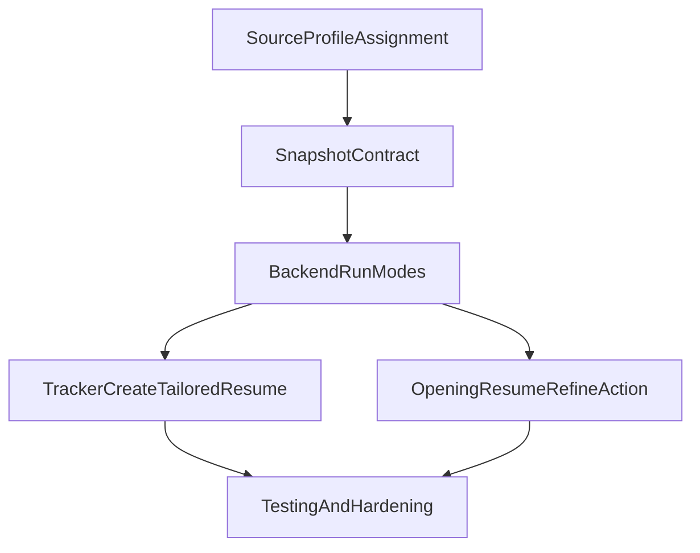

# Development Plan: Job Tracker Opening Resume Orchestration

## Executive Summary

This plan defines a single execution blueprint for adding template-assigned resume snapshot workflows to Job Tracker, with one AI tailoring pipeline exposed through two entry points: tracker-level `create_tailored_resume` and opening-resume-page `Refine with AI agent`. The plan keeps the existing opening-scoped snapshot architecture, enforces mandatory manual template selection for manual snapshot creation, and adds consistent run-status feedback on tracker and opening-resume surfaces.

- Project scope: Job Tracker + Opening Resume + Agent run orchestration
- Total phases: 5
- Estimated total effort: 6-9 engineering days (solo), 3-5 days (parallelized)
- Top risks:
  1. Run-mode ambiguity (`full` vs `refine`) causing inconsistent snapshot behavior
  2. Frontend contract drift between `openings_core`, `opening_resume`, and agent APIs
  3. Incomplete status synchronization causing stale UI state after agent runs

---

## Embedded Tech Stack Analysis

### Stack Components

| Layer | Current Technology | Role in This Plan |
|---|---|---|
| Backend API | FastAPI + Pydantic | Opening/template assignment endpoints and agent run mode contracts |
| Data access | asyncpg + SQL | Ownership checks, snapshot existence checks, opening/profile linkage |
| Persistence | PostgreSQL + Alembic | `job_openings`, `job_opening_resumes`, `job_opening_agent_runs` lifecycle |
| AI orchestration | LangGraph-style node pipeline | Full run and refine run behavior via shared backend agent flow |
| Frontend app | Next.js + React + TypeScript | Tracker row controls, opening resume shell controls, status-driven UX |
| Frontend data layer | feature-scoped API wrappers/hooks | Contract-safe integration for assignment, snapshot creation, and run polling |
| Testing | pytest + Vitest | Targeted regression and new behavior coverage |

### Coverage Assessment by Capability

| Capability | Primary Component(s) | Coverage |
|---|---|---|
| Persist source template/profile on opening | `openings_core` service/router + DB relation (`job_profile_id`) | Covered |
| Manual snapshot requires template selection | opening-resume shell + `POST /job-openings/{id}/resume?source_job_profile_id=` | Covered |
| Tracker `create_tailored_resume` action | tracker UI + agent run endpoint | Covered |
| Opening page refine action | opening-resume shell + agent run endpoint | Covered |
| Full-run vs refine-run backend behavior | agent router + runner + node control | Partially covered (needs explicit contract + validation) |
| Run status/progress reflection in UI | agent status endpoint + frontend polling hooks | Partially covered (needs explicit UX wiring) |

### Gaps and Required Additions

1. **Gap:** No explicit run mode contract on agent run endpoint  
   **Why needed:** Required to distinguish tracker-triggered full orchestration from opening-page refine runs  
   **Addition:** Add request schema/body (`run_mode`, optional source profile assignment input)

2. **Gap:** Template assignment UX missing in tracker/opening pages  
   **Why needed:** Manual snapshot path must enforce explicit template selection  
   **Addition:** Add job-profile dropdown assignment controls and persisted update flow

3. **Gap:** Unified status semantics across surfaces  
   **Why needed:** Users must see clear run lifecycle (`running/succeeded/failed`) regardless of entry point  
   **Addition:** Add frontend polling/state updates for run progression and completion refresh

### Assumptions

- Opening-level `job_profile_id` (already present) is the canonical persisted source template assignment.
- Existing `create_opening_resume` remains the snapshot engine for both manual and AI-driven flows.
- Refinement updates the existing opening snapshot and does not create a new snapshot version in this phase.
- Existing ownership model (`user_id`) remains unchanged.

### Compatibility Notes

- Any API shape changes in backend Pydantic schemas require frontend contract regeneration/synchronization.
- Agent run endpoint currently accepts no body in some clients; migration must preserve backward compatibility where possible.
- Status polling intervals should avoid excessive API load (2-5s cadence with timeout).

---

## Dependency Mapping (Embedded)

### Graph

### Foundation Layer

- Opening-level template assignment contract
- Agent run mode request/validation contract
- Snapshot/refine guardrails and ownership checks

### Critical Path

`P1 -> P2 -> P3 -> P4 -> P5`

### Parallelization Opportunities

- After P2 backend contracts are stable, P3 (tracker UI) and P4 (opening-resume UI) can run in parallel.

### Shared Infrastructure

- Opening ownership and profile ownership validation utilities
- Unified agent status response parsing/polling logic in frontend data layer

---

## Phase Overview

| Phase | Focus Area | Key Deliverables | Effort | Depends On |
|---|---|---|---|---|
| P1 | Contract/Foundation | Template assignment contract, API schema alignment, run-mode request model | M (1-2 days) | - |
| P2 | Backend Orchestration | Full vs refine run semantics, snapshot/refine validation, stable status transitions | L (1.5-2.5 days) | P1 |
| P3 | Tracker UX | Template dropdown + `create_tailored_resume` row action + status/progress feedback | L (1.5-2 days) | P2 |
| P4 | Opening Resume UX | Mandatory manual template selection + refine button + post-run refresh | L (1.5-2 days) | P2 |
| P5 | Testing & Hardening | Targeted tests, regression gates, docs/alignment checks | M (1-1.5 days) | P3,P4 |

---

## Phase 1: Contract/Foundation

### Overview

- Goal: Establish explicit contracts for template assignment and run mode behavior.
- Entry criteria: Existing openings, opening-resume, and agent APIs are runnable.
- Exit criteria: Backend and frontend agree on assignment and run request/response shapes.

### Task P1.T1: Opening-Level Template Assignment Contract
**Feature:** Mandatory source profile assignment model  
**Effort:** M / 6-8 hours  
**Dependencies:** None  
**Risk Level:** Medium

#### Sub-task P1.T1.S1: Confirm and standardize opening template field usage
**Description:** Use the opening-level profile linkage as the canonical assigned template source for manual and AI flows. Ensure service-level ownership checks are applied when assigning/updating template references.  
**Implementation Hints:** Primary files: `backend/app/features/job_tracker/openings_core/schemas.py`, `backend/app/features/job_tracker/openings_core/service.py`, `backend/app/features/job_tracker/openings_core/router.py`.  
**Dependencies:** None  
**Effort:** S / 2-4 hours  
**Acceptance Criteria:**
- Opening update supports valid profile assignment and clearing behavior.
- Cross-user assignment attempts fail safely.
- API response includes assignment state needed by frontend.

#### Sub-task P1.T1.S2: Align frontend opening model with backend contract
**Description:** Ensure opening model/types include assigned template and agent status fields required by tracker/opening pages.  
**Implementation Hints:** `frontend/src/features/job-tracker/types.ts`, `frontend/src/features/job-tracker/jobTrackerApi.ts`.  
**Dependencies:** P1.T1.S1  
**Effort:** S / 2-3 hours  
**Acceptance Criteria:**
- Frontend type mapping has no missing required fields.
- Assignment updates round-trip successfully through API wrappers.

### Task P1.T2: Agent Run Request Contract
**Feature:** Unified run-mode entrypoint  
**Effort:** S / 3-5 hours  
**Dependencies:** P1.T1  
**Risk Level:** Medium

#### Sub-task P1.T2.S1: Define run request schema and compatibility behavior
**Description:** Introduce explicit run mode request contract (`full` vs `refine`) and optional source profile override input for tracker-triggered runs.  
**Implementation Hints:** `backend/app/features/job_tracker/agents/schemas.py`, `backend/app/features/job_tracker/agents/router.py`.  
**Dependencies:** P1.T1.S1  
**Effort:** S / 2-3 hours  
**Acceptance Criteria:**
- Endpoint validates supported run modes.
- Invalid profile IDs are rejected with clear errors.
- Existing client path remains functional or has controlled migration path.

---

## Phase 2: Backend Orchestration

### Overview

- Goal: Make one agent pipeline work correctly for both entry points.
- Entry criteria: Run contract is defined.
- Exit criteria: Full and refine runs enforce expected snapshot/refinement behavior.

### Task P2.T1: Full vs Refine Behavior Enforcement
**Feature:** Shared AI pipeline with mode-aware behavior  
**Effort:** M / 6-8 hours  
**Dependencies:** P1.T2  
**Risk Level:** High

#### Sub-task P2.T1.S1: Enforce refine preconditions
**Description:** Refine runs must require an existing opening snapshot and fail fast with actionable error otherwise.  
**Implementation Hints:** `backend/app/features/job_tracker/agents/router.py`, snapshot existence check in opening resume tables.  
**Dependencies:** P1.T2.S1  
**Effort:** S / 2-3 hours  
**Acceptance Criteria:**
- Refine run without snapshot returns deterministic validation error.
- Full run still works when snapshot absent.

#### Sub-task P2.T1.S2: Template resolution precedence
**Description:** Define and enforce precedence: explicit request profile > opening assigned profile > auto-select logic.  
**Implementation Hints:** `backend/app/features/job_tracker/agents/nodes/node2_select_template.py`.  
**Dependencies:** P2.T1.S1  
**Effort:** M / 4-6 hours  
**Acceptance Criteria:**
- Selection behavior is deterministic and traceable in events.
- Existing auto-selection remains available where assignment is absent.

### Task P2.T2: Status Lifecycle Consistency
**Feature:** Reliable run state reporting  
**Effort:** S / 3-4 hours  
**Dependencies:** P2.T1  
**Risk Level:** Medium

#### Sub-task P2.T2.S1: Ensure status transitions are complete and stable
**Description:** Validate running/succeeded/failed states are set consistently for all run modes and crashes.  
**Implementation Hints:** `backend/app/features/job_tracker/agents/runner.py`, `backend/app/features/job_tracker/agents/router.py`.  
**Dependencies:** P2.T1.S1  
**Effort:** S / 3-4 hours  
**Acceptance Criteria:**
- Final run states are persisted and queryable.
- Opening-level status mirrors latest run outcome.

---

## Phase 3: Tracker UX

### Overview

- Goal: Add assignment + create_tailored_resume controls directly in job tracker.
- Entry criteria: Backend run contract and assignment API are stable.
- Exit criteria: Users can assign template and start full AI tailoring from tracker rows.

### Task P3.T1: Template Dropdown in Tracker
**Feature:** Per-opening template assignment  
**Effort:** M / 4-6 hours  
**Dependencies:** P2  
**Risk Level:** Medium

#### Sub-task P3.T1.S1: Load profile options and render per-row selection
**Description:** Surface user-owned job profiles in tracker rows (or row expansion) and persist assignment changes.  
**Implementation Hints:** `frontend/src/features/job-tracker/openings/JobTrackerTable.tsx`, `frontend/src/features/job-profiles/jobProfileApi.ts`.  
**Dependencies:** P1.T1.S2  
**Effort:** M / 4-6 hours  
**Acceptance Criteria:**
- Dropdown lists user profiles only.
- Assignment updates persist and render immediately.
- Clear state indicates auto-select fallback when not assigned.

### Task P3.T2: `create_tailored_resume` Row Action
**Feature:** Tracker-triggered full run  
**Effort:** M / 4-6 hours  
**Dependencies:** P3.T1, P2  
**Risk Level:** Medium

#### Sub-task P3.T2.S1: Add per-row action and run start handling
**Description:** Add explicit row action that triggers full-run mode using assigned template when present.  
**Implementation Hints:** `frontend/src/features/job-tracker/openings/JobTrackerTable.tsx`, `frontend/src/features/job-tracker/openings/useJobOpenings.ts`, `frontend/src/features/job-tracker/jobTrackerApi.ts`.  
**Dependencies:** P3.T1.S1, P2.T1.S2  
**Effort:** S / 2-4 hours  
**Acceptance Criteria:**
- Action is available for every opening row.
- Run starts successfully and handles conflict/in-progress errors.

#### Sub-task P3.T2.S2: Status/progress feedback on tracker page
**Description:** Show progress and completion/failure states without requiring manual backend inspection.  
**Implementation Hints:** Poll `GET /job-openings/{id}/agent/status`; disable duplicate starts while running.  
**Dependencies:** P3.T2.S1, P2.T2.S1  
**Effort:** M / 4-6 hours  
**Acceptance Criteria:**
- Running state is visible.
- Final outcome updates row state and messages.

---

## Phase 4: Opening Resume UX

### Overview

- Goal: Make opening resume workflow mirror existing resume editing pattern while adding refine action.
- Entry criteria: Backend mode-aware orchestration complete.
- Exit criteria: Manual snapshot enforces template selection and refine button works with visible status.

### Task P4.T1: Manual Snapshot Template Enforcement
**Feature:** Mandatory manual template selection  
**Effort:** S / 3-4 hours  
**Dependencies:** P2  
**Risk Level:** Low

#### Sub-task P4.T1.S1: Add template selector to empty snapshot state
**Description:** Require explicit source template selection before manual snapshot creation from opening-resume page.  
**Implementation Hints:** `frontend/src/features/opening-resume/shell/OpeningResumeShell.tsx`, `frontend/src/features/opening-resume/useOpeningResume.ts`.  
**Dependencies:** P1.T1.S2  
**Effort:** S / 3-4 hours  
**Acceptance Criteria:**
- Snapshot create button is disabled until template is selected.
- Selected template assignment is persisted and reused.

### Task P4.T2: Refine with AI Agent
**Feature:** Opening-page refine entrypoint  
**Effort:** M / 4-6 hours  
**Dependencies:** P4.T1, P2  
**Risk Level:** Medium

#### Sub-task P4.T2.S1: Add refine control and mode-specific run invocation
**Description:** Add `Refine with AI agent` trigger that invokes refine mode and reuses existing snapshot context.  
**Implementation Hints:** `frontend/src/features/opening-resume/shell/OpeningResumeShell.tsx`, `frontend/src/features/job-tracker/jobTrackerApi.ts`.  
**Dependencies:** P2.T1.S1  
**Effort:** S / 2-3 hours  
**Acceptance Criteria:**
- Refine starts only when snapshot exists.
- Clear error is shown when refine precondition fails.

#### Sub-task P4.T2.S2: Post-run data refresh strategy
**Description:** Refresh section data and rendered output metadata after refine completion so UI reflects latest AI edits.  
**Implementation Hints:** Re-fetch opening resume/section hooks or route refresh after success.  
**Dependencies:** P4.T2.S1, P2.T2.S1  
**Effort:** S / 2-4 hours  
**Acceptance Criteria:**
- Updated content is visible without manual navigation hacks.
- Failure state preserves existing user edits and shows clear messaging.

---

## Phase 5: Testing & Hardening

### Overview

- Goal: Validate behavior changes with targeted automated coverage and explicit quality gates.
- Entry criteria: P3 and P4 complete.
- Exit criteria: Targeted suites pass; risks and assumptions are documented for implementation handoff.

### Task P5.T1: Backend Targeted Tests
**Feature:** Assignment + run-mode correctness  
**Effort:** M / 4-6 hours  
**Dependencies:** P2  
**Risk Level:** Medium

#### Sub-task P5.T1.S1: Openings assignment tests
**Description:** Add/adjust tests for valid assignment, invalid profile assignment, and cross-user rejection.  
**Implementation Hints:** `backend/app/features/job_tracker/openings_core/tests/test_openings_crud.py`.  
**Dependencies:** P1.T1.S1  
**Effort:** S / 2-3 hours  
**Acceptance Criteria:**
- Valid assignment persists.
- Invalid/cross-user assignment fails correctly.

#### Sub-task P5.T1.S2: Agent run-mode tests
**Description:** Cover refine-without-snapshot failure, full-run success path, and duplicate run conflict behavior.  
**Implementation Hints:** `backend/app/features/job_tracker/agents/tests/test_agent_router.py`.  
**Dependencies:** P2.T1, P2.T2  
**Effort:** S / 2-3 hours  
**Acceptance Criteria:**
- Mode-specific validation is tested and passing.
- Existing agent run endpoint behavior is not regressed.

### Task P5.T2: Frontend Targeted Tests
**Feature:** Tracker/opening UX reliability  
**Effort:** M / 4-6 hours  
**Dependencies:** P3,P4  
**Risk Level:** Medium

#### Sub-task P5.T2.S1: Hook/API unit coverage
**Description:** Add tests for assignment update calls, run mode invocation, and loading/error state handling.  
**Implementation Hints:** `frontend/src/features/job-tracker/openings/useJobOpenings.ts`, `frontend/src/features/opening-resume/useOpeningResume.ts` and their tests.  
**Dependencies:** P3.T2, P4.T2  
**Effort:** S / 2-3 hours  
**Acceptance Criteria:**
- New API paths are covered by deterministic tests.
- Error states (422/409/400) map to meaningful UI states.

#### Sub-task P5.T2.S2: Component interaction tests
**Description:** Verify dropdown assignment and run-trigger UI states in table and opening shell components.  
**Implementation Hints:** Add focused tests for `JobTrackerTable` and `OpeningResumeShell` behavior.  
**Dependencies:** P5.T2.S1  
**Effort:** S / 2-4 hours  
**Acceptance Criteria:**
- Controls enable/disable correctly by state.
- Status/progress messaging renders for run lifecycle.

---

## Appendix

### Glossary

| Term | Definition |
|---|---|
| Opening Snapshot | Opening-scoped copy of a selected job profile used for role-specific tailoring. |
| Source Template | The assigned `job_profile` used as baseline for manual snapshot creation and AI full runs. |
| Full Run | Agent flow that can select/use template, create snapshot if needed, then tailor and render. |
| Refine Run | Agent flow invoked from opening resume page that refines an existing snapshot. |
| Targeted Testing | Running only tests directly related to touched behavior and dependencies. |

---

### Development Chronology Table

| Order | Work Item | Reason for Sequence | Parallelism |
|---|---|---|---|
| 1 | P1 contracts | Prevents backend/frontend drift | Sequential |
| 2 | P2 orchestration | Defines core runtime semantics used by both UIs | Sequential |
| 3 | P3 tracker UX | Builds on stable contracts | Parallel with P4 |
| 4 | P4 opening-resume UX | Builds on stable contracts | Parallel with P3 |
| 5 | P5 testing/hardening | Final validation gate | Sequential |

---

### Full Risk Register

| ID | Risk | Likelihood | Impact | Mitigation |
|---|---|---|---|---|
| R1 | Run mode behavior diverges between entry points | Medium | High | Mode contract + mode-specific tests |
| R2 | Template assignment not consistently reused | Medium | High | Single source-of-truth precedence rule |
| R3 | UI shows stale run state | Medium | Medium | Explicit polling + completion refresh |
| R4 | Schema/type mismatch between backend and frontend | Medium | Medium | Contract sync checks before merge |
| R5 | Over-broad test runs delay iteration | High | Medium | Enforce targeted testing policy |

---

### Assumptions Log

| ID | Assumption | Impact if Wrong |
|---|---|---|
| A1 | `job_openings.job_profile_id` remains the assignment field | Requires migration/new field introduction |
| A2 | Existing snapshot service remains canonical | Additional snapshot abstraction needed |
| A3 | Agent status endpoint remains available for polling | Need SSE-only fallback UX |
| A4 | No new auth model changes are required | Ownership checks may need middleware refactor |

---

### Targeted Testing Policy (Required)

- Run only changed-feature tests plus direct dependency tests.
- Do not run full repository suites unless targeted suites indicate shared breakage.
- Add new test coverage for every new behavior branch (assignment, run mode, status UX).

Suggested targeted commands (adjust to environment):
- Backend: job tracker openings/agent/opening-resume test modules only
- Frontend: job-tracker/opening-resume hooks/components tests only

---

### Schema-Change and Migration Governance (Required)

- Any schema-level changes in this scope must include explicit Alembic migration tasks in implementation breakdown.
- Migration tasks must include forward path, rollback notes, and data compatibility checks.
- If no schema migration is needed (reusing existing fields), record that decision in implementation notes.

---

### File Structure Governance (Required)

- Keep all changes within existing feature boundaries:
  - `backend/app/features/job_tracker/openings_core/`
  - `backend/app/features/job_tracker/agents/`
  - `backend/app/features/job_tracker/opening_resume/`
  - `frontend/src/features/job-tracker/`
  - `frontend/src/features/opening-resume/`
- Do not create parallel feature trees for this scope.

---

### Agent Workflow Instructions (Required)

Use this sequence for AI coding agents working from this plan:

1. `/using-superpowers` at major transitions
2. `/brainstorming` for any unresolved behavior ambiguity
3. `/dev-plan-generator` when re-baselining plan scope
4. Graph-first exploration (code-review graph / graphify) before broad file scanning
5. Subagents for independent backend/frontend workstreams
6. `/codex review` before completion/merge
7. `/codex rescue` for broken intermediate states

Codex plugin reference: [openai/codex-plugin-cc](https://github.com/openai/codex-plugin-cc)

---

### Cross-Verification Quality Gate (Required)

Before claiming completion:

1. Run targeted automated tests for touched paths
2. Execute agent-driven review (`/codex review`)
3. Validate file-structure and boundary compliance
4. Confirm manual QA checklist for:
   - Manual snapshot with required template selection
   - Tracker `create_tailored_resume` full run
   - Opening-page refine run and UI data refresh
5. Provide evidence (test output + key screenshots/log excerpts where appropriate)

Manual verification by maintainers/dev team is expected; prioritize correctness, maintainability, and clean feature boundaries.

