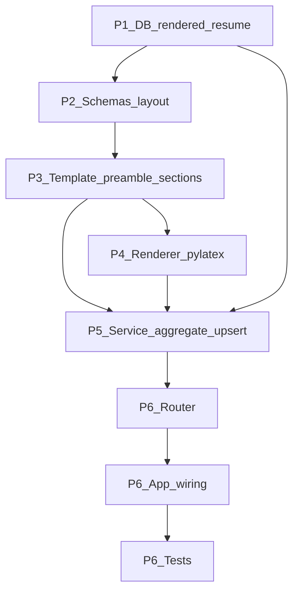

# Development Plan: LaTeX Resume Rendering (`job_profile` / `latex_resume`)

## apply_n_reach — Jobs Tracker Backend

> **Reference Documents:**
>
> - [Jake's Resume template (Overleaf)](https://www.overleaf.com/latex/templates/jakes-resume/syzfjbzwjncs) — MIT license; upstream source referenced on the template page.
> - [Job Profile Development Plan](../../job-profile%20feature/development-plan.md)
> - [User Profile Development Plan](../../backend/user-profile-development-plan.md)
> - Backend feature root: `backend/app/features/job_profile/`

---

## Planning status (implementation not in tree)

This file is the **authoritative design** for the feature. **No `latex_resume` application code or Alembic migration is checked in** until a follow-up implementation pass follows this plan deliberately (any prior exploratory work has been **reverted** to keep the branch clean).

**LaTeX Approach Decision — LOCKED:**


| Decision                | Choice                                                                                                                                                | Rationale                                                                     |
| ----------------------- | ----------------------------------------------------------------------------------------------------------------------------------------------------- | ----------------------------------------------------------------------------- |
| **LaTeX Approach**      | **A — PyLaTeX Document API**                                                                                                                          | Structured Python objects mapping Jake's macros; type-safe section generation |
| **TeX Distribution**    | Developer installs TeX Live / MiKTeX locally; CI skips compile tests via `pytest.mark.skipif`                                                         | System dependency, not pip-installable                                        |
| **PDF Filename**        | `firstname_lastname_rolename.pdf`, fallback to `firstname_lastname_profilename.pdf`, spaces → underscores                                             | Consistent, predictable naming                                                |
| **User Profile Render** | Out of scope; document `template_builder` interface as extensible                                                                                     | Can be added later without refactor                                           |
| **Security**            | Identical patterns to `job_profile` — `get_job_profile_or_404` with `user_id` + `job_profile_id` in WHERE clause; 404 (not 403) for cross-user access | IDOR prevention                                                               |


**Database:** The `rendered_resume` table and its Alembic revision are **part of Phase P1** of this plan; they are **not** present in the repo until that phase is implemented.

---

## Executive Summary

This plan adds a `**latex_resume` sub-feature** under `backend/app/features/job_profile/latex_resume/` that:

1. **Builds LaTeX** from a generalized [Jake's Resume](https://www.overleaf.com/latex/templates/jakes-resume/syzfjbzwjncs)-style preamble and section macros using **PyLaTeX Document API** (Approach A), parameterized so **every section that exists in the job profile domain** can be emitted.
2. **Renders PDF** using `**pylatex`** (with a clear compile pipeline and error surfacing).
3. **Persists** both `latex_source` and `pdf_content` in PostgreSQL table `**rendered_resume`**, **one row per `job_profile`**, **overwrite on re-render**.
4. **Accepts layout options** on render (margins, body font size). **Defaults:** body **10pt**; **name at top 14pt** (fixed rule unless extended later).

- **Total Phases:** 6
- **Estimated Effort:** ~3–5 days solo / ~2–3 days with parallel agents (see Appendix E)
- **Stack:** FastAPI, asyncpg, PostgreSQL (BYTEA + JSONB), Pydantic v2, Alembic, `pylatex` (new), `pdflatex` system dependency, pytest

**Top 3 Risks:**

1. **LaTeX escaping mistakes → compile failures** — Unescaped user content containing `&`, `%`, `$`, `#`, `_`, `{`, `}`, `~`, `^` will break `pdflatex`. Mitigation: single `latex_escape()` utility applied to all user fields, with dedicated tests using malicious strings.
2. **Missing TeX distribution in CI/dev** — `pdflatex` is a system dependency, not pip-installable. Mitigation: document installation requirement; use `pytest.mark.skipif(not shutil.which("pdflatex"))` for compile integration tests.
3. **IDOR if ownership checks are bypassed** — Cross-user access to rendered resumes or render triggers. Mitigation: all routes use `Depends(get_job_profile_or_404)` from existing `job_profile/dependencies.py`; cross-user isolation tests in P6.

---

## API Surface

The API exposes three endpoints under the job profile namespace:

**Render (trigger)**

- `POST /job-profiles/{job_profile_id}/latex-resume/render` — optional `RenderResumeRequest` body with layout options; returns `RenderedResumeResponse` metadata.

**Read**

- `GET /job-profiles/{job_profile_id}/latex-resume` — metadata + `layout_json` (404 if never rendered).
- `GET /job-profiles/{job_profile_id}/latex-resume/pdf` — binary PDF download (`application/pdf`); Content-Disposition filename: `firstname_lastname_rolename.pdf`.

All endpoints require authentication and job profile ownership via `Depends(get_job_profile_or_404)`.

---

## Phase Overview


| Phase | Focus                       | Key Deliverables                                                                  | Effort         | Depends On |
| ----- | --------------------------- | --------------------------------------------------------------------------------- | -------------- | ---------- |
| P1    | DB: `rendered_resume`       | Alembic revision + `models.py` + layout JSON column                               | S / 0.5–1 day  | —          |
| P2    | API contracts               | Pydantic schemas: layout options, render request/response                         | S / 0.5 day    | P1         |
| P3    | LaTeX template & mapping    | `template_builder.py`: PyLaTeX Document objects + full section mapping + escaping | L / 1–1.5 days | P2         |
| P4    | PDF render engine           | `renderer.py`: PyLaTeX `Document.generate_pdf()`, temp dir hygiene, error mapping | M / 0.5–1 day  | P3         |
| P5    | Service orchestration       | Load JP sections → build LaTeX → render → upsert row                              | M / 0.5–1 day  | P1, P3, P4 |
| P6    | HTTP surface, wiring, tests | Router, `app.py`, integration + cross-user tests                                  | M / 0.5–1 day  | P5         |


---

## Data Source and Section Coverage

### Canonical source for v1

- **Render input is the job profile aggregate:** all reads go through existing `**job_profile_*` tables** (personal, education, experience, projects, research, certifications, skills) plus `**job_profiles`** metadata as needed (e.g. optional subtitle or target role line).
- **User profile parity:** Master `**user_profile`** sections use the **same field shapes** as job profile sections (import/copy semantics already exist elsewhere). This plan does **not** add a separate "render from user profile" endpoint; however, the **LaTeX mapping layer must be written per *section***, not per table name, so the same builder functions can be reused if a future endpoint passes "resume DTO" structs built from either aggregate.

### Section → LaTeX mapping (all job profile sections)


| Domain section       | DB / API origin                | LaTeX destination (Jake-style via PyLaTeX)                                                                       | Notes                                                                                                       |
| -------------------- | ------------------------------ | ---------------------------------------------------------------------------------------------------------------- | ----------------------------------------------------------------------------------------------------------- |
| **Personal**         | `job_profile_personal_details` | Center header: name (large), phone if present*, email, LinkedIn, GitHub, portfolio                               | *Phone is not in current JP personal schema in migrations — if absent, omit; if added later, wire here.     |
| **Education**        | `job_profile_educations`       | `\section{Education}` + `\resumeSubheading` rows + bullet lists from `bullet_points`                             | Order: e.g. by `start_month_year` desc. PyLaTeX `Command` objects for `\resumeSubheading`.                  |
| **Experience**       | `job_profile_experiences`      | `\section{Experience}` + subheadings + bullets (`bullet_points`), optional `context` as intro line               | `work_sample_links` → footnote-style `\href` bullets or inline links. Use `NoEscape` for `\href`.           |
| **Projects**         | `job_profile_projects`         | `\section{Projects}` using `\resumeProjectHeading` pattern                                                       | `reference_links` JSONB → compact link list via `NoEscape`.                                                 |
| **Research**         | `job_profile_researches`       | `\section{Research}` — **prefer dedicated section** when any research row exists                                 | Paper title, publication link, description.                                                                 |
| **Certifications**   | `job_profile_certifications`   | `\section{Certifications}` list-style entries                                                                    | Name + verification link.                                                                                   |
| **Skills**           | `job_profile_skill_items`      | `\section{Technical Skills}` (or split labels)                                                                   | Group `technical` vs `competency` like Jake's "Languages / Frameworks" lines — **two bold labels** minimum. |
| **Job profile meta** | `job_profiles`                 | Optional one-line under name: `target_role` / `target_company` / `job_posting_url` (render as small or footnote) | Omit if all null.                                                                                           |


### Template strategy (Approach A — PyLaTeX)

- **PyLaTeX `Document` API:** Build LaTeX using structured Python objects (`Document`, `Section`, `Command`, `NoEscape`) that map Jake's custom macros into the PyLaTeX type system.
- **Custom macros:** Jake's macros (`\resumeSubheading`, `\resumeItem`, `\resumeProjectHeading`, etc.) defined via `pylatex.base_classes.CommandBase` or injected via `NoEscape` blocks in the preamble.
- **Layout parameterization:** `\documentclass[letterpaper,{n}pt]{article}` with `n = body_font_size_pt`; `\usepackage[margin=...]{geometry}` from layout defaults or request; name block overridden to `name_font_size_pt`.
- `**latex_escape()`:** Single utility for all user-controlled strings — escapes LaTeX special characters (`\`, `&`, `%`, `$`, `#`, `_`, `{`, `}`, `~`, `^`); URLs passed to `\href` must be validated or percent-encoded as needed.
- **Empty sections:** omit entire `\section{...}` blocks when there is no content (no blank headings).

### Layout & typography

**Defaults (product rules):**

- **Body / base text:** **10 pt** — passed as the `article` class option (replace Jake's default 11pt in the upstream template).
- **Name (top):** **14 pt** — apply in the header group only, e.g. `\textbf{\fontsize{14}{16}\selectfont ...}` while the rest of the document stays at 10pt.

**Request options (POST render body, all optional with defaults):**

- `body_font_size_pt: int = 10` — validated range 9–12.
- `name_font_size_pt: int = 14` — validated range 12–18.
- `margins_in: { "top": float, "bottom": float, "left": float, "right": float }` — default to Jake-style effective margins; implement via `**geometry`** package: `\usepackage[margin=0.5in]{geometry}` as default, overridable per side if all four provided.

**Persistence:**

- Store the **effective** layout used for that render in `**rendered_resume.layout_json`** (JSONB) so GET metadata returns what was last used; enables "re-render with same layout" without re-posting body.

---

## Phase 1: Database — `rendered_resume`

### Overview

- **Goal:** Persistent storage for LaTeX + PDF + last layout; 1:1 with `job_profiles`.
- **Features addressed:** Rendered resume persistence, layout history.
- **Entry criteria:** Repo builds; Alembic chain known (`c3d4e5f6a7b8` job profile tables revision exists).
- **Exit criteria:** Migration applies; `ensure_rendered_resume_schema` matches; constraints documented.

---

### Task P1.T1: Alembic Migration — `rendered_resume` Table

**Feature:** Persistence
**Effort:** S / 2–4 hours
**Dependencies:** None
**Risk Level:** Low–Medium — BYTEA size and migration ordering.

#### Sub-task P1.T1.S1: Author migration script

**Files:** `backend/alembic/versions/<new_revision>_add_rendered_resume_table.py`

**Description:** Create a new Alembic migration using raw SQL in `op.execute("""...""")` (project style) to add the `rendered_resume` table. The table stores one rendered resume per job profile with LaTeX source, PDF binary, layout metadata, and template versioning. The migration must chain correctly after the existing job profile tables revision (`c3d4e5f6a7b8`).

**Implementation Hints:**

- `rendered_resume` columns:
  - `id SERIAL PRIMARY KEY`
  - `job_profile_id INTEGER NOT NULL UNIQUE REFERENCES job_profiles(id) ON DELETE CASCADE`
  - `latex_source TEXT NOT NULL`
  - `pdf_content BYTEA NOT NULL`
  - `layout_json JSONB NOT NULL DEFAULT '{}'::jsonb` — last render layout (margins, font sizes)
  - `template_name TEXT NOT NULL DEFAULT 'jakes_resume_v1'`
  - `rendered_at TIMESTAMPTZ NOT NULL DEFAULT NOW()`
  - `created_at TIMESTAMPTZ NOT NULL DEFAULT NOW()`
  - `updated_at TIMESTAMPTZ NOT NULL DEFAULT NOW()`
- `downgrade()` drops `rendered_resume` before any dependent ordering issues (only depends on `job_profiles`).
- Follow filename/revision id patterns in `backend/alembic/versions/`.

**Dependencies:** None
**Effort:** S / 1–2 hours
**Risk Flags:** BYTEA columns can grow large for complex resumes. Monitor row size; optional future migration to external storage if needed.
**Acceptance Criteria:**

- `alembic upgrade head` applies on a clean DB after job profile revision
- `UNIQUE(job_profile_id)` enforces one row per profile
- `alembic downgrade -1` rolls back cleanly (test before committing)

#### Sub-task P1.T1.S2: Runtime DDL mirror

**Files:** `backend/app/features/job_profile/latex_resume/models.py`

**Description:** Create the runtime `CREATE TABLE IF NOT EXISTS rendered_resume (...)` matching the Alembic migration, plus an `async def ensure_rendered_resume_schema(conn)` function. This follows the existing pattern in other `job_profile/*/models.py` files where both Alembic and runtime DDL coexist for developer parity.

**Implementation Hints:**

- Import and follow the exact pattern from `backend/app/features/job_profile/core/models.py` or any other section's `models.py`.
- The `ensure_rendered_resume_schema` function should be idempotent (`CREATE TABLE IF NOT EXISTS`).
- Column definitions must exactly match the Alembic migration from P1.T1.S1.

**Dependencies:** P1.T1.S1
**Effort:** XS / 30 minutes
**Risk Flags:** None — straightforward pattern replication.
**Acceptance Criteria:**

- Matches Alembic-created schema (developer parity with other `job_profile/*/models.py`)
- `ensure_rendered_resume_schema(conn)` runs without error on both fresh and existing DBs
- Importing `from app.features.job_profile.latex_resume.models import ensure_rendered_resume_schema` succeeds

---

## Phase 2: API Contracts (Schemas)

### Overview

- **Goal:** Typed request/response for render + metadata; layout defaults centralized.
- **Features addressed:** Layout configuration, render API contracts.
- **Entry criteria:** P1 complete (column names stable for `layout_json`).
- **Exit criteria:** Schemas importable; validators enforce safe ranges; OpenAPI reflects optional nested layout.

---

### Task P2.T1: Pydantic Models for Layout + Responses

**Feature:** API contracts
**Effort:** S / 2–3 hours
**Dependencies:** P1.T1
**Risk Level:** Low

#### Sub-task P2.T1.S1: `ResumeMarginsInches` + `ResumeLayoutOptions`

**Files:** `backend/app/features/job_profile/latex_resume/schemas.py`

**Description:** Create Pydantic v2 schemas for layout configuration. `ResumeMarginsInches` defines the four-side margin model with validation. `ResumeLayoutOptions` bundles font sizes and margins with product-approved defaults (10pt body, 14pt name). All fields include range validators to prevent unreasonable values that could break LaTeX compilation.

**Implementation Hints:**

- `ResumeMarginsInches`: optional `top`, `bottom`, `left`, `right` (floats); if any set, all four required for v1 simplicity. Use a `model_validator` to enforce "all or nothing".
- `ResumeLayoutOptions`:
  - `body_font_size_pt: int = 10`
  - `name_font_size_pt: int = 14`
  - `margins_in: ResumeMarginsInches | None = None`
- Validators: body 9–12 pt; name 12–18 pt; margins 0.3–1.0 in each.
- Follow Pydantic v2 patterns from existing `job_profile/*/schemas.py` files.

**Dependencies:** P1.T1.S1 (column names)
**Effort:** S / 1 hour
**Risk Flags:** None — pure schema definition.
**Acceptance Criteria:**

- `ResumeLayoutOptions()` produces defaults: `body_font_size_pt=10`, `name_font_size_pt=14`, `margins_in=None`
- `ResumeLayoutOptions(body_font_size_pt=13)` raises `ValidationError` (exceeds 12)
- `ResumeMarginsInches(top=0.5)` raises `ValidationError` (partial margins not allowed)
- `ResumeMarginsInches(top=0.5, bottom=0.5, left=0.5, right=0.5)` validates successfully

#### Sub-task P2.T1.S2: `RenderResumeRequest` + `RenderedResumeResponse`

**Files:** `backend/app/features/job_profile/latex_resume/schemas.py`

**Description:** Create the request schema for the render endpoint (wrapping optional layout) and the response schema for metadata (no raw BYTEA in JSON responses — binary PDF served via a separate endpoint). The response includes `job_profile_id`, `template_name`, `rendered_at`, and the effective `layout_json` used during render.

**Implementation Hints:**

- `RenderResumeRequest`: optional `layout: ResumeLayoutOptions | None = None` (omit → defaults applied).
- `RenderedResumeResponse`: `job_profile_id: int`, `template_name: str`, `rendered_at: datetime`, `layout_json: dict` — **no raw BYTEA** in JSON (binary via PDF endpoint only).
- Follow the `BaseSchema` pattern from `app/features/core/base_model.py` if the project uses one.

**Dependencies:** P2.T1.S1
**Effort:** XS / 30 minutes
**Risk Flags:** None.
**Acceptance Criteria:**

- OpenAPI shows optional nested layout object on POST
- Defaults match **10pt / 14pt name** when body omitted
- `RenderedResumeResponse` serializes correctly from DB row data

---

## Phase 3: LaTeX Template Builder

### Overview

- **Goal:** Single module that turns **aggregated job profile DTO** → full `.tex` file content using PyLaTeX Document API.
- **Features addressed:** LaTeX generation, section mapping, security (escaping).
- **Entry criteria:** P2 schemas stable enough for field names.
- **Exit criteria:** Golden-string tests for sparse and full profiles; escaping tests; all sections covered.

---

### Task P3.T1: Escape Utilities + Preamble

**Feature:** Safe LaTeX generation
**Effort:** S / 2–4 hours
**Dependencies:** P2.T1
**Risk Level:** Medium — escaping mistakes are the #1 cause of compile failures.

#### Sub-task P3.T1.S1: `latex_escape` + URL helper

**Files:** `backend/app/features/job_profile/latex_resume/template_builder.py` (or `latex_utils.py` if you split)

**Description:** Implement pure functions for escaping user content before it enters PyLaTeX objects. The `latex_escape()` function handles all LaTeX special characters. A companion `sanitize_url_for_href()` validates/encodes URLs for safe use in `\href{}{}` commands. These are heavily unit-tested as they are the primary LaTeX injection defense.

**Implementation Hints:**

- `latex_escape(text: str) -> str`: escape `\`, `&`, `%`, `$`, `#`, `_`, `{`, `}`, `~`, `^` using LaTeX-safe replacements (e.g. `&` → `\&`, `%` → `\%`).
- `sanitize_url_for_href(url: str) -> str`: validate URL format, percent-encode special characters as needed for LaTeX `\href`.
- These functions wrap user content *before* passing to PyLaTeX `NoEscape()` — the content is escaped, then marked as safe for LaTeX.
- Test with strings containing every special character, empty strings, and very long strings.

**Dependencies:** None (pure utility functions)
**Effort:** S / 1–2 hours
**Risk Flags:** Missing a special character in the escape list will cause compile failures downstream. Test exhaustively with all 10 LaTeX special characters.
**Acceptance Criteria:**

- Strings with `&`, `%`, `_`, `$`, `#` compile when smoke-rendered through `pdflatex`
- `latex_escape("")` returns `""`
- `latex_escape(None)` handled gracefully (return `""` or raise — document choice)
- Unit tests for every LaTeX special character individually and combined

#### Sub-task P3.T1.S2: Preamble with parameterized layout

**Files:** `backend/app/features/job_profile/latex_resume/template_builder.py`

**Description:** Build the LaTeX preamble using PyLaTeX's `Document` API with parameterized layout options. The preamble includes the document class, geometry package for margins, required packages from Jake's template, and all custom macro definitions (`\resumeSubheading`, `\resumeItem`, `\resumeProjectHeading`, etc.) injected via `NoEscape` blocks.

**Implementation Hints:**

- Create a `build_preamble(layout: ResumeLayoutOptions) -> Document` function that:
  - Sets `\documentclass[letterpaper,{n}pt]{article}` with `n = body_font_size_pt`
  - Adds `\usepackage[margin=...]{geometry}` from layout defaults or request
  - Adds required packages: `enumitem`, `titlesec`, `hyperref`, `tabularx`, `fancyhdr`, etc. (from Jake's template source)
  - Defines Jake-style macros via `NoEscape` blocks: `\resumeSubheading`, `\resumeItem`, `\resumeProjectHeading`, `\resumeSubItem`, etc. — copied/adapted from the MIT-licensed template
- The name font size (`name_font_size_pt`) is applied in the header section builder (P3.T2.S1), not in the preamble document class.

**Dependencies:** P3.T1.S1 (escape utils), P2.T1.S1 (layout schema)
**Effort:** M / 2–3 hours
**Risk Flags:** PyLaTeX's `Document` constructor options may not map 1:1 to all Jake's template features. Some preamble content may need raw `NoEscape` injection. Test that the preamble alone compiles to a valid (empty) PDF.
**Acceptance Criteria:**

- Swapping `body_font_size_pt` only changes body size; name block still overridden to `name_font_size_pt`
- Preamble with default layout compiles to a valid empty PDF via `pdflatex`
- All Jake's custom macros are defined and usable in the document body

---

### Task P3.T2: Section Fragment Generators

**Feature:** Full section coverage
**Effort:** L / 1–1.5 days
**Dependencies:** P3.T1
**Risk Level:** Medium — many sections to cover; each has unique field mappings.

#### Sub-task P3.T2.S1: Personal + skills + meta header

**Files:** `backend/app/features/job_profile/latex_resume/template_builder.py`

**Description:** Implement `render_header(personal_data, job_meta, layout)`, `render_skills(skill_items)`, and optional `render_job_meta_line(job_profile)`. The header renders the candidate's name at `name_font_size_pt` with contact info (email, LinkedIn, GitHub, portfolio) using PyLaTeX `Command` and `NoEscape` objects. Skills are grouped by `kind` (technical vs competency) into bold-labeled lines matching Jake's "Languages / Frameworks / Tools" pattern.

**Implementation Hints:**

- Header: use `\textbf{\fontsize{N}{N+2}\selectfont ...}` via `NoEscape` for the name; contact details as a centered line with `|` separators and `\href` for URLs.
- Skills: iterate `skill_items` grouped by `kind`; emit `\textbf{Technical Skills:} item1, item2, ...` pattern.
- Job meta line: if `target_role` or `target_company` is set on the job profile, render a small subtitle line under the name.
- All user content passed through `latex_escape()` before entering `NoEscape`.

**Dependencies:** P3.T1.S1, P3.T1.S2
**Effort:** M / 3–4 hours
**Risk Flags:** Contact info URLs must use `sanitize_url_for_href()` — bare URLs with special characters will break `\href`.
**Acceptance Criteria:**

- Header renders with correct font size for name
- Skills group correctly by `kind` with bold labels
- Empty personal/skills/meta data produces no output (no blank lines or empty sections)
- All URLs wrapped in `\href` compile correctly

#### Sub-task P3.T2.S2: Education / experience / projects / research / certifications

**Files:** `backend/app/features/job_profile/latex_resume/template_builder.py`

**Description:** Implement section generator functions for each remaining list section. Each function takes a list of DB rows (as dicts or DTOs) and returns LaTeX fragment content using PyLaTeX objects that map to Jake's macros. JSONB `bullet_points` arrays become `\resumeItem` lists. JSONB `reference_links` arrays become compact `\href` lists. Empty sections produce no output.

**Implementation Hints:**

- `render_education(educations: list[dict]) -> str`: `\section{Education}` + `\resumeSubheading` per row; `bullet_points` → `\resumeItem` itemize list.
- `render_experience(experiences: list[dict]) -> str`: `\section{Experience}` + subheadings; `context` as optional intro line; `bullet_points` → `\resumeItem`; `work_sample_links` → footnote-style `\href`.
- `render_projects(projects: list[dict]) -> str`: `\section{Projects}` + `\resumeProjectHeading`; `reference_links` → compact link list.
- `render_research(researches: list[dict]) -> str`: `\section{Research}` with paper title, publication link, description.
- `render_certifications(certifications: list[dict]) -> str`: `\section{Certifications}` list-style entries.
- All user text through `latex_escape()`; all URLs through `sanitize_url_for_href()`.
- Order lists by `start_month_year DESC` where applicable (match existing list endpoint ordering).

**Dependencies:** P3.T1.S1, P3.T1.S2, P3.T2.S1 (header sets document context)
**Effort:** L / 4–6 hours
**Risk Flags:** Each section has unique fields and formatting — resist copy-paste errors between generators. JSONB bullet_points may contain empty strings or nulls; filter before rendering.
**Acceptance Criteria:**

- Integration test builds LaTeX for **at least one row per section**
- Empty sections produce **no** `\section` output
- JSONB `bullet_points` and `reference_links` render correctly (including empty arrays)
- LaTeX output for a full profile (all sections populated) compiles via `pdflatex`

---

## Phase 4: PDF Rendering (`pylatex`)

### Overview

- **Goal:** Compile LaTeX string → PDF bytes; surface log on failure.
- **Features addressed:** PDF compilation, error handling, system dependency management.
- **Entry criteria:** P3 produces valid TeX for sample data.
- **Exit criteria:** Renderer tests pass (skip in CI if no TeX — see risks).

---

### Task P4.T1: `renderer.py` Implementation

**Feature:** PDF compilation
**Effort:** M / 3–4 hours
**Dependencies:** P3.T1
**Risk Level:** High — environment dependency on `pdflatex`.

#### Sub-task P4.T1.S1: PyLaTeX wrapper

**Files:** `backend/app/features/job_profile/latex_resume/renderer.py`

**Description:** Implement a `render_pdf(latex_source: str, filename_stem: str | None = None) -> bytes` function that takes a complete LaTeX source string, writes it to a temporary directory, invokes `pdflatex` (via PyLaTeX's `Document.generate_pdf()` or direct subprocess), captures stdout/stderr for error reporting, reads the resulting PDF bytes, and cleans up the temp directory. On failure, raises a structured exception containing the LaTeX error log tail.

**Implementation Hints:**

- Use PyLaTeX's `Document.generate_pdf()` which handles temp dir and `pdflatex` invocation internally, OR use `subprocess.run(["pdflatex", ...])` in a `tempfile.TemporaryDirectory()` for more control.
- Capture `pdflatex` stdout/stderr — on non-zero exit code, parse the log for the first error message and include it in the exception.
- `filename_stem` is used for the temp `.tex` file basename — sanitize it (no spaces, no special chars).
- Return raw `bytes` of the generated PDF file.
- Document **system dependency:** TeX Live / MiKTeX required for local and CI.
- Use `pytest.mark.skipif(not shutil.which("pdflatex"), reason="pdflatex not installed")` for tests that require compilation.

**Dependencies:** P3.T1 (valid LaTeX source to compile)
**Effort:** M / 2–3 hours
**Risk Flags:** `pdflatex` may not be on PATH in all dev environments. The `tempfile` cleanup must happen even on compilation failure (use try/finally or context manager). PyLaTeX may call `pdflatex` twice for cross-references — ensure both runs complete.
**Acceptance Criteria:**

- Known-good `.tex` string returns non-empty PDF bytes
- Invalid `.tex` string raises with message containing LaTeX error snippet
- Temp directory is always cleaned up (verify no leftover files after test)
- Function is skippable in CI via `pytest.mark.skipif`

---

## Phase 5: Service Layer

### Overview

- **Goal:** Orchestration: authorize → load sections → build LaTeX → render PDF → upsert row.
- **Features addressed:** Business logic, data aggregation, transactional persistence.
- **Entry criteria:** P1–P4 available.
- **Exit criteria:** Transactional upsert; overwrite same `job_profile_id`; PDF filename convention applied.

---

### Task P5.T1: `service.py` — Aggregate, Render, Persist

**Feature:** Business logic orchestration
**Effort:** M / 0.5–1 day
**Dependencies:** P1.T1, P3.T2, P4.T1
**Risk Level:** Medium — orchestrates multiple modules; transaction boundaries matter.

#### Sub-task P5.T1.S1: Data aggregation helpers

**Files:** `backend/app/features/job_profile/latex_resume/service.py`

**Description:** Implement internal async functions that `SELECT` each section by `job_profile_id` (reuse query patterns from existing `job_profile/*/service.py`). These functions aggregate all section data into DTO dicts suitable for the template builder. A single `aggregate_job_profile_data(conn, job_profile_id)` function returns a complete dict of all sections, handling missing/empty sections gracefully.

**Implementation Hints:**

- Query each section table: `job_profile_personal_details`, `job_profile_educations`, `job_profile_experiences`, `job_profile_projects`, `job_profile_researches`, `job_profile_certifications`, `job_profile_skill_items`.
- Also query `job_profiles` for metadata (`target_role`, `target_company`, `profile_name`).
- Use `conn.fetch()` / `conn.fetchrow()` with asyncpg parameterized queries (`$1`, `$2`).
- Return a structured dict: `{"personal": {...}, "educations": [...], "experiences": [...], ...}`.
- Sections with no data return empty lists/None — template builder handles omission.

**Dependencies:** P1.T1 (DB schema), P3.T2 (knows what data template builder expects)
**Effort:** M / 2–3 hours
**Risk Flags:** Query performance with many sections — consider whether a single JOIN query or multiple simple SELECTs is better. For v1, multiple simple SELECTs matching existing service patterns is acceptable.
**Acceptance Criteria:**

- Returns complete aggregated data for a job profile with all sections populated
- Returns empty collections for sections with no data
- Uses asyncpg `$N` parameterization (no string interpolation)
- All queries scope by `job_profile_id` (no cross-profile data leakage)

#### Sub-task P5.T1.S2: Render orchestration + upsert

**Files:** `backend/app/features/job_profile/latex_resume/service.py`

**Description:** Implement the main `render_resume(conn, job_profile_id, layout: ResumeLayoutOptions | None)` function that orchestrates the full pipeline: aggregate data → build LaTeX via template builder → compile PDF via renderer → upsert into `rendered_resume` table. The upsert uses `INSERT ... ON CONFLICT (job_profile_id) DO UPDATE` to maintain the one-row-per-profile invariant. PDF filename stem follows the convention: `firstname_lastname_rolename` (fallback to `firstname_lastname_profilename`), with spaces replaced by underscores.

**Implementation Hints:**

- Apply layout defaults if `layout` is None: `ResumeLayoutOptions()`.
- Call `aggregate_job_profile_data(conn, job_profile_id)` → `build_latex(data, layout)` → `render_pdf(latex_source, filename_stem)`.
- Build filename stem: `f"{first}_{last}_{role}".replace(" ", "_").lower()` from personal details + job profile metadata.
- Upsert SQL: `INSERT INTO rendered_resume (job_profile_id, latex_source, pdf_content, layout_json, template_name, rendered_at) VALUES ($1, $2, $3, $4, $5, NOW()) ON CONFLICT (job_profile_id) DO UPDATE SET latex_source=$2, pdf_content=$3, layout_json=$4, template_name=$5, rendered_at=NOW(), updated_at=NOW() RETURNING *`.
- Store `layout.model_dump()` as `layout_json`.

**Dependencies:** P5.T1.S1, P3.T2 (template builder), P4.T1 (renderer)
**Effort:** M / 2–3 hours
**Risk Flags:** The render step is synchronous and potentially slow (pdflatex compilation). For v1, blocking is acceptable. If performance becomes an issue, consider async task queue in the future. Transaction boundary: the upsert should be in the same connection context as the reads to avoid stale data.
**Acceptance Criteria:**

- Second render updates same `id` / same `job_profile_id` row (upsert, not duplicate)
- `layout_json` in DB matches the effective layout used for rendering
- PDF filename stem follows `firstname_lastname_rolename` convention
- Handles missing personal details gracefully (fallback filename)

---

## Phase 6: Router, App Wiring, Tests

### Overview

- **Goal:** Expose minimal API; register router; full tests.
- **Features addressed:** HTTP endpoints, application wiring, test coverage, cross-user isolation.
- **Entry criteria:** P5 complete.
- **Exit criteria:** All tests green where TeX available; isolation tests always run; router registered in `app.py`.

---

### Task P6.T1: FastAPI Router

**Feature:** HTTP endpoints
**Effort:** S / 2–3 hours
**Dependencies:** P5.T1
**Risk Level:** Low

#### Sub-task P6.T1.S1: Endpoints

**Files:** `backend/app/features/job_profile/latex_resume/router.py`

**Description:** Create the FastAPI `APIRouter` with three endpoints for the LaTeX resume feature. All endpoints use `Depends(get_job_profile_or_404)` from the existing job profile dependencies for ownership validation. The POST render endpoint triggers compilation, the GET metadata endpoint returns render info, and the GET PDF endpoint streams the binary PDF with proper Content-Disposition headers.

**Implementation Hints:**

- `POST /job-profiles/{job_profile_id}/latex-resume/render`
  - Body: optional `RenderResumeRequest`
  - Response: `RenderedResumeResponse` (200 or 201)
  - Uses `Depends(get_job_profile_or_404)` for ownership check
  - Calls `service.render_resume(conn, job_profile_id, request.layout)`
- `GET /job-profiles/{job_profile_id}/latex-resume`
  - Response: `RenderedResumeResponse` (200) or 404 if never rendered
  - Uses `Depends(get_job_profile_or_404)`
- `GET /job-profiles/{job_profile_id}/latex-resume/pdf`
  - Response: `Response(content=pdf_bytes, media_type="application/pdf", headers={"Content-Disposition": f'attachment; filename="{filename}.pdf"'})`
  - 404 if never rendered
  - Uses `Depends(get_job_profile_or_404)`
- Router prefix and tags: `APIRouter(prefix="/job-profiles/{job_profile_id}/latex-resume", tags=["latex-resume"])`

**Dependencies:** P5.T1 (service layer)
**Effort:** S / 1–2 hours
**Risk Flags:** Content-Disposition filename must be sanitized — no special characters that could break HTTP headers.
**Acceptance Criteria:**

- 401 without auth; 404 cross-user; 404 when no render exists for GET endpoints
- POST returns render metadata with correct `layout_json`
- GET PDF returns `application/pdf` content-type with correct Content-Disposition filename
- PDF filename follows `firstname_lastname_rolename.pdf` convention

---

### Task P6.T2: Register Router

**Feature:** Application wiring
**Effort:** XS / 15 minutes
**Dependencies:** P6.T1
**Risk Level:** Low

#### Sub-task P6.T2.S1: Wire router in `app.py`

**Files:** `backend/app/app.py`

**Description:** Import `jp_latex_resume_router` from the latex_resume package and call `include_router` in `app.py`, placing it next to the other job profile router includes. Follow the exact import and registration pattern used by existing job profile section routers.

**Implementation Hints:**

- Add import: `from app.features.job_profile.latex_resume.router import router as jp_latex_resume_router`
- Add: `app.include_router(jp_latex_resume_router)` alongside other job profile routers
- Verify the router appears in OpenAPI docs at `/docs`

**Dependencies:** P6.T1.S1
**Effort:** XS / 15 minutes
**Risk Flags:** None.
**Acceptance Criteria:**

- LaTeX resume endpoints appear in OpenAPI docs
- No import errors on application startup
- Existing endpoints unaffected (no regressions)

---

### Task P6.T3: Tests

**Feature:** Test coverage
**Effort:** M / 3–4 hours
**Dependencies:** P6.T1, P6.T2
**Risk Level:** Low

#### Sub-task P6.T3.S1: Conftest and integration tests

**Files:**

- `backend/app/features/job_profile/latex_resume/tests/conftest.py`
- `backend/app/features/job_profile/latex_resume/tests/test_jp_latex_resume.py`

**Description:** Create test fixtures and integration tests for all three LaTeX resume endpoints. Tests follow the established patterns from `job_profile/projects/tests/test_jp_projects.py`. Fixtures provide authenticated users with job profiles pre-populated with section data. Compile-dependent tests use `pytest.mark.skipif` when `pdflatex` is not available.

**Implementation Hints:**

- `conftest.py`: fixtures for authenticated user, job profile with populated sections (personal, education, experience, etc.), and `pdflatex` availability check.
- Test cases:
  - **Layout:** POST with custom margins + 11pt body → `layout_json` reflects request; defaults test when body empty.
  - **Overwrite:** two POSTs → single DB row updated (`COUNT` check or same `job_profile_id` unique constraint).
  - **PDF GET:** returns 200 and `application/pdf` content-type when rendered; correct Content-Disposition filename.
  - **Metadata GET:** returns 200 with correct `rendered_at`, `template_name`, `layout_json`.
  - **Not-rendered GET:** returns 404 when no render exists.
  - **Auth:** 401 without session for all endpoints.
- Compile-dependent tests marked with `@pytest.mark.skipif(not shutil.which("pdflatex"), reason="pdflatex not installed")`.

**Dependencies:** P6.T1.S1, P6.T2.S1
**Effort:** M / 2–3 hours
**Risk Flags:** Tests that compile LaTeX will be slow (~2–5 seconds each). Keep the count minimal; rely on unit tests in P3 for section coverage.
**Acceptance Criteria:**

- All tests pass when `pdflatex` is available
- Tests skip gracefully when `pdflatex` is not installed
- Tests follow patterns from `job_profile/projects/tests/test_jp_projects.py`

#### Sub-task P6.T3.S2: Cross-user isolation tests

**Files:** `backend/app/features/job_profile/tests/test_cross_user_isolation.py` (add cases)

**Description:** Add cross-user isolation test cases for all three LaTeX resume endpoints to the existing shared isolation test file. User B must not be able to trigger renders, read metadata, or download PDFs for User A's job profiles. All cross-user attempts must return 404 (never 403, never 200).

**Implementation Hints:**

- User A creates a job profile, renders a resume.
- User B tries:
  - `POST /job-profiles/{A's_job_profile_id}/latex-resume/render` → 404
  - `GET /job-profiles/{A's_job_profile_id}/latex-resume` → 404
  - `GET /job-profiles/{A's_job_profile_id}/latex-resume/pdf` → 404
- Use `app.dependency_overrides` to swap `get_current_user` between User A and User B.
- Follow the multi-user test pattern from existing cross-user tests in the same file.

**Dependencies:** P6.T3.S1
**Effort:** S / 1 hour
**Risk Flags:** This is a critical security test. Verify that test fails if `get_job_profile_or_404` ownership check is temporarily removed.
**Acceptance Criteria:**

- All 3 cross-user endpoint tests return 404 (never 200, never 403)
- Tests explicitly verify status code AND response body
- Tests cover render, metadata, and PDF download endpoints

---

## Appendix A — Glossary


| Term                | Definition                                                                                                                    |
| ------------------- | ----------------------------------------------------------------------------------------------------------------------------- |
| **Job profile**     | Tailored resume data under `job_profiles` + section tables.                                                                   |
| **Rendered resume** | Single stored LaTeX+PDF artifact per job profile.                                                                             |
| **Layout JSON**     | Serialized margin/font options used for last successful render.                                                               |
| **Jake's template** | LaTeX resume skeleton and macros per [Overleaf template](https://www.overleaf.com/latex/templates/jakes-resume/syzfjbzwjncs). |
| **PyLaTeX**         | Python library (`pylatex` on PyPI) for building LaTeX documents programmatically.                                             |
| **pdflatex**        | TeX compiler that converts `.tex` source to PDF. System dependency (TeX Live / MiKTeX).                                       |
| **BYTEA**           | PostgreSQL binary data type used to store PDF content in the `rendered_resume` table.                                         |
| **NoEscape**        | PyLaTeX utility class that marks a string as safe (pre-escaped) for direct LaTeX insertion.                                   |


---

## Appendix B — Risk Register


| ID  | Risk                                           | Likelihood | Impact   | Mitigation                                                                                            | Phase  |
| --- | ---------------------------------------------- | ---------- | -------- | ----------------------------------------------------------------------------------------------------- | ------ |
| R1  | LaTeX injection via unescaped content          | Medium     | High     | `latex_escape()` on all user fields; tests with malicious strings; `sanitize_url_for_href()` for URLs | P3     |
| R2  | IDOR — cross-user access to renders            | Low        | Critical | `get_job_profile_or_404` on all routes; 404 never 403; cross-user tests in P6                         | P6     |
| R3  | TeX not installed (CI/dev)                     | Medium     | Medium   | Docs + `pytest.mark.skipif` for compile integration tests; setup instructions                         | P4, P6 |
| R4  | Large PDF BYTEA rows                           | Low        | Low      | Monitor size; optional future external storage migration                                              | P1     |
| R5  | Layout validation too loose                    | Low        | Low      | Pydantic bounds on pt and inches; compile-time validation catches extremes                            | P2     |
| R6  | PyLaTeX API incompatibility with custom macros | Medium     | Medium   | Jake's macros via `NoEscape` blocks bypass API limitations; test preamble compiles independently      | P3     |
| R7  | pdflatex subprocess hangs                      | Low        | Medium   | Set timeout on subprocess call; clean up temp dir on timeout                                          | P4     |


---

## Appendix C — Assumptions Log


| #   | Assumption                                                        | Impact if Wrong                                                       |
| --- | ----------------------------------------------------------------- | --------------------------------------------------------------------- |
| A1  | Python `**pylatex`** 1.4.x compatible with Python 3.12+           | Pin version; test in CI                                               |
| A2  | Host `**pdflatex**` (TeX Live / MiKTeX) available on dev machines | Document installation; CI skips compile tests                         |
| A3  | One rendered row per job profile is sufficient                    | Add history table later if needed                                     |
| A4  | Phone not in JP personal row (current schema)                     | Omit phone line until schema adds it                                  |
| A5  | Feature code ships only when following this plan phase-by-phase   | Prevents drift between partial prototypes and the agreed schema/API   |
| A6  | `pylatex` calls `pdflatex` subprocess internally                  | Verify in implementation; may need direct subprocess for more control |
| A7  | asyncpg BYTEA handling works for PDF storage/retrieval            | Test with actual PDF bytes in integration tests                       |


---

## Appendix D — File Structure (target, not in repo until implementation)

```
backend/app/features/job_profile/
└── latex_resume/
    ├── __init__.py
    ├── router.py               # 3 endpoints: render, metadata, PDF download
    ├── service.py              # aggregate + render + upsert orchestration
    ├── models.py               # ensure_rendered_resume_schema + DDL
    ├── schemas.py              # layout options, render request/response
    ├── template_builder.py     # PyLaTeX preamble + section fragments + escape
    ├── renderer.py             # pdflatex invocation via PyLaTeX or subprocess
    └── tests/
        ├── conftest.py
        └── test_jp_latex_resume.py

backend/alembic/versions/<revision>_add_rendered_resume_table.py
backend/app/app.py                          # include_router latex_resume
backend/app/features/job_profile/tests/test_cross_user_isolation.py  # add cases
```

**Dependency file:** add `pylatex` (and pin) to backend dependency manifest (e.g. `pyproject.toml` / `requirements.txt` — follow repo convention).

---

## Appendix E — Task Dependency and Agent Execution

This appendix summarizes **task order**, **parallelism**, and **how coding agents should execute** the plan. Use it with the **phase overview** table and the dependency graph below.

### E.1 Task-level dependency table


| Task  | Depends on            | Sequential note                                              | Parallel with (once deps done) |
| ----- | --------------------- | ------------------------------------------------------------ | ------------------------------ |
| P1.T1 | —                     | P1.T1.S1 → P1.T1.S2                                          | P2 prep (reading only)         |
| P2.T1 | P1.T1 (schema stable) | P2.T1.S1 → P2.T1.S2 (same file, can be one PR)               | —                              |
| P3.T1 | P2.T1                 | P3.T1.S1 → P3.T1.S2                                          | —                              |
| P3.T2 | P3.T1                 | Section generators can be split by file later; v1 one module | —                              |
| P4.T1 | P3.T1                 | Renderer can start after minimal valid TeX string exists     | P3.T2 (if TeX sample stubbed)  |
| P5.T1 | P1.T1, P3.T2, P4.T1   | P5.T1.S1 then P5.T1.S2                                       | —                              |
| P6.T1 | P5.T1                 | Router after service                                         | —                              |
| P6.T2 | P6.T1                 | Single commit after router imports                           | —                              |
| P6.T3 | P6.T1, P6.T2          | Tests after routes                                           | —                              |


**Parallelization summary**

- **P1 + P2** can overlap slightly only after P1.T1.S1 defines columns (especially `layout_json`).
- **P3** (template) and **P4** (renderer) can use **two agents** once P3.T1.S1 produces a **minimal compiling TeX fixture** agreed in interface (`build_preamble(layout) -> str`).
- **P5** must follow **P3 + P4 + P1** (single integration owner recommended).

**Critical path:** P1.T1 → P2.T1 → P3.T1 → P3.T2 → P4.T1 → P5.T1 → P6.T1 → P6.T2 → P6.T3.

### E.2 Sub-task ordering (high signal)

- **P1.T1:** migration first (S1), then runtime `ensure_`* (S2).
- **P2.T1:** layout defaults (**10pt body**, **14pt name**) encoded in schema defaults; margins schema before request/response.
- **P3:** escape utils (S1) before preamble (S2); preamble before section generators.
- **P4:** smoke compile before wiring to DB; use known-good `.tex` fixture.
- **P5:** aggregation queries reuse existing table column names from `c3d4e5f6a7b8_add_job_profile_tables.py`.
- **P6:** router, then wiring, then tests; cross-user tests for all three routes.

### E.3 Task flow (Mermaid)




### E.4 Instructions for coding agents

1. **Using superpowers (required first):** Before planning or executing this roadmap, invoke and follow the **using-superpowers** skill so you load the correct workflow (which skills to invoke, ordering, and checklists). Use it to decide when to apply brainstorming, TDD, systematic debugging, verification-before-completion, and code-review skills.
2. **Execution order:** Treat **Appendix E.1 and E.2** as the source of truth for sequencing. Only parallelize where the **Parallel with** column and parallelization summary allow.
3. **Subagent execution model:** When dispatching parallel agents using the dependency matrix from E.1, ensure:
  - P3.T2 (section generators) and P4.T1 (renderer) can run as independent subagents once P3.T1.S1 produces a minimal compiling fixture.
  - P5 and P6 must run sequentially — they integrate all prior work.
  - Use `/using-superpowers` to determine which skills to invoke before each task type (see skill mapping table below).
4. **Testing:** Run `pytest` for `latex_resume` and job_profile isolation tests after each task. Document TeX requirement if compile tests are skipped. Fix failures before moving on.
5. **Security:** Never interpolate user strings into SQL; LaTeX only after `latex_escape()`. All routes through `get_job_profile_or_404`.
6. **Delivery:** Small PRs: (1) migration + models, (2) schemas, (3) template + renderer, (4) service + router + tests.

**Skill mapping table:**


| Task Type        | Skills to Check                                                    |
| ---------------- | ------------------------------------------------------------------ |
| Planning a phase | `writing-plans`                                                    |
| Executing a plan | `executing-plans`, `subagent-driven-development`                   |
| Code development | `brainstorming` (if creative), `test-driven-development`           |
| Code review      | `requesting-code-review`, `receiving-code-review`                  |
| Testing          | `verification-before-completion`                                   |
| Bug/failure      | `systematic-debugging`                                             |
| Completion       | `verification-before-completion`, `finishing-a-development-branch` |


### E.5 Documentation and verification standards

- **Docstrings (required):** New modules and public functions include purpose, parameters, return values, and notes on **layout defaults (10pt / 14pt name)** and **TeX dependency**.
- **File layout and format:** Match [Appendix D](#appendix-d--file-structure-target-not-in-repo-until-implementation) and existing `job_profile/*/` conventions.
- **Verification gate:** After each phase, run targeted tests; migration `upgrade`/`downgrade` once on dev DB. Before starting the next task, verify the current one: run its tests, confirm paths and filenames match this plan, and confirm docstrings are in place.

### E.6 File-level dependency map (for sub-agents)


| Work package | Primary files                                                               | Depends on package                        |
| ------------ | --------------------------------------------------------------------------- | ----------------------------------------- |
| DB           | `alembic/versions/*_add_rendered_resume_table.py`, `latex_resume/models.py` | —                                         |
| Contracts    | `latex_resume/schemas.py`                                                   | DB column names for `layout_json`         |
| Template     | `latex_resume/template_builder.py`                                          | Contracts for layout field names          |
| Render       | `latex_resume/renderer.py`                                                  | Template produces syntactically valid TeX |
| Integration  | `latex_resume/service.py`, `router.py`, `app.py`                            | All above                                 |
| QA           | `latex_resume/tests/`*, `test_cross_user_isolation.py`                      | Integration                               |


---

## Appendix F — Testing Scope Policy

This appendix defines the testing boundaries for this feature to ensure efficient development and avoid false failures from unrelated features.

### Scoped test directories

- **Primary:** `backend/app/features/job_profile/latex_resume/tests/` — all feature-specific tests live here.
- **Shared isolation:** `backend/app/features/job_profile/tests/test_cross_user_isolation.py` — for cross-user isolation additions only (test ONLY latex_resume endpoints).
- **Do NOT** run tests from other feature directories (`user_profile`, `auth`, other `job_profile` sections) unless explicitly needed for a regression check.

### Pytest commands

```bash
# Primary test suite — run after every task
pytest backend/app/features/job_profile/latex_resume/tests/ -v

# Cross-user isolation tests — run after P6.T3
pytest backend/app/features/job_profile/tests/test_cross_user_isolation.py -v

# Full job_profile test suite — run before PR merge only
pytest backend/app/features/job_profile/ -v
```

### Compile-dependent test handling

```python
import shutil
import pytest

PDFLATEX_AVAILABLE = shutil.which("pdflatex") is not None

@pytest.mark.skipif(not PDFLATEX_AVAILABLE, reason="pdflatex not installed")
def test_render_produces_valid_pdf():
    ...
```

### Rationale

- **Save time:** Only run tests relevant to the feature being developed.
- **Efficient development:** Avoid waiting for unrelated test suites.
- **Avoid false failures:** Other features' tests may have their own flaky or environment-dependent behavior.
- **Clear ownership:** Each test file maps to a specific feature or cross-cutting concern.

---

## Appendix G — Security Patterns Reference

This appendix documents the security patterns used in this feature, mirroring the established `job_profile` patterns.

### Route-level ownership

All routes use `Depends(get_job_profile_or_404)` from `[backend/app/features/job_profile/dependencies.py](../../backend/app/features/job_profile/dependencies.py)`:

```python
async def get_job_profile_or_404(
    job_profile_id: int,
    request: Request,
    conn = Depends(get_db_conn)
) -> dict:
    user_id = request.session.get("user_id")
    row = await conn.fetchrow(
        "SELECT * FROM job_profiles WHERE id = $1 AND user_id = $2",
        job_profile_id, user_id
    )
    if not row:
        raise HTTPException(status_code=404, detail="Job profile not found")
    return dict(row)
```

### Key security rules

1. **SQL queries always include `user_id` scope** via the `get_job_profile_or_404` dependency — no direct access by `job_profile_id` alone.
2. **404 (never 403)** for unauthorized access — do not reveal whether a resource exists for another user.
3. `**latex_escape()`** for all user content entering LaTeX — prevents LaTeX injection that could execute arbitrary TeX commands.
4. `**sanitize_url_for_href()**` for all URLs entering `\href{}{}` — prevents URL-based LaTeX injection.
5. **No raw string interpolation into SQL** — use asyncpg `$N` parameterization exclusively.
6. **Content-Disposition filename sanitization** — strip special characters from PDF download filenames to prevent HTTP header injection.

---

## Engineering Workflow (Superpowers)

**Entry point — skill id `using-superpowers`:** Invoke relevant skills **before** acting; user instructions take precedence; use **process skills before implementation skills**.


| When                                      | Skill id (invoke this name)                        | Notes                                                     |
| ----------------------------------------- | -------------------------------------------------- | --------------------------------------------------------- |
| Designing behavior / new features         | `brainstorming`                                    | Before creative or ambiguous design work                  |
| Multi-step work before coding             | `writing-plans`                                    | Multi-step implementation from spec                       |
| Independent parallel workstreams          | `subagent-driven-development` or `executing-plans` | Parallel tasks vs checkpointed execution                  |
| Before claiming done / before commit / PR | `verification-before-completion`                   | Run verification commands; evidence before success claims |
| Before merge                              | `requesting-code-review`                           | Use `receiving-code-review` when acting on feedback       |
| Bugs / failures                           | `systematic-debugging`                             | Before proposing fixes                                    |


**Typical sequence**


| Step | Action                                        | Skill id to load                                                |
| ---- | --------------------------------------------- | --------------------------------------------------------------- |
| 1    | New feature slice or unclear scope            | `brainstorming` (and `using-superpowers` if not already loaded) |
| 2    | Multi-step change with no written plan        | `writing-plans`                                                 |
| 3    | Execute plan with parallel subtasks           | `subagent-driven-development`                                   |
| 4    | Execute plan across sessions with checkpoints | `executing-plans`                                               |
| 5    | Before done / commit / PR                     | `verification-before-completion`                                |
| 6    | Before merge                                  | `requesting-code-review`                                        |
| 7    | Review comments need changes                  | `receiving-code-review`                                         |
| 8    | Test failure or bug                           | `systematic-debugging`                                          |


*Use the Skill tool to load `using-superpowers` first; then load the skill id from the workflow table for your current phase. Do not skip skill loading when the task matches the "When" column.*

**Cursor / other IDEs:** Use the same skill **ids** when skills are exposed as agent skills or workspace rules.

---

## Development Order

Execute tasks in the following order to respect dependencies and reuse patterns. Use the [Engineering Workflow](#engineering-workflow-superpowers) above during implementation.


| Order | Task / Feature                                                    | Rationale                                                     |
| ----- | ----------------------------------------------------------------- | ------------------------------------------------------------- |
| 1     | **P1.T1** — Alembic migration + runtime DDL for `rendered_resume` | All features depend on DB table                               |
| 2     | **P2.T1** — Pydantic schemas for layout + render request/response | API contracts needed before template builder                  |
| 3     | **P3.T1** — Escape utilities + preamble builder                   | Safety layer + document skeleton before section generators    |
| 4     | **P3.T2** — Section fragment generators (all sections)            | Template builder complete after this                          |
| 5     | **P4.T1** — PDF renderer (pylatex/pdflatex wrapper)               | Can start after P3.T1; parallel with P3.T2 if fixture stubbed |
| 6     | **P5.T1** — Service orchestration (aggregate + render + upsert)   | Integrates DB + template + renderer                           |
| 7     | **P6.T1** — FastAPI router (3 endpoints)                          | HTTP surface after service                                    |
| 8     | **P6.T2** — Wire router in `app.py`                               | Single commit after router                                    |
| 9     | **P6.T3** — Integration tests + cross-user isolation              | Full coverage after routes wired                              |


Parallelism: after P3.T1 (order 3) is stable, P3.T2 (order 4) and P4.T1 (order 5) may proceed in parallel if a minimal compiling TeX fixture is agreed upon.

---

## Plan Verification Checklist (for editors of this document)

- Every section from the data source mapping appears in at least one task
- No orphan sub-tasks (every sub-task has dependencies and acceptance criteria)
- Dependencies form a valid DAG (no circular dependencies)
- Critical path explicitly called out in E.1
- T-shirt sizes and time estimates for every sub-task
- Acceptance criteria (2–4 testable bullets) for every sub-task
- Implementation hints reference PyLaTeX API (Approach A), asyncpg, Pydantic v2 — not generic advice
- Risks are specific and actionable (not "something might go wrong")
- Assumptions logged with impact-if-wrong
- Mermaid diagram syntactically valid
- Appendix F (Testing Scope) defines exact `pytest` commands
- Appendix G (Security) mirrors `job_profile` patterns with latex-specific additions

---

*End of plan — implement only after product sign-off on defaults and optional user-profile render scope.*