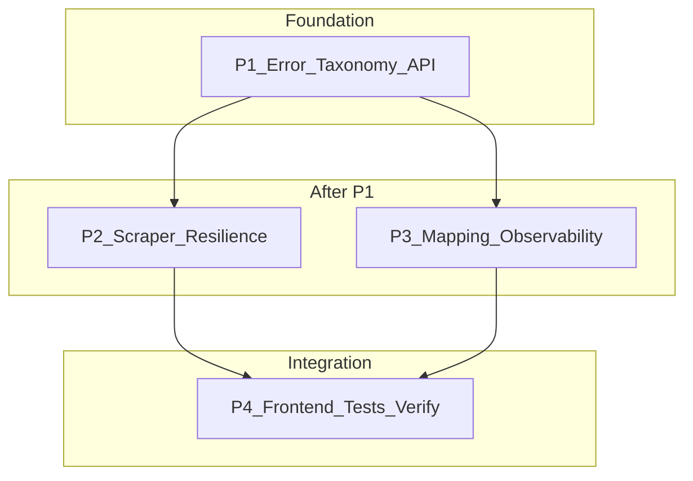

# LinkedIn Import Reliability & HTTP Semantics — Consolidated Development Plan

**Document type**: Single canonical plan (requirements + tech stack + dependency map + phased work breakdown + appendices).

**Derived from**: [`.cursor/plans/linkedin_import_502_fix_946f99c7.plan.md`](../../.cursor/plans/linkedin_import_502_fix_946f99c7.plan.md).

**Referenced implementation paths**: `backend/app/features/user_profile/linkedin_import/` (notably [`router.py`](../../backend/app/features/user_profile/linkedin_import/router.py), [`scraper.py`](../../backend/app/features/user_profile/linkedin_import/scraper.py), [`mapping_chain.py`](../../backend/app/features/user_profile/linkedin_import/mapping_chain.py)), [`frontend/src/core/http/client.ts`](../../frontend/src/core/http/client.ts), [`frontend/src/features/user-profile/sections/personal/PersonalForm.tsx`](../../frontend/src/features/user-profile/sections/personal/PersonalForm.tsx).

---

## Executive Summary

Today, `POST /profile/import/linkedin` returns **502** for both Apify scrape failures and LangChain mapping failures ([`router.py`](../../backend/app/features/user_profile/linkedin_import/router.py) lines 46–53). That collapses misconfiguration, upstream scrape issues, validation problems, and LLM failures into one bucket, which hurts monitoring, support, and client-side handling.

This initiative introduces a clear **error taxonomy** and **HTTP semantics**, hardens the **Apify scraper** (validation, retries, logging), improves **mapping observability**, aligns the **frontend** with the revised contract, and adds **scoped tests** plus verification and a conventional commit. Agent workflow aligns with OpenCode plus `using-superpowers`; parallel tracks may delegate review or rescue work to Codex via [codex-plugin-cc](https://github.com/openai/codex-plugin-cc).

| Attribute | Value |
| --- | --- |
| **Phases** | 4 |
| **Estimated total effort** | ~2–4 engineer-days (calendar ~1–1.5 days with parallel P2/P3) |
| **Critical path** | P1 → P2 → P4 (sequential baseline); P3 parallel after P1 |

**Top risks and mitigations**

1. **Apify / LinkedIn behavior** — Treat as partly external; retries, clear errors, dashboards; document actor assumptions in Appendix C.
2. **LLM structured-output flakiness** — Distinct status/detail for mapping stage; log safe excerpts; optional correlation id.
3. **Breaking clients that only check 502** — Grep for consumers; document migration in release notes; keep human-readable `detail`.

---

# Part I — Requirements Analysis

## Feature 1: Error taxonomy and HTTP contract (API)

| Field | Content |
| --- | --- |
| **Description** | Classify import failures by stage (`scrape` vs `map` vs `config` vs `validation`) and map each to an appropriate HTTP status and stable `detail` (string or small structured object). |
| **Core capabilities** | Typed/domain errors; router mapping; OpenAPI documentation of new responses; backward-compatible messaging where possible. |
| **User-facing behavior** | Users and support see meaningful status codes and messages; API clients can branch on status and optional `error_code`. |
| **Implied requirements** | No leakage of secrets in `detail`; Pydantic validation unchanged for request body; logging without raw PII dumps. |
| **Dependencies** | None (foundation for P2–P4). |
| **Open questions** | Final matrix: e.g. missing `apify_api_token` → **503** vs **501**; LLM failure → **424** vs **503** — product/API policy must confirm (defaults proposed in Part II). |

## Feature 2: Scraper hardening (Apify / httpx)

| Field | Content |
| --- | --- |
| **Description** | Validate and normalize LinkedIn URLs; parse Apify error bodies; bounded retries for transient httpx errors; structured logging for diagnosis. |
| **Core capabilities** | URL rules; `LinkedInScrapeError` variants or enriched messages; retry with cap aligned to existing timeouts; unit tests with mocked httpx. |
| **User-facing behavior** | Fewer spurious failures; clearer 422 for bad URLs; 502/503 with actionable detail when upstream fails. |
| **Implied requirements** | Truncate log bodies; respect 120s-style client timeout from current [`scraper.py`](../../backend/app/features/user_profile/linkedin_import/scraper.py) design. |
| **Dependencies** | P1 error types and router mapping. |
| **Open questions** | Exact retry policy (which status codes, max attempts, jitter). |

## Feature 3: Mapping observability (LangChain / LLM)

| Field | Content |
| --- | --- |
| **Description** | Preserve exception context in logs; optional request correlation id through scrape + map; document env vars for LLM and Apify. |
| **Core capabilities** | Logging in [`mapping_chain.py`](../../backend/app/features/user_profile/linkedin_import/mapping_chain.py); optional middleware or router-generated id; appendix env table. |
| **User-facing behavior** | Indirect — faster RCA for support/engineering. |
| **Implied requirements** | Do not log full raw profile payloads at INFO in production if policy forbids. |
| **Dependencies** | P1 (stable error surfacing). |
| **Open questions** | Whether correlation id is header-in or server-generated only. |

## Feature 4: Frontend error UX & tests

| Field | Content |
| --- | --- |
| **Description** | Surface `HttpError.status` alongside message in LinkedIn import UI; adjust `parseError` if structured `detail` uses a preferred `message` field; Vitest/pytest updates. |
| **Core capabilities** | PersonalForm (or caller) displays status prefix; optional `parseError` enhancement; router and scraper tests. |
| **User-facing behavior** | “Import failed (424): …” style copy for support screenshots. |
| **Implied requirements** | Accessible error text; no breaking change for generic `Error` paths. |
| **Dependencies** | P1 contract; P2/P3 ideally complete before final UI polish. |
| **Open questions** | Whether to localize strings in this phase. |

---

# Part II — Tech Stack Analysis

## Stack components

| Technology | Role in this initiative |
| --- | --- |
| **FastAPI** | Router, dependency injection, OpenAPI docs, `HTTPException` semantics. |
| **Pydantic** | [`LinkedInImportRequest`](../../backend/app/features/user_profile/linkedin_import/schemas.py) / response models. |
| **httpx** | Async HTTP client for Apify in [`scraper.py`](../../backend/app/features/user_profile/linkedin_import/scraper.py). |
| **Apify** | LinkedIn profile scraper actor (e.g. `harvestapi/linkedin-profile-scraper` — verify in deployment). |
| **LangChain** | Mapping pipeline in [`mapping_chain.py`](../../backend/app/features/user_profile/linkedin_import/mapping_chain.py). |
| **asyncpg** | Profile lookup and transactional replace via [`service.py`](../../backend/app/features/user_profile/linkedin_import/service.py). |
| **pytest** | Backend tests under `linkedin_import/tests/`. |
| **React + TypeScript** | [`PersonalForm.tsx`](../../frontend/src/features/user-profile/sections/personal/PersonalForm.tsx), Vitest. |
| **Shared HTTP client** | [`frontend/src/core/http/client.ts`](../../frontend/src/core/http/client.ts) — `HttpError`, `parseError`. |

## Coverage assessment (capability → component)

| Capability | Stack component |
| --- | --- |
| HTTP status mapping | FastAPI router + domain errors |
| URL validation | `scraper.py` + Pydantic optional refinements |
| Apify resilience | httpx + scraper helpers |
| LLM mapping | LangChain chain + exception wrapping |
| UI error display | React + `HttpError` |
| Verification | pytest, Vitest, manual smoke |

## Gaps

| Gap | Why needed | Recommended addition |
| --- | --- | --- |
| **Centralized observability** (metrics/traces) | Dashboards for scrape vs map failure rates | Optional: OpenTelemetry spans around scrape/map; out of MVP if logs suffice |
| **Rate limiting on import endpoint** | Abuse / cost control | Existing platform middleware if any; else defer |
| **Feature flag for new status codes** | Risk-averse rollout | Short-lived env flag mapping new codes → legacy 502 — only if prod clients are unknown |

## Assumptions

| ID | Assumption |
| --- | --- |
| AS1 | Primary consumer is the first-party web app using `apiRequest` / `HttpError`. |
| AS2 | Apify actor ID and pricing model remain stable for the dev cycle (see Appendix C). |
| AS3 | Team accepts **424 Failed Dependency** for LLM/mapping failures *or* standardizes on **503** — plan uses **424** where API policy allows (else **503** with distinct `error_code` in body). |
| AS4 | Missing `apify_api_token` returns **503 Service Unavailable** with clear `detail` (not 502). |

## Compatibility notes

- **`parseError`** already handles string `detail` and object `detail` via `JSON.stringify` — structured payloads remain readable but ugly; optional improvement in P4 prefers `detail.message`.
- Changing status codes may affect undocumented API clients — mitigation: grep codebase + document.

## Suggested HTTP mapping (implement in P1; adjust with PM sign-off)

| Condition | HTTP | Notes |
| --- | --- | --- |
| Missing / invalid server config (`apify_api_token`) | **503** | Feature unavailable server-side |
| Invalid / non-LinkdedIn URL after validation | **422** | Client correctable |
| Empty scrape result / unparsable profile | **422** or **502** | Prefer **422** if “not a profile”; **502** if actor returned anomaly |
| Apify 401/403/quota | **502** | Bad upstream credentials or quota |
| Transient network / 5xx to Apify (retries exhausted) | **502** or **503** | Use **503** if overload-oriented copy fits |
| LLM / mapping failure | **424** (or **503** + code) | Distinguish from scrape |

---

# Part III — Dependency Map

## Dependency graph (features / phases)



**Legend**: Nodes are phases. Edges are hard dependencies.

## Foundation layer

- **P1** — No upstream phase dependency.

## Critical path

- **Sequential minimum**: **P1 → P2 → P4** defines the longest chain if one engineer runs P3 after P4 prep only (not recommended).
- **Calendar optimization**: Run **P2** and **P3** in parallel after **P1**; then **P4**.

## Parallelization opportunities

| After phase | Parallel tracks |
| --- | --- |
| P1 | Agent A: P2 scraper / Agent B: P3 mapping & logging |

## Shared infrastructure

- **`errors.py` (new)** — shared exception types / codes consumed by router, scraper, mapping.
- **Logging prefix / correlation id** — shared middleware or router helper (optional).

## File structure target (additive)

```
backend/app/features/user_profile/linkedin_import/
  errors.py                    # NEW — taxonomy, helpers
  router.py                    # MODIFY — HTTP mapping
  scraper.py                   # MODIFY — validation, retries, logging
  mapping_chain.py             # MODIFY — logging, error context
  tests/
    test_router.py             # NEW or EXTEND — status codes
    test_scraper.py            # EXTEND — httpx mocks
frontend/src/
  core/http/client.ts          # OPTIONAL MODIFY — parseError
  features/user-profile/sections/personal/
    PersonalForm.tsx           # MODIFY — HttpError UX
    PersonalForm.test.tsx      # MODIFY if copy changes
Features-to-develop/
  linkedin-import-reliability/
    development-plan.md        # THIS FILE
```

---

# Part IV — Development Plan

## Phase overview

| Phase | Focus | Key deliverables | Effort | Depends on |
| --- | --- | --- | --- | --- |
| **P1** | Error taxonomy + API contract | `errors.py`, router mapping, OpenAPI clarity | M–L | — |
| **P2** | Scraper resilience | Validation, retries, logging, pytest | M | P1 |
| **P3** | Mapping + observability | Logs, correlation id (optional), env docs | S–M | P1 |
| **P4** | Frontend + tests + closure | UI, Vitest/pytest, smoke, graphify, commit | M | P1–P3 |

---

## Phase 1: Error taxonomy and HTTP contract

### Overview

- **Goal**: Every failure mode maps to a meaningful status and stable `detail`.
- **Features addressed**: API contract (Feature 1).
- **Entry criteria**: None.
- **Exit criteria**: OpenAPI reflects new responses; scrape/map failures are not blindly `502`; no uncaught exceptions in happy path.

### Task P1.T1: Define domain error taxonomy

**Feature**: Error taxonomy and HTTP contract  
**Effort**: M / 1 day  
**Dependencies**: —  
**Risk level**: Medium (product must confirm status matrix)

#### Sub-task P1.T1.S1: Add `errors.py` with stages and codes

**Description**: Introduce a small module (e.g. `linkedin_import/errors.py`) defining an `ImportStage` enum (`config`, `validation`, `scrape`, `map`), stable string `error_code` values, and either subclassed exceptions or a single `LinkedInImportAppError` carrying `stage`, `code`, `message`, and optional `http_status`. Ensure `LinkedInScrapeError` and `MappingError` can be mapped *into* this taxonomy at the router boundary without losing safe context.

**Implementation hints**: Use Python 3.11+ `StrEnum` or plain `Enum` for stages; keep messages user-safe. Do not put Apify raw JSON in user `detail` by default. Align with existing [`LinkedInScrapeError`](../../backend/app/features/user_profile/linkedin_import/scraper.py) / [`MappingError`](../../backend/app/features/user_profile/linkedin_import/mapping_chain.py) definitions — extend or wrap rather than duplicating strings everywhere.

**Dependencies**: —  
**Effort**: M / 4–8 hrs  
**Risk flags**: Over-abstraction before router needs are clear — keep first version minimal.  
**Acceptance criteria**:
- Given a raised domain error with stage `scrape` and code `UPSTREAM_QUOTA`, when converted for HTTP, then status and `detail`/`error_code` are deterministic.
- Given no `apify_api_token`, when import is attempted, then the error classifies as `config` (or equivalent) before Apify is called.
- Unit-level tests exist for classification helpers (pytest).

#### Sub-task P1.T1.S2: Document chosen HTTP matrix in code comments

**Description**: Copy the agreed matrix (Part II table) into module docstring or `errors.py` header so future edits keep semantics consistent.

**Implementation hints**: Link to this file’s Appendix C for assumptions.

**Dependencies**: P1.T1.S1  
**Effort**: XS / <2 hrs  
**Acceptance criteria**:
- A new engineer can read one file and know which HTTP status applies to scrape vs map failures.

### Task P1.T2: Router HTTP mapping and response detail

**Feature**: Error taxonomy and HTTP contract  
**Effort**: M / 4–8 hrs  
**Dependencies**: P1.T1  
**Risk level**: Medium

#### Sub-task P1.T2.S1: Replace blanket 502 in `router.py`

**Description**: Update [`import_linkedin_profile`](../../backend/app/features/user_profile/linkedin_import/router.py) to catch `LinkedInScrapeError` / `MappingError` (or new unified types), map through taxonomy, and raise `HTTPException` with correct `status_code` and `detail`. Preserve 404 for missing user profile.

**Implementation hints**: Use `HTTPException` with `detail` as `str` or `dict` per FastAPI docs; if `dict`, include `message` and `error_code` keys for frontend parsing. Avoid inline imports (team rule).

**Dependencies**: P1.T1.S1  
**Effort**: M / 4–8 hrs  
**Risk flags**: FastAPI may serialize `detail` differently for `dict` — verify OpenAPI output.  
**Acceptance criteria**:
- Given scrape raises quota-related error, when endpoint runs, then response status is **502** (or agreed code) and `detail` mentions quota without raw token.
- Given mapping fails, when endpoint runs, then status is **424** (or agreed alternate) and differs from scrape failures.
- Given invalid URL (post-validation), when endpoint runs, then status is **422**.

#### Sub-task P1.T2.S2: Optional structured `detail` contract

**Description**: If using `dict` detail, add Pydantic model or typed dict for documentation consistency and ensure [`client.ts`](../../frontend/src/core/http/client.ts) consumers get a readable `HttpError.message`.

**Implementation hints**: Consider `{"message": "...", "error_code": "...", "stage": "scrape"}`; keep fields stable.

**Dependencies**: P1.T2.S1  
**Effort**: S / 2–4 hrs  
**Acceptance criteria**:
- OpenAPI shows example error response body for at least one failure case.
- Frontend manual test: error message is human-readable (not raw `JSON.stringify` only).

### Task P1.T3: OpenAPI and developer docs touch-up

**Feature**: Error taxonomy  
**Effort**: S / 2–4 hrs  
**Dependencies**: P1.T2  
**Risk level**: Low

#### Sub-task P1.T3.S1: Add `responses=` metadata on route

**Description**: Annotate `@router.post` with `responses={422: ..., 424: ..., 502: ..., 503: ...}` as applicable so generated OpenAPI lists distinct codes.

**Implementation hints**: FastAPI `responses` dict with `description` and optional `model`/`content`.

**Dependencies**: P1.T2.S1  
**Effort**: S / 2–4 hrs  
**Acceptance criteria**:
- `/openapi.json` includes distinct response entries for documented error statuses.
- CI or local smoke confirms app starts with updated router.

---

## Phase 2: Scraper resilience

### Overview

- **Goal**: Fewer avoidable failures; better logs for Apify issues.
- **Features addressed**: Scraper hardening (Feature 2).
- **Entry criteria**: P1 complete (typed errors consumed by scraper paths).
- **Exit criteria**: Invalid URLs fail fast with 422; transient errors retry within timeout budget; tests cover critical branches.

### Task P2.T1: URL validation and normalization

**Feature**: Scraper hardening  
**Effort**: M / 4–8 hrs  
**Dependencies**: P1.T1, P1.T2  
**Risk level**: Low

#### Sub-task P2.T1.S1: Implement validate/normalize helper

**Description**: Before Apify call, enforce scheme `https`, host contains `linkedin.com`, and path looks like a profile URL; normalize trailing slashes; reject obvious non-profile URLs. Raise taxonomy error that maps to **422**.

**Implementation hints**: Pure function in `scraper.py` or `url_utils.py` under same package; unit tests with parametrized URLs.

**Dependencies**: P1.T1.S1  
**Effort**: M / 4–8 hrs  
**Acceptance criteria**:
- Given `http://evil.com`, when scrape invoked, then no Apify request is made and error is validation-stage.
- Given valid `https://www.linkedin.com/in/foo`, when normalized, then actor receives consistent URL form.

#### Sub-task P2.T1.S2: Wire validation into `scrape_linkedin_profile`

**Description**: Call helper at start of scrape; ensure error messages are safe and consistent with router mapping.

**Dependencies**: P2.T1.S1  
**Effort**: S / 2–4 hrs  
**Acceptance criteria**:
- Integration test or unit test proves Apify client not called on invalid URL.

### Task P2.T2: httpx resilience and logging

**Feature**: Scraper hardening  
**Effort**: M–L / 1–2 days  
**Dependencies**: P2.T1  
**Risk level**: Medium (timeout interaction)

#### Sub-task P2.T2.S1: Parse and log Apify error bodies safely

**Description**: On non-success responses, log status, correlation id (if present), and truncated body (e.g. first 2KB). Map to `LinkedInScrapeError` with code distinguishing 401/403 vs 5xx vs empty dataset.

**Implementation hints**: Use structured logging (`logger.exception` / `logger.error` with `extra={}`); never log API token.

**Dependencies**: P2.T1.S2  
**Effort**: M / 4–8 hrs  
**Acceptance criteria**:
- Given Apify returns 401, when scrape runs, then logs contain status and truncated body; user-facing message does not include token.
- Given empty dataset response, when scrape runs, then error is classified for 422/502 per matrix.

#### Sub-task P2.T2.S2: Bounded retries for transient failures

**Description**: Retry `ConnectTimeout`, `ReadTimeout`, and selective 5xx with exponential backoff and jitter; cap total elapsed time to remain within existing ~120s budget discussed in source plan.

**Implementation hints**: `tenacity` if already in project; else small manual loop with `asyncio.sleep`; count attempts in logs.

**Dependencies**: P2.T2.S1  
**Effort**: L / 1–2 days  
**Risk flags**: Double timeout if not careful — integrate with httpx client timeout settings.  
**Acceptance criteria**:
- Given two transient 503s then 200, when scrape runs, then request eventually succeeds without user-visible failure.
- Given persistent failure beyond budget, when scrape runs, then raises mapped error with retries exhausted note in logs.

### Task P2.T3: Scraper tests

**Feature**: Scraper hardening  
**Effort**: M / 4–8 hrs  
**Dependencies**: P2.T2  
**Risk level**: Low

#### Sub-task P2.T3.S1: Extend pytest with httpx mocks

**Description**: Cover empty list, 401, timeout, and success path; assert error types / messages and that retries fire only when configured.

**Implementation hints**: `httpx.MockTransport` or `respx` if used elsewhere in repo — match project convention.

**Dependencies**: P2.T2.S2  
**Effort**: M / 4–8 hrs  
**Acceptance criteria**:
- `pytest backend/app/features/user_profile/linkedin_import/tests/` passes for new cases.
- No real network calls in unit tests.

---

## Phase 3: Mapping and observability

### Overview

- **Goal**: Faster root-cause when mapping fails.
- **Features addressed**: Feature 3.

### Task P3.T1: Mapping chain logging

**Feature**: Observability  
**Effort**: S / 2–4 hrs  
**Dependencies**: P1  
**Risk level**: Low

#### Sub-task P3.T1.S1: Enrich logs in `mapping_chain.py`

**Description**: Log start/end of mapping; on failure, log exception type and message; include correlation id when available.

**Implementation hints**: Avoid logging full scraped dict at INFO — summarize keys or hash if needed.

**Dependencies**: P1.T2.S1  
**Effort**: S / 2–4 hrs  
**Acceptance criteria**:
- Given mapping raises, when reviewing logs, then engineer identifies LLM vs validation failure without attaching debugger.

### Task P3.T2: Correlation id (optional)

**Feature**: Observability  
**Effort**: S / 2–4 hrs  
**Dependencies**: P3.T1  
**Risk level**: Low

#### Sub-task P3.T2.S1: Plumb correlation id scrape → map

**Description**: Generate UUID in router or read `X-Request-ID`; pass via contextvar or explicit parameter through `scrape_linkedin_profile` and `map_linkedin_to_profile`; include in log `extra`.

**Implementation hints**: Prefer `contextvars` to avoid threading async kwargs through long signatures if refactor cost is high.

**Dependencies**: P3.T1.S1  
**Effort**: S / 2–4 hrs  
**Acceptance criteria**:
- Single import request produces log lines sharing one id across scrape and map.

### Task P3.T3: Environment documentation

**Feature**: Observability / ops  
**Effort**: XS / <2 hrs  
**Dependencies**: —  
**Risk level**: Low

#### Sub-task P3.T3.S1: Record env vars in Appendix (this file)

**Description**: Ensure `apify_api_token` and LLM-related vars (`get_chat_llm` / [`llm_factory.py`](../../backend/app/features/job_tracker/agents/llm_factory.py)) are listed with purpose — no new repo README required unless team mandates.

**Dependencies**: —  
**Effort**: XS / <2 hrs  
**Acceptance criteria**:
- Appendix below lists all required vars for import feature to function in dev/staging.

---

## Phase 4: Frontend, tests, verification, commit

### Overview

- **Goal**: UX matches new contract; automated tests protect behavior; branch ready to merge.
- **Features addressed**: Feature 4.

### Task P4.T1: Frontend error display

**Feature**: Frontend UX  
**Effort**: S / 2–4 hrs  
**Dependencies**: P1.T2  
**Risk level**: Low

#### Sub-task P4.T1.S1: Show status in `PersonalForm` import error UI

**Description**: When caught error is `HttpError`, prefix message with status, e.g. `Import failed (424): …`. Keep existing behavior for generic errors.

**Implementation hints**: Import `HttpError` type guard if available; avoid duplicating string logic across components.

**Dependencies**: P1.T2.S1  
**Effort**: S / 2–4 hrs  
**Acceptance criteria**:
- Given API returns 422, when import fails, then user sees `422` in message area.
- Accessibility: error region remains screen-reader friendly (existing patterns).

#### Sub-task P4.T1.S2: Optional `parseError` enhancement

**Description**: If `detail` is object with `message`, prefer that field for `HttpError.message` construction.

**Dependencies**: P1.T2.S2  
**Effort**: S / 2–4 hrs  
**Acceptance criteria**:
- Unit test in client tests (if present) covers object `detail` with `message` key.

### Task P4.T2: Automated tests (full stack of change)

**Feature**: Quality  
**Effort**: M / 4–8 hrs  
**Dependencies**: P1–P3  
**Risk level**: Low

#### Sub-task P4.T2.S1: Router / API tests for status codes

**Description**: Use FastAPI `TestClient` or existing async test harness to assert status codes for mocked scrape/map failures.

**Dependencies**: P1.T3, P2.T3  
**Effort**: M / 4–8 hrs  
**Acceptance criteria**:
- Tests fail on old blanket-502 behavior and pass on correct taxonomy.

#### Sub-task P4.T2.S2: Update `PersonalForm.test.tsx`

**Description**: Adjust expectations if user-visible strings change; add `HttpError` case.

**Dependencies**: P4.T1  
**Effort**: S / 2–4 hrs  
**Acceptance criteria**:
- `npm test` (or scoped Vitest) passes for affected file.

### Task P4.T3: Manual smoke, graphify, commit

**Feature**: Closure  
**Effort**: S / 2–4 hrs  
**Dependencies**: P4.T2  
**Risk level**: Low

#### Sub-task P4.T3.S1: Manual import smoke + Apify dashboard check

**Description**: Run import against known public profile; simulate bad URL and confirm 422; confirm failed runs visible in Apify when applicable.

**Dependencies**: P4.T2.S1  
**Effort**: S / 2–4 hrs  
**Acceptance criteria**:
- Audit log entry recorded per Appendix H template.

#### Sub-task P4.T3.S2: Graphify update and conventional commit

**Description**: Run `python -m graphify update .` after substantive code edits per [CLAUDE.md](../../CLAUDE.md). Commit with message such as `fix(profile): clarify linkedin import errors and harden apify scrape`.

**Dependencies**: P4.T3.S1  
**Effort**: XS / <2 hrs  
**Acceptance criteria**:
- Working tree clean; commit contains only this feature scope.

---

# Appendix

### Appendix A — Glossary

| Term | Meaning |
| --- | --- |
| **Apify actor** | Serverless scraper unit on Apify platform used to fetch LinkedIn profile HTML/JSON. |
| **`LinkedInScrapeError`** | Exception type for failures during Apify / httpx scrape phase. |
| **`MappingError`** | Exception type for LLM / LangChain mapping failures. |
| **`import_stage`** | Conceptual phase: `config`, `validation`, `scrape`, `map`. |
| **`HttpError`** | Frontend typed error carrying HTTP status from `apiRequest`. |
| **`using-superpowers`** | Skill workflow for plan → TDD → verification-before-completion. |
| **OpenCode** | Primary local coding agent for implementation (per source plan). |
| **Codex plugin** | [codex-plugin-cc](https://github.com/openai/codex-plugin-cc) — optional delegation for `/codex:rescue`, `/codex:review`, etc. |
| **Sub-agent** | Parallel agent track (e.g. P2 vs P3) coordinated by main agent. |

### Appendix B — Full risk register

| ID | Risk | Likelihood | Impact | Mitigation |
| --- | --- | --- | --- | --- |
| R1 | Apify / LinkedIn rate limits or blocking | Medium | High | Retries, clear errors, monitoring, document actor limits |
| R2 | LLM quota or provider outage | Medium | High | Distinct HTTP + `error_code`; backoff; user messaging |
| R3 | Status code change breaks unknown API clients | Low–Med | Medium | Grep consumers; release notes; optional temporary flag |
| R4 | PII logged from scrape payloads | Medium | High | Truncate/summarize logs; redact emails/phones at INFO |
| R5 | Flaky tests due to real network | Medium | Medium | Strict mocks; no live Apify in unit tests |
| R6 | Timeout interaction (retry + httpx) | Medium | Medium | Integration test timing budget; log total elapsed |

### Appendix C — Assumptions log

| ID | Assumption | Impact if wrong |
| --- | --- | --- |
| A1 | Only first-party web app consumes this API | Need mobile/client audit before code changes |
| A2 | Apify actor remains `harvestapi/linkedin-profile-scraper` (verify) | Update actor id + payload parsing |
| A3 | OpenCode is default local agent for this repo | Process appendix still applies with other agents |
| A4 | Product accepts **424** for mapping failures | Revert to **503** + `error_code` only |
| A5 | `GET_CHAT_LLM` / provider env vars already set where import is enabled | Import fails at map stage — doc vars clearly |

**Environment variables (import-related)**

| Variable | Purpose |
| --- | --- |
| `apify_api_token` | Authenticate Apify API |
| LLM vars via `get_chat_llm` | Provider API keys, model selection (see `llm_factory.py`) |

### Appendix D — Instructions for coding agents (OpenCode + superpowers)

1. **Primary agent: OpenCode** — Use for implementation on this repo checkout.
2. **Process: `using-superpowers`** — At phase start, select skills: `writing-plans` / `brainstorming` where creative; `test-driven-development` or tests-first for behavior changes; **`verification-before-completion`** before claiming pass; `requesting-code-review` before merge.
3. **Workflow**: Plan (this document) → Develop (minimal diffs per sub-task) → Test (scoped pytest / Vitest) → Review → Commit locally (conventional commits; no secrets).
4. **Graphify**: Query impact before large edits; run `python -m graphify update .` after substantive code changes ([CLAUDE.md](../../CLAUDE.md)).

### Appendix E — Development order summary

| Order | Work item | Rationale |
| --- | --- | --- |
| 1 | P1 — taxonomy + router | Unblocks all other work |
| 2 | P2 — scraper + tests | Longest engineering path |
| 3 | P3 — mapping logs + correlation | Parallel with P2 after P1 |
| 4 | P4 — frontend + integration tests + smoke | Needs stable contract |

### Appendix F — Wave dispatch map

- **Wave 1**: One agent on **P1** (error types + router + OpenAPI).
- **Wave 2**: **Agent-A** P2 (scraper), **Agent-B** P3 (mapping/logging) in parallel.
- **Wave 3**: One agent on **P4** (frontend + tests + verification + commit).

### Appendix G — Coding instructions and quality bar

1. OpenCode + superpowers workflow; minimal diffs.
2. Match patterns in existing `linkedin_import` modules; **no inline imports** (team rule).
3. Preserve security: no tokens in logs or `detail`.
4. Prefer explicit tests over broad refactors.

### Appendix H — Testing instructions and test audit log

1. **Scoped tests** — Run only affected pytest/Vitest targets unless shared infrastructure changed.
2. **Every behavior change** — Test or manual audit entry required.
3. **Audit log template**

| Field | Required content |
| --- | --- |
| Task / change id | e.g. `P2.T3.S1` |
| Changed files / behavior | Paths + what changed |
| Verification performed | Exact commands or manual steps |
| Scope type | `new-code` / `changed-code` / `shared-dependency` |
| Result | pass/fail + note |
| Why not broader | One line |

**Critical cases**: invalid URL → 422; mapping fail → 424 (or agreed); quota fail → 502/503; happy path import.

### Appendix I — Multi-agent, Codex delegation, and review gates

1. **Gates**: Functionality, code quality, file structure, testing evidence, review readiness (smoke pass).
2. **Sub-agents + Codex** — When parallel tracks run per Appendix F, sub-agents **may** delegate via codex-plugin-cc, e.g.:
   - `/codex:rescue` — investigate scrape failures, propose minimal patches.
   - `/codex:review` / `/codex:review --background` — pre-merge review.
   - `/codex:adversarial-review` — stress-test error taxonomy.
   - `/codex:status`, `/codex:result`, `/codex:cancel` — manage background jobs.
3. **Coordination**: P1 contract is source of truth; main agent merges and runs **verification-before-completion** once.

---

## Quality checklist (dev-plan-generator)

- [x] Every feature from Part I appears in Phase tasks.
- [x] Sub-tasks trace to tasks and features; IDs are unique (`P#.T#.S#`).
- [x] Dependencies form a DAG (no cycles).
- [x] Critical path and parallel opportunities stated.
- [x] T-shirt / time estimates on each sub-task.
- [x] Acceptance criteria on each sub-task.
- [x] Implementation hints reference FastAPI, httpx, Apify, LangChain, React stack.
- [x] Risks are concrete (Appendix B + task risk flags).
- [x] Assumptions logged (Appendix C + Part II).
- [x] Mermaid diagram syntactically valid.

---

*End of consolidated plan.*
