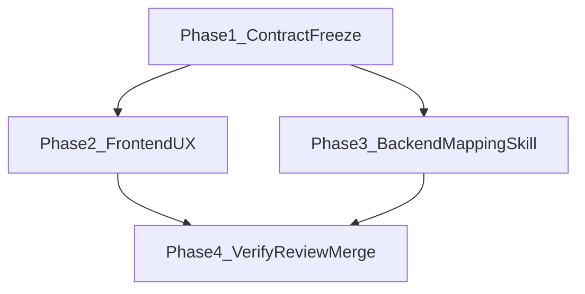

# Development Plan: LinkedIn Import UI Autofill + Mapping Skill (Opencode-Driven)
## apply_n_reach — Frontend + Backend (`user_profile`)

## Executive Summary
This plan implements LinkedIn-based profile autopopulation from the User Profile UI with a two-path UX: use saved personal-details `linkedin_url` when available, or request URL input when missing. It also adds a backend-local agent skill document describing section-by-section mapping expectations and examples for reliable LinkedIn-to-profile normalization.

Execution is designed for Opencode as the direct coding agent across development, testing, code review, and local merge.

## Scope
- Add frontend "Import from LinkedIn" action in User Profile Personal Details.
- Support fallback URL prompt when personal details do not contain a LinkedIn URL.
- Call existing backend endpoint `POST /profile/import/linkedin`.
- Refresh UI state after successful import.
- Add backend mapping skill documentation with examples and edge-case normalization rules.

## Out of Scope
- New backend endpoints for import.
- Schema redesign of `MappedLinkedInProfile`.
- Non-LinkedIn profile import sources.

## Phase Overview
- Phase 1: Contract freeze and baseline.
- Phase 2: Frontend user flow implementation.
- Phase 3: Backend mapping skill documentation.
- Phase 4: Verification, review, and local merge flow.

## Phase 1: Contract Freeze and Baseline
### P1.T1 — Validate import contract
- Confirm endpoint behavior in `backend/app/features/user_profile/linkedin_import/router.py`.
- Confirm request/response schemas in `backend/app/features/user_profile/linkedin_import/schemas.py`.
- Confirm router wiring in `backend/app/app.py`.

### P1.T2 — Confirm data source of URL
- Use personal details `linkedin_url` as primary source.
- Define fallback prompt behavior when missing.

## Phase 2: Frontend LinkedIn Import Autofill
### P2.T1 — Add import action on Personal Details
- Add "Import from LinkedIn" button in `frontend/src/features/user-profile/sections/personal/PersonalForm.tsx`.
- Disable action during active import.

### P2.T2 — Saved URL path
- If `linkedin_url` exists on personal details, call import API directly.
- Show success/error feedback in-form.

### P2.T3 — Missing URL fallback path
- Prompt user for LinkedIn URL input when URL is absent.
- Validate URL format before API call.

### P2.T4 — Post-import refresh
- Refresh personal details data on successful import.
- Keep profile section behavior consistent with existing on-demand fetching.

### P2.T5 — Targeted frontend verification
- Verify happy path, missing URL prompt path, invalid URL path, and backend failure path.

## Phase 3: Backend Mapping Skill
### P3.T1 — Create mapping skill artifact
- Add a backend-local skill document in `backend/app/features/user_profile/linkedin_import/`.
- Document expected mapping for:
  - personal
  - educations
  - experiences
  - projects
  - certifications
  - skills

### P3.T2 — Add examples and edge cases
- Provide worked input -> output examples.
- Include rules for date normalization, null handling, and skill dedupe.

### P3.T3 — Agent usage guidance
- Explicitly direct coding agents to consult this mapping skill before changing mapping behavior.
- Keep guidance aligned to `mapping_chain.py` and `service.py` replace-all semantics.

## Phase 4: Opencode Execution and Merge
### P4.T1 — Opencode execution model
Use Opencode directly for:
- development
- targeted tests
- code review
- local merge preparation

### P4.T2 — Mandatory `/using-superpowers`
- Before planning/executing any wave, invoke `/using-superpowers`.
- Follow the selected skill workflow for planning, implementation, debugging, and verification.

### P4.T3 — Quality gates before merge
- All scoped tests pass.
- Review findings are resolved.
- No out-of-scope refactors in final diff.

## Dependency Map


## File Structure Target
```text
Features-to-develop/
  linkedin-import-ui-autofill/
    development-plan.md

frontend/src/features/user-profile/
  profileApi.ts
  sections/personal/PersonalForm.tsx

backend/app/features/user_profile/linkedin_import/
  linkedin_mapping_skill.md
```

## Appendix
### Appendix A — Glossary
| Term | Meaning |
| --- | --- |
| LinkedIn import | `POST /profile/import/linkedin` flow that maps scraped LinkedIn data to user profile sections. |
| Saved URL path | Flow that uses existing `personal_details.linkedin_url` without asking user input. |
| Fallback URL path | Flow that asks user for LinkedIn URL when personal details do not have one saved. |
| Replace-all import | Service behavior that deletes section rows and re-inserts mapped rows in one transaction. |
| Mapping normalization | Rules that convert raw LinkedIn shapes into API-safe schema fields. |
| Contract freeze | Point where request/response format is fixed for implementation wave. |
| Opencode wave | A bounded implementation wave executed by Opencode with scoped testing. |

### Appendix B — Full Risk Register
| ID | Risk | Likelihood | Impact | Mitigation |
| --- | --- | --- | --- | --- |
| R1 | Invalid LinkedIn URL provided by user | Medium | Medium | URL validation before import request |
| R2 | Missing URL causes confusing UX | Medium | Medium | Explicit fallback prompt and clear messaging |
| R3 | API contract drift between FE and BE | Low | High | Freeze schema and use existing endpoint contract |
| R4 | Mapping quality mismatch for sparse LinkedIn data | Medium | High | Document strict normalization and examples |
| R5 | Imported records duplicate low-value skills | Medium | Medium | Dedupe guidance in mapping skill |

### Appendix C — Assumptions Log
| ID | Assumption | Impact if wrong |
| --- | --- | --- |
| A1 | `POST /profile/import/linkedin` remains stable | FE integration must be updated |
| A2 | Personal details endpoint includes `linkedin_url` | Fallback becomes default path |
| A3 | User profile sections fetch on page/tab load | Additional refresh plumbing required |
| A4 | Mapping schema in `schemas.py` is source of truth | Skill document must be revised quickly |

### Appendix D — Instructions for Coding Agents
1. Start every wave with `/using-superpowers`.
2. Use Opencode directly for implementation, tests, review, and local merge prep.
3. Respect task dependencies; do not parallelize dependent tasks.
4. Keep diffs minimal and avoid unrelated refactors.

### Appendix E — Development Order Summary
| Order | Work item | Rationale |
| --- | --- | --- |
| 1 | Contract freeze | Prevent integration churn |
| 2 | Frontend import flow | User-facing requirement |
| 3 | Backend mapping skill docs | Mapping correctness and maintainability |
| 4 | Verification + review | Merge-readiness |

### Appendix F — Wave Dispatch Map
- Wave A: Frontend `profileApi.ts` + `PersonalForm.tsx`
- Wave B: Backend `linkedin_mapping_skill.md`
- Wave C: Scoped tests, code review, and local merge checks

### Appendix G — Coding Instructions and Quality Bar
1. Keep imports at top of file.
2. Prefer explicit error messages over silent failure.
3. Preserve existing API and file-structure conventions.
4. Avoid speculative abstractions.

### Appendix H — Testing Instructions and Test Audit Log Requirements
1. Use scoped testing only for touched areas.
2. Log executed commands and observed results.
3. Record why full suite was not run.
4. Confirm both saved-URL and fallback-URL flows.

### Appendix I — Multi-Agent and User Review Gates
1. Functionality gate: both import paths work.
2. Code quality gate: readable, maintainable, minimal diff.
3. File structure gate: changes stay within intended modules.
4. Testing gate: scoped checks pass with evidence.
5. Review gate: reviewer/user sign-off for merge readiness.
