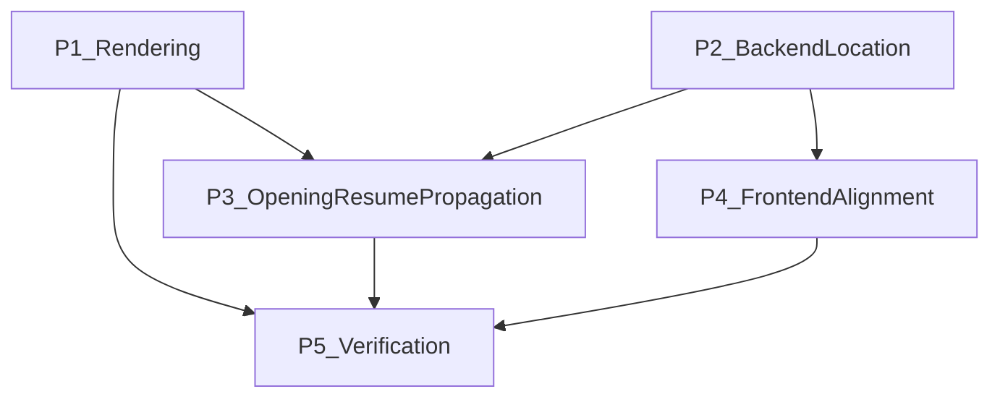

# Resume Experience Updates Implementation Plan

> **For agentic workers:** REQUIRED SUB-SKILL: Use superpowers `using-superpowers` first, then use `subagent-driven-development` (recommended) or `executing-plans` to implement this plan task-by-task. Steps use checkbox (`- [ ]`) syntax for tracking.

**Goal:** Fix resume experience rendering quality and privacy behavior, and propagate `experience.location` end-to-end across backend and frontend surfaces.

**Architecture:** Keep rendering behavior centralized in shared LaTeX template builder flow, while extending experience data contracts across `user_profile`, `job_profile`, `job_tracker/opening_resume`, and frontend mappers/contracts. Use additive database changes (nullable `location`) plus strict targeted regression tests.

**Tech Stack:** FastAPI, asyncpg/PostgreSQL, Alembic, Pytest, frontend TypeScript contracts/mappers + Vitest, graphify.

---

## Executive Summary

- Scope is **full cross-surface**: `user_profile`, `job_profile`, `job_tracker/opening_resume`, frontend contracts/mappers, and migration.
- `experience.context` remains stored for AI/agent understanding but must never appear in rendered resume output.
- Experience bullets must render as one LaTeX resume item per bullet, with corrected vertical spacing.
- `experience.location` must be persisted and propagated into LaTeX as the fourth subheading field.
- Verification is **targeted only** to changed test files; full-suite execution is explicitly out of scope.

---

## Feature Requirements Analysis

### R1. Hide experience context in resume output
- **Description:** `context` field is agent-facing metadata and should not be visible in LaTeX/PDF output.
- **User-facing behavior:** No context line appears in rendered Experience entries.
- **Implied requirements:** Keep DB/API support for context unchanged.

### R2. Bullet fidelity for experiences
- **Description:** Each bullet must render as a separate LaTeX resume item.
- **User-facing behavior:** Distinct bullet lines, not merged or malformed list rendering.
- **Implied requirements:** Normalize list rendering logic for both job profile and opening resume render paths.

### R3. Vertical spacing quality
- **Description:** Correct spacing between bullet items and section blocks.
- **User-facing behavior:** Consistent, professional spacing in PDF output.
- **Implied requirements:** Use stable macro/list boundaries and avoid duplicated spacing commands.

### R4. Add and propagate experience location
- **Description:** `location` must exist through DB schema, APIs, service flows, snapshot copy, and frontend mapping.
- **User-facing behavior:** Experience location appears as the fourth line/slot in subheading output.
- **Implied requirements:** Add nullable columns + migration, API model updates, frontend contract refresh/mapping updates.

---

## Dependency and Sequencing Strategy

### Foundation Layer
- Migration + backend model/schema updates for `experience.location`.
- Rendering behavior changes in template builder.

### Critical Path
1. DB migration and backend experience schemas/services
2. Rendering updates in shared template builder path
3. Snapshot/copy and render payload updates in opening resume flow
4. Frontend contract and mapper alignment
5. Targeted regression verification

### Parallelization Opportunities
- Rendering tests and API contract updates can proceed in parallel **after** backend schema decisions are stable.
- Frontend mapper work can start once OpenAPI/backend schema shape is finalized.

---

## File Structure and Ownership Map

### Backend rendering surface
- Modify: `backend/app/features/job_profile/latex_resume/template_builder.py`
- Validate bridge impact through:
  - `backend/app/features/job_tracker/opening_resume/latex_resume/template_builder.py`
  - `backend/app/features/job_tracker/opening_resume/latex_resume/service.py` (or equivalent mapping path)

### Backend experience data surfaces
- Modify `user_profile` experience:
  - `backend/app/features/user_profile/experience/models.py`
  - `backend/app/features/user_profile/experience/schemas.py`
  - `backend/app/features/user_profile/experience/service.py`
  - `backend/app/features/user_profile/experience/router.py`
- Modify `job_profile` experience:
  - `backend/app/features/job_profile/experience/models.py`
  - `backend/app/features/job_profile/experience/schemas.py`
  - `backend/app/features/job_profile/experience/service.py`
  - `backend/app/features/job_profile/experience/router.py`
- Modify opening resume snapshot/copy flow:
  - `backend/app/features/job_tracker/opening_resume/service.py`
  - `backend/app/features/job_tracker/opening_resume/sections/experience/*` (if present in current tree)

### Migration surface
- Create: `backend/alembic/versions/<revision>_add_experience_location_columns.py`

### Frontend surface
- Modify generated contracts after backend schema changes:
  - `frontend/src/generated/openapi.json`
  - `frontend/src/generated/schema.ts`
  - `frontend/src/generated/contracts.ts`
- Modify mappers/APIs:
  - `frontend/src/features/user-profile/profileApi.ts`
  - `frontend/src/features/job-profiles/jobProfileApi.ts`
  - Related experience hooks/components where payload mapping is defined

---

## Implementation Tasks (Detailed Breakdown)

### Task P1: Rendering behavior fixes (context, bullets, spacing, location slot)

**Files:**
- Modify: `backend/app/features/job_profile/latex_resume/template_builder.py`
- Validate: `backend/app/features/job_tracker/opening_resume/latex_resume/template_builder.py`
- Test: `backend/app/features/job_profile/latex_resume/tests/test_jp_latex_resume.py`
- Test: `backend/app/features/job_tracker/opening_resume/tests/test_latex_resume.py`

- [ ] **Step 1: Write failing rendering tests**
  - Add tests asserting:
    - `context` is absent in LaTeX output.
    - N bullets produce N `\resumeItem` outputs.
    - Location maps to the fourth subheading slot.
    - Spacing markers/macros are not duplicated.

- [ ] **Step 2: Run only the new rendering tests to confirm failure**
  - Run:
    - `pytest backend/app/features/job_profile/latex_resume/tests/test_jp_latex_resume.py -v`
    - `pytest backend/app/features/job_tracker/opening_resume/tests/test_latex_resume.py -v`
  - Expected: fail on current behavior.

- [ ] **Step 3: Implement minimal template builder updates**
  - Remove context emission from experience rendering output.
  - Ensure each bullet is emitted as a separate item command.
  - Normalize item list start/end and section spacing boundaries.
  - Include location in the fourth subheading slot when present.

- [ ] **Step 4: Re-run targeted rendering tests**
  - Run same test commands as Step 2.
  - Expected: pass.

- [ ] **Step 5: Commit rendering slice**
  - `git add <rendering files + tests>`
  - `git commit -m "fix: normalize experience rendering and hide context from resume output"`

---

### Task P2: Add `experience.location` to backend schemas and storage

**Files:**
- Create: `backend/alembic/versions/<revision>_add_experience_location_columns.py`
- Modify: `backend/app/features/user_profile/experience/models.py`
- Modify: `backend/app/features/job_profile/experience/models.py`
- Modify: `backend/app/features/user_profile/experience/schemas.py`
- Modify: `backend/app/features/job_profile/experience/schemas.py`
- Modify: `backend/app/features/user_profile/experience/service.py`
- Modify: `backend/app/features/job_profile/experience/service.py`
- Modify: `backend/app/features/user_profile/experience/router.py`
- Modify: `backend/app/features/job_profile/experience/router.py`
- Test: `backend/app/features/user_profile/experience/tests/test_experience.py`
- Test: `backend/app/features/job_profile/experience/tests/test_jp_experience.py`

- [ ] **Step 1: Write failing API/data tests for location**
  - Add tests for create/read/update with `location` in both user_profile and job_profile experience APIs.

- [ ] **Step 2: Run only affected experience tests to confirm failure**
  - Run:
    - `pytest backend/app/features/user_profile/experience/tests/test_experience.py -v`
    - `pytest backend/app/features/job_profile/experience/tests/test_jp_experience.py -v`
  - Expected: fail due to missing field/column behavior.

- [ ] **Step 3: Implement migration + schema/service/router updates**
  - Add nullable `location` columns for both experience tables.
  - Update model DDL mirrors and API schemas.
  - Wire service inserts/updates/selects to include location.

- [ ] **Step 4: Run migration and targeted tests**
  - Run migration up/down in dev env.
  - Re-run tests from Step 2.
  - Expected: pass; no regressions for context handling.

- [ ] **Step 5: Commit backend location slice**
  - `git add <migration + backend experience files + tests>`
  - `git commit -m "feat: add experience location across user and job profile APIs"`

---

### Task P3: Propagate location through job_tracker opening resume snapshot/render flow

**Files:**
- Modify: `backend/app/features/job_tracker/opening_resume/service.py`
- Modify: `backend/app/features/job_tracker/opening_resume/latex_resume/service.py` (or active mapper)
- Test: `backend/app/features/job_tracker/opening_resume/tests/test_snapshot_copy.py`
- Test: `backend/app/features/job_tracker/opening_resume/tests/test_latex_resume.py`

- [ ] **Step 1: Write failing snapshot/render propagation tests**
  - Assert location is copied from job_profile experience into opening_resume experience snapshot.
  - Assert rendered output includes location in the correct slot.

- [ ] **Step 2: Run targeted opening_resume tests to confirm failure**
  - Run:
    - `pytest backend/app/features/job_tracker/opening_resume/tests/test_snapshot_copy.py -v`
    - `pytest backend/app/features/job_tracker/opening_resume/tests/test_latex_resume.py -v`

- [ ] **Step 3: Implement copy + render payload mapping fixes**
  - Stop hardcoding `location: null`.
  - Ensure snapshot and LaTeX mapping carry real location values.

- [ ] **Step 4: Re-run targeted opening_resume tests**
  - Expected: pass.

- [ ] **Step 5: Commit opening resume propagation slice**
  - `git add <opening_resume files + tests>`
  - `git commit -m "fix: propagate experience location into opening resume snapshot and render"`

---

### Task P4: Frontend contract + mapper alignment

**Files:**
- Modify: `frontend/src/generated/openapi.json`
- Modify: `frontend/src/generated/schema.ts`
- Modify: `frontend/src/generated/contracts.ts`
- Modify: `frontend/src/features/user-profile/profileApi.ts`
- Modify: `frontend/src/features/job-profiles/jobProfileApi.ts`
- Test: targeted affected frontend tests (mapper/hooks for experience fields)

- [ ] **Step 1: Add failing mapper/contract tests (or update existing tests)**
  - Assert `location` roundtrip mapping in user profile + job profiles API layers.

- [ ] **Step 2: Regenerate/update contracts from backend OpenAPI**
  - Ensure `location` exists in relevant request/response shapes.

- [ ] **Step 3: Implement mapper updates**
  - Map inbound and outbound `location` consistently.
  - Remove any forced null assignment paths.

- [ ] **Step 4: Run only targeted frontend tests**
  - Example:
    - `pnpm vitest run <affected test files>`
  - Expected: pass.

- [ ] **Step 5: Commit frontend alignment slice**
  - `git add <frontend contracts/mappers/tests>`
  - `git commit -m "feat: align frontend experience mappings with location support"`

---

### Task P5: Final targeted verification and handoff checks

**Files:**
- Modify: this plan’s execution checklist artifact(s) only if needed.

- [ ] **Step 1: Run complete targeted backend list**
  - `pytest backend/app/features/job_profile/experience/tests/test_jp_experience.py -v`
  - `pytest backend/app/features/user_profile/experience/tests/test_experience.py -v`
  - `pytest backend/app/features/job_profile/latex_resume/tests/test_jp_latex_resume.py -v`
  - `pytest backend/app/features/job_tracker/opening_resume/tests/test_latex_resume.py -v`
  - `pytest backend/app/features/job_tracker/opening_resume/tests/test_snapshot_copy.py -v`

- [ ] **Step 2: Run complete targeted frontend list**
  - `pnpm vitest run <only changed experience/profile-api test files>`

- [ ] **Step 3: Verify KPI checklist (Appendix C)**
  - Ensure all KPIs are objectively marked pass/fail with evidence.

- [ ] **Step 4: Commit verification artifacts (if any)**
  - `git add <changed docs/checklists>`
  - `git commit -m "chore: finalize targeted verification for resume experience updates"`

---

## KPI Matrix

- **KPI-1 Privacy correctness:** `context` remains stored/available to agents but never rendered in LaTeX/PDF output.
- **KPI-2 Bullet correctness:** bullet count in source equals `\resumeItem` count in output for each experience.
- **KPI-3 Spacing quality:** no extra blank vertical gaps between bullet lists and adjacent sections.
- **KPI-4 Location completeness:** create/read/update/copy/render all preserve `experience.location`.
- **KPI-5 Change safety:** all targeted tests pass without requiring full suite runs.

---

## Risks and Mitigations

- **Schema drift risk:** migration and runtime DDL/service queries diverge.
  - Mitigation: task P2 enforces migration + model/service updates in same slice.
- **Template regression risk:** spacing/bullet fixes affect other sections.
  - Mitigation: exact rendering assertions in targeted LaTeX tests.
- **Contract drift risk:** frontend types stale after backend update.
  - Mitigation: regenerate contracts in P4 before mapper edits.
- **Snapshot propagation risk:** opening_resume continues nulling location.
  - Mitigation: explicit snapshot copy test in P3.

---

## Appendix A: Dependency Map

**Critical path:** `P2 -> P3 -> P5`.

---

## Appendix B: Scoped Test Execution Policy (Mandatory)

- Run **only tests for files changed in this initiative**.
- Do **not** run the entire backend or frontend test suite for this workstream.
- Minimum backend targeted commands:
  - `pytest backend/app/features/job_profile/experience/tests/test_jp_experience.py -v`
  - `pytest backend/app/features/user_profile/experience/tests/test_experience.py -v`
  - `pytest backend/app/features/job_profile/latex_resume/tests/test_jp_latex_resume.py -v`
  - `pytest backend/app/features/job_tracker/opening_resume/tests/test_latex_resume.py -v`
  - `pytest backend/app/features/job_tracker/opening_resume/tests/test_snapshot_copy.py -v`
- Frontend: execute only touched mapper/hook/api test files with `vitest`.

---

## Appendix C: Acceptance Criteria (Pass/Fail)

- [ ] `context` absent from rendered LaTeX/PDF experience blocks.
- [ ] Experience bullets render one-to-one as separate resume items.
- [ ] Spacing is visually and string-level stable per template assertions.
- [ ] `location` persists through user_profile -> job_profile -> opening_resume -> rendered output.
- [ ] All targeted tests pass; no full-suite run required.

---

## Appendix D: Agent Operating Procedure

### Required skill flow
1. Start with `using-superpowers` before any planning/execution action.
2. Use `brainstorming` only for unresolved scope/requirement gaps.
3. Use `writing-plans` to refine/update execution-level steps if scope changes.
4. Execute with `subagent-driven-development` (recommended) or `executing-plans`.
5. Validate with `verification-before-completion`.
6. Run review loop with `requesting-code-review` then `receiving-code-review` as needed.
7. Close with `finishing-a-development-branch`.

### Agent review checkpoints
- After each task (P1..P5), stop and verify targeted tests before proceeding.
- Do not batch DB+render+frontend into one unreviewed change.
- Keep commits small and phase-bound.

---

## Appendix E: Graphify-First Codebase Orientation (Mandatory)

- Before implementation, agents must:
  - Read `graphify-out/GRAPH_REPORT.md`.
  - Use graph communities and hubs to find dependencies across `user_profile`, `job_profile`, `job_tracker/opening_resume`, and frontend mapper boundaries quickly.
- During implementation:
  - Re-check graph relationships when adding `location` propagation links.
- After code changes:
  - Run: `python -m graphify update .`

---

## Appendix F: Out-of-Scope Guardrails

- No unrelated refactors outside the listed surfaces.
- No redesign of non-experience resume sections beyond spacing stabilization required for this fix.
- No full test-suite mandate for this workstream.

